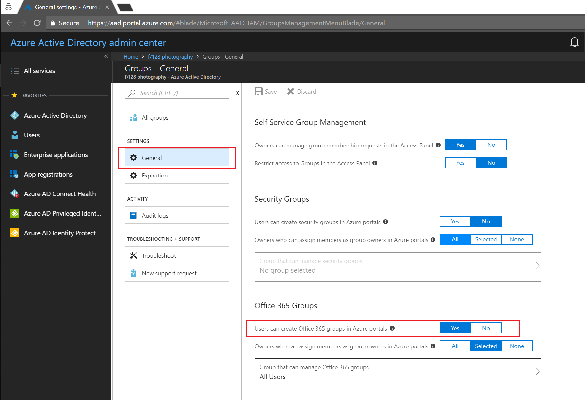

# Impostare la scadenza dei gruppi di Microsoft 365 in Azure Active Directory

In questa guida di avvio rapido si impostano i criteri di scadenza per i gruppi di Microsoft 365. Quando gli utenti possono configurare gruppi personalizzati, i gruppi inutilizzati possono moltiplicarsi. Un modo per gestire i gruppi inutilizzati consiste nell'impostare la scadenza per tali gruppi, per ridurre le attività di manutenzione legate all'eliminazione manuale dei gruppi.

I criteri di scadenza sono semplici:

- I gruppi con attività utente vengono rinnovati automaticamente in prossimità della scadenza
- I proprietari del gruppo ricevono una notifica per rinnovare un gruppo in scadenza
- Un gruppo che non viene rinnovato viene eliminato
- Un gruppo di Microsoft 365 eliminato può essere ripristinato entro 30 giorni da un proprietario del gruppo o da un amministratore di Azure AD

> [!NOTE]
> I gruppi ora usano l'intelligence di Azure AD per il rinnovo automatico in base al fatto che siano stati usati più di recente. Questa decisione di rinnovo si basa sull'attività utente in gruppi nei servizi di Microsoft 365 come Outlook, SharePoint, Teams, Yammer e altri ancora.

Se non si ha una sottoscrizione di Azure, [creare un account gratuito](https://azure.microsoft.com/free/) prima di iniziare.

## Prerequisito

 Il ruolo con privilegi minimi necessario per configurare la scadenza di un gruppo è quello di Amministratore utenti nell'organizzazione.

## Attivare la creazione dei gruppi da parte degli utenti

1. Accedere al [portale di Azure](https://portal.azure.com) con un account Amministratore utenti.

2. Selezionare **Gruppi** e quindi selezionare **Generale** .
  
   

3. Impostare **Gli utenti possono creare gruppi di Microsoft 365** su **Sì** .

4. Al termine, selezionare **Salva** per salvare le impostazioni dei gruppi.

## Impostare la scadenza dei gruppi

1. Accedere al [portale di Azure](https://portal.azure.com), selezionare **Azure Active Directory** > **Gruppi** > **Scadenza** per visualizzare le impostazioni di scadenza.
  
   

2. Impostare l'intervallo di scadenza. Selezionare un valore predefinito o immettere un valore personalizzato superiore a 31 giorni. 

3. Specificare un indirizzo e-mail per l'invio delle notifiche di scadenza quando un gruppo non ha un proprietario.

4. Per questa guida di avvio rapido impostare **È possibile abilitare la scadenza per questi gruppi di Microsoft 365** su **Tutti** .

5. Al termine, selezionare **Salva** per salvare le impostazioni di scadenza.

L'operazione è terminata. In questa guida di avvio rapido sono stati impostati criteri di scadenza per i gruppi di Microsoft 365 selezionati.

## Pulire le risorse

### Per rimuovere i criteri di scadenza

1. Assicurarsi di accedere al [portale di Azure](https://portal.azure.com) con un account di amministratore globale per l'organizzazione di Azure AD.
2. Selezionare **Azure Active Directory** > **Gruppi** > **Scadenza** .
3. Impostare **È possibile abilitare la scadenza per questi gruppi di Microsoft 365** su **Nessuno** .

### Per disattivare la creazione dei gruppi da parte degli utenti

1. Selezionare **Azure Active Directory** > **Gruppi** > **Generale** . 
2. Impostare **Gli utenti possono creare gruppi di Microsoft 365 nei portali di Azure** su **No** .

## Passaggi successivi

Per altre informazioni sulla scadenza, incluse le istruzioni di PowerShell e i vincoli tecnici, vedere l'articolo seguente:

> [!div class="nextstepaction"]
> [Criteri di scadenza - PowerShell](groups-lifecycle.md)
