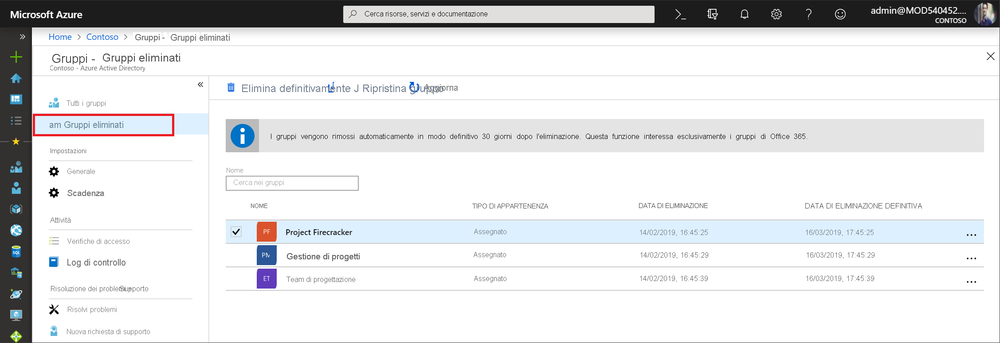

# <a name="restore-a-deleted-microsoft-365-group-in-azure-active-directory"></a>Ripristinare un gruppo di Microsoft 365 eliminato in Azure Active Directory

Quando si elimina un gruppo di Microsoft 365 in Azure Active Directory (Azure AD), il gruppo eliminato viene conservato ma non è visibile per 30 giorni dalla data di eliminazione. In questo modo è possibile ripristinare il gruppo e i relativi contenuti se necessario. Questa funzionalità è limitata esclusivamente ai gruppi di Microsoft 365 in Azure AD. Non è disponibile per i gruppi di sicurezza e i gruppi di distribuzione. Si noti che il periodo di ripristino del gruppo di 30 giorni non è personalizzabile.

> [!NOTE]
> Non usare `Remove-MsolGroup`, perché elimina definitivamente il gruppo. Usare sempre `Remove-AzureADMSGroup` per eliminare un gruppo di Microsoft 365.

Per ripristinare un gruppo sono necessarie una delle autorizzazioni seguenti:

Ruolo | Autorizzazioni
--------- | ---------
Amministratore globale, Amministratore gruppo, Supporto partner - Livello 2 e Amministratore di Intune | È possibile ripristinare qualsiasi gruppo di Microsoft 365 eliminato
Amministratore utenti e Supporto partner - Livello 1 | Consente di ripristinare eventuali gruppi di Microsoft 365 eliminati, ad eccezione di quelli assegnati al ruolo di amministratore globale
Utente | È possibile ripristinare qualsiasi gruppo di Microsoft 365 eliminato di cui si è proprietari

## <a name="view-and-manage-the-deleted-microsoft-365-groups-that-are-available-to-restore"></a>Visualizzare e gestire i gruppi di Microsoft 365 eliminati disponibili per il ripristino

1. Accedere all'[interfaccia di amministrazione di Azure AD](https://aad.portal.azure.com) con un account Amministratore utenti.

2. Selezionare **Gruppi** e quindi **Gruppi eliminati** per visualizzare i gruppi eliminati disponibili per il ripristino.

    

3. Nel pannello **Gruppi eliminati** è possibile:

   - Ripristinare il gruppo eliminato e il relativo contenuto selezionando **Ripristina gruppo**.
   - Rimuovere in modo permanente il gruppo eliminato selezionando **Elimina definitivamente**. Per rimuovere definitivamente un gruppo, è necessario essere un amministratore.

## <a name="view-the-deleted-microsoft-365-groups-that-are-available-to-restore-using-powershell"></a>Visualizzare i gruppi di Microsoft 365 eliminati disponibili per il ripristino con PowerShell

I cmdlet seguenti consente di visualizzare i gruppi eliminati per verificare che il gruppo o i gruppi a cui l'utente è interessato non siano stati ancora eliminati definitivamente. Questi cmdlet fanno parte del modulo [PowerShell di Azure AD](https://www.powershellgallery.com/packages/AzureAD/). Altre informazioni su questo modulo sono reperibili nell'articolo [PowerShell di Azure Active Directory versione 2](/powershell/azure/active-directory/install-adv2).

1.  Eseguire questo cmdlet per visualizzare tutti i gruppi di Microsoft 365 eliminati nell'organizzazione di Azure AD che sono ancora disponibili per il ripristino.
   

    ```powershell
    Get-AzureADMSDeletedGroup
    ```

2.  In alternativa, se si conosce l'objectID di un gruppo specifico (ed è possibile ottenerlo dal cmdlet nel passaggio 1), eseguire il cmdlet seguente per verificare che il gruppo eliminato specifico non sia stato ancora definitivamente eliminato.

    ```
    Get-AzureADMSDeletedGroup –Id <objectId>
    ```

## <a name="how-to-restore-your-deleted-microsoft-365-group-using-powershell"></a>Come ripristinare un gruppo di Microsoft 365 eliminato con PowerShell

Dopo avere verificato che è ancora possibile ripristinare il gruppo, ripristinare il gruppo eliminato con uno dei passaggi seguenti. Se il gruppo contiene documenti, siti SP o altri oggetti persistenti, potrebbero volerci fino a 24 ore per ripristinare completamente un gruppo e il relativo contenuto.

1. Eseguire il cmdlet seguente per ripristinare il gruppo e il relativo contenuto.
 

   ```
    Restore-AzureADMSDeletedDirectoryObject –Id <objectId>
    ``` 

2. In alternativa, è possibile eseguire il cmdlet seguente per rimuovere definitivamente il gruppo eliminato.
    

    ```
    Remove-AzureADMSDeletedDirectoryObject –Id <objectId>
    ```

## <a name="how-do-you-know-this-worked"></a>Come si verifica che l'azione è riuscita?

Per verificare di aver ripristinato correttamente un gruppo di Microsoft 365, eseguire il cmdlet `Get-AzureADGroup –ObjectId <objectId>` per visualizzare informazioni sul gruppo. Al completamento della richiesta di ripristino:

- Il gruppo viene visualizzato nella barra di spostamento a sinistra su Exchange
- In Planner verrà visualizzato il piano per il gruppo
- I siti di SharePoint e tutti i contenuti saranno disponibili
- Il gruppo è accessibile da qualsiasi endpoint di Exchange e da altri carichi di lavoro di Microsoft 365 che supportano i gruppi di Microsoft 365

## <a name="next-steps"></a>Passaggi successivi

Questi articoli contengono informazioni aggiuntive sui gruppi di Azure Active Directory.

* [Vedere i gruppi esistenti](../fundamentals/active-directory-groups-view-azure-portal.md)
* [Gestire le impostazioni di un gruppo](../fundamentals/active-directory-groups-settings-azure-portal.md)
* [Gestire i membri di un gruppo](../fundamentals/active-directory-groups-members-azure-portal.md)
* [Gestire le appartenenze di un gruppo](../fundamentals/active-directory-groups-membership-azure-portal.md)
* [Gestire le regole dinamiche per gli utenti in un gruppo](groups-dynamic-membership.md)
