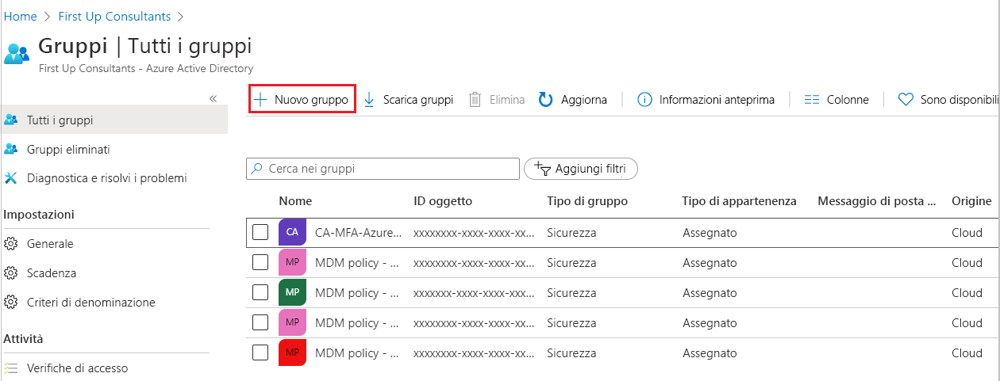
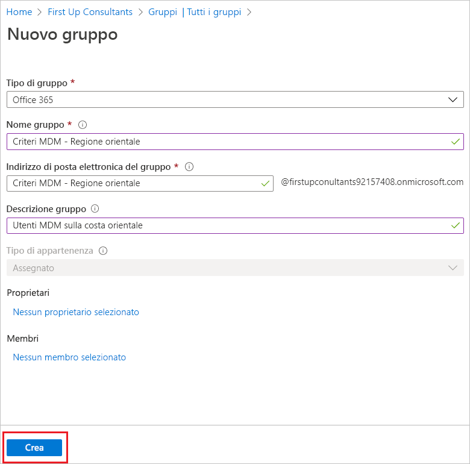
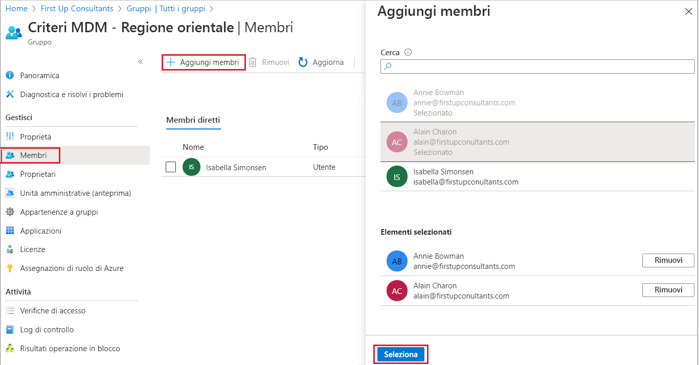
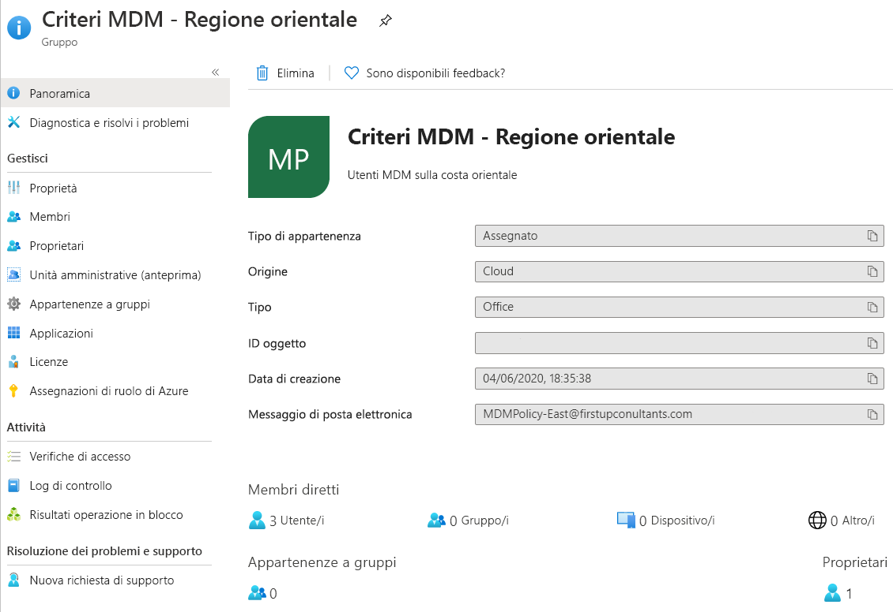

# Creare un gruppo di base e aggiungere membri con Azure Active Directory
È possibile creare un gruppo di base usando il portale di Azure Active Directory (Azure AD). Ai fini di questo articolo, un gruppo di base viene aggiunto a una singola risorsa dal proprietario della risorsa (amministratore) e include membri specifici (dipendenti) che devono accedere a tale risorsa. Per scenari più complessi, incluse le appartenenze dinamiche e la creazione di regole, vedere la [documentazione sulla gestione degli utenti di Azure Active Directory](../enterprise-users/index.yml).

## Tipi di gruppo e di appartenenza
Sono disponibili diversi tipi di gruppo e di appartenenza. In questo articolo vengono illustrati i tipi di gruppo e di appartenenza disponibili e viene spiegato per quale motivo vengono usati allo scopo di facilitare la scelta delle opzioni da usare quando si crea un gruppo.

### Tipi di gruppo:
- **Sicurezza**. Usato per gestire l'accesso di membri e computer a risorse condivise per un gruppo di utenti. Ad esempio, è possibile creare un gruppo di sicurezza per criteri di sicurezza specifici. In questo modo, è possibile concedere un set di autorizzazioni a tutti i membri in una sola volta, invece di dover aggiungere autorizzazioni per ogni membro singolarmente. Un gruppo di sicurezza può avere utenti, dispositivi, gruppi ed entità servizio come membri e utenti ed entità servizio come proprietari. Per altre informazioni sulla gestione dell'accesso alle risorse, vedere [Gestire l'accesso alle risorse tramite i gruppi di Azure Active Directory](active-directory-manage-groups.md).
- **Microsoft 365**. Offre opportunità di collaborazione consentendo ai membri di accedere a cassette postali, calendari, file, siti di SharePoint e altri elementi condivisi. Questa opzione consente anche di concedere l'accesso al gruppo a utenti esterni all'organizzazione. Un gruppo Microsoft 365 può avere solo utenti come membri. Sia gli utenti che le entità servizio possono essere proprietari di un gruppo di Microsoft 365. Per ulteriori informazioni sui gruppi di Microsoft 365, vedere informazioni [sui gruppi di Microsoft 365](https://support.office.com/article/learn-about-office-365-groups-b565caa1-5c40-40ef-9915-60fdb2d97fa2).

### Tipi di appartenenza:
- **Assegnato.** Consente di aggiungere utenti specifici come membri di questo gruppo con autorizzazioni univoche. Ai fini di questo articolo viene usata questa opzione.
- **Utente dinamico.** Consente di usare le regole di appartenenza dinamica per aggiungere e rimuovere i membri automaticamente. Se cambiano gli attributi di un membro, il sistema esamina le regole per i gruppi dinamici per la directory per verificare se il membro soddisfa i requisiti delle regole (viene aggiunto) o non soddisfa più i requisiti delle regole (viene rimosso).
- **Dispositivo dinamico.** Consente di usare le regole per i gruppi dinamici per aggiungere e rimuovere i dispositivi automaticamente. Se cambiano gli attributi di un dispositivo, il sistema esamina le regole per i gruppi dinamici per la directory per verificare se il dispositivo soddisfa i requisiti delle regole (viene aggiunto) o non soddisfa più i requisiti delle regole (viene rimosso).

    > [!IMPORTANT]
    > È possibile creare un gruppo dinamico per dispositivi o utenti, ma non per entrambi. Non è inoltre possibile creare un gruppo di dispositivi in base agli attributi dei proprietari dei dispositivi. Le regole di appartenenza dei dispositivi possono fare riferimento solo agli attributi dei dispositivi. Per altre informazioni sulla creazione di un gruppo dinamico per utenti e dispositivi, vedere [Creare un gruppo dinamico e controllare lo stato](../enterprise-users/groups-create-rule.md)

## Creare un gruppo di base e aggiungere membri
È possibile creare un gruppo di base e aggiungere i membri allo stesso tempo. Per creare un gruppo di base e aggiungere membri, seguire questa procedura:

1. Accedere al [portale di Azure](https://portal.azure.com) con un account amministratore globale per la directory.

1. Cercare e selezionare **Azure Active Directory**.

1. Nella pagina **Active Directory** selezionare **Gruppi** e quindi **Nuovo gruppo**.

    

1. Verrà visualizzato il riquadro **Nuovo gruppo** in cui compilare le informazioni richieste.

    

1. Selezionare un **tipo di gruppo** predefinito. Per altre informazioni sui tipi di gruppo, vedere [Tipi di gruppo e di appartenenza](#group-types).

1. Creare e aggiungere un **nome di gruppo**. Scegliere un nome facile da ricordare e significativo per il gruppo. Verrà eseguita una verifica per determinare se il nome è già usato da un altro gruppo. Se il nome è già in uso, per evitare duplicati, verrà richiesto di cambiare il nome del gruppo.

1. Aggiungere un **indirizzo di posta elettronica del gruppo** o mantenere l'indirizzo di posta elettronica inserito automaticamente.

1. **Descrizione gruppo.** Aggiungere una descrizione facoltativa per il gruppo.

1. Selezionare un **tipo di appartenenza** predefinito (obbligatorio) Per altre informazioni sui tipi di appartenenza, vedere [Tipi di gruppo e di appartenenza](#membership-types).

1. Selezionare **Crea**. Il gruppo viene creato ed è pronto per l'aggiunta di membri.

1. Selezionare l'area **Membri** nella pagina **Gruppo** quindi iniziare a cercare i membri da aggiungere al gruppo nella pagina **Seleziona membri**.

    

1. Dopo aver aggiunto tutti i membri, scegliere **Seleziona**.

    La pagina **Panoramica gruppo** viene aggiornata per indicare il numero di membri aggiunti al gruppo.

    

## Attivare o disattivare il messaggio di posta elettronica di benvenuto del gruppo

Quando viene creato un nuovo gruppo di Microsoft 365, sia con l'appartenenza dinamica che statica, viene inviata una notifica di benvenuto a tutti gli utenti aggiunti al gruppo. Quando gli attributi di un utente o un dispositivo cambiano, tutte le regole dinamiche del gruppo dell'organizzazione vengono elaborate per rilevare eventuali modifiche nell'appartenenza. Anche gli utenti aggiunti ricevono la notifica di benvenuto. È possibile disattivare questo comportamento in [Exchange PowerShell](/powershell/module/exchange/users-and-groups/Set-UnifiedGroup). 

## Passaggi successivi

- [Gestire l'accesso alle app SaaS con i gruppi](../enterprise-users/groups-saasapps.md)
- [Gestire i gruppi con i comandi di PowerShell](../enterprise-users/groups-settings-v2-cmdlets.md)
