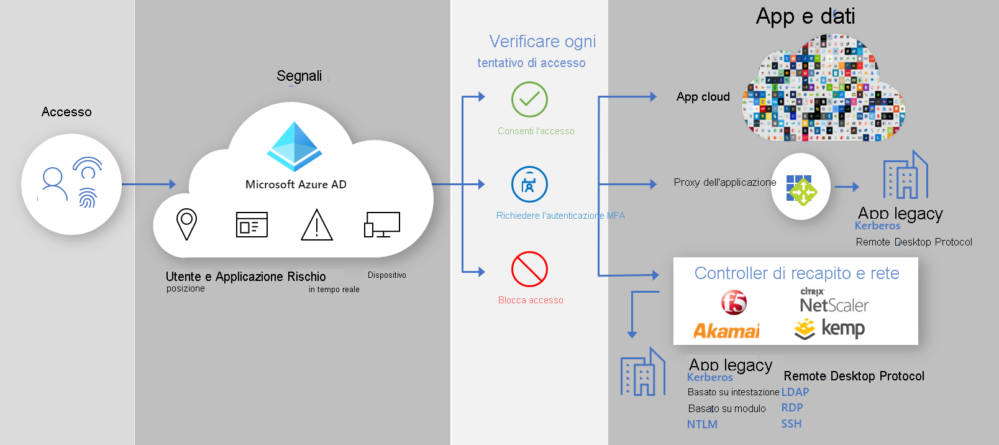

# Accesso ibrido sicuro: Proteggi le app legacy con Azure Active Directory

È ora possibile proteggere le applicazioni locali e di autenticazione legacy del cloud connettendosi a Azure Active Directory (AD) con:

- [Proxy dell'applicazione di Azure AD](#secure-hybrid-access-sha-through-azure-ad-application-proxy)

- [Controller e reti per la distribuzione di applicazioni esistenti](#sha-through-networking-and-delivery-controllers)

- [Applicazioni di rete privata virtuale (VPN) e Software-Defined perimetrale (SDP)](#sha-through-vpn-and-sdp-applications)

È possibile colmare il gap e rafforzare il comportamento di sicurezza in tutte le applicazioni con funzionalità Azure AD come Azure AD [l'accesso condizionale](../conditional-access/overview.md) e Azure ad [Identity Protection](../identity-protection/overview-identity-protection.md).

## SHA (Secure Hybrid Access) tramite il proxy di applicazione Azure AD
  
Con il [proxy di applicazione](./what-is-application-proxy.md) è possibile fornire [l'accesso remoto sicuro](./application-proxy.md) alle applicazioni Web locali. Gli utenti non richiedono l'uso di una VPN. Gli utenti traggono vantaggio grazie alla connessione semplificata alle applicazioni da qualsiasi dispositivo dopo un [Single Sign-on](./add-application-portal-setup-sso.md). Il proxy di applicazione fornisce accesso remoto come servizio e consente di [pubblicare facilmente le applicazioni locali](./application-proxy-add-on-premises-application.md) a utenti esterni alla rete aziendale. Consente di ridimensionare la gestione dell'accesso al cloud senza che sia necessario modificare le applicazioni locali. [Pianificare un Azure ad distribuzione del proxy di applicazione](./application-proxy-deployment-plan.md) come passaggio successivo.

## Integrazioni di partner Azure AD

### SHA tramite i controller di rete e di recapito

Oltre a [Azure ad proxy di applicazione](./what-is-application-proxy.md), per consentire all'utente di utilizzare il [Framework zero Trust](https://www.microsoft.com/security/blog/2020/04/02/announcing-microsoft-zero-trust-assessment-tool/), partner Microsoft con provider di terze parti. È possibile utilizzare i controller di rete e di distribuzione esistenti e proteggere con facilità le applicazioni legacy cruciali per i processi aziendali, ma che non è stato possibile proteggere prima con Azure AD. È probabile che siano già presenti tutti gli elementi necessari per iniziare a proteggere le applicazioni.

I fornitori di reti seguenti offrono soluzioni predefinite e linee guida dettagliate per l'integrazione con Azure AD.

- [Akamai Enterprise Application Access (EAA)](../saas-apps/akamai-tutorial.md)

- [Citrix Application Delivery Controller (ADC)](../saas-apps/citrix-netscaler-tutorial.md)

- [F5 Big-IP APM](../saas-apps/headerf5-tutorial.md)

- [Kemp](../saas-apps/kemp-tutorial.md)

### SHA tramite applicazioni VPN e SDP

Grazie alle soluzioni VPN e SDP è possibile fornire l'accesso sicuro alla rete aziendale da qualsiasi dispositivo, in qualsiasi momento, in qualsiasi posizione, proteggendo al tempo stesso i dati dell'organizzazione. Con Azure AD come provider di identità (IDP), è possibile usare metodi di autenticazione e autorizzazione moderni come Azure AD [Single Sign-on](./what-is-single-sign-on.md) e [l'autenticazione](../authentication/concept-mfa-howitworks.md) a più fattori per proteggere le applicazioni legacy locali.  

I fornitori VPN e SDP seguenti offrono soluzioni predefinite e linee guida dettagliate per l'integrazione con Azure AD.

• [Cisco AnyConnect](../saas-apps/cisco-anyconnect.md)

• [Fortinet](../saas-apps/fortigate-ssl-vpn-tutorial.md)

• [F5 Big-IP APM](../saas-apps/headerf5-tutorial.md)

• [Protezione globale Palo Alto Networks](../saas-apps/paloaltoadmin-tutorial.md)

• [Accesso privato zScaler (ZPA)](../saas-apps/zscalerprivateaccess-tutorial.md)