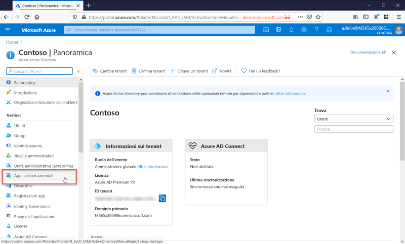

# Cos'è la gestione delle applicazioni?

Azure AD è un sistema di gestione delle identità e degli accessi (IAM). Fornisce un'unica posizione in cui archiviare le informazioni sulle identità digitali. È possibile configurare le applicazioni software per usare Azure AD come posizione di archiviazione delle informazioni sugli utenti. 

Azure AD deve essere configurato per l'integrazione con un'applicazione. In altre parole, deve sapere quali app usano per le identità. La gestione delle applicazioni e il modo in cui devono essere gestite da queste app sono note come gestione delle applicazioni. Azure AD

È possibile gestire le applicazioni nella pagina **applicazioni aziendali** che si trova nella sezione Gestisci del portale di Azure Active Directory.

## Che cos'è un sistema di gestione delle identità e degli accessi (IAM)?
Un'applicazione è un software usato per uno scopo specifico. La maggior parte delle app richiede agli utenti di eseguire l'accesso.

Un sistema di gestione delle identità centralizzato fornisce un'unica posizione per archiviare le informazioni utente che possono essere usate da tutte le applicazioni. Questi sistemi sono noti come sistemi di gestione delle identità e degli accessi (IAM). Azure Active Directory è il sistema IAM per Microsoft Cloud.

>[!TIP]
>Un sistema IAM fornisce un'unica posizione in cui tenere traccia delle identità degli utenti. Azure AD è il sistema IAM per il cloud Microsoft.

## Perché gestire le applicazioni con una soluzione cloud?

In molte organizzazioni sono presenti centinaia di applicazioni a cui devono ricorrere i dipendenti per poter portare a termine il proprio lavoro. Gli utenti accedono a queste applicazioni da dispositivi e luoghi diversi. Le nuove applicazioni vengono aggiunte, sviluppate e calate sempre. Con un numero così elevato di app e punti di accesso, è importante usare una soluzione di identità che funzioni tutti.

>[!TIP]
>La raccolta di app di Azure AD contiene molte delle applicazioni più diffuse già preconfigurate per interagire con Azure AD come provider di identità.

## In che modo Azure AD funziona con le app?

Azure AD si trova al centro e fornisce la gestione delle identità per le app cloud e locali. 

>[!TIP]
>Ridurre i costi amministrativi [automatizzando il provisioning degli](../app-provisioning/user-provisioning.md) utenti in modo che gli utenti vengano aggiunti automaticamente a Azure ad quando vengono aggiunti al sistema HR aziendale. 

## Quali tipi di applicazioni è possibile integrare con Azure AD?

È possibile usare Azure AD come sistema di identità per quasi tutte le app. Molte app sono già preconfigurate e possono essere impostate con il minimo sforzo. Queste app preconfigurate sono pubblicate nella [raccolta di app Azure ad](/azure/active-directory/saas-apps/). 

È possibile configurare manualmente la maggior parte delle app per Single Sign-On se non sono già presenti nella raccolta. Azure AD offre diverse opzioni SSO. Alcuni dei più diffusi sono SSO basato su SAML e SSO basato su OIDC. Per altre informazioni sull'integrazione di app per abilitare SSO, vedere [opzioni Single Sign-on](sso-options.md). 

L'organizzazione USA app locali? È possibile integrarle usando il proxy applicazione. Per altre informazioni, vedere [fornire l'accesso remoto alle applicazioni locali tramite il proxy di applicazione di Azure ad](application-proxy.md).

>[!TIP]
>Quando si compilano applicazioni line-of-business, è possibile integrarle con Azure AD per supportare Single Sign-On. Per altre informazioni sullo sviluppo di app per Azure AD, vedere la pagina relativa alla [piattaforma delle identità Microsoft](..//develop/v2-overview.md).

## Gestione dei rischi con i criteri di accesso condizionale

Combinando l'accesso Single Sign-On (SSO) di Azure AD con l'[accesso condizionale](../conditional-access/concept-conditional-access-cloud-apps.md), è possibile garantire elevati livelli di sicurezza per l'accesso alle applicazioni. I criteri di accesso condizionale forniscono un controllo granulare alle app in base alle condizioni impostate. 

## Migliorare la produttività con l'accesso Single Sign-On

Single Sign-on (SSO) offre un'esperienza utente unificata tra Microsoft 365 e tutte le altre app usate. È possibile passare all'immissione continua del nome utente e della password.

Per ulteriori informazioni su Single Sign-On, vedere [che cos'è Single Sign-on](what-is-single-sign-on.md).

## Gestione della governance e della conformità

Monitora le app tramite report che usano gli strumenti per eventi imprevisti di sicurezza e monitoraggio eventi (SIEM). È possibile accedere ai report dal portale o dalle API. A livello di codice, è possibile anche controllare chi può accedere alle applicazioni e rimuovere l'accesso agli utenti inattivi tramite verifiche di accesso.

## Gestire i costi

Eseguendo la migrazione ad Azure AD è possibile anche risparmiare sui costi ed eliminare le complessità correlate alla gestione dell'infrastruttura locale. Azure AD consente infatti l'accesso self-service alle applicazioni, con un considerevole risparmio di tempo per gli amministratori e gli utenti. L'accesso Single Sign-On elimina le password specifiche delle applicazioni. La possibilità di eseguire l'accesso una sola volta consente di risparmiare sui costi correlati alla reimpostazione delle password delle applicazioni e alla perdita di produttività per il recupero delle password.

Per le applicazioni incentrate sulle risorse umane o altre applicazioni con un ampio set di utenti, è possibile usare il provisioning delle app per semplificare la vita. Il provisioning delle app consente di automatizzare il processo di aggiunta e rimozione degli utenti. Per altre informazioni, vedere [che cos'è il provisioning delle applicazioni?](../app-provisioning/user-provisioning.md)

## Passaggi successivi

- [Serie di guide di avvio rapido sulla gestione delle applicazioni](view-applications-portal.md)
- [Introduzione all'integrazione delle applicazioni](plan-an-application-integration.md)
- [Come automatizzare il provisioning](../app-provisioning/user-provisioning.md)