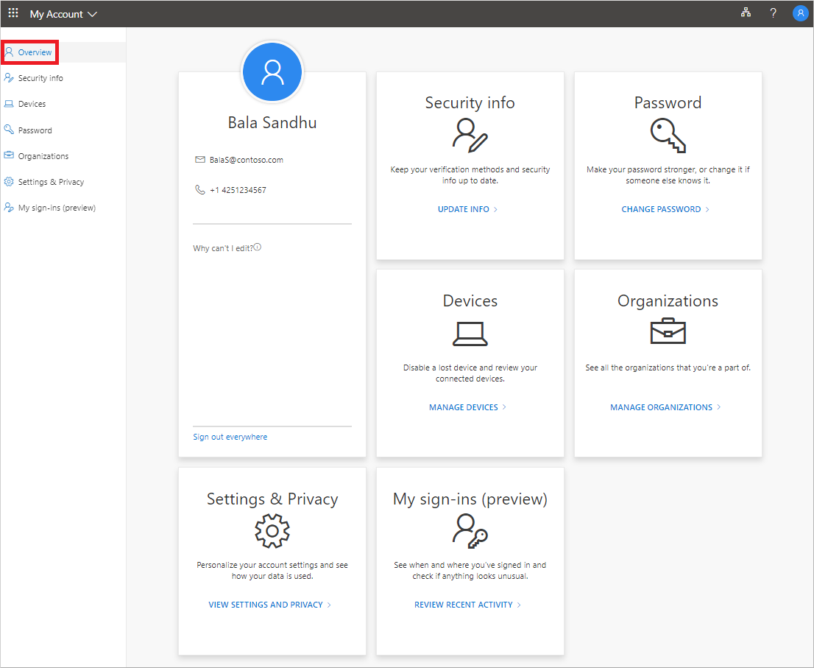

# Che cos'è il portale Account personale?

Il portale **Account personale** (anteprima) consente di gestire l'account aziendale o dell'istituto di istruzione configurando e gestendo le informazioni di sicurezza, gestendo le organizzazioni e i dispositivi connessi e visualizzando come vengono usati i dati nell'organizzazione.

È possibile accedere al portale **Account personale** (https://myaccount.microsoft.com) ), dalla versione corrente di uno qualsiasi dei browser seguenti:

- Chrome
- Microsoft Edge
- Safari
- Firefox
- Internet Explorer 11

>[!Important]
>Questo articolo è destinato agli utenti che provano ad accedere al portale Account personale per aggiornare le informazioni di sicurezza, le informazioni sui dispositivi, la password, le organizzazioni connesse, la privacy o le precedenti informazioni di accesso. Se si è un amministratore e si cercano informazioni su come attivare l'autenticazione e altre funzionalità di Azure Active Directory (Azure AD) per i dipendenti e altri utenti, vedere la [documentazione di Azure AD per amministratori](https://docs.microsoft.com/azure/active-directory/).

## Passaggi successivi

- Visualizzare o gestire le [informazioni di sicurezza](user-help-security-info-overview.md)

- Visualizzare o gestire i [dispositivi](my-account-portal-devices-page.md) connessi

- Visualizzare e gestire le [organizzazioni](my-account-portal-organizations-page.md)

- Visualizzare l'[attività di accesso](my-account-portal-sign-ins-page.md)

- Visualizzare come vengono usati dall'organizzazione i [dati relativi alla privacy](my-account-portal-privacy-page.md)

## Contenuto correlato di Microsoft Office

- [Accedere per gestire Office](https://support.office.com/article/sign-in-to-manage-your-office-product-959ac957-8d37-4ae4-b1b6-d6e4874e013f)

- [Andare alla pagina **Account personale** di Office](https://portal.office.com/account/)

- [Andare alla pagina **Mie installazioni** di Office](https://portal.office.com/account/#installs)

- [Andare alla pagina **Sottoscrizioni** di Office](https://portal.office.com/account/#subscriptions)