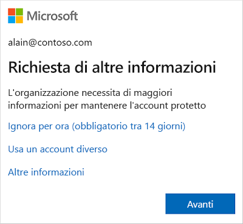
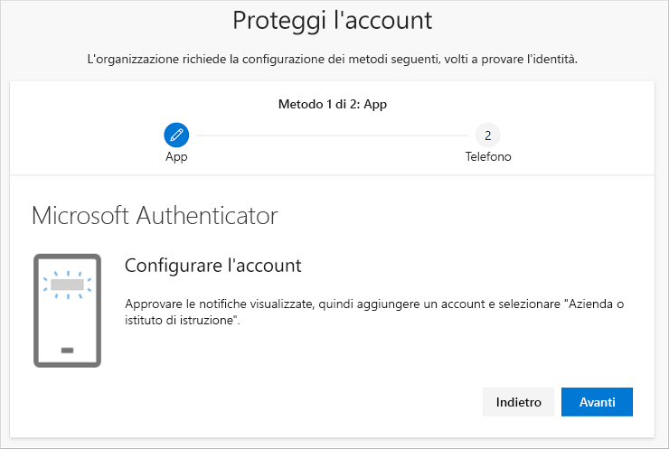
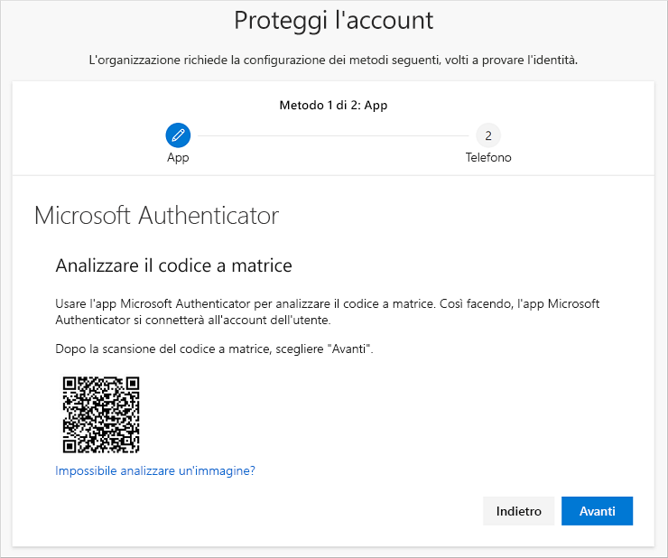
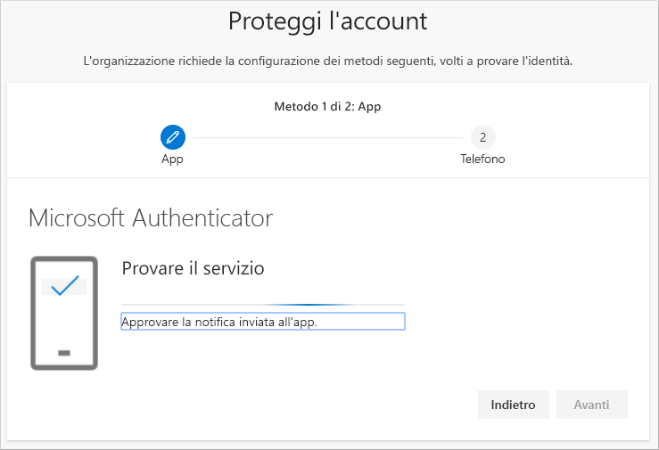
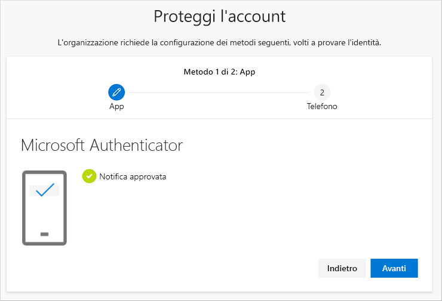
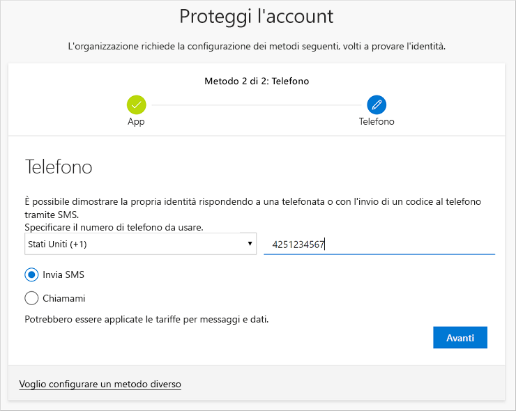
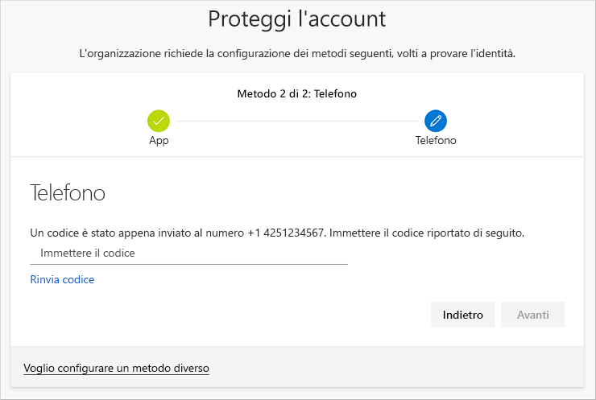
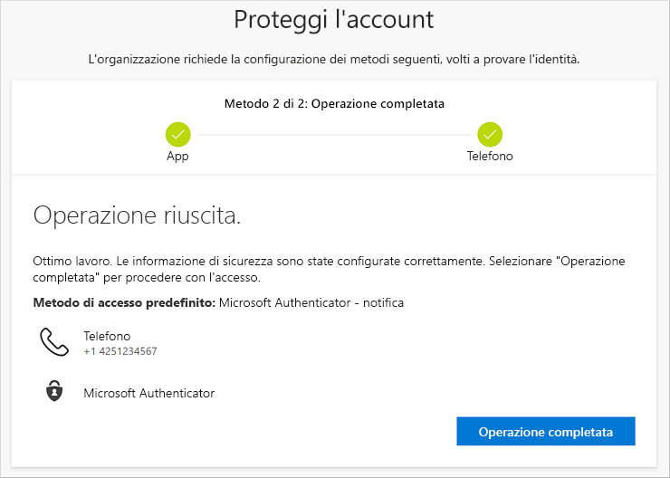

# Configurare le informazioni di sicurezza da una richiesta di accesso

È possibile seguire questa procedura se subito dopo l'accesso all'account aziendale o dell'istituto di istruzione viene richiesto di configurare le informazioni di sicurezza.

Questa richiesta verrà visualizzata solo se non si sono ancora configurate le informazioni di sicurezza richieste dall'organizzazione. Se sono state configurate in precedenza ma si vogliono apportare modifiche, è possibile seguire i passaggi illustrati nei vari articoli sulle procedure in base al metodo. Per altre informazioni, vedere la [panoramica su come aggiungere o aggiornare le informazioni di sicurezza](security-info-add-update-methods-overview.md).

[!INCLUDE [preview-notice](../../../includes/active-directory-end-user-preview-notice-security-info.md)]

## Confronto tra verifica di sicurezza e autenticazione per la reimpostazione della password

I metodi di gestione delle informazioni di sicurezza vengono usati sia per la verifica di sicurezza a due fattori sia per la reimpostazione della password. Non tutti i metodi possono tuttavia essere usati per entrambe.

| Metodo | Utilizzo |
| ------ | -------- |
| App di autenticazione | Verifica a due fattori e autenticazione per la reimpostazione della password. |
| SMS | Verifica a due fattori e autenticazione per la reimpostazione della password. |
| Telefonate | Verifica a due fattori e autenticazione per la reimpostazione della password. |
| Chiave di sicurezza | Verifica a due fattori e autenticazione per la reimpostazione della password. |
| Account di posta elettronica | Solo autenticazione per la reimpostazione della password. Per la verifica a due fattori sarà necessario scegliere un altro metodo. |
| Domande di sicurezza | Solo autenticazione per la reimpostazione della password. Per la verifica a due fattori sarà necessario scegliere un altro metodo. |

## Accedere all'account aziendale o dell'istituto di istruzione

Dopo che si è eseguito l'accesso all'account aziendale o dell'istituto di istruzione, prima di poter accedere all'account verrà visualizzata la richiesta di specificare altre informazioni.

## Configurare le informazioni di sicurezza con la procedura guidata

Seguire questa procedura per configurare le informazioni di sicurezza per l'account aziendale o dell'istituto di istruzione dal messaggio di richiesta.

>[!Important]
>Questo è solo un esempio del processo. A seconda dei requisiti dell'organizzazione, l'amministratore potrebbe aver configurato altri metodi di verifica da configurare durante questo processo. In questo esempio si richiedono due metodi: l'app Microsoft Authenticator e un numero di telefono cellulare per SMS o chiamate di verifica.

1. Dopo che si è selezionato **Avanti** nel messaggio di richiesta, verrà visualizzata la procedura guidata **Proteggi l'account** con il primo metodo che l'amministratore e l'organizzazione richiedono di configurare. In questo esempio è l'app Microsoft Authenticator.

   > [!Note]
   > Se si vuole usare un'app di autenticazione diversa dall'app Microsoft Authenticator, fare clic sul collegamento **Desidero usare un'app di autenticazione diversa**.
   >
   > Se l'organizzazione consente di scegliere un metodo diverso oltre all'app di autenticazione, è possibile fare clic sul collegamento **Desidero configurare un metodo diverso**.

    

2. Selezionare **Scarica adesso** per scaricare e installare l'app Microsoft Authenticator sul dispositivo mobile e quindi selezionare **Avanti**. Per altre informazioni su come scaricare e installare l'app, vedere [Scaricare e installare l'app Microsoft Authenticator](user-help-auth-app-download-install.md).

    

3. Rimanere sulla pagina **Configurare l'account** durante la configurazione dell'app Microsoft Authenticator sul dispositivo mobile.

4. Aprire l'app Microsoft Authenticator, scegliere di consentire le notifiche (se richiesto), selezionare **Aggiungi account** dall'icona **Customize and control** (Personalizza e controlla) in alto a destra e quindi selezionare **Account aziendale o dell'istituto di istruzione**.

    >[!Note]
    >Se si configura l'app Microsoft Authenticator per la prima volta, è possibile che venga visualizzato un messaggio in cui viene richiesto se consentire all'app di accedere alla fotocamera (iOS) o se consentire all'app di scattare foto e registrare video (Android). Selezionare **Consenti** per consentire all'app Authenticator di accedere alla fotocamera per scattare una foto del codice a matrice nel passaggio successivo. Se non si consente l'accesso alla fotocamera, è comunque possibile configurare l'app Authenticator, ma sarà necessario aggiungere le informazioni sul codice manualmente. Per altre informazioni su come aggiungere manualmente un codice, vedere [Aggiungere manualmente un account all'app](user-help-auth-app-add-account-manual.md).

5. Tornare alla pagina **Configura l'account** sul computer e quindi selezionare **Avanti**.

    Verrà visualizzata la pagina **Esegui la scansione del codice a matrice**.

    

6. Effettuare la scansione del codice fornito con il lettore di codice a matrice dell'app Microsoft Authenticator, visualizzato sul dispositivo mobile dopo la creazione dell'account aziendale o dell'istituto di istruzione nel passaggio 5.

    L'app Authenticator dovrebbe completare l'aggiunta dell'account aziendale o dell'istituto di istruzione senza richiedere altre informazioni. Se invece il lettore di codice a matrice non riesce a leggere il codice, è possibile selezionare **Non è possibile eseguire la scansione del codice a matrice** e immettere manualmente il codice e l'URL nell'app Microsoft Authenticator. Per altre informazioni sull'aggiunta manuale di un codice, vedere [Aggiungere manualmente un account all'app](user-help-auth-app-add-account-manual.md).

7. Selezionare **Avanti** nella pagina **Esegui la scansione del codice a matrice** sul computer.

    Verrà inviata una notifica all'app Microsoft Authenticator sul dispositivo mobile per testare l'account.

    

8. Approvare la notifica nell'app Microsoft Authenticator, quindi selezionare **Avanti**.

    

    Le informazioni di sicurezza vengono aggiornate in modo da usare per impostazione predefinita l'app Microsoft Authenticator per verificare l'identità quando viene usata la verifica in due passaggi o la reimpostazione della password.

9. Nella pagina di configurazione **Telefono** scegliere se si vuole ricevere un SMS o una telefonata e quindi selezionare **Avanti**. Ai fini di questo esempio si usano SMS, quindi è necessario usare il numero di telefono di un dispositivo che può accettare SMS.

    

    Verrà inviato un SMS al numero di telefono. Se si preferisce ricevere una telefonata, il processo è lo stesso. Si riceverà però una telefonata con istruzioni invece di un SMS.

10. Immettere il codice contenuto nell'SMS inviato al dispositivo mobile e quindi selezionare **Avanti**.

    

11. Esaminare la notifica di operazione riuscita e quindi selezionare **Fine**.

    

    Le informazioni di sicurezza vengono aggiornate in modo da usare l'invio di SMS come metodo di backup per verificare l'identità quando viene usata la verifica in due passaggi o la reimpostazione della password.

12. Esaminare la pagina **Operazione riuscita** per verificare di aver configurato correttamente per le informazioni di sicurezza sia l'app Microsoft Authenticator sia un metodo tramite telefono (SMS o telefonata) e quindi selezionare **Fine**.

    

    >[!Note]
    >Se l'organizzazione richiede l'uso di password delle app, in questa procedura guidata potrebbe essere visualizzata una sezione aggiuntiva per la relativa configurazione. Se viene visualizzata una terza sezione denominata **Password dell'app**, per poter completare la procedura guidata è prima necessario compilarla. Per informazioni sulla procedura per aggiungere una password dell'app, vedere la sezione [Gestire le password delle app](#manage-your-app-passwords) di questo articolo.

### Gestire le password delle app

Alcune app, come Outlook 2010, non supportano la verifica in due passaggi. L'assenza di supporto significa che se si usa la verifica in due passaggi nell'organizzazione, l'app non funzionerà. Per ovviare a questo problema, è possibile creare una password generata automaticamente da usare con ogni app non basata su browser, diversa dalla password normale.

>[!Note]
>Se questa opzione non viene visualizzata nella procedura guidata, significa che non è stata configurata dall'amministratore. Se l'opzione non è configurata ma si sa di dover usare password delle app, è possibile seguire la procedura descritta in [Configurare le password delle app dalla pagina Informazioni di sicurezza](security-info-app-passwords.md).

Quando si usano password per le app, è importante tenere presente quanto segue:

- Le password delle app vengono generate automaticamente e immesse una sola volta per ogni app.

- Il limite è di 40 password per utente. Se si prova a crearne un'altra oltre questo limite, verrà chiesto di eliminare una password esistente prima di poter creare quella nuova.

- Usare una sola password per dispositivo, non per app. Ad esempio, creare una singola password per tutte le app del portatile e un'altra per tutte le app sul PC desktop.

#### Per aggiungere password delle app nella procedura guidata per l'accesso

1. Dopo aver completato le sezioni precedenti della procedura guidata, selezionare **Avanti** e completare la sezione **Password dell'app**.

2. Digitare il nome dell'app per cui è necessaria la password, ad esempio `Outlook 2010`, e quindi selezionare **Avanti**.

    

3. Copiare il codice della password dalla schermata **Password dell'app** e incollarlo nell'area **Password** dell'app, che in questo esempio è Outlook 2010.

    

4. Dopo aver copiato la password e averla incollata nell'app, tornare a questa procedura guidata per verificare che tutte le informazioni sul metodo di accesso siano corrette e quindi selezionare **Fine**.

    

## Passaggi successivi

- Per modificare, eliminare o aggiornare i metodi di gestione delle informazioni di sicurezza predefiniti, vedere:

    - [Configurare le informazioni di sicurezza per l'uso di un'app di autenticazione](security-info-setup-auth-app.md).

    - [Configurare le informazioni di sicurezza per l'uso di SMS](security-info-setup-text-msg.md).

    - [Configurare le informazioni di sicurezza per l'uso di chiamate telefoniche](security-info-setup-phone-number.md).

    - [Configurare le informazioni di sicurezza per l'uso della posta elettronica ](security-info-setup-email.md).

    - [Configurare le informazioni di sicurezza per l'uso di domande di sicurezza predefinite](security-info-setup-questions.md).

- Per informazioni su come eseguire l'accesso usando il metodo specificato, vedere [Come effettuare l'accesso](user-help-sign-in.md).

- Se la password viene persa o dimenticata, reimpostarla dal [portale per la reimpostazione della password](https://passwordreset.microsoftonline.com/) oppure seguire i passaggi nell'articolo [Reimpostare la password aziendale o dell'istituto di istruzione](active-directory-passwords-update-your-own-password.md).

- Ottenere informazioni e suggerimenti per la risoluzione dei problemi di accesso nell'articolo [Quando non riesci ad accedere al tuo account Microsoft](https://support.microsoft.com/help/12429/microsoft-account-sign-in-cant).
