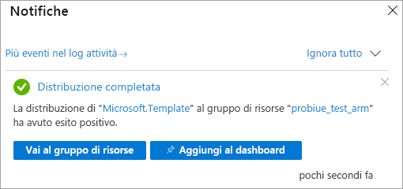

# <a name="quickstart-create-a-server---arm-template"></a>Avvio rapido: Creare un server - Modello di Resource Manager

Questo argomento di avvio rapido descrive come creare una risorsa server di Analysis Services nella sottoscrizione di Azure usando un modello di Azure Resource Manager (modello ARM).

[!INCLUDE [About Azure Resource Manager](../../includes/resource-manager-quickstart-introduction.md)]

Se l'ambiente soddisfa i prerequisiti e si ha familiarità con l'uso dei modelli di Resource Manager, selezionare il pulsante **Distribuisci in Azure**. Il modello verrà aperto nel portale di Azure.

[](https://portal.azure.com/#create/Microsoft.Template/uri/https%3A%2F%2Fraw.githubusercontent.com%2FAzure%2Fazure-quickstart-templates%2Fmaster%2F101-analysis-services-create%2Fazuredeploy.json)

## <a name="prerequisites"></a>Prerequisiti

* **Sottoscrizione di Azure**: visitare la pagina [Versione di valutazione gratuita di Azure](https://azure.microsoft.com/offers/ms-azr-0044p/) per creare un account.
* **Azure Active Directory**: la sottoscrizione deve essere associata a un tenant Azure Active Directory. Inoltre è necessario essere registrati ad Azure con un account nell'Azure Active Directory specifica. Per altre informazioni, vedere [Autenticazione e autorizzazioni utente](analysis-services-manage-users.md).

## <a name="review-the-template"></a>Rivedere il modello

Il modello usato in questo avvio rapido proviene dai [modelli di avvio rapido di Azure](https://azure.microsoft.com/resources/templates/101-analysis-services-create/).

:::code language="json" source="~/quickstart-templates/101-analysis-services-create/azuredeploy.json":::

Nel modello viene definita una singola risorsa [Microsoft.AnalysisServices/servers](/azure/templates/microsoft.analysisservices/servers) con una regola del firewall.

## <a name="deploy-the-template"></a>Distribuire il modello

1. Selezionare il collegamento Distribuisci in Azure seguente per accedere ad Azure e aprire un modello. Il modello viene usato per creare una risorsa server di Analysis Services e specificare le proprietà obbligatorie e facoltative.

   [](https://portal.azure.com/#create/Microsoft.Template/uri/https%3A%2F%2Fraw.githubusercontent.com%2FAzure%2Fazure-quickstart-templates%2Fmaster%2F101-analysis-services-create%2Fazuredeploy.json)

2. Selezionare o immettere i valori seguenti.

    Se non specificato diversamente, usare i valori predefiniti.

    * **Sottoscrizione** Selezionare una sottoscrizione di Azure.
    * **Gruppo di risorse**: fare clic su **Crea nuovo** e quindi immettere il nome univoco del nuovo gruppo di risorse.
    * **Località**: selezionare una posizione predefinita per le risorse create nel gruppo di risorse.
    * **Nome server**: immettere un nome per la risorsa server. 
    * **Località**: ignorare per Analysis Services. La posizione viene specificata in Località del server.
    * **Località del server**: immettere la posizione del server di Analysis Services. Si tratta spesso della stessa area immessa nella Località predefinita specificata per il gruppo di risorse, ma non obbligatoria. Ad esempio **Stati Uniti centro-settentrionali**. Per le aree supportate, vedere [Disponibilità di Analysis Services per area](analysis-services-overview.md#availability-by-region).
    * **Nome SKU**: immettere il nome dello SKU per il server di Analysis Services da creare. Scegliere tra: B1, B2, D1, S0, S1, S2, S3, S4, S8v2, S9v2. La disponibilità degli SKU dipende dall'area. È consigliabile usare S0 o D1 per la valutazione e il test.
    * **Capacity**: immettere il numero totale di istanze di scale-out delle repliche di query. Lo scale-out di più di un'istanza è supportato solo in alcune aree.
    * **Impostazioni del firewall**: immettere le regole del firewall in ingresso da definire per il server. Se non è specificato, il firewall è disabilitato.
    * **URI del contenitore BLOB di backup**: immettere l'URI SAS di un contenitore di Archiviazione BLOB di Azure privato con autorizzazioni di lettura, scrittura ed elenco. Obbligatorio solo se si intende usare la funzionalità di [backup/ripristino](analysis-services-backup.md).
    * **Accetto le condizioni riportate sopra**: selezionare questa casella.

3. Selezionare **Acquisto**. Al termine della distribuzione del server, si riceverà una notifica:

   

## <a name="validate-the-deployment"></a>Convalidare la distribuzione

Usare il portale di Azure o Azure PowerShell per verificare che il gruppo di risorse e la risorsa server siano stati creati.

### <a name="powershell"></a>PowerShell

```azurepowershell-interactive
$resourceGroupName = Read-Host -Prompt "Enter the Resource Group name"
(Get-AzResource -ResourceType "Microsoft.AnalysisServices/servers" -ResourceGroupName $resourceGroupName).Name
 Write-Host "Press [ENTER] to continue..."
```

---

## <a name="clean-up-resources"></a>Pulire le risorse

Quando non sono più necessari, usare il portale di Azure, l'interfaccia della riga di comando di Azure o Azure PowerShell per eliminare il gruppo di risorse e la risorsa server.

# <a name="cli"></a>[CLI](#tab/CLI)

```azurecli-interactive
echo "Enter the Resource Group name:" &&
read resourceGroupName &&
az group delete --name $resourceGroupName &&
echo "Press [ENTER] to continue ..."
```

# <a name="powershell"></a>[PowerShell](#tab/PowerShell)

```azurepowershell-interactive
$resourceGroupName = Read-Host -Prompt "Enter the Resource Group name"
Remove-AzResourceGroup -Name $resourceGroupName
Write-Host "Press [ENTER] to continue..."
```

---

## <a name="next-steps"></a>Passaggi successivi

In questo argomento di avvio rapido è stato usato un modello di Resource Manager per creare un nuovo gruppo di risorse e una risorsa server di Azure Analysis Services. Dopo aver creato una risorsa server usando il modello, tenere presente quanto segue:

> [!div class="nextstepaction"]
> [Avvio rapido: Configurare il firewall del server - Portale](analysis-services-qs-firewall.md)   
