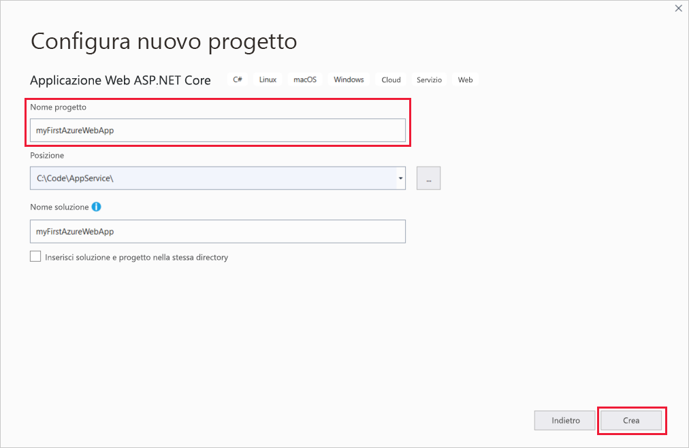
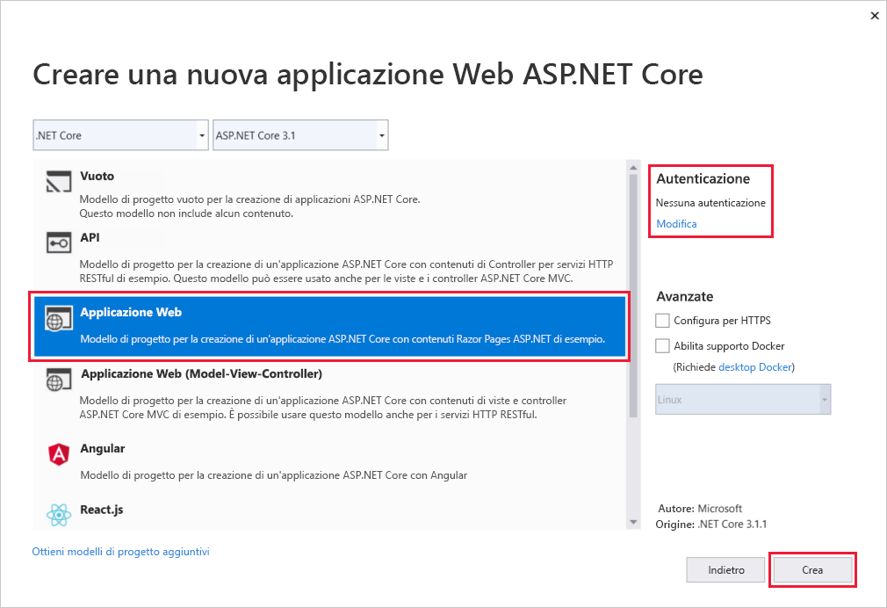
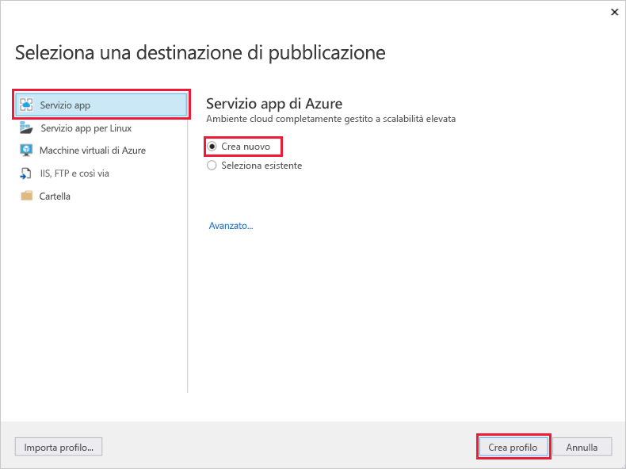
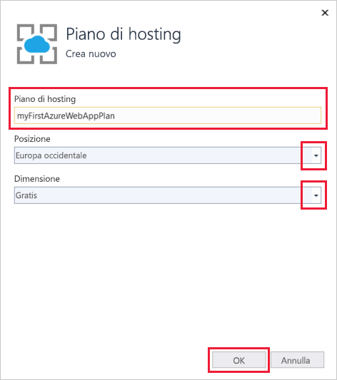
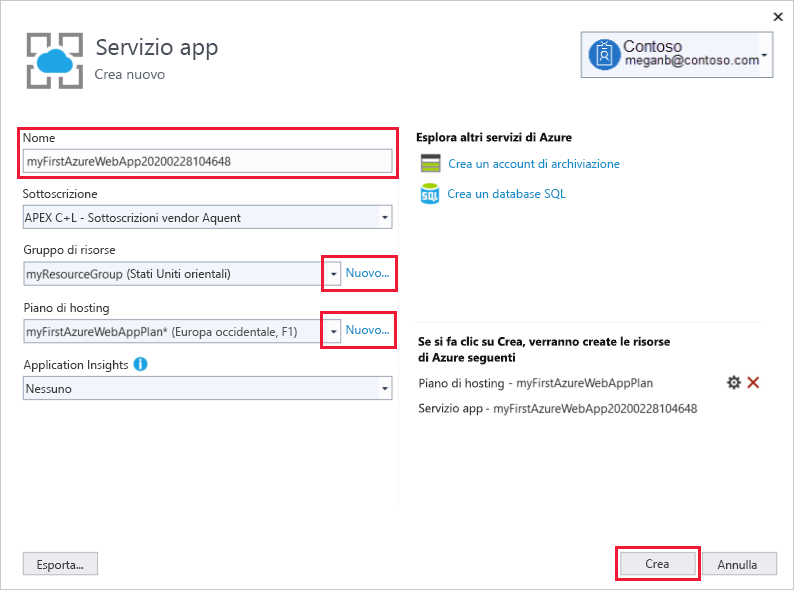
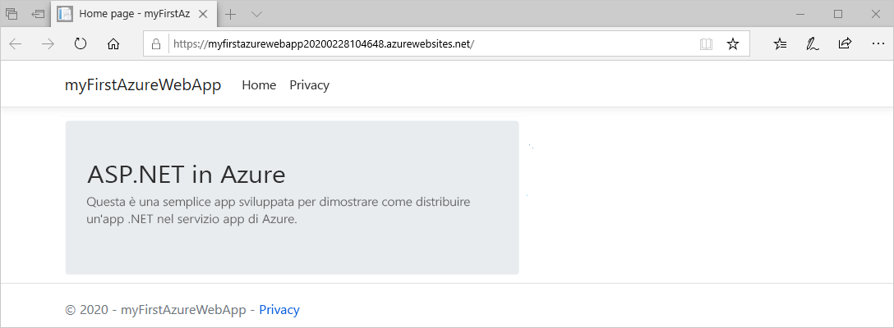
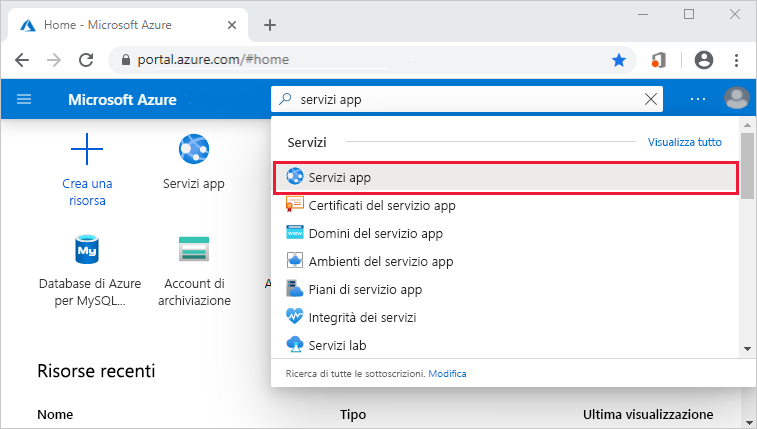
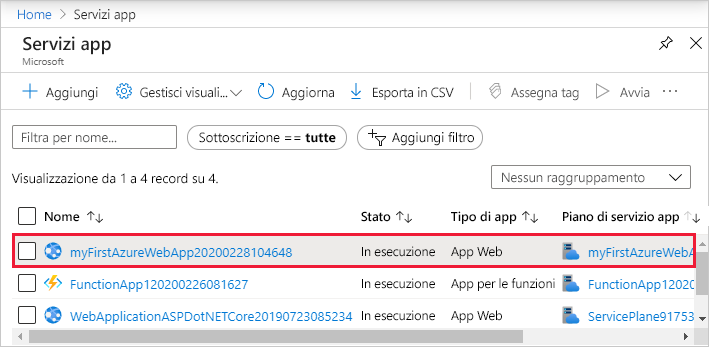

# <a name="quickstart-create-an-aspnet-core-web-app-in-azure"></a>Guida introduttiva: Creare un'app Web ASP.NET Core in Azure

Questo argomento di avvio rapido illustra come distribuire la prima app Web ASP.NET Core nel [Servizio app di Azure](overview.md). 

Al termine, si avrà un gruppo di risorse di Azure costituito da un piano di hosting del servizio app e un servizio app con un'applicazione Web distribuita.

## <a name="prerequisites"></a>Prerequisiti

- Un account Azure con una sottoscrizione attiva. [Creare un account gratuitamente](https://azure.microsoft.com/free/dotnet/).
- Questo argomento di avvio rapido illustra come distribuire un'app nel servizio app in Windows. Per la distribuzione nel servizio app in _Linux_, vedere [Creare un'app Web .NET Core nel servizio app in Linux](./containers/quickstart-dotnetcore.md).
- Installare <a href="https://www.visualstudio.com/downloads/" target="_blank">Visual Studio 2019</a> con il carico di lavoro **Sviluppo ASP.NET e Web**.

  Se Visual Studio 2019 è già installato:

  - Installare gli aggiornamenti più recenti in Visual Studio selezionando **?**  > **Controlla aggiornamenti**.
  - Aggiungere il carico di lavoro selezionando **Strumenti** > **Ottieni strumenti e funzionalità**.


## <a name="create-an-aspnet-core-web-app"></a>Creare un'app Web ASP.NET Core

Creare un'app Web ASP.NET Core in Visual Studio seguendo questa procedura:

1. Aprire Visual Studio e selezionare **Crea un nuovo progetto**.

1. In **Crea un nuovo progetto**selezionare **Applicazione Web ASP.NET Core** e verificare che **C#** sia elencato nei linguaggi disponibili per tale scelta, quindi selezionare **Avanti**.

1. In **Configura il nuovo progetto** assegnare al progetto di applicazione Web il nome *myFirstAzureWebApp* e selezionare **Crea**.

   

1. È possibile distribuire qualsiasi tipo di app Web ASP.NET Core in Azure, ma per questo argomento di avvio rapido scegliere il modello **Applicazione Web**. Verificare che l'opzione **Autenticazione** sia impostata su **Nessuna autenticazione** e che non sia selezionata nessun'altra opzione. Scegliere quindi **Create** (Crea).

    
   
1. Nel menu di Visual Studio selezionare **Debug** > **Avvia senza eseguire debug** per eseguire l'app Web in locale.

   

## <a name="publish-your-web-app"></a>Pubblicare l'app Web

Per pubblicare l'app Web, è necessario prima creare e configurare un nuovo servizio app in cui pubblicarla. 

Come parte della configurazione del servizio app, si creeranno:

- Un nuovo [gruppo di risorse](https://docs.microsoft.com/azure/azure-resource-manager/management/overview#terminology) che conterrà tutte le risorse di Azure per il servizio.
- Un nuovo [piano di hosting](https://docs.microsoft.com/azure/app-service/overview-hosting-plans) che specifica la località, le dimensioni e le funzionalità della server farm Web che ospita l'app.

Seguire questa procedura per creare il servizio app e pubblicare l'app Web:

1. In **Esplora soluzioni** fare clic con il pulsante destro del mouse sul progetto **myFirstAzureWebApp** e scegliere **Pubblica**. Se non è già stato effettuato l'accesso all'account Azure da Visual Studio, selezionare **Aggiungi un account** o **Accedi**. È anche possibile creare un account Azure gratuito.

1. Nella finestra di dialogo **Selezionare una destinazione di pubblicazione** scegliere **Servizio app**, selezionare **Crea nuovo** e quindi selezionare **Crea profilo**.

   

1. Nella finestra di dialogo **Servizio app - Crea nuovo**, in **Nome**, specificare un nome univoco globale per l'app accettando il valore predefinito o immettendone uno nuovo. I caratteri validi sono `a-z`, `A-Z`, `0-9` e `-`. Questo **Nome** viene usato come prefisso dell'URL per l'app Web nel formato `http://<app_name>.azurewebsites.net`.

1. Per **Sottoscrizione**, accettare la sottoscrizione elencata o sceglierne una nuova nell'elenco a discesa.

1. Per **Gruppo di risorse** selezionare **Nuovo**. In **Nome nuovo gruppo di risorse** immettere *myResourceGroup* e scegliere **OK**. 

1. Per **Piano di hosting** selezionare **Nuovo**. 

1. Nella finestra di dialogo **Piano di hosting: Crea nuovo** immettere i valori specificati nella tabella seguente:

   | Impostazione  | Valore consigliato | Descrizione |
   | -------- | --------------- | ----------- |
   | **Piano di hosting**  | *myFirstAzureWebAppPlan* | Nome del piano di servizio app. |
   | **Posizione**      | *Europa occidentale* | Data center in cui è ospitata l'app Web. |
   | **Dimensione**          | *Free* | [Piano tariffario](https://azure.microsoft.com/pricing/details/app-service/?ref=microsoft.com&utm_source=microsoft.com&utm_medium=docs&utm_campaign=visualstudio) che determina le funzionalità di hosting. |
   
   

1. Lasciare l'opzione **Application Insights** impostata su *Nessuno*.

1. Nella finestra di dialogo **Servizio app - Crea nuovo** selezionare **Crea** per avviare la creazione delle risorse di Azure.

   

1. Al termine della procedura guidata, selezionare **Pubblica**.

   

   Visual Studio pubblica l'app Web ASP.NET Core in Azure e la avvia nel browser predefinito. 

   

**Congratulazioni** L'app Web ASP.NET Core è ora in esecuzione nel servizio app di Azure.

## <a name="update-the-app-and-redeploy"></a>Aggiornare e ridistribuire l'app

Seguire questa procedura per aggiornare e ridistribuire l'app Web:

1. Nel progetto in **Esplora soluzioni** aprire **Pagine** > **Index.cshtml**.

1. Sostituire l'intero tag `<div>` con il codice seguente:

   ```html
   <div class="jumbotron">
       <h1>ASP.NET in Azure!</h1>
       <p class="lead">This is a simple app that we've built that demonstrates how to deploy a .NET app to Azure App Service.</p>
   </div>
   ```

1. Per la ridistribuzione in Azure, fare clic con il pulsante destro del mouse sul progetto **myFirstAzureWebApp** in **Esplora soluzioni** e selezionare **Pubblica**.

1. Nella pagina di riepilogo **Pubblica** selezionare **Pubblica**.

   

Al termine del processo di pubblicazione, Visual Studio avvia un browser sull'URL dell'app Web.



## <a name="manage-the-azure-app"></a>Gestire l'app Azure

Per gestire l'app Web, passare al [portale di Azure](https://portal.azure.com), quindi cercare e selezionare **Servizi app**.



Nella pagina **Servizi app** selezionare il nome dell'app Web.



La pagina **Panoramica** per l'app Web contiene le opzioni per la gestione di base, ad esempio Sfoglia, Arresta, Avvia, Riavvia ed Elimina. Il menu a sinistra include ulteriori pagine per la configurazione dell'app.


[!INCLUDE [Clean-up section](../../includes/clean-up-section-portal.md)]

## <a name="next-steps"></a>Passaggi successivi

In questo argomento di avvio rapido è stato usato Visual Studio per creare e distribuire un'app Web ASP.NET Core nel Servizio app di Azure.

Procedere con l'articolo successivo per informazioni su come creare un'app .NET Core e connetterla a un database SQL:

> [!div class="nextstepaction"]
> [ASP.NET Core con database SQL](app-service-web-tutorial-dotnetcore-sqldb.md)

> [!div class="nextstepaction"]
> [Configurare l'app ASP.NET Core](configure-language-dotnetcore.md)

Si vuole ottimizzare e risparmiare sulla spesa per il cloud?

> [!div class="nextstepaction"]
> [Per iniziare, analizzare i costi con Gestione costi](https://docs.microsoft.com/azure/cost-management-billing/costs/quick-acm-cost-analysis?WT.mc_id=costmanagementcontent_docsacmhorizontal_-inproduct-learn)