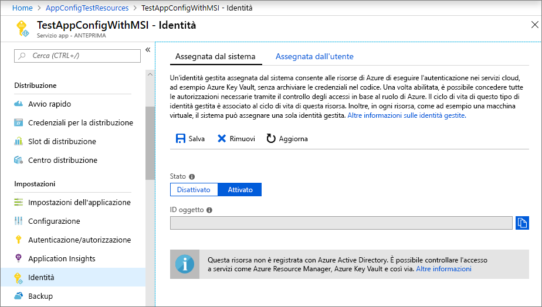
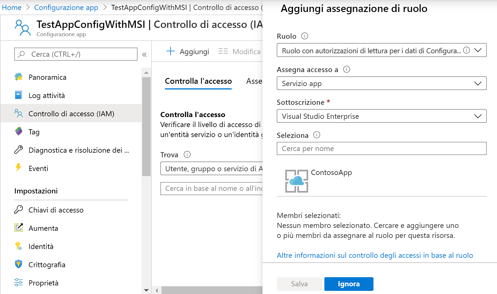

# <a name="integrate-with-azure-managed-identities"></a>Integrazione con Identità gestite di Azure

Le [identità gestite di](../active-directory/managed-identities-azure-resources/overview.md) Azure Active Directory semplificano la gestione dei segreti per l'applicazione cloud. Con un'identità gestita, il codice può usare l'entità servizio creata per il servizio di Azure in cui viene eseguito. È possibile usare un'identità gestita invece di usare credenziali distinte archiviate in Azure Key Vault o una stringa di connessione locale. 

Azure App Configuration e le librerie client .NET Core, .NET Framework e Java Spring hanno integrato il supporto delle identità gestite. Anche se non è necessario utilizzarlo, l'identità gestita elimina la necessità di un token di accesso che contiene segreti. Il codice può accedere all'archivio di configurazione app usando solo l'endpoint del servizio. È possibile incorporare questo URL direttamente nel codice senza esporre alcun segreto.

Questo articolo illustra come sfruttare l'identità gestita per accedere a Configurazione app. Si basa sull'app Web presentata nelle guide introduttive. Prima di continuare, creare prima [un'app ASP.NET Core con Configurazione app.](./quickstart-aspnet-core-app.md)

In questo articolo viene inoltre illustrato come utilizzare l'identità gestita insieme ai riferimenti dell'insieme di credenziali delle chiavi di Configurazione app. Con una singola identità gestita, è possibile accedere senza problemi a entrambi i segreti da Key Vault e valori di configurazione da Configurazione app. Se si desidera esplorare questa funzionalità, [completare l'uso dei riferimenti dell'insieme](./use-key-vault-references-dotnet-core.md) di credenziali delle chiavi con ASP.NET Core.

Per completare i passaggi riportati in questa esercitazione, è possibile usare qualsiasi editor di codice. [Visual Studio Code](https://code.visualstudio.com/) è un'ottima scelta per le piattaforme Windows, macOS e Linux.

In questo articolo vengono illustrate le operazioni seguenti:

> [!div class="checklist"]
> * Concedere a un'identità gestita l'accesso a Configurazione app.
> * Configurare l'app in modo da usare un'identità gestita per connettersi a Configurazione app.
> * Facoltativamente, configurare l'app per l'utilizzo di un'identità gestita quando ci si connette all'insieme di credenziali delle chiavi tramite un riferimento dell'insieme di credenziali delle chiavi di configurazione dell'app.

## <a name="prerequisites"></a>Prerequisiti

Per completare l'esercitazione, sono necessari:

* [.NET Core SDK](https://www.microsoft.com/net/download/windows).
* [Azure Cloud Shell configurato](https://docs.microsoft.com/azure/cloud-shell/quickstart).

[!INCLUDE [quickstarts-free-trial-note](../../includes/quickstarts-free-trial-note.md)]

## <a name="add-a-managed-identity"></a>Aggiungere un'identità gestita

Per impostare un'identità gestita nel portale, è innanzitutto necessario creare un'applicazione e quindi abilitare la funzionalità.

1. Creare un'istanza di Servizi app nel portale di [Azure](https://portal.azure.com) come di consueto. Passare all'app nel portale.

1. Scorrere verso il basso fino al gruppo **Impostazioni** nel riquadro a sinistra e selezionare **Identità**.

1. Nella scheda **Assegnata dal sistema** impostare **Stato** su **Attivato** e selezionare **Salva**.

1. Rispondere **Sì** quando viene richiesto di abilitare l'identità gestita assegnata dal sistema.

    

## <a name="grant-access-to-app-configuration"></a>Concedere l'accesso a Configurazione app

1. Nel [portale di Azure](https://portal.azure.com)selezionare **Tutte le risorse** e selezionare l'archivio di configurazione app creato nella guida introduttiva.

1. Selezionare **Controllo di accesso (IAM)**.

1. Nella scheda **Verifica l'accesso** selezionare **Aggiungi** nell'interfaccia utente della scheda **Aggiungi un'assegnazione di ruolo**.

1. In **Ruolo**selezionare **Lettore dati di configurazione app**. In **Assegna accesso a** selezionare **Servizio app** in **Identità gestita assegnata dal sistema**.

1. In **Sottoscrizione** selezionare la sottoscrizione di Azure. Selezionare la risorsa Servizio app per la propria app.

1. Selezionare **Salva**.

    

1. Facoltativo: se si desidera concedere l'accesso anche all'insieme di credenziali delle chiavi, seguire le istruzioni in Fornire l'autenticazione dell'insieme di credenziali delle chiavi [con un'identità gestita.](https://docs.microsoft.com/azure/key-vault/managed-identity)

## <a name="use-a-managed-identity"></a>Usare un'identità gestita

1. Aggiungere un riferimento al pacchetto *Azure.Identity:Add* a reference to the Azure.Identity package:

    ```cli
    dotnet add package Azure.Identity
    ```

1. Trovare l'endpoint per l'archivio di configurazione app. Questo URL è elencato nella scheda Chiavi di accesso per l'archivio nel portale di Azure.This URL is listed on the **Access keys** tab for the store in the Azure portal.

1. Aprire *appsettings.json* e aggiungere lo script seguente. Sostituire * \<service_endpoint>*, incluse le parentesi quadre, con l'URL dell'archivio di configurazione app. 

    ```json
    "AppConfig": {
        "Endpoint": "<service_endpoint>"
    }
    ```

1. Aprire *Program.cs*e aggiungere un `Azure.Identity` `Microsoft.Azure.Services.AppAuthentication` riferimento agli spazi dei nomi e :

    ```csharp-interactive
    using Azure.Identity;
    ```

1. Se si desidera accedere solo ai valori `CreateWebHostBuilder` archiviati direttamente `config.AddAzureAppConfiguration()` in Configurazione app, aggiornare il metodo sostituendo il metodo.

    > [!IMPORTANT]
    > `CreateHostBuilder` sostituisce `CreateWebHostBuilder` in .NET Core 3.0.  Selezionare la sintassi corretta in base all'ambiente.

    ### <a name="net-core-2x"></a>[.NET Core 2.x](#tab/core2x)

    ```csharp
        public static IWebHostBuilder CreateWebHostBuilder(string[] args) =>
            WebHost.CreateDefaultBuilder(args)
                .ConfigureAppConfiguration((hostingContext, config) =>
                {
                    var settings = config.Build();
                    config.AddAzureAppConfiguration(options =>
                        options.Connect(new Uri(settings["AppConfig:Endpoint"]), new ManagedIdentityCredential()));
                })
                .UseStartup<Startup>();
    ```

    ### <a name="net-core-3x"></a>[.NET Core 3.x](#tab/core3x)

    ```csharp
        public static IHostBuilder CreateHostBuilder(string[] args) =>
            Host.CreateDefaultBuilder(args)
            .ConfigureWebHostDefaults(webBuilder =>
            webBuilder.ConfigureAppConfiguration((hostingContext, config) =>
            {
                var settings = config.Build();
                    config.AddAzureAppConfiguration(options =>
                        options.Connect(new Uri(settings["AppConfig:Endpoint"]), new ManagedIdentityCredential()));
                })
                .UseStartup<Startup>());
    ```
    ---

1. Per utilizzare sia i valori di Configurazione app che i riferimenti dell'insieme di credenziali delle chiavi, aggiornare *Program.cs* come illustrato di seguito. Questo codice crea `KeyVaultClient` un `AzureServiceTokenProvider` nuovo usando un e `UseAzureKeyVault` passa questo riferimento a una chiamata al metodo.

    ### <a name="net-core-2x"></a>[.NET Core 2.x](#tab/core2x)

    ```csharp
            public static IWebHostBuilder CreateWebHostBuilder(string[] args) =>
                WebHost.CreateDefaultBuilder(args)
                    .ConfigureAppConfiguration((hostingContext, config) =>
                    {
                        var settings = config.Build();
                        var credentials = new ManagedIdentityCredential();

                        config.AddAzureAppConfiguration(options =>
                        {
                            options.Connect(new Uri(settings["AppConfig:Endpoint"]), credentials)
                                    .ConfigureKeyVault(kv =>
                                    {
                                        kv.SetCredential(credentials);
                                    });
                        });
                    })
                    .UseStartup<Startup>();
    ```

    ### <a name="net-core-3x"></a>[.NET Core 3.x](#tab/core3x)

    ```csharp
        public static IHostBuilder CreateHostBuilder(string[] args) =>
            Host.CreateDefaultBuilder(args)
            .ConfigureWebHostDefaults(webBuilder =>
            webBuilder.ConfigureAppConfiguration((hostingContext, config) =>
                    {
                        var settings = config.Build();
                        var credentials = new ManagedIdentityCredential();

                        config.AddAzureAppConfiguration(options =>
                        {
                            options.Connect(new Uri(settings["AppConfig:Endpoint"]), credentials)
                                    .ConfigureKeyVault(kv =>
                                    {
                                        kv.SetCredential(credentials);
                                    });
                        });
                    })
                    .UseStartup<Startup>());
    ```
    ---

    È ora possibile accedere ai riferimenti dell'insieme di credenziali delle chiavi come qualsiasi altra chiave di configurazione dell'app. Il provider di `KeyVaultClient` configurazione utilizzerà l'oggetto configurato per l'autenticazione nell'insieme di credenziali delle chiavi e recupererà il valore.

[!INCLUDE [Prepare repository](../../includes/app-service-deploy-prepare-repo.md)]

## <a name="deploy-from-local-git"></a>Eseguire la distribuzione dall'archivio Git locale

Il modo più semplice per abilitare la distribuzione Git locale per l'app con il server di compilazione Kudu consiste nell'usare [Azure Cloud Shell.](https://shell.azure.com)

### <a name="configure-a-deployment-user"></a>Configurare un utente della distribuzione

[!INCLUDE [Configure a deployment user](../../includes/configure-deployment-user-no-h.md)]

### <a name="enable-local-git-with-kudu"></a>Abilitare l'archivio Git locale con Kudu
Se non hai un repository git locale per la tua app, dovrai inizializzarne uno. Per inizializzare un repository git locale, esegui i comandi seguenti dalla directory del progetto dell'app:

```cmd
git init
git add .
git commit -m "Initial version"
```

Per abilitare la distribuzione Git locale per l'app con il server di compilazione Kudu, eseguire [`az webapp deployment source config-local-git`](/cli/azure/webapp/deployment/source?view=azure-cli-latest#az-webapp-deployment-source-config-local-git) cloud Shell.

```azurecli-interactive
az webapp deployment source config-local-git --name <app_name> --resource-group <group_name>
```

Questo comando offre un elemento simile al seguente output:

```json
{
  "url": "https://<username>@<app_name>.scm.azurewebsites.net/<app_name>.git"
}
```

### <a name="deploy-your-project"></a>Distribuire il progetto

Nella finestra del _terminale locale_aggiungere un telecomando di Azure al repository Git locale. Sostituire _ \<url>_ con l'URL del telecomando Git ottenuto da [Abilita Git locale con Kudu](#enable-local-git-with-kudu).

```bash
git remote add azure <url>
```

Effettuare il push all'istanza remota di Azure per distribuire l'app con il comando seguente. Quando viene chiesta la password, immettere quella creata in [Configurare un utente della distribuzione](#configure-a-deployment-user). Non usare la stessa password usata per accedere al portale di Azure.

```bash
git push azure master
```

Nell'output potrebbe essere visualizzata l'automazione specifica di runtime, ad esempio MSBuild per ASP.NET, `npm install` per Node.js e `pip install` per Python.

### <a name="browse-to-the-azure-web-app"></a>Passare all'app Web di Azure

Passare all'app Web usando un browser per verificare che il contenuto sia stato distribuito.

```bash
http://<app_name>.azurewebsites.net
```

## <a name="use-managed-identity-in-other-languages"></a>Usare l'identità gestita in altri linguaggi

Anche i provider di Configurazione app per .NET Framework e Java Spring offrono supporto incorporato per l'identità gestita. È possibile usare l'endpoint URL dell'archivio anziché la stringa di connessione completa quando si configura uno di questi provider. 

Ad esempio, è possibile aggiornare l'app console .NET Framework creata nella guida introduttiva per specificare le impostazioni seguenti nel file *App.config:*

```xml
    <configSections>
        <section name="configBuilders" type="System.Configuration.ConfigurationBuildersSection, System.Configuration, Version=4.0.0.0, Culture=neutral, PublicKeyToken=b03f5f7f11d50a3a" restartOnExternalChanges="false" requirePermission="false" />
    </configSections>

    <configBuilders>
        <builders>
            <add name="MyConfigStore" mode="Greedy" endpoint="${Endpoint}" type="Microsoft.Configuration.ConfigurationBuilders.AzureAppConfigurationBuilder, Microsoft.Configuration.ConfigurationBuilders.AzureAppConfiguration" />
            <add name="Environment" mode="Greedy" type="Microsoft.Configuration.ConfigurationBuilders.EnvironmentConfigBuilder, Microsoft.Configuration.ConfigurationBuilders.Environment" />
        </builders>
    </configBuilders>

    <appSettings configBuilders="Environment,MyConfigStore">
        <add key="AppName" value="Console App Demo" />
        <add key="Endpoint" value ="Set via an environment variable - for example, dev, test, staging, or production endpoint." />
    </appSettings>
```

## <a name="clean-up-resources"></a>Pulire le risorse

[!INCLUDE [azure-app-configuration-cleanup](../../includes/azure-app-configuration-cleanup.md)]

## <a name="next-steps"></a>Passaggi successivi
In questa esercitazione è stata aggiunta un'identità gestita di Azure per semplificare l'accesso a Configurazione app e migliorare la gestione delle credenziali per l'app. Per altre informazioni sull'uso di Configurazione app, passare agli esempi dell'interfaccia della riga di comando di Azure.

> [!div class="nextstepaction"]
> [Esempi dell'interfaccia della riga di comando](./cli-samples.md)
