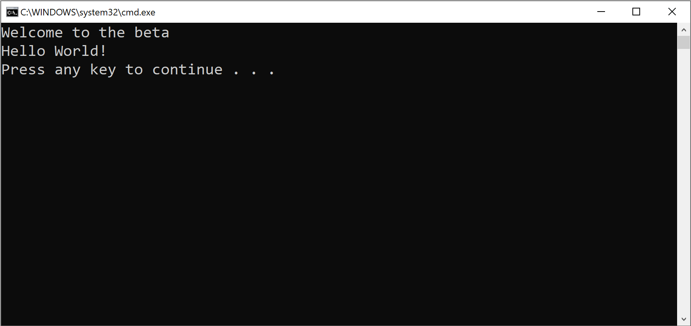

# <a name="quickstart-add-feature-flags-to-a-net-framework-app"></a>Guida introduttiva: Aggiungere flag di funzionalità a un'app .NET Framework

In questa guida di avvio rapido si incorpora Configurazione app di Azure in un'app .NET Framework per creare un'implementazione end-to-end di Gestione funzionalità. È possibile usare il servizio Configurazione app per archiviare tutti i flag di funzionalità in una posizione centralizzata e controllarne gli stati. 

Le librerie di Gestione funzionalità di .NET estendono il framework con il supporto completo per i flag di funzionalità. Queste librerie si basano sul sistema di configurazione di .NET. Si integrano facilmente con Configurazione app tramite il provider di configurazione di .NET.

## <a name="prerequisites"></a>Prerequisiti

- Sottoscrizione di Azure: [creare un account gratuito](https://azure.microsoft.com/free/)
- [Visual Studio 2019](https://visualstudio.microsoft.com/vs)
- [.NET Framework 4.8](https://dotnet.microsoft.com/download)

## <a name="create-an-app-configuration-store"></a>Creare un archivio di Configurazione app

[!INCLUDE [azure-app-configuration-create](../../includes/azure-app-configuration-create.md)]

6. Selezionare **Gestione funzionalità** >  **+Aggiungi** per aggiungere un flag funzionalità denominato `Beta`.

    > [!div class="mx-imgBorder"]
    > 

    Per il momento lasciare il campo `label` non definito.

## <a name="create-a-net-console-app"></a>Creare un'app console .NET

1. Avviare Visual Studio e selezionare **File** > **Nuovo** > **Progetto**.

1. In **Crea un nuovo progetto** filtrare in base al tipo di progetto **Console** e quindi fare clic su **App console (.NET Framework)** . Fare clic su **Avanti**.

1. In **Configura il nuovo progetto** immettere un nome di progetto. In **Framework** selezionare **.NET Framework 4.8** o versione successiva. Fare clic su **Crea**.

## <a name="connect-to-an-app-configuration-store"></a>Connettersi a un archivio di Configurazione app

1. Fare clic con il pulsante destro del mouse sul progetto e scegliere **Gestisci pacchetti NuGet**. Nella scheda **Sfoglia** cercare e aggiungere i pacchetti NuGet seguenti al progetto. Se non è possibile trovarli, selezionare la casella di controllo **Includi versione preliminare**.

    ```
    Microsoft.Extensions.DependencyInjection
    Microsoft.Extensions.Configuration.AzureAppConfiguration
    Microsoft.FeatureManagement
    ```

1. Aprire *Program.cs* e aggiungere le istruzioni seguenti:

    ```csharp
    using Microsoft.Extensions.DependencyInjection;
    using Microsoft.Extensions.Configuration;
    using Microsoft.Extensions.Configuration.AzureAppConfiguration;
    using Microsoft.FeatureManagement;
    ```

1. Aggiornare il metodo `Main` per connettersi a Configurazione app, specificando l'opzione `UseFeatureFlags` in modo da recuperare i flag di funzionalità. Visualizzare quindi un messaggio se il flag di funzionalità `Beta` è abilitato.

    ```csharp
        public static async Task Main(string[] args)
        {         
            IConfigurationRoot configuration = new ConfigurationBuilder()
                .AddAzureAppConfiguration(options =>
                {
                    options.Connect(Environment.GetEnvironmentVariable("ConnectionString"))
                           .UseFeatureFlags();
                }).Build();

            IServiceCollection services = new ServiceCollection();

            services.AddSingleton<IConfiguration>(configuration).AddFeatureManagement();

            using (ServiceProvider serviceProvider = services.BuildServiceProvider())
            {
                IFeatureManager featureManager = serviceProvider.GetRequiredService<IFeatureManager>();

                if (await featureManager.IsEnabledAsync("Beta"))
                {
                    Console.WriteLine("Welcome to the beta!");
                }
            }

            Console.WriteLine("Hello World!");
        }
    ```

## <a name="build-and-run-the-app-locally"></a>Compilare ed eseguire l'app in locale

1. Impostare una variabile di ambiente denominata **ConnectionString** sulla stringa di connessione dell'archivio di Configurazione app. Se si usa il prompt dei comandi di Windows, eseguire il comando seguente:

        setx ConnectionString "connection-string-of-your-app-configuration-store"

    Se si usa Windows PowerShell, eseguire il comando seguente:

        $Env:ConnectionString = "connection-string-of-your-app-configuration-store"

1. Riavviare Visual Studio per rendere effettiva la modifica. 

1. Premere CTRL+F5 per compilare ed eseguire l'app console.

    

## <a name="clean-up-resources"></a>Pulire le risorse

[!INCLUDE [azure-app-configuration-cleanup](../../includes/azure-app-configuration-cleanup.md)]

## <a name="next-steps"></a>Passaggi successivi

In questa guida di avvio rapido è stato creato un flag di funzionalità in Configurazione app, che è stato usato con un'app console .NET Framework. Per informazioni su come aggiornare in modo dinamico i flag di funzionalità e altri valori di configurazione senza riavviare l'applicazione, continuare con l'esercitazione successiva.

> [!div class="nextstepaction"]
> [Abilitare la configurazione dinamica](./enable-dynamic-configuration-dotnet.md)
