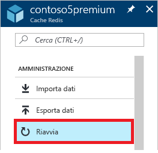
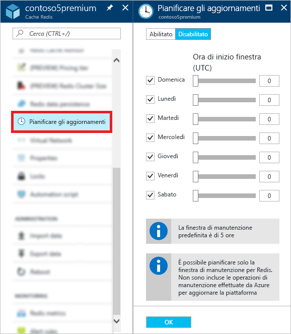

# Come amministrare Cache Redis di Azure
Questo argomento descrive come eseguire attività di amministrazione, ad esempio il [riavvio](#reboot) e la [pianificazione degli aggiornamenti](#schedule-updates) per le istanze di Cache Redis di Azure.

[!INCLUDE [updated-for-az](../../includes/updated-for-az.md)]

## Riavvio
Il pannello **Riavvia** consente di riavviare uno o più nodi della cache. La funzionalità di riavvio consente di testare la resilienza dell'applicazione in presenza di un errore di un nodo della cache.

Selezionare i nodi per il riavvio e fare clic su **Riavvia**.

Se si dispone di una cache Premium con clustering abilitato, è possibile selezionare le partizioni della cache da riavviare.

Per riavviare uno o più nodi della cache, selezionare i nodi desiderati e fare clic su **Reboot**(Riavvia). Se si dispone di una cache Premium con clustering abilitato, selezionare le partizioni desiderate per riavviare il computer e quindi fare clic su **Reboot**(Riavvia). Dopo alcuni minuti, i nodi selezionati si riavviano e vengono ripristinati online pochi minuti dopo.

L'impatto sulle applicazioni client varia a seconda dei nodi che si riavviano.

* **Master** : quando il nodo primario viene riavviato, cache di Azure per Redis esegue il failover sul nodo di replica e lo promuove in primario. Durante il failover potrebbe verificarsi un breve intervallo in cui le connessioni alla cache potrebbero avere esito negativo.
* **Replica** : quando il nodo di replica viene riavviato, non vi sono in genere effetti sui client della cache.
* **Sia primaria che replica** : quando vengono riavviati entrambi i nodi della cache, tutti i dati vengono persi nella cache e le connessioni alla cache hanno esito negativo fino a quando il nodo primario non torna online. Se è stato configurato il [salvataggio permanente dei dati](cache-how-to-premium-persistence.md), il backup più recente viene ripristinato quando la cache ritorna in linea, ma tutte le scritture nella cache che si sono verificate dopo l'ultimo backup andranno perse.
* **Nodi di una cache Premium con clustering abilitato**: quando si riavviano uno o più nodi di una cache Premium con clustering abilitato, il comportamento per i nodi selezionati è analogo a quello che si ottiene quando si riavviano il nodo o i nodi corrispondenti di una cache non cluster.

## Domande frequenti sulla funzionalità di riavvio
* [Quale nodo si deve riavviare per testare l'applicazione?](#which-node-should-i-reboot-to-test-my-application)
* [È possibile riavviare la cache per annullare le connessioni al client?](#can-i-reboot-the-cache-to-clear-client-connections)
* [Con il riavvio i dati nella cache andranno persi?](#will-i-lose-data-from-my-cache-if-i-do-a-reboot)
* [È possibile riavviare la cache usando PowerShell, l'interfaccia della riga di comando o altri strumenti di gestione?](#can-i-reboot-my-cache-using-powershell-cli-or-other-management-tools)

### Quale nodo si deve riavviare per testare l'applicazione?
Per testare la resilienza dell'applicazione in caso di errore del nodo principale della cache, riavviare il nodo **Principale** . Per testare la resilienza dell'applicazione in caso di errore del nodo di replica, riavviare il nodo **replica** . Per testare la resilienza dell'applicazione in caso di errore completo della cache, riavviare **Entrambi** i nodi.

### È possibile riavviare la cache per annullare le connessioni al client?
Sì, se si riavvia la cache tutte le connessioni client vengono annullate. Il riavvio può risultare utile nel caso in cui tutte le connessioni client si interrompano a causa di un errore logico o di un bug nell'applicazione client. Ogni piano tariffario presenta diversi [limiti di connessione al client](cache-configure.md#default-redis-server-configuration) per le diverse dimensioni e, una volta raggiunti questi limiti, non vengono accettate altre connessioni al client. Il riavvio della cache consente di annullare tutte le connessioni al client.

> [!IMPORTANT]
> Se si riavvia la cache per cancellare le connessioni client, StackExchange.Redis si riconnette automaticamente solo dopo che il nodo di Redis è tornato in linea. Se il problema sottostante non viene risolto, le connessioni client possono continuare a interrompersi.
> 
> 

### Con il riavvio i dati nella cache andranno persi?
Se si riavvia sia il nodo **Master** che quello di **replica** , tutti i dati nella cache (o in tale partizione se si usa una cache Premium con il clustering abilitato) potrebbero andare perduti, ma ciò non è garantito. Se è stato configurato il [salvataggio permanente dei dati](cache-how-to-premium-persistence.md), il backup più recente viene ripristinato quando la cache ritorna in linea, ma tutte le scritture nella cache che si sono verificate dopo l'esecuzione del backup andranno perse.

Se si riavvia solo uno dei nodi, in genere i dati non vengono persi, ma è comunque possibile. Se, ad esempio, il nodo primario viene riavviato ed è in corso una scrittura nella cache, i dati della scrittura nella cache andranno persi. Un altro scenario in cui avviene una perdita di dati si verifica se si riavvia un nodo e l'altro nodo diventa contemporaneamente inattivo basso a causa di un errore. Per altre informazioni sulle possibili cause di una perdita di dati, vedere [What happened to my data in Redis?](https://gist.github.com/JonCole/b6354d92a2d51c141490f10142884ea4#file-whathappenedtomydatainredis-md)(Cosa è accaduto ai dati in Redis)

### È possibile riavviare la cache usando PowerShell, l'interfaccia della riga di comando o altri strumenti di gestione?
Sì, per istruzioni relative a PowerShell vedere [Riavviare una Cache Redis](cache-how-to-manage-redis-cache-powershell.md#to-reboot-an-azure-cache-for-redis).

## Pianificare gli aggiornamenti
Il pannello **Pianifica aggiornamenti** consente di definire una finestra di manutenzione per l'istanza della cache. Una finestra di manutenzione consente di controllare i giorni e le ore di una settimana durante i quali è possibile aggiornare le macchine virtuali che ospitano la cache. Cache di Azure per Redis effettuerà il massimo sforzo per avviare e completare l'aggiornamento del software server Redis entro l'intervallo di tempo specificato definito.

> [!NOTE] 
> Si noti che l'intervallo di manutenzione è applicabile solo agli aggiornamenti del server Redis e non a tutti gli aggiornamenti di Azure o del sistema operativo delle macchine virtuali che ospitano la cache.
>

Per specificare un intervallo di manutenzione, selezionare i giorni desiderati e specificare l'ora di inizio dell'intervallo per ogni giorno, quindi fare clic su **OK**. Si noti che l'orario dell'intervallo di manutenzione è in formato UTC. 

L'intervallo di manutenzione minimo predefinito per gli aggiornamenti è di cinque ore. Questo valore non è configurabile dal portale di Azure, ma può essere configurato in PowerShell usando il parametro `MaintenanceWindow` del cmdlet [New-AzRedisCacheScheduleEntry](/powershell/module/az.rediscache/new-azrediscachescheduleentry). Per altre informazioni, vedere È possibile gestire gli aggiornamenti pianificati usando PowerShell, l'interfaccia della riga di comando o altri strumenti di gestione?

## Domande frequenti sulla pianificazione degli aggiornamenti
* [Quando vengono eseguiti gli aggiornamenti se non si usa la funzionalità di pianificazione degli aggiornamenti?](#when-do-updates-occur-if-i-dont-use-the-schedule-updates-feature)
* [Quale tipo di aggiornamenti vengono eseguiti durante l'intervallo di manutenzione pianificato?](#what-type-of-updates-are-made-during-the-scheduled-maintenance-window)
* [È possibile gestire gli aggiornamenti pianificati usando PowerShell, l'interfaccia della riga di comando o altri strumenti di gestione?](#can-i-managed-scheduled-updates-using-powershell-cli-or-other-management-tools)

### Quando vengono eseguiti gli aggiornamenti se non si usa la funzionalità di pianificazione degli aggiornamenti?
Se non si specifica un intervallo di manutenzione, è possibile eseguire aggiornamenti in qualsiasi momento.

### Quale tipo di aggiornamenti vengono eseguiti durante l'intervallo di manutenzione pianificato?
Durante l'intervallo di manutenzione pianificato vengono eseguiti solo gli aggiornamenti del server Redis. L'intervallo di manutenzione non si applica agli aggiornamenti di Azure o del sistema operativo della macchina virtuale.

### È possibile gestire gli aggiornamenti pianificati usando PowerShell, l'interfaccia della riga di comando o altri strumenti di gestione?
Sì, è possibile gestire gli aggiornamenti pianificati con i cmdlet di PowerShell seguenti:

* [Get-AzRedisCachePatchSchedule](/powershell/module/az.rediscache/get-azrediscachepatchschedule)
* [New-AzRedisCachePatchSchedule](/powershell/module/az.rediscache/new-azrediscachepatchschedule)
* [New-AzRedisCacheScheduleEntry](/powershell/module/az.rediscache/new-azrediscachescheduleentry)
* [Remove-AzRedisCachePatchSchedule](/powershell/module/az.rediscache/remove-azrediscachepatchschedule)

## Passaggi successivi
Altre informazioni sulle funzionalità di cache di Azure per Redis.

* [Cache di Azure per i livelli di servizio Redis](cache-overview.md#service-tiers)

