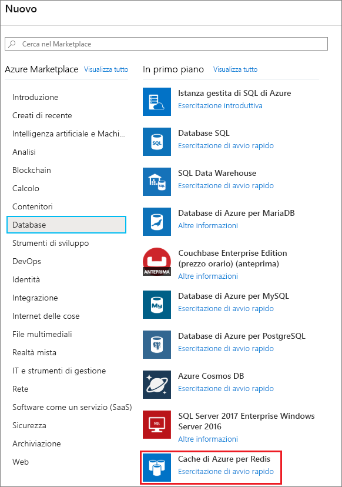
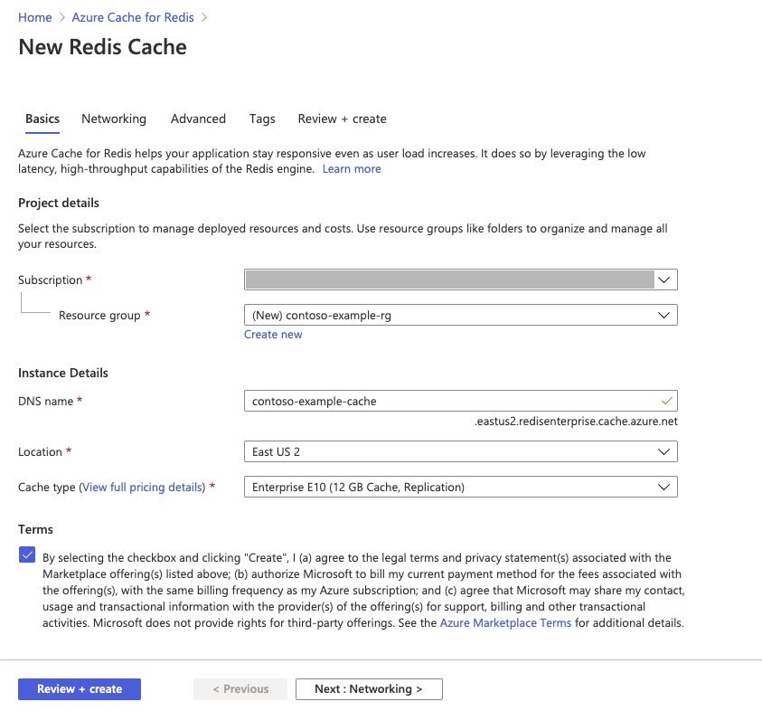

# Guida introduttiva: Crea una cache di livello Enterprise (anteprima)

I livelli Enterprise della cache di Azure per Redis offrono una soluzione [Redis Enterprise](https://redislabs.com/redis-enterprise/) completamente integrata e gestita in Azure. Sono attualmente disponibili in anteprima. L'anteprima include due nuovi livelli:
* Enterprise, che usa memoria volatile (DRAM) in una macchina virtuale per archiviare i dati
* Enterprise SSD, che usa memoria volatile e non volatile (NVMe) per archiviare i dati.

Non è previsto alcun costo per partecipare all'anteprima. Se si è interessati, eseguire la registrazione tramite l'opzione **Contattaci** di [Azure Marketplace](https://aka.ms/redispreviewsignup/). Il numero di posti disponibili per i partecipanti è molto limitato e non è garantito che si venga accettati nell'anteprima.

## Prerequisiti

Prima di iniziare, è necessaria una sottoscrizione di Azure. Se non se ne ha una, creare un [account gratuito](https://azure.microsoft.com/free/).

## Creare una cache
1. Per creare una cache, accedere al portale di Azure seguendo il collegamento nell'invito all'anteprima e quindi selezionare **Crea una risorsa**.

   > [!IMPORTANT] 
   > Non sottoscrivere la *cache di Azure per Redis, livelli Enterprise* direttamente nel Marketplace.
   > Questo passaggio viene eseguito automaticamente dall'interfaccia utente del portale Cache di Azure per Redis.
   >
   
1. Nella pagina **Nuovo** selezionare **Database** e quindi **Cache di Azure per Redis**.
   
   
   
1. Nella pagina **Nuova cache Redis** configurare le impostazioni per la nuova cache.
   
   | Impostazione      | Valore consigliato  | Descrizione |
   | ------------ |  ------- | -------------------------------------------------- |
   | **Sottoscrizione** | Nell'elenco a discesa selezionare la sottoscrizione. | Sottoscrizione in cui creare la nuova istanza della cache di Azure per Redis. | 
   | **Gruppo di risorse** | Nell'elenco a discesa selezionare un gruppo di risorse oppure scegliere **Crea nuovo** e immettere il nome di un nuovo gruppo di risorse. | Nome del gruppo di risorse in cui creare la cache e altre risorse. L'inserimento di tutte le risorse di un'app in un unico gruppo di risorse ne semplifica la gestione o l'eliminazione. | 
   | **Nome DNS** | Immettere un nome univoco globale. | Il nome della cache deve essere una stringa compresa tra 1 e 63 caratteri contenente solo numeri, lettere o trattini. Il nome deve iniziare e terminare con un numero o una lettera e non può contenere trattini consecutivi. Il *nome host* dell'istanza della cache sarà *\<Nome DNS>.<Azure region>.redisenterprise.cache.azure.net*. | 
   | **Posizione** | Nell'elenco a discesa selezionare una località. | I livelli Enterprise sono disponibili nelle aree Stati Uniti occidentali, Stati Uniti orientali 2 ed Europa occidentale. |
   | **Livello cache** | Nell'elenco a discesa selezionare il livello *Enterprise DRAM* o *Enterprise SSD* e le dimensioni. |  Il livello determina le dimensioni, le prestazioni e le funzionalità disponibili per la cache. |
   
    

1. Selezionare **Avanti: Rete** e ignorare la pagina.

   > [!NOTE] 
   > Il supporto per il collegamento privato verrà aggiunto più avanti.
   >

1. Selezionare **Avanti: Avanzate**.
   
   È possibile mantenere le impostazioni predefinite o cambiarle in base alle esigenze. Se si attiva l'opzione **Allow access only via TLS** (Consenti l'accesso solo tramite TLS), è necessario usare TLS per accedere alla nuova cache dall'applicazione.

    

   > [!NOTE] 
   > I moduli Redis non sono ancora supportati nel livello Enterprise SSD. Se si prevede di usare un modulo Redis, assicurarsi di scegliere una cache di livello Enterprise.
   >
   
1. Selezionare **Avanti: Tag** e ignorare la pagina.

1. Selezionare **Avanti: Riepilogo**.

    

1. Selezionare la casella di controllo sotto **Condizioni**, rivedere le impostazioni e quindi selezionare **Rivedi e crea**.
   
   La creazione della cache richiede un po' di tempo. È possibile monitorare lo stato di avanzamento nella pagina **Panoramica** della cache di Azure per Redis. Quando l'elemento **Stato** indica **In esecuzione**, la cache è pronta per l'uso.

   > [!NOTE] 
   > Dopo aver creato la cache di livello Enterprise, si riceverà un messaggio di posta elettronica di Azure Marketplace con l'**azione necessaria** per configurare la *cache di Azure per Redis, livelli Enterprise*. Questa azione non è necessaria. È possibile ignorare tranquillamente il messaggio.
   >

## Passaggi successivi

In questo argomento di avvio rapido si è appreso come creare un'istanza di livello Enterprise della cache di Azure per Redis.

> [!div class="nextstepaction"]
> [Creare un'app Web ASP.NET che usa Cache Redis di Azure.](./cache-web-app-howto.md)

