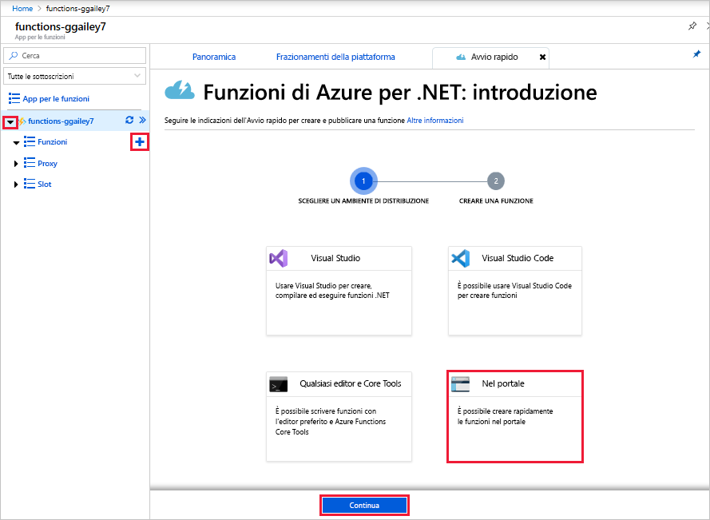
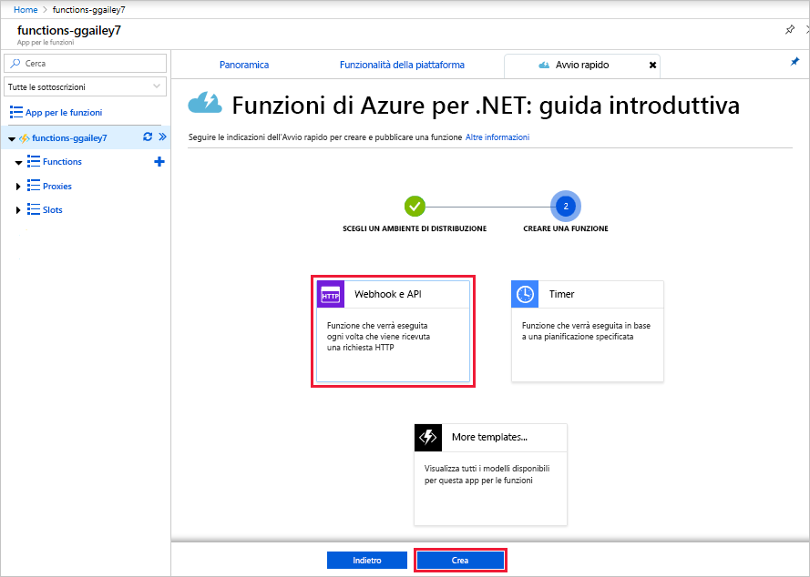

# Creare la prima funzione nel portale di Azure

Funzioni di Azure consente di eseguire il codice in un ambiente serverless senza dover prima creare una macchina virtuale (VM) o pubblicare un'applicazione Web. Questo articolo illustra come usare Funzioni di Azure per creare una funzione "hello world" attivata tramite HTTP nel portale di Azure.

[!INCLUDE [quickstarts-free-trial-note](../../includes/quickstarts-free-trial-note.md)]

Per gli sviluppatori in C# potrebbe essere opportuno [creare la prima funzione in Visual Studio 2019](functions-create-your-first-function-visual-studio.md) anziché nel portale. 

## Accedere ad Azure

Accedere al [portale di Azure](https://portal.azure.com) con il proprio account Azure.

## Creare un'app per le funzioni

Per ospitare l'esecuzione delle funzioni è necessaria un'app per le funzioni. Un'app per le funzioni consente di raggruppare le funzioni come un'unità logica per semplificare la gestione, la distribuzione, il ridimensionamento e la condivisione delle risorse.

[!INCLUDE [Create function app Azure portal](../../includes/functions-create-function-app-portal.md)]

Creare quindi una funzione nella nuova app per le funzioni.

## Creare una funzione attivata tramite HTTP

1. Espandere la nuova app per le funzioni, selezionare il pulsante **+** accanto a **Funzioni**, scegliere **Nel portale** e quindi selezionare **Continua**.

    

1. Scegliere **WebHook e API** e quindi selezionare **Crea**.

    

   Viene creata una funzione usando il modello specifico del linguaggio per una funzione attivata tramite HTTP.

Ora è possibile eseguire la nuova funzione inviando una richiesta HTTP.

## Testare la funzione

1. Nella nuova funzione selezionare **</> Recupera URL della funzione** in alto a destra. 

1. Nella finestra di dialogo **Recupera URL della funzione** selezionare **default (Function key)** (valore predefinito - chiave funzione) nell'elenco a discesa e quindi **Copia**. 

    

1. Incollare l'URL della funzione nella barra degli indirizzi del browser. Aggiungere il valore della stringa di query `&name=<your_name>` alla fine dell'URL e premere INVIO per eseguire la richiesta. 

    L'esempio seguente mostra la risposta nel browser:

    

    L'URL della richiesta include una chiave necessaria per impostazione predefinita per accedere a una funzione tramite HTTP.

1. Quando viene eseguita la funzione, vengono scritte nei log informazioni di traccia. Per visualizzare l'output di traccia dell'esecuzione precedente, tornare alla funzione nel portale e selezionare la freccia nella parte inferiore della schermata per espandere **Log**.

   

## Pulire le risorse

[!INCLUDE [Clean-up resources](../../includes/functions-quickstart-cleanup.md)]

## Passaggi successivi

[!INCLUDE [Next steps note](../../includes/functions-quickstart-next-steps.md)]

