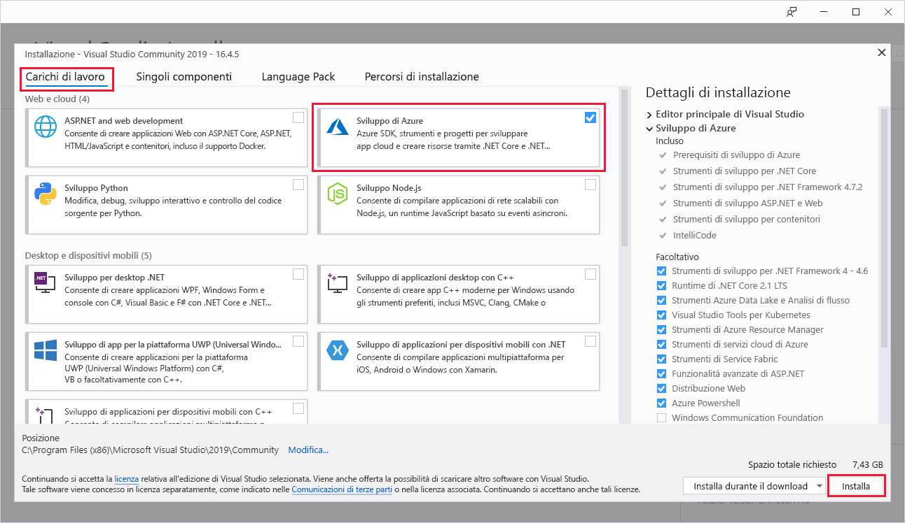

# Avvio rapido: Creare la prima funzione in Azure con Visual Studio

In questo articolo viene usato Visual Studio per creare una funzione basata sulla libreria di classi C# che risponde alle richieste HTTP. Dopo aver testato il codice in locale, verrà distribuito nell'ambiente serverless di Funzioni di Azure.  

Le procedure illustrate in questa guida di avvio rapido comportano l'addebito di qualche centesimo (USD) o meno nell'account Azure.

## Prerequisiti

Per completare questa esercitazione, per prima cosa installare [Visual Studio 2019](https://azure.microsoft.com/downloads/). Durante l'installazione assicurarsi di selezionare il carico di lavoro **Sviluppo di Azure**. Se si preferisce creare un progetto Funzioni di Azure con Visual Studio 2017, è prima necessario installare gli [strumenti più recenti per Funzioni di Azure](functions-develop-vs.md#check-your-tools-version).

Se non si ha una [sottoscrizione di Azure](../guides/developer/azure-developer-guide.md#understanding-accounts-subscriptions-and-billing), creare un [account gratuito](https://azure.microsoft.com/free/dotnet/) prima di iniziare.

## Creare un progetto di app per le funzioni

[!INCLUDE [Create a project using the Azure Functions template](../../includes/functions-vstools-create.md)]

Visual Studio crea un progetto e una classe che contiene il codice boilerplate per il tipo di funzione trigger HTTP. Il codice boilerplate invia una risposta HTTP che include un valore presente nel corpo della richiesta o nella stringa di query. L'attributo `HttpTrigger` specifica che la funzione è attivata da una richiesta HTTP. 

## Rinominare la funzione

L'attributo del metodo `FunctionName` imposta il nome della funzione, che per impostazione predefinita viene generato come `Function1`. Poiché gli strumenti non consentono di eseguire l'override del nome predefinito della funzione quando si crea il progetto, è necessario creare un nome migliore per la classe, il file e i metadati della funzione.

1. In **Esplora file**, fare clic con il pulsante destro del mouse sul file Function1.cs e rinominarlo in `HttpExample.cs`.

1. Nel codice rinominare la classe Function1 in 'HttpExample'.

1. Nel metodo `HttpTrigger` denominato `Run` rinominare l'attributo del metodo `FunctionName` in `HttpExample`.

Dopo aver rinominato la funzione, è possibile testarla nel computer locale.

## Eseguire la funzione in locale

Dato che Visual Studio si integra con Azure Functions Core Tools, è possibile testare le funzioni in locale usando il runtime completo di Funzioni di Azure.  

[!INCLUDE [functions-run-function-test-local-vs](../../includes/functions-run-function-test-local-vs.md)]

Dopo aver verificato la corretta esecuzione della funzione nel computer locale, è possibile pubblicare il progetto in Azure.

## Pubblicare il progetto in Azure

Per poter pubblicare il progetto, è prima necessario che la sottoscrizione di Azure includa un'app per le funzioni. La pubblicazione di Visual Studio crea un'app per le funzioni la prima volta che si pubblica il progetto.

[!INCLUDE [Publish the project to Azure](../../includes/functions-vstools-publish.md)]

## Testare la funzione in Azure

1. In Cloud Explorer è necessario selezionare la nuova app per le funzioni. In caso contrario, espandere la sottoscrizione > **Servizi app** e selezionare la nuova app per le funzioni.

1. Fare clic con il pulsante destro del mouse sull'app per le funzioni e scegliere **Apri nel browser**. Verrà visualizzata la radice dell'app per le funzioni nel Web browser predefinito e verrà visualizzata la pagina che indica che l'app per le funzioni è in esecuzione. 

    :::image type="content" source="media/functions-create-your-first-function-visual-studio/function-app-running-azure.png" alt-text="App per le funzioni in esecuzione":::

1. Nella barra degli indirizzi del browser aggiungere la stringa `/api/HttpExample?name=Functions` all'URL di base ed eseguire la richiesta.

    Il formato dell'URL che chiama la funzione attivata tramite HTTP è il seguente:

    `http://<APP_NAME>.azurewebsites.net/api/HttpExample?name=Functions`

2. Passare a questo URL per vedere la risposta nel browser alla risposta GET remota restituita dalla funzione, simile all'esempio seguente:

    :::image type="content" source="media/functions-create-your-first-function-visual-studio/functions-create-your-first-function-visual-studio-browser-azure.png" alt-text="Risposta della funzione nel browser":::

## Pulire le risorse

Altre guide di avvio rapido di questa raccolta si basano sulla presente guida di avvio rapido. Se si prevede di continuare a usare le guide di avvio rapido o i servizi creati con questa guida di avvio rapido, non eseguire la pulizia delle risorse.

Il termine *risorse* in Azure si riferisce ad app per le funzioni, funzioni, account di archiviazione e così via. Le risorse sono raggruppate in *gruppi di risorse*, ed è possibile eliminare tutti gli elementi in un gruppo eliminando il gruppo. 

Per completare queste guide introduttive sono state create risorse. Per tali risorse potrebbero venire addebitati costi, a seconda dello [stato dell'account](https://azure.microsoft.com/account/) e dei [prezzi dei servizi](https://azure.microsoft.com/pricing/). Se le risorse non sono più necessarie, ecco come eliminarle:

1. In Cloud Explorer espandere la sottoscrizione > **Servizi app**, fare clic con il pulsante destro del mouse sull'app per le funzioni e scegliere **Apri nel portale**. 

1. Nella pagina dell'app per le funzioni selezionare la scheda **Panoramica** e quindi il collegamento sotto **Gruppo di risorse**.

   :::image type="content" source="media/functions-create-your-first-function-visual-studio/functions-app-delete-resource-group.png" alt-text="Selezionare il gruppo di risorse da eliminare nella pagina dell'app per le funzioni.":::

2. Nella pagina **Gruppo di risorse** esaminare l'elenco delle risorse incluse e verificare che siano quelle da eliminare.
 
3. Selezionare **Elimina gruppo di risorse** e seguire le istruzioni.

   L'eliminazione potrebbe richiedere alcuni minuti. Al termine, viene visualizzata una notifica per pochi secondi. È anche possibile selezionare l'icona a forma di campana nella parte superiore della pagina per visualizzare la notifica.

## Passaggi successivi

In questa guida di avvio rapido è stato usato Visual Studio per creare e pubblicare un'app per le funzioni C# in Azure con una semplice funzione attivata tramite HTTP. 

Passare all'articolo successivo per informazioni su come aggiungere un'associazione alla coda di archiviazione di Azure alla funzione:
> [!div class="nextstepaction"]
> [Aggiungere un binding della coda di archiviazione di Azure alla funzione](functions-add-output-binding-storage-queue-vs.md)

