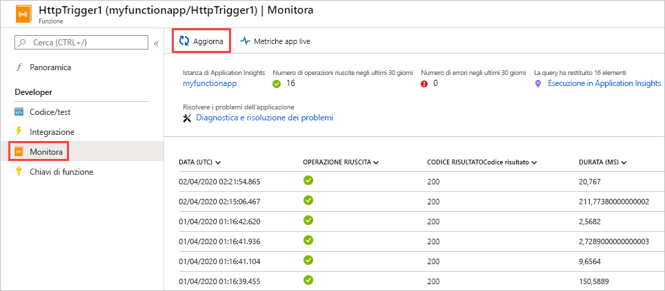
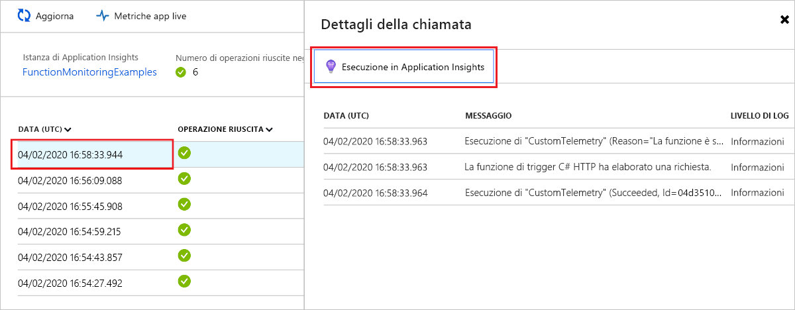
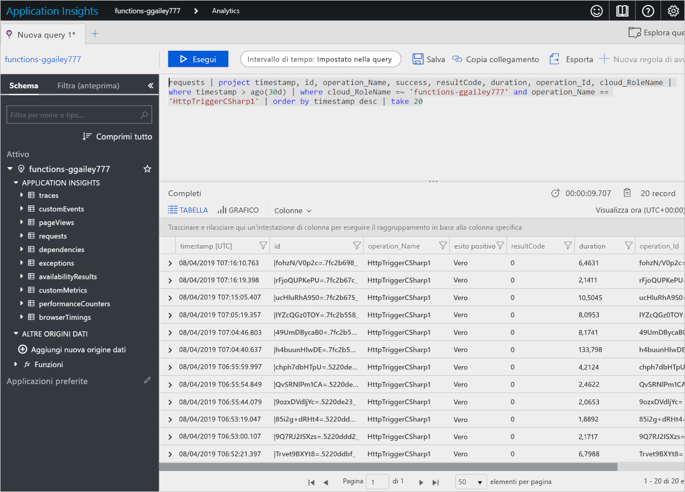
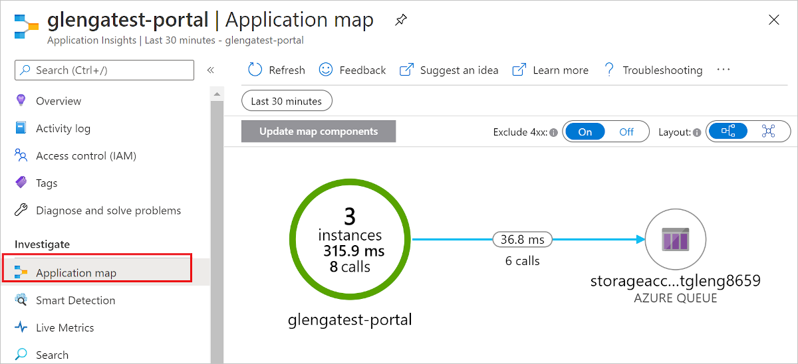
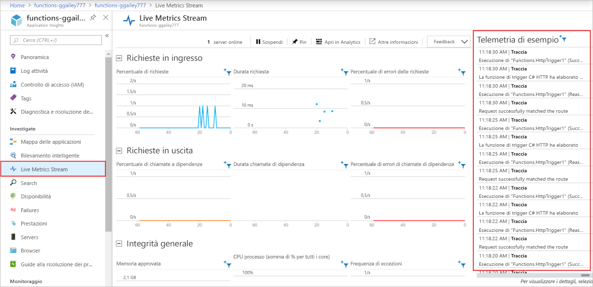

# <a name="monitor-azure-functions"></a>Monitorare Funzioni di Azure

[Funzioni di Azure](functions-overview.md) offre l'integrazione predefinita con [Azure Application Insights](../azure-monitor/app/app-insights-overview.md) per il monitoraggio delle funzioni. Questo articolo illustra come configurare Funzioni di Azure per inviare file di log generati dal sistema ad Application Insights.

È consigliabile usare Application Insights perché raccoglie i dati dei log, delle prestazioni e degli errori. Oltre a rilevare automaticamente le anomalie nelle prestazioni, include strumenti di analisi avanzati che consentono di diagnosticare i problemi e conoscere come vengono usate le funzioni. Il servizio è progettato per supportare il miglioramento continuo delle prestazioni e dell'usabilità. È anche possibile usare Application Insights durante lo sviluppo di un progetto locale di app per le funzioni. Per altre informazioni, vedere [Informazioni su Application Insights](../azure-monitor/app/app-insights-overview.md).

Poiché la chiave di strumentazione di Application Insights obbligatoria è già integrata in Funzioni di Azure, è sufficiente una chiave di strumentazione valida per connettere l'app per le funzioni a una risorsa di Application Insights. La chiave di strumentazione deve essere aggiunta alle impostazioni dell'applicazione quando la risorsa dell'app per le funzioni viene creata in Azure. Se l'app per le funzioni non dispone già di questa chiave, è possibile [impostarla manualmente](#enable-application-insights-integration).  

## <a name="application-insights-pricing-and-limits"></a>Prezzi e limiti di Application Insights

È possibile provare gratuitamente l'integrazione di Application Insights con Funzioni di Azure. È previsto un limite giornaliero per la quantità di dati che possono essere elaborati gratuitamente. È possibile che questo limite venga raggiunto durante i test. Quando il limite giornaliero è quasi raggiunto, Azure invia notifiche tramite il portale e messaggi di posta elettronica. Se si ignorano gli avvisi e viene raggiunto il limite, i nuovi log non verranno visualizzati nelle query di Application Insights. È quindi importante prestare attenzione al limite per evitare di perdere tempo inutilmente. Per altre informazioni, vedere [Gestire volumi di dati e prezzi in Application Insights](../azure-monitor/app/pricing.md).

> [!IMPORTANT]
> Application Insights ha una funzionalità di [campionamento](../azure-monitor/app/sampling.md) che consente di evitare la produzione di un numero eccessivo di dati di telemetria sulle esecuzioni completate nei picchi di carico. Il campionamento è abilitato per impostazione predefinita. Se sembrano mancare dati, potrebbe essere semplicemente necessario regolare le impostazioni di campionamento in base allo specifico scenario di monitoraggio. Per altre informazioni, vedere [Configurare il campionamento](#configure-sampling).

L'elenco completo delle funzionalità di Application Insights disponibili per le app per le funzioni è riportato in [Application Insights per le funzionalità supportate di Funzioni di Azure](../azure-monitor/app/azure-functions-supported-features.md).

## <a name="view-telemetry-in-monitor-tab"></a>Visualizzare dati di telemetria nella scheda Monitoraggio

Con l'[integrazione di Application Insights abilitata](#enable-application-insights-integration), è possibile visualizzare i dati di telemetria nella scheda **Monitor**.

1. Nella pagina dell'app per le funzioni selezionare una funzione eseguita almeno una volta dopo la configurazione di Application Insights, quindi selezionare **Monitor** nel riquadro a sinistra. Selezionare **Aggiorna** periodicamente fino a quando non viene visualizzato l'elenco di chiamate di funzione.

   

    > [!NOTE]
    > La visualizzazione dell'elenco può richiedere fino a 5 minuti, il tempo necessario al client di telemetria di configurare in batch i dati da trasmettere al server. Questo ritardo non si applica al servizio [Live Metrics Stream](../azure-monitor/app/live-stream.md), che si connette all'host di Funzioni mentre si carica la pagina e, quindi, i log vengono trasmessi direttamente alla pagina.

1. Per visualizzare i log per una chiamata di funzione particolare, selezionare il collegamento alla colonna **Data (UTC)** per la chiamata. L'output di registrazione per tale chiamata viene visualizzato in una nuova pagina.

   

1. Scegliere **Esegui in Application Insights** per visualizzare l'origine della query che recupera i dati di log di Monitoraggio di Azure nel log di Azure. Se è la prima volta che si usa Azure Log Analytics nella propria sottoscrizione, viene chiesto di abilitarlo.

1. Dopo aver abilitato Log Analytics, viene visualizzata la query seguente. È possibile notare come i risultati della query siano limitati agli ultimi 30 giorni (`where timestamp > ago(30d)`) e a non più di 20 righe (`take 20`). Al contrario, l'elenco dei dettagli delle chiamate alla funzione è relativo agli ultimi 30 giorni senza alcun limite.

   

Per altre informazioni, vedere [Eseguire query sui dati di telemetria](#query-telemetry-data) più avanti in questo articolo.

## <a name="view-telemetry-in-application-insights"></a>Visualizzare i dati di telemetria in Application Insights

Per aprire Application Insights da un'app per le funzioni nel portale di Azure, selezionare **Application Insights** nel menu **Impostazioni** della pagina a sinistra. Se è la prima volta che si usa Application Insights con la propria sottoscrizione, verrà chiesto di abilitarla: selezionare **Attiva Application Insights** e quindi scegliere **Applica** nella pagina successiva.


Per informazioni su come usare Application Insights, vedere la [documentazione su Application Insights](https://docs.microsoft.com/azure/application-insights/). Questa sezione mostra alcuni esempi su come visualizzare i dati in Application Insights. Se si ha già familiarità con Application Insights, è possibile passare direttamente alle [sezioni sulla configurazione e la personalizzazione dei dati di telemetria](#configure-categories-and-log-levels).


Le aree di Application Insights seguenti possono essere utili durante la valutazione del comportamento, delle prestazioni e degli errori delle funzioni:

| Analisi dei problemi | Descrizione |
| ---- | ----------- |
| **[Errori](../azure-monitor/app/asp-net-exceptions.md)** |  È possibile creare grafici e avvisi in base agli errori di funzione e alle eccezioni del server. Il **nome dell'operazione** corrisponde al nome della funzione. Gli errori nelle dipendenze non vengono mostrati a meno che non si implementino i dati di telemetria personalizzati per le dipendenze. |
| **[Prestazioni](../azure-monitor/app/performance-counters.md)** | È possibile analizzare i problemi di prestazioni visualizzando l'utilizzo delle risorse e la velocità effettiva per le **Istanze del ruolo del cloud**. Questi dati possono essere utili negli scenari di debug in cui le funzioni bloccano le risorse sottostanti. |
| **[Metriche](../azure-monitor/app/metrics-explorer.md)** | È possibile creare grafici e avvisi basati sulle metriche, che includono il numero di chiamate di funzione, il tempo di esecuzione e le percentuali di riuscita. |
| **[Metriche attive    ](../azure-monitor/app/live-stream.md)** | È possibile visualizzare i dati delle metriche così come vengono creati quasi in tempo reale. |

## <a name="query-telemetry-data"></a>Query sui dati di telemetria

[Analytics di Application Insights](../azure-monitor/app/analytics.md) consente di accedere a tutti i dati di telemetria sotto forma di tabelle in un database. Analytics offre un linguaggio di query per l'estrazione, la manipolazione e la visualizzazione dei dati. 

Scegliere **Log** per esplorare o eseguire una query in merito agli eventi registrati.


Questo è un esempio che mostra la distribuzione delle richieste per ruolo di lavoro negli ultimi 30 minuti.

<pre>
requests
| where timestamp > ago(30m) 
| summarize count() by cloud_RoleInstance, bin(timestamp, 1m)
| render timechart
</pre>

Le tabelle disponibili vengono mostrate nella scheda **Schema** a sinistra. Nelle tabelle seguenti è possibile trovare i dati generati dalle chiamate alla funzione:

| Tabella | Descrizione |
| ----- | ----------- |
| **traces** | log creati dal runtime e dal codice della funzione. |
| **requests** | una richiesta per ogni chiamata alla funzione. |
| **exceptions** | tutte le eccezioni generate dal runtime. |
| **customMetrics** | numero di chiamate con esito positivo e negativo, percentuale di riuscita, durata. |
| **customEvents** | eventi rilevati dal runtime, ad esempio: richieste HTTP che attivano una funzione. |
| **performanceCounters** | informazioni sulle prestazioni dei server su cui sono in esecuzione le funzioni. |

Le altre tabelle sono riservate ai test di disponibilità e ai dati di telemetria del browser e del client. È possibile implementare i dati di telemetria personalizzati per aggiungerne altri.

All'interno di ogni tabella alcuni dati specifici per Funzioni si trovano nel campo `customDimensions`.  Ad esempio, la query seguente recupera tutte le tracce con livello di registrazione `Error`.

<pre>
traces 
| where customDimensions.LogLevel == "Error"
</pre>

Il runtime fornisce i campi `customDimensions.LogLevel` e `customDimensions.Category`. È possibile specificare campi aggiuntivi nei log in cui si scrive il codice funzione. Vedere la sezione [Registrazione strutturata](#structured-logging) più avanti in questo articolo.

## <a name="configure-categories-and-log-levels"></a>Configurare le categorie e i livelli di registrazione

È possibile usare Application Insights senza alcuna operazione di configurazione personalizzata, poiché la configurazione predefinita può già produrre elevati volumi di dati. Se si usa una sottoscrizione di Azure di Visual Studio, si potrebbe raggiunge il limite d'uso dati per Application Insights. Nelle sezioni successive di questo articolo viene illustrato come configurare e personalizzare i dati inviati dalle funzioni ad Application Insights. Per le app per le funzioni, la registrazione viene configurata nel file [host.json].

### <a name="categories"></a>Categorie

Il logger di Funzioni di Azure include un *categoria* per ogni log. La categoria indica quale parte del codice runtime o del codice funzione è stata scritta dal log. Nel grafico seguente vengono descritte le principali categorie di log create dal runtime. 

| Category | Descrizione |
| ----- | ----- | 
| Host.Results | Questi log vengono visualizzati come **requests** in Application Insights. Indicano l'esito positivo o negativo di una funzione. Tutti questi log vengono scritti al livello `Information`. Se si filtra per `Warning` o categoria successiva, non verrà visualizzato alcun dato. |
| Host.Aggregator | Questi log indicano il numero e le medie di chiamate alla funzione in un periodo di tempo [configurabile](#configure-the-aggregator). Il periodo predefinito è 30 secondi o 1000 risultati, ovvero quello che viene prima. I log sono disponibili nella tabella **customMetrics** in Application Insights. Gli esempi indicano il numero di esecuzioni, la percentuale di riuscita e la durata. Tutti questi log vengono scritti al livello `Information`. Se si filtra per `Warning` o categoria successiva, non verrà visualizzato alcun dato. |

Tutti i log per categorie diverse da quelle elencate sono disponibili nella tabella **traces** in Application Insights.

Tutti i log con categorie che iniziano con `Host` vengono scritti dal runtime di Funzioni. I log **Funzione avviata** e **Funzione completata** rientrano nella categoria `Host.Executor`. Per le esecuzioni con esito positivo, questi log si trovano al livello `Information`. Le eccezioni vengono registrate al livello `Error`. Il runtime crea anche il livello di registrazione `Warning`, ad esempio: messaggi di coda inviati alla coda non elaborabile.

Il runtime di Funzioni crea log con una categoria che inizia con "Host". Nella versione 1.x, i log `function started`, `function executed` e `function completed` si trovano nella categoria `Host.Executor`, mentre, a partire dalla versione 2.x, si trovano nella categoria `Function.<YOUR_FUNCTION_NAME>`.

I log scritti dal codice funzione rientrano nella categoria `Function.<YOUR_FUNCTION_NAME>.User` e possono avere qualsiasi livello di registrazione. Nella versione 1.x del runtime di Funzioni, la categoria è `Function`.

### <a name="log-levels"></a>Livelli di registrazione

Il logger di Funzioni di Azure include anche un *livello di registrazione* per ogni log. [LogLevel](/dotnet/api/microsoft.extensions.logging.loglevel) è un'enumerazione e il codice integer ne indica la relativa importanza:

|LogLevel    |Codice|
|------------|---|
|Trace       | 0 |
|Debug       | 1 |
|Informazioni | 2 |
|Avviso     | 3 |
|Errore       | 4 |
|Critico    | 5 |
|nessuno        | 6 |

Il livello di registrazione `None` è illustrato nella sezione successiva. 

### <a name="log-configuration-in-hostjson"></a>Configurazione del log in host.json

Il file [host.json] configura il numero di registrazioni che un'app per le funzioni invia ad Application Insights. Per ogni categoria, si indica il livello di registrazione minimo da inviare. Sono disponibili due esempi, uno che ha come destinazione la [versione 2.x e successive](functions-versions.md#version-2x) del runtime di Funzioni (con .NET Core) e un altro per il runtime della versione 1.x.

### <a name="version-2x-and-higher"></a>Versione 2.x e successive

La versione 2.x e le versioni successive del runtime di Funzioni usano la [gerarchia dei filtri di registrazione di .NET Core](https://docs.microsoft.com/aspnet/core/fundamentals/logging/?view=aspnetcore-2.1#log-filtering). 

```json
{
  "logging": {
    "fileLoggingMode": "always",
    "logLevel": {
      "default": "Information",
      "Host.Results": "Error",
      "Function": "Error",
      "Host.Aggregator": "Trace"
    }
  }
}
```

### <a name="version-1x"></a>Versione 1.x

```json
{
  "logger": {
    "categoryFilter": {
      "defaultLevel": "Information",
      "categoryLevels": {
        "Host.Results": "Error",
        "Function": "Error",
        "Host.Aggregator": "Trace"
      }
    }
  }
}
```

In questo esempio vengono impostate due regole:

* Per i log con categoria `Host.Results` o `Function`, inviare ad Application Insights solo i log di livello `Error` e superiori. I log di livello `Warning` e livelli inferiori vengono ignorati.
* Per i log con categoria `Host.Aggregator`, inviare tutti i log ad Application Insights. Il livello del log `Trace` corrisponde a quello che alcuni logger chiamano `Verbose`, ma usano `Trace` nel file [host.json].
* Per tutti gli altri log, inviare ad Application Insights solo i log di livello `Information` e superiori.

Il valore della categoria in [host.json] controlla la registrazione di tutte le categorie che iniziano con lo stesso valore. `Host` in [host.json] controlla la registrazione per `Host.General`, `Host.Executor`, `Host.Results` e così via.

Se [host.json] include più categorie che iniziano con la stessa stringa, viene rilevata prima la corrispondenza con quelle più lunghe. Si supponga, ad esempio, che tutti gli elementi generati dal runtime, ad eccezione di `Host.Aggregator`, vengano registrati al livello `Error` e che si voglia invece registrare `Host.Aggregator` al livello `Information`:

### <a name="version-2x-and-later"></a>Versione 2.x e successive

```json
{
  "logging": {
    "fileLoggingMode": "always",
    "logLevel": {
      "default": "Information",
      "Host": "Error",
      "Function": "Error",
      "Host.Aggregator": "Information"
    }
  }
}
```

### <a name="version-1x"></a>Versione 1.x 

```json
{
  "logger": {
    "categoryFilter": {
      "defaultLevel": "Information",
      "categoryLevels": {
        "Host": "Error",
        "Function": "Error",
        "Host.Aggregator": "Information"
      }
    }
  }
}
```

Per eliminare tutti i log di una categoria, è possibile usare il livello di registrazione `None`. Nessun log viene scritto con questa categoria e non è presente alcun livello di registrazione superiore.

## <a name="configure-the-aggregator"></a>Configurare l'aggregatore

Come indicato nella sezione precedente, il runtime aggrega i dati sulle esecuzioni di funzioni in un periodo di tempo. Il periodo predefinito è 30 secondi o 1000 esecuzioni, ovvero quello che viene prima. È possibile configurare questa impostazione nel file [host.json].  Ad esempio:

```json
{
    "aggregator": {
      "batchSize": 1000,
      "flushTimeout": "00:00:30"
    }
}
```

## <a name="configure-sampling"></a>Configurare il campionamento

Application Insights ha una funzionalità di [campionamento](../azure-monitor/app/sampling.md) che consente di evitare la produzione di un numero eccessivo di dati di telemetria sulle esecuzioni completate nei picchi di carico. Quando la frequenza delle esecuzioni in ingresso supera una soglia specificata, Application Insights inizia a ignorare in modo casuale alcune delle esecuzioni in ingresso. Il valore predefinito per il numero massimo di elementi al secondo è 20 (cinque nella versione 1.x). È possibile configurare il campionamento nel file [host.json](https://docs.microsoft.com/azure/azure-functions/functions-host-json#applicationinsights).  Ad esempio:

### <a name="version-2x-and-later"></a>Versione 2.x e successive

```json
{
  "logging": {
    "applicationInsights": {
      "samplingSettings": {
        "isEnabled": true,
        "maxTelemetryItemsPerSecond" : 20,
        "excludedTypes": "Request"
      }
    }
  }
}
```

Nella versione 2. x è possibile escludere determinati tipi di dati di telemetria dal campionamento. Nell'esempio precedente, i dati di tipo `Request` vengono esclusi dal campionamento. In questo modo si garantisce che *tutte le* esecuzioni di funzioni (richieste) vengano registrate mentre altri tipi di dati di telemetria rimangono soggetti al campionamento.

### <a name="version-1x"></a>Versione 1.x 

```json
{
  "applicationInsights": {
    "sampling": {
      "isEnabled": true,
      "maxTelemetryItemsPerSecond" : 5
    }
  }
}
```

## <a name="write-logs-in-c-functions"></a>Scrivere i log nelle funzioni C#

È possibile scrivere log nel codice funzione che vengono visualizzati come tracce in Application Insights.

### <a name="ilogger"></a>ILogger

Usare il parametro [ILogger](https://docs.microsoft.com/dotnet/api/microsoft.extensions.logging.ilogger) nelle funzioni anziché il parametro `TraceWriter`. I log creati con `TraceWriter` passano in Application Insights, ma `ILogger` consente di eseguire una [registrazione strutturata](https://softwareengineering.stackexchange.com/questions/312197/benefits-of-structured-logging-vs-basic-logging).

Con un oggetto `ILogger` è possibile chiamare i [metodi di estensione su ILogger](https://docs.microsoft.com/dotnet/api/microsoft.extensions.logging.loggerextensions#methods)`Log<level>` per creare i log. Il codice seguente scrive i log `Information` con la categoria "Function.<YOUR_FUNCTION_NAME>.User."

```cs
public static async Task<HttpResponseMessage> Run(HttpRequestMessage req, ILogger logger)
{
    logger.LogInformation("Request for item with key={itemKey}.", id);
```

### <a name="structured-logging"></a>Registrazione strutturata

I parametri usati nel messaggio del log sono determinati dall'ordine dei segnaposto, non dai nomi. Si supponga di avere il codice seguente:

```csharp
string partitionKey = "partitionKey";
string rowKey = "rowKey";
logger.LogInformation("partitionKey={partitionKey}, rowKey={rowKey}", partitionKey, rowKey);
```

Se si mantenere la stessa stringa del messaggio e si inverte l'ordine dei parametri, il testo del messaggio risultante mostrerebbe i valori in maniera errata.

I segnaposto vengono gestiti in modo da poter eseguire la registrazione strutturata. Application Insights archivia le coppie nome-valore del parametro e la stringa del messaggio. Il risultato è che gli argomenti del messaggio diventano campi su cui è possibile eseguire delle query.

Se la chiamata al metodo del logger è simile all'esempio precedente, è possibile eseguire una query per il campo `customDimensions.prop__rowKey`. Il prefisso `prop__` viene aggiunto per verificare che non ci siano conflitti tra i campi aggiunti dal runtime e i campi aggiunti dal codice funzione.

È anche possibile eseguire query sulla stringa del messaggio originale facendo riferimento al campo `customDimensions.prop__{OriginalFormat}`.  

Ecco una rappresentazione JSON di esempio dei dati `customDimensions`:

```json
{
  "customDimensions": {
    "prop__{OriginalFormat}":"C# Queue trigger function processed: {message}",
    "Category":"Function",
    "LogLevel":"Information",
    "prop__message":"c9519cbf-b1e6-4b9b-bf24-cb7d10b1bb89"
  }
}
```

### <a name="custom-metrics-logging"></a>Registrazione delle metriche personalizzate

Nelle funzioni di script C# è possibile usare il metodo di estensione `LogMetric` su `ILogger` per creare metriche personalizzate in Application Insights. Ecco un esempio di chiamata al metodo:

```csharp
logger.LogMetric("TestMetric", 1234);
```

Questo codice è un'alternativa alla chiamata di `TrackMetric` con l'API di Application Insights per .NET.

## <a name="write-logs-in-javascript-functions"></a>Scrivere i log in funzioni JavaScript

Nelle funzioni di Node.js usare `context.log` per scrivere i log. La registrazione strutturata non è abilitata.

```
context.log('JavaScript HTTP trigger function processed a request.' + context.invocationId);
```

### <a name="custom-metrics-logging"></a>Registrazione delle metriche personalizzate

Quando vengono eseguite nella [versione 1.x](functions-versions.md#creating-1x-apps) del runtime di Funzioni, le funzioni Node.js possono usare il metodo `context.log.metric` per creare metriche personalizzate in Application Insights. Questo metodo non è attualmente supportato nella versione 2.x e successive. Ecco un esempio di chiamata al metodo:

```javascript
context.log.metric("TestMetric", 1234);
```

Questo codice è un'alternativa alla chiamata di `trackMetric` con l'SDK di Node.js per Application Insights.

## <a name="log-custom-telemetry-in-c-functions"></a>Registrare dati di telemetria personalizzati nelle funzioni C#

È disponibile una versione di Application Insights SDK specifica per Funzioni di Azure, che consente di inviare dati di telemetria personalizzati dalle funzioni in uso ad Application Insights: [Microsoft.Azure.WebJobs.Logging.ApplicationInsights](https://www.nuget.org/packages/Microsoft.Azure.WebJobs.Logging.ApplicationInsights). Al prompt dei comandi, usare il comando seguente per installare il pacchetto:

# <a name="command"></a>[Comando](#tab/cmd)

```cmd
dotnet add package Microsoft.Azure.WebJobs.Logging.ApplicationInsights --version <VERSION>
```

# <a name="powershell"></a>[PowerShell](#tab/powershell)

```powershell
Install-Package Microsoft.Azure.WebJobs.Logging.ApplicationInsights -Version <VERSION>
```

---

In questo comando sostituire `<VERSION>` con una versione del pacchetto che supporta la versione installata di [Microsoft.Azure.WebJobs](https://www.nuget.org/packages/Microsoft.Azure.WebJobs/). 

L'esempio C# seguente usa l'[API di telemetria personalizzata](../azure-monitor/app/api-custom-events-metrics.md). L'esempio fa riferimento a una libreria di classi .NET, ma il codice di Application Insights è lo stesso per lo script C#.

### <a name="version-2x-and-later"></a>Versione 2.x e successive

La versione 2.x e le versioni successive del runtime usano le funzionalità più recenti in Application Insights per correlare automaticamente i dati di telemetria con l'operazione corrente. Non è necessario impostare manualmente i campi `Id`, `ParentId` o `Name` dell'operazione.

```cs
using System;
using System.Threading.Tasks;
using Microsoft.AspNetCore.Mvc;
using Microsoft.Azure.WebJobs;
using Microsoft.Azure.WebJobs.Extensions.Http;
using Microsoft.AspNetCore.Http;
using Microsoft.Extensions.Logging;

using Microsoft.ApplicationInsights;
using Microsoft.ApplicationInsights.DataContracts;
using Microsoft.ApplicationInsights.Extensibility;
using System.Linq;

namespace functionapp0915
{
    public class HttpTrigger2
    {
        private readonly TelemetryClient telemetryClient;

        /// Using dependency injection will guarantee that you use the same configuration for telemetry collected automatically and manually.
        public HttpTrigger2(TelemetryConfiguration telemetryConfiguration)
        {
            this.telemetryClient = new TelemetryClient(telemetryConfiguration);
        }

        [FunctionName("HttpTrigger2")]
        public Task<IActionResult> Run(
            [HttpTrigger(AuthorizationLevel.Anonymous, "get", Route = null)]
            HttpRequest req, ExecutionContext context, ILogger log)
        {
            log.LogInformation("C# HTTP trigger function processed a request.");
            DateTime start = DateTime.UtcNow;

            // Parse query parameter
            string name = req.Query
                .FirstOrDefault(q => string.Compare(q.Key, "name", true) == 0)
                .Value;

            // Track an Event
            var evt = new EventTelemetry("Function called");
            evt.Context.User.Id = name;
            this.telemetryClient.TrackEvent(evt);

            // Track a Metric
            var metric = new MetricTelemetry("Test Metric", DateTime.Now.Millisecond);
            metric.Context.User.Id = name;
            this.telemetryClient.TrackMetric(metric);

            // Track a Dependency
            var dependency = new DependencyTelemetry
            {
                Name = "GET api/planets/1/",
                Target = "swapi.co",
                Data = "https://swapi.co/api/planets/1/",
                Timestamp = start,
                Duration = DateTime.UtcNow - start,
                Success = true
            };
            dependency.Context.User.Id = name;
            this.telemetryClient.TrackDependency(dependency);

            return Task.FromResult<IActionResult>(new OkResult());
        }
    }
}
```

[Getmetric](../azure-monitor/app/api-custom-events-metrics.md#getmetric) è l'API attualmente consigliata per la creazione di una metrica.

### <a name="version-1x"></a>Versione 1.x

```cs
using System;
using System.Net;
using Microsoft.ApplicationInsights;
using Microsoft.ApplicationInsights.DataContracts;
using Microsoft.ApplicationInsights.Extensibility;
using Microsoft.Azure.WebJobs;
using System.Net.Http;
using System.Threading.Tasks;
using Microsoft.Azure.WebJobs.Extensions.Http;
using Microsoft.Extensions.Logging;
using System.Linq;

namespace functionapp0915
{
    public static class HttpTrigger2
    {
        private static string key = TelemetryConfiguration.Active.InstrumentationKey = 
            System.Environment.GetEnvironmentVariable(
                "APPINSIGHTS_INSTRUMENTATIONKEY", EnvironmentVariableTarget.Process);

        private static TelemetryClient telemetryClient = 
            new TelemetryClient() { InstrumentationKey = key };

        [FunctionName("HttpTrigger2")]
        public static async Task<HttpResponseMessage> Run(
            [HttpTrigger(AuthorizationLevel.Anonymous, "get", "post", Route = null)]
            HttpRequestMessage req, ExecutionContext context, ILogger log)
        {
            log.LogInformation("C# HTTP trigger function processed a request.");
            DateTime start = DateTime.UtcNow;

            // Parse query parameter
            string name = req.GetQueryNameValuePairs()
                .FirstOrDefault(q => string.Compare(q.Key, "name", true) == 0)
                .Value;

            // Get request body
            dynamic data = await req.Content.ReadAsAsync<object>();

            // Set name to query string or body data
            name = name ?? data?.name;
         
            // Track an Event
            var evt = new EventTelemetry("Function called");
            UpdateTelemetryContext(evt.Context, context, name);
            telemetryClient.TrackEvent(evt);
            
            // Track a Metric
            var metric = new MetricTelemetry("Test Metric", DateTime.Now.Millisecond);
            UpdateTelemetryContext(metric.Context, context, name);
            telemetryClient.TrackMetric(metric);
            
            // Track a Dependency
            var dependency = new DependencyTelemetry
                {
                    Name = "GET api/planets/1/",
                    Target = "swapi.co",
                    Data = "https://swapi.co/api/planets/1/",
                    Timestamp = start,
                    Duration = DateTime.UtcNow - start,
                    Success = true
                };
            UpdateTelemetryContext(dependency.Context, context, name);
            telemetryClient.TrackDependency(dependency);
        }
        
        // Correlate all telemetry with the current Function invocation
        private static void UpdateTelemetryContext(TelemetryContext context, ExecutionContext functionContext, string userName)
        {
            context.Operation.Id = functionContext.InvocationId.ToString();
            context.Operation.ParentId = functionContext.InvocationId.ToString();
            context.Operation.Name = functionContext.FunctionName;
            context.User.Id = userName;
        }
    }    
}
```

Non chiamare `TrackRequest` o `StartOperation<RequestTelemetry>` poiché comparirebbero richieste duplicate per una chiamata di funzione.  Il runtime di Funzioni rileva automaticamente le richieste.

Non impostare `telemetryClient.Context.Operation.Id`. Si tratta di un'impostazione globale che causa errori di correlazione quando molte funzioni vengono eseguite contemporaneamente. Creare invece una nuova istanza di telemetria (`DependencyTelemetry`, `EventTelemetry`) e modificare la relativa proprietà `Context`. Passare quindi l'istanza di telemetria al metodo `Track` corrispondente in `TelemetryClient` (`TrackDependency()`, `TrackEvent()`, `TrackMetric()`). Questo metodo assicura che la telemetria disponga dei dettagli di correlazione corretti per la chiamata di funzione corrente.

## <a name="log-custom-telemetry-in-javascript-functions"></a>Registrare dati di telemetria personalizzati nelle funzioni JavaScript

Ecco alcuni frammenti di codice di esempio che inviano dati di telemetria personalizzati con la [Application Insights Node.js SDK](https://github.com/microsoft/applicationinsights-node.js):

### <a name="version-2x-and-later"></a>Versione 2.x e successive

```javascript
const appInsights = require("applicationinsights");
appInsights.setup();
const client = appInsights.defaultClient;

module.exports = function (context, req) {
    context.log('JavaScript HTTP trigger function processed a request.');

    // Use this with 'tagOverrides' to correlate custom telemetry to the parent function invocation.
    var operationIdOverride = {"ai.operation.id":context.traceContext.traceparent};

    client.trackEvent({name: "my custom event", tagOverrides:operationIdOverride, properties: {customProperty2: "custom property value"}});
    client.trackException({exception: new Error("handled exceptions can be logged with this method"), tagOverrides:operationIdOverride);
    client.trackMetric({name: "custom metric", value: 3, tagOverrides:operationIdOverride});
    client.trackTrace({message: "trace message", tagOverrides:operationIdOverride});
    client.trackDependency({target:"http://dbname", name:"select customers proc", data:"SELECT * FROM Customers", duration:231, resultCode:0, success: true, dependencyTypeName: "ZSQL", tagOverrides:operationIdOverride});
    client.trackRequest({name:"GET /customers", url:"http://myserver/customers", duration:309, resultCode:200, success:true, tagOverrides:operationIdOverride});

    context.done();
};
```

### <a name="version-1x"></a>Versione 1.x

```javascript
const appInsights = require("applicationinsights");
appInsights.setup();
const client = appInsights.defaultClient;

module.exports = function (context, req) {
    context.log('JavaScript HTTP trigger function processed a request.');

    // Use this with 'tagOverrides' to correlate custom telemetry to the parent function invocation.
    var operationIdOverride = {"ai.operation.id":context.operationId};

    client.trackEvent({name: "my custom event", tagOverrides:operationIdOverride, properties: {customProperty2: "custom property value"}});
    client.trackException({exception: new Error("handled exceptions can be logged with this method"), tagOverrides:operationIdOverride);
    client.trackMetric({name: "custom metric", value: 3, tagOverrides:operationIdOverride});
    client.trackTrace({message: "trace message", tagOverrides:operationIdOverride});
    client.trackDependency({target:"http://dbname", name:"select customers proc", data:"SELECT * FROM Customers", duration:231, resultCode:0, success: true, dependencyTypeName: "ZSQL", tagOverrides:operationIdOverride});
    client.trackRequest({name:"GET /customers", url:"http://myserver/customers", duration:309, resultCode:200, success:true, tagOverrides:operationIdOverride});

    context.done();
};
```

Il parametro `tagOverrides` imposta `operation_Id` sull'ID di chiamata alla funzione. Questa impostazione consente di correlare tutti i dati di telemetria personalizzati e generati automaticamente per una chiamata di funzione specifica.

## <a name="dependencies"></a>Dependencies

Funzioni V2 raccoglie automaticamente le dipendenze per le richieste HTTP, ServiceBus, EventHub e SQL.

È possibile scrivere codice personalizzato per visualizzare le dipendenze, come il codice di esempio nella [sezione relativa ai dati di telemetria personalizzati C#](#log-custom-telemetry-in-c-functions). Il codice di esempio crea una *mappa dell'applicazione* in Application Insights simile all'immagine seguente:



## <a name="enable-application-insights-integration"></a>Abilitare l'integrazione di Application Insights

Affinché un'app per le funzioni invii dati ad Application Insights, è necessario conoscere la chiave di strumentazione di una risorsa di Application Insights. La chiave deve essere specificata in un'impostazione dell'app denominata **APPINSIGHTS_INSTRUMENTATIONKEY**.

Quando si crea un'app per le funzioni [nel portale di Azure](functions-create-first-azure-function.md) usando [Azure Functions Core Tools](functions-create-first-azure-function-azure-cli.md) o [Visual Studio Code](functions-create-first-function-vs-code.md) nella riga di comando, l'integrazione con Application Insights viene abilitata per impostazione predefinita. La risorsa di Application Insights prende lo stesso nome dell'app per le funzioni e viene creata nella stessa area o nell'area più vicina.

### <a name="new-function-app-in-the-portal"></a>Nuova app per le funzioni nel portale

Per verificare la risorsa di Application Insights appena creata, selezionarla per espandere la finestra **Application Insights**. È possibile cambiare il **Nome nuova risorsa** oppure scegliere una **Località** diversa in un'[area geografica di Azure](https://azure.microsoft.com/global-infrastructure/geographies/) in cui si vogliono archiviare i dati.


Se si sceglie **Crea**, viene creata una risorsa di Application Insights con l'app per le funzioni, con il parametro `APPINSIGHTS_INSTRUMENTATIONKEY` impostato nelle impostazioni dell'applicazione. È tutto pronto per iniziare.

<a id="manually-connect-an-app-insights-resource"></a>
### <a name="add-to-an-existing-function-app"></a>Aggiungere un'app per le funzioni esistente 

Se si crea un'app per le funzioni usando [Visual Studio](functions-create-your-first-function-visual-studio.md), è necessario creare la risorsa di Application Insights. È quindi possibile aggiungere la chiave di strumentazione dalla risorsa come [impostazione dell'applicazione](functions-how-to-use-azure-function-app-settings.md#settings) nell'app per le funzioni.

[!INCLUDE [functions-connect-new-app-insights.md](../../includes/functions-connect-new-app-insights.md)]

Nelle versioni precedenti di Funzioni veniva usato il servizio di monitoraggio incorporato, che non è più consigliato. Quando si abilita l'integrazione di Application Insights per un'app per le funzioni di questo tipo, è necessario anche [disabilitare la registrazione predefinita](#disable-built-in-logging).  

## <a name="report-issues"></a>Segnalare i problemi

Per segnalare un problema con l'integrazione di Application Insights in Funzioni o per inviare un suggerimento o una richiesta, [creare un problema in GitHub](https://github.com/Azure/Azure-Functions/issues/new).

## <a name="streaming-logs"></a>Log in streaming

Durante lo sviluppo di un'applicazione, è spesso necessario vedere cosa viene scritto nei log quasi in tempo reale durante l'esecuzione in Azure.

Esistono due modi per visualizzare il flusso dei file di log generati dalle esecuzioni delle funzioni.

* **Streaming dei log predefinito**: la piattaforma del servizio app consente di visualizzare un flusso dei file di log dell'applicazione. Questa opzione equivale all'output visualizzato quando si esegue il debug delle funzioni durante lo [sviluppo locale](functions-develop-local.md) o quando si usa la scheda **Test** nel portale. Vengono visualizzate tutte le informazioni basate sui log. Per altre informazioni, vedere [Eseguire lo streaming dei log](../app-service/troubleshoot-diagnostic-logs.md#stream-logs). Questo metodo di streaming supporta solo una singola istanza e non può essere usato con un'app in esecuzione su Linux con un piano a consumo.

* **Live Metrics Stream**: se l'app per le funzioni è [connessa ad Application Insights](#enable-application-insights-integration), è possibile visualizzare i dati di log e altre metriche quasi in tempo reale nel portale di Azure usando [Live Metrics Stream](../azure-monitor/app/live-stream.md). È opportuno usare questo metodo quando si monitorano funzioni in esecuzione su più istanze o su Linux con un piano a consumo. Questo metodo usa [dati campionati](#configure-sampling).

I flussi di log possono essere visualizzati sia nel portale sia nella maggior parte degli ambienti di sviluppo locali. 

### <a name="portal"></a>Portale

Nel portale è possibile visualizzare entrambi i tipi di flussi di log.

#### <a name="built-in-log-streaming"></a>Streaming dei log predefinito

Per visualizzare i log in streaming nel portale, selezionare la scheda **Funzionalità della piattaforma** nell'app per le funzioni. Nella sezione **Monitoraggio** scegliere quindi **Streaming dei log**.


In questo modo, l'app viene connessa al servizio di streaming dei log e i log dell'applicazione vengono visualizzati nella finestra. È possibile alternare tra i **Log applicazioni** e i **Log del server Web**.  


#### <a name="live-metrics-stream"></a>Flusso di metriche live

Per visualizzare il servizio Live Metrics Stream per l'app, selezionare la scheda **Panoramica** dell'app per le funzioni. Dopo aver abilitato Application Insights, nella sezione **Funzionalità configurate** viene visualizzato un collegamento di **Application Insights**, che indirizza alla pagina di Application Insights per l'app in uso.

In Application Insights selezionare **Live Metrics Stream**. Nella sezione [Telemetria di esempio](#configure-sampling) vengono visualizzate **campioni di voci di log**.

 

### <a name="visual-studio-code"></a>Visual Studio Code

[!INCLUDE [functions-enable-log-stream-vs-code](../../includes/functions-enable-log-stream-vs-code.md)]

### <a name="core-tools"></a>Core Tools

[!INCLUDE [functions-streaming-logs-core-tools](../../includes/functions-streaming-logs-core-tools.md)]

### <a name="azure-cli"></a>Interfaccia della riga di comando di Azure

Per abilitare i log in streaming, è possibile usare l'[interfaccia della riga di comando di Azure](/cli/azure/install-azure-cli). Usare i comandi seguenti per eseguire l'accesso, scegliere la sottoscrizione e trasmettere in streaming i file di log:

```azurecli
az login
az account list
az account set --subscription <subscriptionNameOrId>
az webapp log tail --resource-group <RESOURCE_GROUP_NAME> --name <FUNCTION_APP_NAME>
```

### <a name="azure-powershell"></a>Azure PowerShell

Per abilitare i log in streaming, è possibile usare [Azure PowerShell](/powershell/azure/overview). Per PowerShell usare i comandi seguenti per aggiungere l'account di Azure, scegliere la sottoscrizione e trasmettere in streaming i file di log:

```powershell
Add-AzAccount
Get-AzSubscription
Get-AzSubscription -SubscriptionName "<subscription name>" | Select-AzSubscription
Get-AzWebSiteLog -Name <FUNCTION_APP_NAME> -Tail
```

## <a name="scale-controller-logs-preview"></a>Ridimensiona log del controller (anteprima)

Questa funzionalità è in anteprima. 

Il [controller di scalabilità di funzioni di Azure](./functions-scale.md#runtime-scaling) monitora le istanze dell'host di funzioni di Azure in cui viene eseguita l'app. Questo controller prende le decisioni relative al momento in cui aggiungere o rimuovere le istanze in base alle prestazioni correnti. È possibile fare in modo che il controller di ridimensionamento crei log in Application Insights o nell'archiviazione BLOB per comprendere meglio le decisioni che il controller di scala sta effettuando per l'app per le funzioni.

Per abilitare questa funzionalità, aggiungere una nuova impostazione dell'applicazione denominata `SCALE_CONTROLLER_LOGGING_ENABLED` . Il valore di questa impostazione deve essere nel formato `<DESTINATION>:<VERBOSITY>` , in base agli elementi seguenti:

[!INCLUDE [functions-scale-controller-logging](../../includes/functions-scale-controller-logging.md)]

Ad esempio, il comando dell'interfaccia della riga di comando di Azure seguente attiva la registrazione dettagliata dal controller di scalabilità a Application Insights:

```azurecli-interactive
az functionapp config appsettings set --name <FUNCTION_APP_NAME> \
--resource-group <RESOURCE_GROUP_NAME> \
--settings SCALE_CONTROLLER_LOGGING_ENABLED=AppInsights:Verbose
```

In questo esempio sostituire `<FUNCTION_APP_NAME>` e `<RESOURCE_GROUP_NAME>` con il nome dell'app per le funzioni e il nome del gruppo di risorse, rispettivamente. 

Il seguente comando dell'interfaccia della riga di comando di Azure Disabilita la registrazione impostando il livello di dettaglio su `None` :

```azurecli-interactive
az functionapp config appsettings set --name <FUNCTION_APP_NAME> \
--resource-group <RESOURCE_GROUP_NAME> \
--settings SCALE_CONTROLLER_LOGGING_ENABLED=AppInsights:None
```

È anche possibile disabilitare la registrazione rimuovendo l' `SCALE_CONTROLLER_LOGGING_ENABLED` impostazione usando il comando dell'interfaccia della riga di comando di Azure seguente:

```azurecli-interactive
az functionapp config appsettings delete --name <FUNCTION_APP_NAME> \
--resource-group <RESOURCE_GROUP_NAME> \
--setting-names SCALE_CONTROLLER_LOGGING_ENABLED
```

## <a name="disable-built-in-logging"></a>Disabilitare la registrazione predefinita

Quando si abilita Application Insights, disabilitare la registrazione predefinita che usa Archiviazione di Azure. La registrazione predefinita risulta utile per i test con carichi di lavoro leggeri, ma non è destinata all'uso in ambienti di produzione con carichi elevati. Per il monitoraggio della produzione, è consigliabile usare Application Insights. Se la registrazione predefinita viene usata in ambienti di produzione, è possibile che il record di registrazione non sia completo a causa delle limitazioni a livello di Archiviazione di Azure.

Per disabilitare la registrazione predefinita, eliminare l'impostazione app `AzureWebJobsDashboard`. Per informazioni su come eliminare le impostazioni app nel portale di Azure, vedere la sezione relativa alle **impostazioni dell'applicazione** in [Come gestire un'app per le funzioni nel portale di Azure](functions-how-to-use-azure-function-app-settings.md#settings). Prima di eliminare l'impostazione dell'app, verificare che l'impostazione non venga usata da nessun'altra funzione esistente nell'app per le funzioni per trigger o binding di Archiviazione di Azure.

## <a name="next-steps"></a>Passaggi successivi

Per altre informazioni, vedere le seguenti risorse:

* [Application Insights](/azure/application-insights/)
* [Registrazione di ASP.NET Core](/aspnet/core/fundamentals/logging/)

[host.json]: functions-host-json.md
