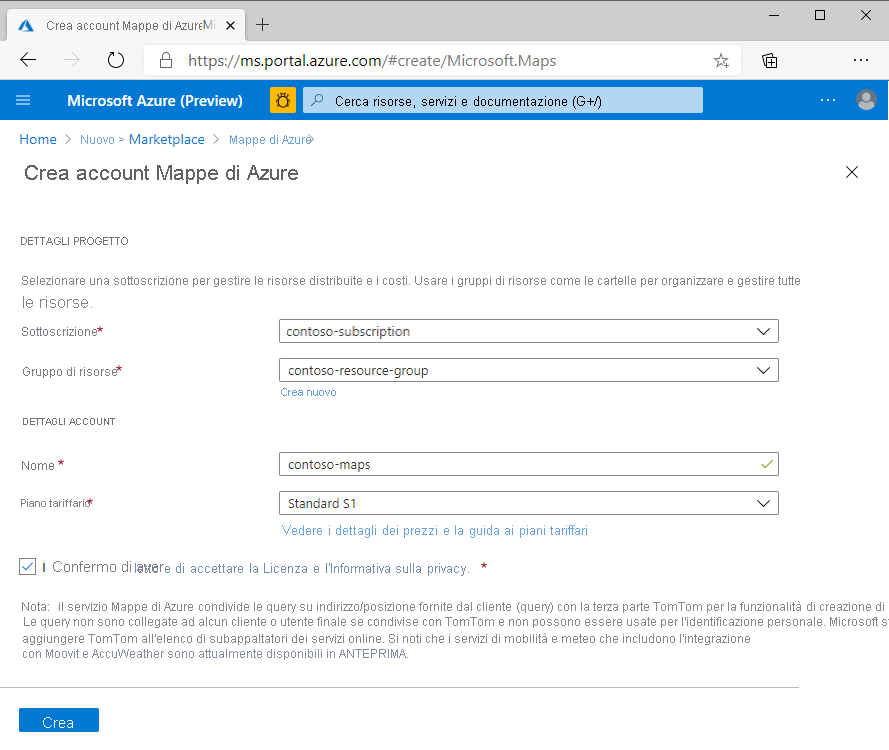
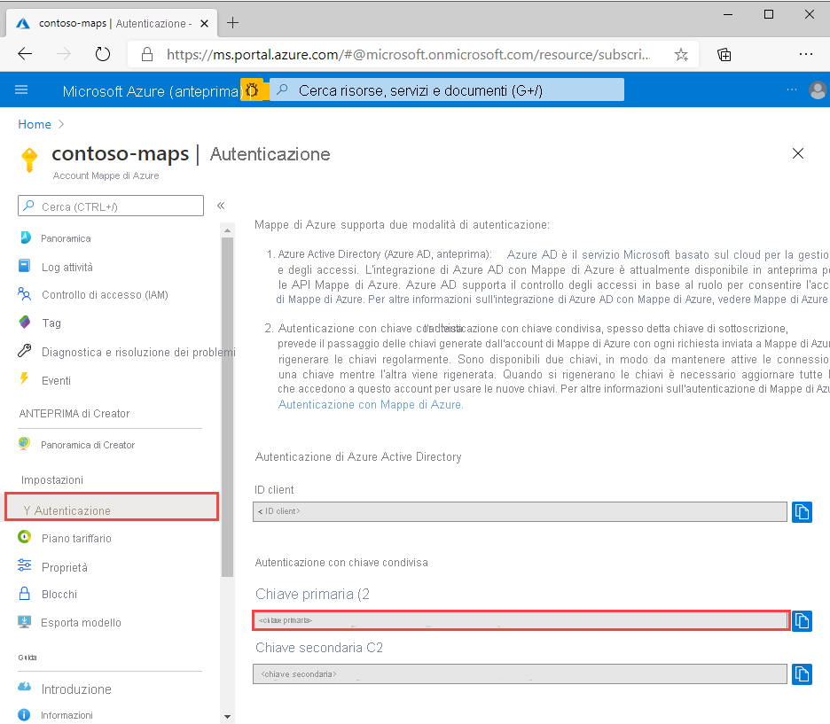
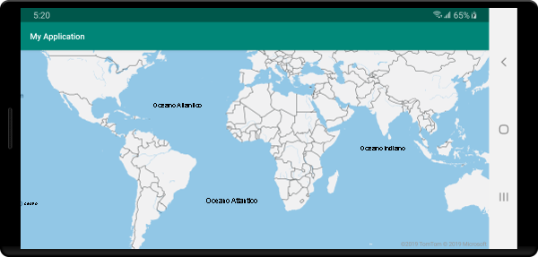

# <a name="quickstart-create-an-android-app-with-azure-maps"></a>Avvio rapido: Creare un'app Android con Mappe di Azure

Questo articolo illustra come aggiungere Mappe di Azure a un'app Android. L'articolo descrive le operazioni di base seguenti:

* Configurare l'ambiente di sviluppo.
* Creare un proprio account di Mappe di Azure.
* Ottenere la chiave primaria di Mappe di Azure da usare nell'app.
* Fare riferimento alle librerie di Mappe di Azure dal progetto.
* Aggiungere un controllo di Mappe di Azure all'app.

## <a name="prerequisites"></a>Prerequisiti

1. Creare un account di Mappe di Azure tramite accesso al [portale di Azure](https://portal.azure.com). Se non si ha una sottoscrizione di Azure, creare un [account gratuito](https://azure.microsoft.com/free/) prima di iniziare.
2. [Creare un account Mappe di Azure](quick-demo-map-app.md#create-an-azure-maps-account)
3. [Ottenere una chiave di sottoscrizione primaria](quick-demo-map-app.md#get-the-primary-key-for-your-account), nota anche come chiave primaria o chiave di sottoscrizione Per altre informazioni sull'autenticazione in Mappe di Azure, vedere [Gestire l'autenticazione in Mappe di Azure](how-to-manage-authentication.md).
4. [Scaricare Android Studio](https://developer.android.com/studio/) gratuitamente da Google.

## <a name="create-an-azure-maps-account"></a>Creare un account di Mappe di Azure

Creare un account di Mappe di Azure eseguendo questa procedura:

1. Nell'angolo superiore sinistro del [portale di Azure](https://portal.azure.com) fare clic su **Crea una risorsa**.
2. Nella casella *Cerca nel marketplace* digitare **Mappe**.
3. Dai *risultati* scegliere **Mappe**. Fare clic sul pulsante **Crea** visualizzato sotto la mappa.
4. Nella pagina **Crea account di Mappe** immettere i valori seguenti:
    * La *sottoscrizione* da usare per l'account.
    * Il nome del *gruppo di risorse* per l'account. Per il gruppo di risorse è possibile selezionare l'opzione *Crea nuovo* o *Usa esistente*.
    * Il *nome* del nuovo account.
    * *Piano tariffario* dell'account.
    * Leggere la *Licenza* e l'*Informativa sulla Privacy* e selezionare la casella di controllo per accettare le condizioni.
    * Fare clic sul pulsante **Create** (Crea).

    

## <a name="get-the-primary-key-for-your-account"></a>Ottenere la chiave primaria per l'account

Dopo che è stato creato l'account di Mappe, recuperare la chiave primaria che consente di eseguire query nelle API di Mappe.

1. Aprire l'account di Mappe nel portale.
2. Nella sezione delle impostazioni selezionare **Autenticazione**.
3. Copiare il valore di **Chiave primaria** negli Appunti. Salvarlo in locale per usarlo in seguito in questa esercitazione.

>[!NOTE]
> Se si usa la chiave di sottoscrizione di Azure invece della chiave primaria di Mappe di Azure, non verrà eseguito il rendering corretto della mappa. Inoltre, per motivi di sicurezza, si consiglia di eseguire la rotazione tra le chiavi primarie e secondarie. Per eseguire la rotazione delle chiavi, aggiornare l'app per usare la chiave secondaria, distribuire, quindi premere il pulsante di ciclo/aggiornamento accanto alla chiave primaria per generare una nuova chiave primaria. La chiave primaria precedente verrà disabilitata. Per altre informazioni sulla rotazione delle chiavi, vedere [Configurare l'insieme di credenziali delle chiavi di Azure con rotazione e controllo delle chiavi](../key-vault/secrets/tutorial-rotation-dual.md)



## <a name="create-a-project-in-android-studio"></a>Creare un progetto in Android Studio

Per prima cosa, creare un nuovo progetto con un'attività vuota. Completare questi passaggi per creare un progetto di Android Studio:

1. In **Choose your project** (Scegliere il progetto) selezionare **Phone and Tablet** (Telefoni e tablet). L'applicazione verrà eseguita in questo fattore di forma.
2. Nella scheda **Phone e Tablet** (Telefoni e tablet) selezionare **Empty Activity** (Attività vuota), quindi selezionare **Next** (Avanti).
3. In **Configure your project** (Configurare il progetto) selezionare `API 21: Android 5.0.0 (Lollipop)` come SDK minimo. Questa è la versione minima supportata da Android SDK per Mappe di Azure.
4. Accettare i valori `Activity Name` e `Layout Name` predefiniti e selezionare **Finish** (Fine).

Vedere la [documentazione di Android Studio](https://developer.android.com/studio/intro/) per altre informazioni sull'installazione di Android Studio e la creazione di un nuovo progetto.


## <a name="set-up-a-virtual-device"></a>Configurare un dispositivo virtuale

Android Studio consente di configurare un dispositivo Android virtuale nel computer. Questa operazione può essere utile per testare l'applicazione durante lo sviluppo. Per configurare un dispositivo virtuale, selezionare l'icona del gestore di dispositivi virtuali Android, AVD Manager, in alto a destra nello schermo del progetto, quindi selezionare **Create Virtual Device** (Crea dispositivo virtuale). È anche possibile aprire AVD Manager selezionando **Tools (Strumenti)**  > **Android** > **AVD Manager** dalla barra degli strumenti. Nella categoria **Phones** (Telefoni) selezionare **Nexus 5X** e quindi **Next** (Avanti).

Per altre informazioni sulla configurazione di un dispositivo virtuale Android, vedere la [documentazione di Android Studio](https://developer.android.com/studio/run/managing-avds).


## <a name="install-the-azure-maps-android-sdk"></a>Installare Android SDK per Mappe di Azure

Il passaggio successivo per la creazione dell'applicazione consiste nell'installare Android SDK per Mappe di Azure. Per installare l'SDK, seguire questa procedura:

1. Aprire il file di primo livello **build.gradle** e aggiungere il codice seguente alla sezione del blocco **all projects**, **repositories**:

    ```gradle
    maven {
        url "https://atlas.microsoft.com/sdk/android"
    }
    ```

2. Aggiornare **app/build.gradle** e aggiungervi il codice seguente:

    1. Verificare che il valore di **minSdkVersion** del progetto sia API 21 o versione successiva.

    2. Aggiungere il codice seguente alla sezione Android:

        ```gradle
        compileOptions {
            sourceCompatibility JavaVersion.VERSION_1_8
            targetCompatibility JavaVersion.VERSION_1_8
        }
        ```

    3. Aggiornare il blocco delle dipendenze e aggiungere una nuova riga di dipendenza implementation per la versione più recente di Azure Maps Android SDK:

        ```gradle
        implementation "com.microsoft.azure.maps:mapcontrol:0.7"
        ```

        > [!Note]
        > È possibile impostare il numero di versione su "0+" affinché il codice punti sempre alla versione più recente.

    4. Passare a **File** sulla barra degli strumenti e fare clic su **Sync Project with Gradle Files** (Sincronizza progetto con file Gradle).
3. Aggiungere un frammento di mappa all'attività principale (res \> layout \> activity\_main.xml):

    ```xml
    <com.microsoft.azure.maps.mapcontrol.MapControl
        android:id="@+id/mapcontrol"
        android:layout_width="match_parent"
        android:layout_height="match_parent"
        />
    ```

::: zone pivot="programming-language-java-android"

4. Nel file **MainActivity.java** è necessario:

    * Aggiungere le importazioni per Azure Maps SDK
    * Impostare le informazioni di autenticazione di Mappe di Azure
    * Ottenere l'istanza del controllo mappa nel metodo **OnCreate**

    Se si impostano le informazioni di autenticazione globalmente nella classe `AzureMaps` usando il metodo `setSubscriptionKey` o `setAadProperties`, si evita di dover aggiungere tali informazioni in ogni visualizzazione.

    Il controllo mappa contiene i propri metodi del ciclo di vita per la gestione del ciclo di vita OpenGL di Android. Questi metodi del ciclo di vita devono essere chiamati direttamente dall'attività che li contiene. Perché l'app possa chiamare correttamente i metodi del ciclo di vita del controllo mappa, occorre eseguire l'override dei metodi del ciclo di vita seguenti nell'attività che contiene il controllo mappa e chiamare il rispettivo metodo del controllo mappa.

    * `onCreate(Bundle)`
    * `onDestroy()`
    * `onLowMemory()`
    * `onPause()`
    * `onResume()`
    * `onSaveInstanceState(Bundle)`
    * `onStart()`
    * `onStop()`

    Modificare il file **MainActivity.java** come segue:

    ```java
    package com.example.myapplication;
    
    import androidx.appcompat.app.AppCompatActivity;
    import com.microsoft.azure.maps.mapcontrol.AzureMaps;
    import com.microsoft.azure.maps.mapcontrol.MapControl;
    import com.microsoft.azure.maps.mapcontrol.layer.SymbolLayer;
    import com.microsoft.azure.maps.mapcontrol.options.MapStyle;
    import com.microsoft.azure.maps.mapcontrol.source.DataSource;
    
    public class MainActivity extends AppCompatActivity {
        
    static {
        AzureMaps.setSubscriptionKey("<Your Azure Maps subscription key>");

        //Alternatively use Azure Active Directory authenticate.
        //AzureMaps.setAadProperties("<Your aad clientId>", "<Your aad AppId>", "<Your aad Tenant>");
    }

    MapControl mapControl;

    @Override
    protected void onCreate(Bundle savedInstanceState) {
        super.onCreate(savedInstanceState);
        setContentView(R.layout.activity_main);

        mapControl = findViewById(R.id.mapcontrol);

        mapControl.onCreate(savedInstanceState);

        //Wait until the map resources are ready.
        mapControl.onReady(map -> {
            //Add your post map load code here.

        });
    }

    @Override
    public void onResume() {
        super.onResume();
        mapControl.onResume();
    }

    @Override
    protected void onStart(){
        super.onStart();
        mapControl.onStart();
    }

    @Override
    public void onPause() {
        super.onPause();
        mapControl.onPause();
    }

    @Override
    public void onStop() {
        super.onStop();
        mapControl.onStop();
    }

    @Override
    public void onLowMemory() {
        super.onLowMemory();
        mapControl.onLowMemory();
    }

    @Override
    protected void onDestroy() {
        super.onDestroy();
        mapControl.onDestroy();
    }

    @Override
    protected void onSaveInstanceState(Bundle outState) {
        super.onSaveInstanceState(outState);
        mapControl.onSaveInstanceState(outState);
    }}
    ```

    > [!NOTE]
    > Dopo aver completato i passaggi precedenti, è possibile ricevere avvisi da Android Studio su parte del codice. Per risolvere questi avvisi, importare le classi a cui viene fatto riferimento in `MainActivity.java`.
    > È possibile importare automaticamente queste classi premendo `Alt` + `Enter` (`Option` + `Return` su Mac).

::: zone-end

::: zone pivot="programming-language-kotlin"

4. Nel file **MainActivity. kt** è necessario:

    * Aggiungere le importazioni per Azure Maps SDK
    * Impostare le informazioni di autenticazione di Mappe di Azure
    * Ottenere l'istanza del controllo mappa nel metodo **OnCreate**

    Se si impostano le informazioni di autenticazione globalmente nella classe `AzureMaps` usando il metodo `setSubscriptionKey` o `setAadProperties`, si evita di dover aggiungere tali informazioni in ogni visualizzazione.

    Il controllo mappa contiene i propri metodi del ciclo di vita per la gestione del ciclo di vita OpenGL di Android. Questi metodi del ciclo di vita devono essere chiamati direttamente dall'attività che li contiene. Perché l'app possa chiamare correttamente i metodi del ciclo di vita del controllo mappa, occorre eseguire l'override dei metodi del ciclo di vita seguenti nell'attività che contiene il controllo mappa e chiamare il rispettivo metodo del controllo mappa.

    * `onCreate(Bundle)`
    * `onDestroy()`
    * `onLowMemory()`
    * `onPause()`
    * `onResume()`
    * `onSaveInstanceState(Bundle)`
    * `onStart()`
    * `onStop()`

    Modificare il file **MainActivity. kt** come indicato di seguito:

    ```kotlin
    package com.example.myapplication;

    import androidx.appcompat.app.AppCompatActivity
    import android.os.Bundle
    import com.microsoft.azure.maps.mapcontrol.AzureMap
    import com.microsoft.azure.maps.mapcontrol.AzureMaps
    import com.microsoft.azure.maps.mapcontrol.MapControl
    import com.microsoft.azure.maps.mapcontrol.events.OnReady
    
    class MainActivity : AppCompatActivity() {
    
        companion object {
            init {
                AzureMaps.setSubscriptionKey("<Your Azure Maps subscription key>");
    
                //Alternatively use Azure Active Directory authenticate.
                //AzureMaps.setAadProperties("<Your aad clientId>", "<Your aad AppId>", "<Your aad Tenant>");
            }
        }
    
        var mapControl: MapControl? = null
    
        override fun onCreate(savedInstanceState: Bundle?) {
            super.onCreate(savedInstanceState)
            setContentView(R.layout.activity_main)
    
            mapControl = findViewById(R.id.mapcontrol)
    
            mapControl?.onCreate(savedInstanceState)
    
            //Wait until the map resources are ready.
            mapControl?.onReady(OnReady { map: AzureMap -> })
        }
    
        public override fun onStart() {
            super.onStart()
            mapControl?.onStart()
        }
    
        public override fun onResume() {
            super.onResume()
            mapControl?.onResume()
        }
    
        public override fun onPause() {
            mapControl?.onPause()
            super.onPause()
        }
    
        public override fun onStop() {
            mapControl?.onStop()
            super.onStop()
        }
    
        override fun onLowMemory() {
            mapControl?.onLowMemory()
            super.onLowMemory()
        }
    
        override fun onDestroy() {
            mapControl?.onDestroy()
            super.onDestroy()
        }
    
        override fun onSaveInstanceState(outState: Bundle) {
            super.onSaveInstanceState(outState)
            mapControl?.onSaveInstanceState(outState)
        }
    }
    ```

    > [!NOTE]
    > Dopo aver completato i passaggi precedenti, è possibile ricevere avvisi da Android Studio su parte del codice. Per risolvere questi avvisi, importare le classi a cui viene fatto riferimento in `MainActivity.kt`.
    > È possibile importare automaticamente queste classi premendo `Alt` + `Enter` (`Option` + `Return` su Mac).

::: zone-end

5. Per compilare l'applicazione, selezionare il pulsante di esecuzione illustrato nell'immagine seguente oppure premere `Control` + `R` su un Mac.

    

Per la compilazione dell'applicazione in Android Studio occorreranno pochi secondi. Al termine della compilazione è possibile testare l'applicazione nel dispositivo Android emulato. Verrà visualizzata una mappa simile a questa:



## <a name="clean-up-resources"></a>Pulire le risorse

>[!WARNING]
> Le esercitazioni elencate nella sezione [Passaggi successivi](#next-steps) offrono indicazioni dettagliate su come usare e configurare Mappe di Azure con il proprio account. Non eliminare le risorse create in questa guida introduttiva se si prevede di continuare con le esercitazioni.

Se non si intende continuare con le esercitazioni, pulire le risorse eseguendo questa procedura:

1. Chiudere Android Studio ed eliminare l'applicazione creata.
2. Se l'applicazione è stata testata in un dispositivo esterno, disinstallarla da tale dispositivo.

Se non si prevede di continuare a sviluppare con Android SDK per Mappe di Azure:

1. Accedere alla pagina del portale di Azure. Selezionare **Tutte le risorse** dalla pagina principale del portale. In alternativa, fare clic sull'icona di menu nell'angolo superiore sinistro. Selezionare **Tutte le risorse**.
2. Selezionare il proprio account di Mappe di Azure. Nella parte superiore della pagina fare clic su **Elimina**.
3. Facoltativamente, se non si prevede di continuare a sviluppare app Android, disinstallare Android Studio.

Per altri esempi di codice, vedere queste guide:

* [Gestire l'autenticazione in Mappe di Azure](how-to-manage-authentication.md)
* [Cambiare gli stili della mappa nelle mappe Android](set-android-map-styles.md)
* [Aggiungere un livello per i simboli](how-to-add-symbol-to-android-map.md)
* [Aggiungere un livello per le linee](android-map-add-line-layer.md)
* [Aggiungere un livello per i poligoni](how-to-add-shapes-to-android-map.md)

## <a name="next-steps"></a>Passaggi successivi

In questa guida introduttiva vengono creati l'account di Mappe di Azure e un'applicazione demo. Per altre informazioni su Mappe di Azure, esaminare queste esercitazioni:

> [!div class="nextstepaction"]
> [Caricare dati GeoJSON in Mappe di Azure](tutorial-load-geojson-file-android.md)