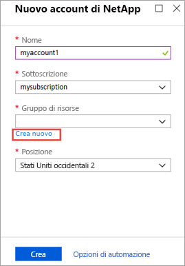
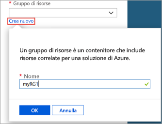
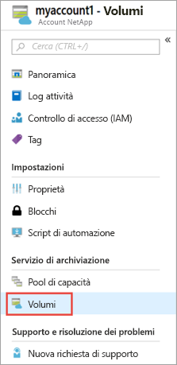
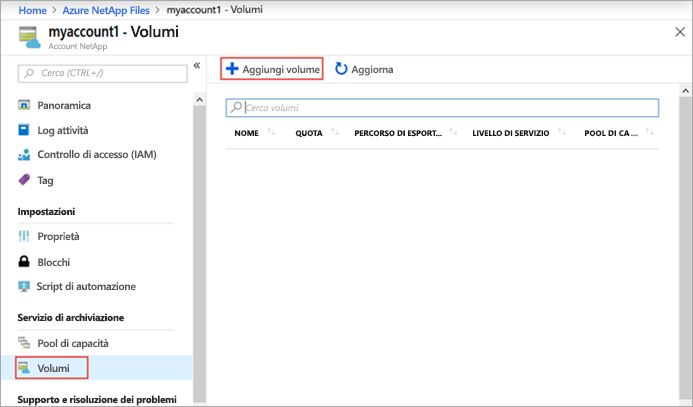
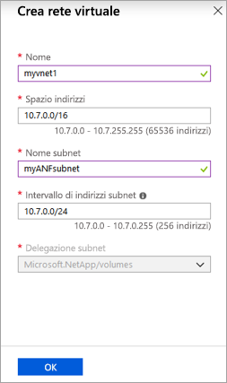

# <a name="quickstart-set-up-azure-netapp-files-and-create-an-nfs-volume"></a>Guida introduttiva: Configurare Azure NetApp Files e creare un volume NFS

Questo articolo illustra come configurare rapidamente Azure NetApp Files e creare un volume.

In questo argomento di avvio rapido si configureranno gli elementi seguenti:

- La registrazione per Azure NetApp Files e il provider di risorse NetApp
- Un account NetApp
- Un pool di capacità
- Un volume NFS per Azure NetApp Files

Se non si ha una sottoscrizione di Azure, creare un [account gratuito](https://azure.microsoft.com/free/?WT.mc_id=A261C142F) prima di iniziare.

## <a name="before-you-begin"></a>Prima di iniziare

> [!IMPORTANT]
> È necessario disporre dell'accesso al servizio Azure NetApp Files. Per richiedere l'accesso al servizio, vedere la [pagina per l'invio della richiesta di inserimento nella lista di attesa per Azure NetApp Files](https://aka.ms/azurenetappfiles).  Prima di continuare, è necessario attendere un messaggio di posta elettronica di conferma ufficiale dal team di Azure NetApp Files.

[!INCLUDE [cloud-shell-try-it.md](../../includes/cloud-shell-try-it.md)]

---

## <a name="register-for-azure-netapp-files-and-netapp-resource-provider"></a>Effettuare la registrazione ad Azure NetApp Files e del provider di risorse NetApp

> [!NOTE]
> Il completamento del processo di registrazione può richiedere del tempo.
>

# <a name="portal"></a>[Portale](#tab/azure-portal)

Per la procedura di registrazione tramite il portale, aprire una sessione Cloud Shell come indicato in precedenza e seguire questi passaggi dell'interfaccia della riga di comando di Azure:

[!INCLUDE [azure-netapp-files-cloudshell-include](../../includes/azure-netapp-files-azure-cloud-shell-window.md)]

# <a name="powershell"></a>[PowerShell](#tab/azure-powershell)

Questa procedura richiede il modulo Azure PowerShell Az 2.6.0 o versioni successive. Eseguire `Get-Module -ListAvailable Az` per trovare la versione corrente. Se è necessario eseguire l'installazione o l'aggiornamento, vedere come [installare il modulo Azure PowerShell](/powershell/azure/install-Az-ps). Se si preferisce, è possibile usare la console di Cloud Shell in una sessione di PowerShell.

1. In un prompt dei comandi di PowerShell (o in una sessione di Cloud Shell di PowerShell) specificare la sottoscrizione che è stata approvata per Azure NetApp Files:
    ```powershell-interactive
    Select-AzSubscription -Subscription <subscriptionId>
    ```

2. Registrare il provider di risorse di Azure:
    ```powershell-interactive
    Register-AzResourceProvider -ProviderNamespace Microsoft.NetApp
    ```

# <a name="azure-cli"></a>[Interfaccia della riga di comando di Azure](#tab/azure-cli)

[!INCLUDE [azure-netapp-files-cloudshell-include](../../includes/azure-netapp-files-azure-cloud-shell-window.md)]

# <a name="template"></a>[Modello](#tab/template)

No.

Usare il portale di Azure, PowerShell o l'interfaccia della riga di comando di Azure per eseguire la registrazione per Azure NetApp Files e il provider di risorse NetApp.

Per altre informazioni, vedere [Effettuare la registrazione per Azure NetApp Files](azure-netapp-files-register.md).

---

## <a name="create-a-netapp-account"></a>Creare un account di NetApp

# <a name="portal"></a>[Portale](#tab/azure-portal)

1. Nella casella di ricerca del portale di Azure immettere **Azure NetApp Files** e quindi selezionare **Azure NetApp Files** dall'elenco visualizzato.

      

2. Fare clic su **+ Aggiungi** per creare un nuovo account di NetApp.

     

3. Nella finestra New NetApp Account (Nuovo account NetApp) specificare le informazioni seguenti:
   1. Immettere **myaccount1** nel campo relativo al nome dell'account.
   2. Selezionare la propria sottoscrizione.
   3. Selezionare **Crea nuovo** per creare un nuovo gruppo di risorse. Immettere **myRG1** nel campo relativo al nome del gruppo di risorse. Fare clic su **OK**.
   4. Selezionare la località dell'account.

      

      

4. Fare clic su **Crea** per creare il nuovo account NetApp.

# <a name="powershell"></a>[PowerShell](#tab/azure-powershell)

1. Definire alcune variabili in modo che sia possibile farvi riferimento nei restanti esempi:

    ```powershell-interactive
    $resourceGroup = "myRG1"
    $location = "eastus"
    $anfAccountName = "myaccount1"
    ```

    > [!NOTE]
    > Per un elenco delle aree supportate, vedere [Prodotti disponibili in base all'area](https://azure.microsoft.com/global-infrastructure/services/?products=netapp&regions=all).
    > Per ottenere il nome dell'area supportato dagli strumenti da riga di comando, usare `Get-AzLocation | select Location`
    >

1. Creare un nuovo gruppo di risorse con il comando [New-AzResourceGroup](/powershell/module/az.resources/new-azresourcegroup):

    ```powershell-interactive
    New-AzResourceGroup -Name $resourceGroup -Location $location
    ```

2. Creare l'account Azure NetApp Files con il comando [New-AzNetAppFilesAccount](/powershell/module/az.netappfiles/New-AzNetAppFilesAccount):

    ```powershell-interactive
    New-AzNetAppFilesAccount -ResourceGroupName $resourceGroup -Location $location -Name $anfAccountName
    ```

# <a name="azure-cli"></a>[Interfaccia della riga di comando di Azure](#tab/azure-cli)

1. Definire alcune variabili in modo che sia possibile farvi riferimento nei restanti esempi:

    ```azurecli-interactive
    RESOURCE_GROUP="myRG1"
    LOCATION="eastus"
    ANF_ACCOUNT_NAME="myaccount1"
    ```

    > [!NOTE]
    > Per un elenco delle aree supportate, vedere [Prodotti disponibili in base all'area](https://azure.microsoft.com/global-infrastructure/services/?products=netapp&regions=all).
    > Per ottenere il nome dell'area supportato dagli strumenti da riga di comando, usare `az account list-locations --query "[].{Region:name}" --out table`
    >

2. Creare un nuovo gruppo di risorse con il comando [az group create](/cli/azure/group#az-group-create):

    ```azurecli-interactive
    az group create \
        --name $RESOURCE_GROUP \
        --location $LOCATION
    ```

3. Creare l'account Azure NetApp Files con il comando [az netappfiles account create](/cli/azure/netappfiles/account#az-netappfiles-account-create):

    ```azurecli-interactive
    az netappfiles account create \
        --resource-group $RESOURCE_GROUP \
        --location $LOCATION \
        --account-name $ANF_ACCOUNT_NAME
    ```

# <a name="template"></a>[Modello](#tab/template)

[!INCLUDE [About Azure Resource Manager](../../includes/resource-manager-quickstart-introduction.md)]

Il frammento di codice seguente mostra come creare un account NetApp in un modello di Azure Resource Manager (modello ARM), usando la risorsa [Microsoft.NetApp/netAppAccounts](/azure/templates/microsoft.netapp/netappaccounts). Per eseguire il codice, scaricare il [modello di Azure Resource Manager completo](https://github.com/Azure/azure-quickstart-templates/blob/master/101-anf-nfs-volume/azuredeploy.json) dal repository GitHub.

:::code language="json" source="~/quickstart-templates/101-anf-nfs-volume/azuredeploy.json" range="177-183":::

<!-- Block begins with "type": "Microsoft.NetApp/netAppAccounts", -->

---

## <a name="set-up-a-capacity-pool"></a>Configurare un pool di capacità

# <a name="portal"></a>[Portale](#tab/azure-portal)

1. Nel pannello di gestione di Azure NetApp Files selezionare l'account di NetApp appena creato ( **myaccount1** ).

    

2. Nell'area del pannello di gestione di Azure NetApp Files relativa al proprio account NetApp selezionare **Pool di capacità**.

    

3. Fare clic su **+ Aggiungi pool**.

    

4. Specificare le informazioni relative al pool di capacità:
    * Immettere **mypool1** come nome del pool.
    * Selezionare **Premium** come livello di servizio.
    * Specificare **4 (TiB)** come dimensione del pool.
    * Usare il tipo QoS **Automatico**.

5. Fare clic su **Crea**.

# <a name="powershell"></a>[PowerShell](#tab/azure-powershell)

1. Definizione di alcune nuove variabili per riferimento futuro

    ```powershell-interactive
    $poolName = "mypool1"
    $poolSizeBytes = 4398046511104 # 4TiB
    $serviceLevel = "Premium" # Valid values are Standard, Premium and Ultra
    ```

1. Creare un nuovo pool di capacità usando il comando [New-AzNetAppFilesPool](/powershell/module/az.netappfiles/new-aznetappfilespool)

    ```powershell-interactive
    New-AzNetAppFilesPool -ResourceGroupName $resourceGroup -Location $location -AccountName $anfAccountName -Name $poolName -PoolSize $poolSizeBytes -ServiceLevel $serviceLevel
    ```

# <a name="azure-cli"></a>[Interfaccia della riga di comando di Azure](#tab/azure-cli)

1. Definizione di alcune nuove variabili per riferimento futuro

    ```azurecli-interactive
    POOL_NAME="mypool1"
    POOL_SIZE_TiB=4 # Size in Azure CLI needs to be in TiB unit (minimum 4 TiB)
    SERVICE_LEVEL="Premium" # Valid values are Standard, Premium and Ultra
    ```

2. Creare un nuovo pool di capacità usando il comando [az netappfiles pool create](/cli/azure/netappfiles/pool#az-netappfiles-pool-create)

    ```azurecli-interactive
    az netappfiles pool create \
        --resource-group $RESOURCE_GROUP \
        --location $LOCATION \
        --account-name $ANF_ACCOUNT_NAME \
        --pool-name $POOL_NAME \
        --size $POOL_SIZE_TiB \
        --service-level $SERVICE_LEVEL
    ```

# <a name="template"></a>[Modello](#tab/template)

<!-- [!INCLUDE [About Azure Resource Manager](../../includes/resource-manager-quickstart-introduction.md)] -->

Il frammento di codice seguente mostra come creare un pool di capacità in un modello di Azure Resource Manager (modello ARM), usando la risorsa [Microsoft.NetApp/netAppAccounts/capacityPools](/azure/templates/microsoft.netapp/netappaccounts/capacitypools). Per eseguire il codice, scaricare il [modello di Azure Resource Manager completo](https://github.com/Azure/azure-quickstart-templates/blob/master/101-anf-nfs-volume/azuredeploy.json) dal repository GitHub.

:::code language="json" source="~/quickstart-templates/101-anf-nfs-volume/azuredeploy.json" range="184-196":::

<!-- LN 185, block begins with  "type": "Microsoft.NetApp/netAppAccounts/capacityPools", -->

---

## <a name="create-nfs-volume-for-azure-netapp-files"></a>Creare un volume NFS per Azure NetApp Files

# <a name="portal"></a>[Portale](#tab/azure-portal)

1. Nell'area del pannello di gestione di Azure NetApp Files relativa al proprio account NetApp selezionare **Volumi**.

    

2. Fare clic su **+ Aggiungi volume**.

    

3. Nella finestra Crea un volume specificare le informazioni relative al volume:
   1. Immettere **myvol1** come nome del volume.
   2. Selezionare il pool di capacità appena creato ( **mypool1** ).
   3. Usare il valore predefinito per la quota.
   4. Nella rete virtuale fare clic su **Crea nuovo** per creare una nuova rete virtuale.  Specificare quindi le informazioni seguenti:
       * Immettere **myvnet1** come nome della rete virtuale.
       * Specificare uno spazio indirizzi per la configurazione, ad esempio 10.7.0.0/16
       * Immettere **myANFsubnet** come nome della subnet.
       * Specificare l'intervallo di indirizzi della subnet, ad esempio 10.7.0.0/24. Non è possibile condividere una subnet dedicata con altre risorse.
       * Selezionare **Microsoft.NetApp/volumes** come delega per la subnet.
       * Fare clic su **OK** per creare la rete virtuale.
   5. Nella subnet selezionare la rete virtuale appena creata ( **myvnet1** ) come subnet di delega.

      

      

4. Fare clic su **Protocollo** e quindi completare le azioni seguenti:
    * Selezionare **NFS** come tipo di protocollo per il volume.
    * Immettere **myfilepath1** come percorso del file che verrà usato per creare il percorso di esportazione per il volume.
    * Selezionare la versione di NFS ( **NFSv3** o **NFSv4.1** ) per il volume.
      Vedere le [considerazioni](azure-netapp-files-create-volumes.md#considerations) e le [procedure consigliate](azure-netapp-files-create-volumes.md#best-practice) per le versioni di NFS.

    

5. Fare clic su **Rivedi e crea**.

    

6. Verificare le informazioni relative al volume e quindi fare clic su **Crea**.
    Il volume creato viene visualizzato nel pannello Volumi.

    

# <a name="powershell"></a>[PowerShell](#tab/azure-powershell)

1. Creare una delega della subnet a "Microsoft. NetApp/volumes" con il comando [New-AzDelegation](/powershell/module/az.network/new-azdelegation).

    ```powershell-interactive
    $anfDelegation = New-AzDelegation -Name ([guid]::NewGuid().Guid) -ServiceName "Microsoft.NetApp/volumes"
    ```

2. Creare una configurazione della subnet usando il comando [New-AzVirtualNetworkSubnetConfig](/powershell/module/az.network/new-azvirtualnetworksubnetconfig).

    ```powershell-interactive
    $subnet = New-AzVirtualNetworkSubnetConfig -Name "myANFSubnet" -AddressPrefix "10.7.0.0/24" -Delegation $anfDelegation
    ```

3. Creare la rete virtuale usando il comando [New-AzVirtualNetwork](/powershell/module/az.network/new-azvirtualnetwork).

    ```powershell-interactive
    $vnet = New-AzVirtualNetwork -Name "myvnet1" -ResourceGroupName $resourceGroup -Location $location -AddressPrefix "10.7.0.0/16" -Subnet $subnet
    ```

4. Creare il volume con il comando [New-AzNetAppFilesVolume](/powershell/module/az.netappfiles/new-aznetappfilesvolume).

    ```powershell-interactive
    $volumeSizeBytes = 1099511627776 # 100GiB
    $subnetId = $vnet.Subnets[0].Id

    New-AzNetAppFilesVolume -ResourceGroupName $resourceGroup `
        -Location $location `
        -AccountName $anfAccountName `
        -PoolName $poolName `
        -Name "myvol1" `
        -UsageThreshold $volumeSizeBytes `
        -SubnetId $subnetId `
        -CreationToken "myfilepath1" `
        -ServiceLevel $serviceLevel `
        -ProtocolType NFSv3
    ```

# <a name="azure-cli"></a>[Interfaccia della riga di comando di Azure](#tab/azure-cli)

1. Definizione di alcune variabili per un uso successivo.

    ```azurecli-interactive
    VNET_NAME="myvnet1"
    SUBNET_NAME="myANFSubnet"
    ```

1. Creare una rete virtuale senza subnet con il comando [az network vnet create](/cli/azure/network/vnet#az-network-vnet-create).

    ```azurecli-interactive
    az network vnet create \
        --resource-group $RESOURCE_GROUP \
        --name $VNET_NAME \
        --location $LOCATION \
        --address-prefix "10.7.0.0/16"

    ```

2. Creare una subnet delegata con il comando [az network vnet subnet create](/cli/azure/network/vnet/subnet#az-network-vnet-subnet-create).

    ```azurecli-interactive
    az network vnet subnet create \
        --resource-group $RESOURCE_GROUP \
        --vnet-name $VNET_NAME \
        --name $SUBNET_NAME \
        --address-prefixes "10.7.0.0/24" \
        --delegations "Microsoft.NetApp/volumes"
    ```

3. Creare il volume con il comando [az netappfiles volume create](/cli/azure/netappfiles/volume#az-netappfiles-volume-create).

    ```azurecli-interactive
    VNET_ID=$(az network vnet show --resource-group $RESOURCE_GROUP --name $VNET_NAME --query "id" -o tsv)
    SUBNET_ID=$(az network vnet subnet show --resource-group $RESOURCE_GROUP --vnet-name $VNET_NAME --name $SUBNET_NAME --query "id" -o tsv)
    VOLUME_SIZE_GiB=100 # 100 GiB
    UNIQUE_FILE_PATH="myfilepath2" # Please note that creation token needs to be unique within subscription and region

    az netappfiles volume create \
        --resource-group $RESOURCE_GROUP \
        --location $LOCATION \
        --account-name $ANF_ACCOUNT_NAME \
        --pool-name $POOL_NAME \
        --name "myvol1" \
        --service-level $SERVICE_LEVEL \
        --vnet $VNET_ID \
        --subnet $SUBNET_ID \
        --usage-threshold $VOLUME_SIZE_GiB \
        --file-path $UNIQUE_FILE_PATH \
        --protocol-types "NFSv3"
    ```

# <a name="template"></a>[Modello](#tab/template)

<!-- [!INCLUDE [About Azure Resource Manager](../../includes/resource-manager-quickstart-introduction.md)] -->

Il frammento di codice seguente mostra come configurare una rete virtuale e creare un volume Azure NetApp Files in un modello di Azure Resource Manager (modello ARM). Per la configurazione della rete virtuale viene usata la risorsa [Microsoft.Network/virtualNetworks](/azure/templates/Microsoft.Network/virtualNetworks). Per la creazione del volume viene usata la risorsa [Microsoft.NetApp/netAppAccounts/capacityPools/volumes](/azure/templates/microsoft.netapp/netappaccounts/capacitypools/volumes). Per eseguire il codice, scaricare il [modello di Azure Resource Manager completo](https://github.com/Azure/azure-quickstart-templates/blob/master/101-anf-nfs-volume/azuredeploy.json) dal repository GitHub.

:::code language="json" source="~/quickstart-templates/101-anf-nfs-volume/azuredeploy.json" range="148-176":::

<!-- Block begins with  "type": "Microsoft.Network/virtualNetworks", -->

:::code language="json" source="~/quickstart-templates/101-anf-nfs-volume/azuredeploy.json" range="197-229":::

<!-- Block begins with  "type": "Microsoft.NetApp/netAppAccounts/capacityPools/volumes", -->

---

## <a name="clean-up-resources"></a>Pulire le risorse

# <a name="portal"></a>[Portale](#tab/azure-portal)

Al termine, se si vuole, è possibile eliminare il gruppo di risorse. L'azione di eliminazione di un gruppo di risorse è irreversibile.

> [!IMPORTANT]
> Eliminerà in modo definitivo tutte le risorse all'interno dei gruppi di risorse e non potrà essere annullata.

1. Nella casella di ricerca del portale di Azure immettere **Azure NetApp Files** e quindi selezionare **Azure NetApp Files** dall'elenco visualizzato.

2. Nell'elenco delle sottoscrizioni fare clic sul gruppo di risorse (myRG1) che si vuole eliminare.

    


3. Nella pagina del gruppo di risorse fare clic su **Elimina gruppo di risorse**.

    

    Si aprirà una finestra con un avviso relativo alle risorse che verranno eliminate con il gruppo di risorse.

4. Immettere il nome del gruppo di risorse (myRG1) per confermare che si intende eliminarlo in modo definitivo con tutte le risorse in esso contenute e quindi fare clic su **Elimina**.

    

# <a name="powershell"></a>[PowerShell](#tab/azure-powershell)

Al termine, se si vuole, è possibile eliminare il gruppo di risorse. L'azione di eliminazione di un gruppo di risorse è irreversibile.

> [!IMPORTANT]
> Eliminerà in modo definitivo tutte le risorse all'interno dei gruppi di risorse e non potrà essere annullata.

1. Eliminare il gruppo di risorse usando il comando [Remove-AzResourceGroup](/powershell/module/az.resources/remove-azresourcegroup).

    ```powershell-interactive
    Remove-AzResourceGroup -Name $resourceGroup
    ```

# <a name="azure-cli"></a>[Interfaccia della riga di comando di Azure](#tab/azure-cli)

Al termine, se si vuole, è possibile eliminare il gruppo di risorse. L'azione di eliminazione di un gruppo di risorse è irreversibile.

> [!IMPORTANT]
> Eliminerà in modo definitivo tutte le risorse all'interno dei gruppi di risorse e non potrà essere annullata.

1. Eliminare il gruppo di risorse usando il comando [az group delete](/cli/azure/group#az-group-delete).

    ```azurecli-interactive
    az group delete \
        --name $RESOURCE_GROUP
    ```

# <a name="template"></a>[Modello](#tab/template)

No.

Usare il portale di Azure, PowerShell o l'interfaccia della riga di comando di Azure per eliminare il gruppo di risorse.

---

## <a name="next-steps"></a>Passaggi successivi

> [!div class="nextstepaction"]
> [Gerarchia di archiviazione di Azure NetApp Files](azure-netapp-files-understand-storage-hierarchy.md)

> [!div class="nextstepaction"]
> [Livelli di servizio per Azure NetApp Files](azure-netapp-files-service-levels.md)

> [!div class="nextstepaction"]
> [Creare un volume NFS](azure-netapp-files-create-volumes.md)
