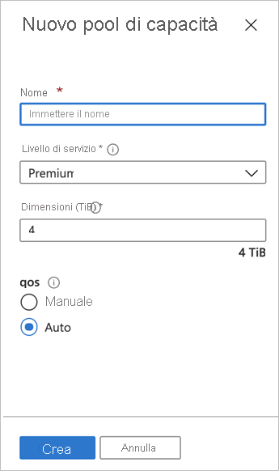

# Configurare un pool di capacità

La configurazione di un pool di capacità consente di creare volumi al suo interno.  

## Prima di iniziare 

È necessario avere già creato un account di NetApp.   

[Creare un account di NetApp](azure-netapp-files-create-netapp-account.md)

## Passaggi 

1. Passare al pannello di gestione per l'account di NetApp e quindi selezionare **Pool di capacità** nel riquadro di spostamento.  
    
    

2. Fare clic su **+ Aggiungi pool** per creare un nuovo pool di capacità.   
    Verrà visualizzata la finestra New Capacity Pool (Nuovo pool di capacità).

3. Specificare le informazioni seguenti per il nuovo pool di capacità:  
   * **Nome**  
     Specificare il nome per il pool di capacità.  
     Il nome del pool di capacità deve essere univoco per ogni account di NetApp.

   * **Livello di servizio**   
     Questo campo mostra le prestazioni di destinazione per il pool di capacità.  
     Specificare il livello di servizio per il pool di capacità: [**ultra**](azure-netapp-files-service-levels.md#Ultra), [**Premium**](azure-netapp-files-service-levels.md#Premium)o [**standard**](azure-netapp-files-service-levels.md#Standard).

    * **Dimensioni**     
     Specificare le dimensioni del pool di capacità da acquistare.        
     Le dimensioni minime del pool di capacità sono di 4 TiB. È possibile creare un pool con dimensioni in multipli di 4 TiB.   

   * **QoS**   
     Specificare se il pool di capacità deve usare il tipo di QoS **manuale** o **automatico** .  

     Per informazioni sui tipi QoS, vedere [considerazioni sulle prestazioni](azure-netapp-files-performance-considerations.md) e sulla [gerarchia di archiviazione](azure-netapp-files-understand-storage-hierarchy.md) .  

     > [!IMPORTANT] 
     > L'impostazione del **tipo QoS** su **manuale** è permanente. Non è possibile convertire un pool di capacità QoS manuale per usare la funzionalità QoS automatica. Tuttavia, è possibile convertire un pool di capacità QoS automatica per usare la funzionalità QoS manuale. Vedere [modificare un pool di capacità per usare QoS manuale](manage-manual-qos-capacity-pool.md#change-to-qos).   
     > Per usare il tipo QoS manuale per un pool di capacità è necessaria la registrazione. Vedere [Gestire un pool di capacità QoS manuale](manage-manual-qos-capacity-pool.md#register-the-feature). 

    

4. Fare clic su **Crea**.

## Passaggi successivi 

- [Gerarchia di archiviazione](azure-netapp-files-understand-storage-hierarchy.md) 
- [Livelli di servizio per Azure NetApp Files](azure-netapp-files-service-levels.md)
- [Pagina dei prezzi di Azure NetApp Files](https://azure.microsoft.com/pricing/details/storage/netapp/)
- [Gestire un pool di capacità QoS manuale](manage-manual-qos-capacity-pool.md)
- [Delegare una subnet ad Azure NetApp Files](azure-netapp-files-delegate-subnet.md)
