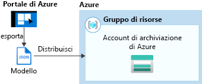
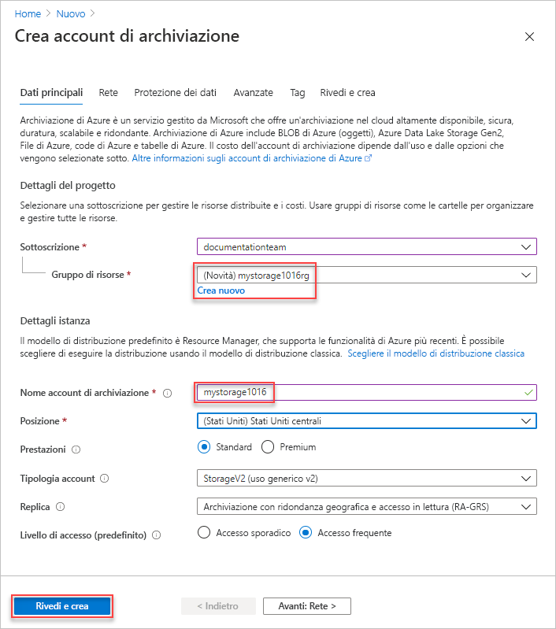
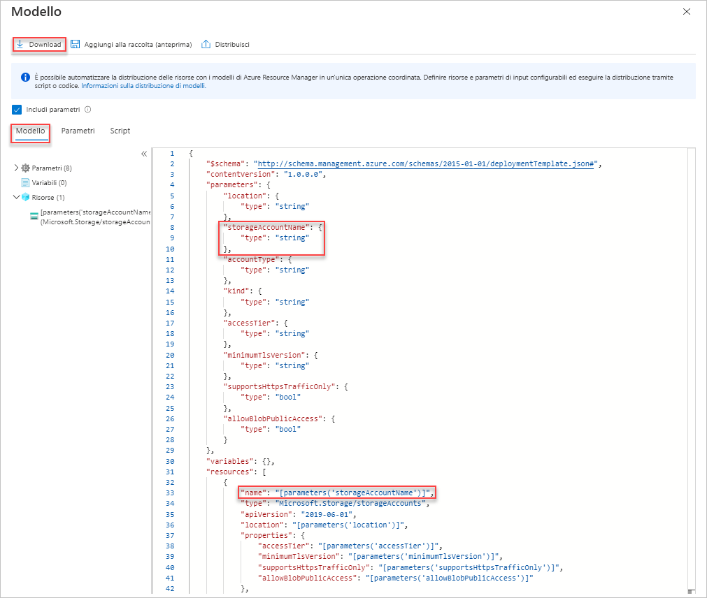
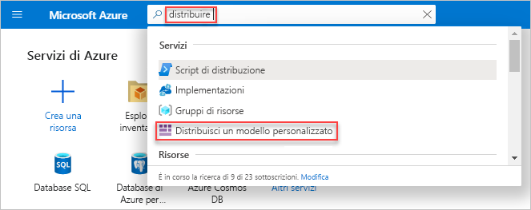

# <a name="quickstart-create-and-deploy-arm-templates-by-using-the-azure-portal"></a>Avvio rapido: Creare e distribuire modelli di Resource Manager con il portale di Azure

Informazioni su come generare un modello di Azure Resource Manager (ARM) con il portale di Azure e il processo di modifica e distribuzione del modello dal portale. I modelli di Resource Manager sono file JSON che definiscono le risorse che è necessario distribuire per la soluzione. Per comprendere i concetti associati alla distribuzione e alla gestione delle soluzioni di Azure, vedere la [panoramica della distribuzione di modelli](overview.md).



Al termine dell'esercitazione si distribuirà un account di archiviazione di Azure. Lo stesso processo può essere usato per distribuire altre risorse di Azure.

Se non si ha una sottoscrizione di Azure, [creare un account gratuito](https://azure.microsoft.com/free/) prima di iniziare.

## <a name="generate-a-template-using-the-portal"></a>Generare un modello con il portale

Creare un modello di Resource Manager da zero non è semplice, soprattutto se non si ha familiarità con la distribuzione in Azure e con il formato JSON. Usando il portale di Azure è possibile configurare una risorsa, ad esempio un account di archiviazione di Azure. Prima di distribuire la risorsa, si può esportare la configurazione in un modello. Si può salvare il modello e usarlo di nuovo in futuro.

Molti sviluppatori esperti di modelli usano questo approccio per generare modelli quando provano a distribuire risorse di Azure con cui non hanno familiarità. Per altre informazioni sull'esportazione di modelli tramite il portale, vedere [Esportare i gruppi di risorse in modelli](../management/manage-resource-groups-portal.md#export-resource-groups-to-templates). L'altro modo per trovare un modello di lavoro consiste nell'usare i [modelli di avvio rapido di Azure](https://azure.microsoft.com/resources/templates/).

1. In un Web browser passare al [portale di Azure](https://portal.azure.com) ed eseguire l'accesso.
1. Nel menu del portale di Azure selezionare **Crea una risorsa**.

    

1. Selezionare **Archiviazione** > **Account di archiviazione**.

    
1. Immettere le seguenti informazioni:

    |Nome|valore|
    |----|----|
    |**Gruppo di risorse**|Selezionare **Crea nuovo** e specificare un nome di propria scelta per il gruppo di risorse. Nello screenshot il nome del gruppo di risorse è *mystorage1016rg*. Il gruppo di risorse è un contenitore per le risorse di Azure e ne semplifica la gestione. |
    |**Nome**|assegnare un nome univoco all'account di archiviazione. Il nome dell'account di archiviazione deve essere univoco in tutto Azure e deve contenere solo lettere minuscole e numeri. Il nome deve avere una lunghezza compresa fra 3 e 24 caratteri. Se viene visualizzato il messaggio di errore "Il nome dell'account di archiviazione 'mystorage1016' è già in uso", provare a usare **&lt;il proprio nome>storage&lt;data odierna nel formato MMGG>** , ad esempio **johndolestorage1016**. Per altre informazioni, vedere [Regole di denominazione e restrizioni](/azure/architecture/best-practices/resource-naming).|

    Per le restanti proprietà si possono usare i valori predefiniti.

    

    > [!NOTE]
    > Alcuni modelli esportati richiedono alcune modifiche prima di poter essere distribuiti.

1. Selezionare **Rivedi e crea** nella parte inferiore della schermata. Non selezionare **Crea** nel passaggio successivo.
1. Selezionare **Scaricare un modello per l'automazione** nella parte inferiore della schermata. Il portale mostra il modello generato:

    

    Nel riquadro principale viene visualizzato il modello, che è un file JSON con sei elementi di primo livello: `schema`, `contentVersion`, `parameters`, `variables`, `resources` e `output`. Per altre informazioni, vedere [Comprendere la struttura e la sintassi dei modelli ARM](./template-syntax.md).

    Sono stati definiti otto parametri, uno dei quali è **storageAccountName**. La seconda parte evidenziata nello screenshot precedente mostra come fare riferimento a questo parametro nel modello. Nella sezione successiva si modifica il modello per usare un nome generato per l'account di archiviazione.

    Nel modello viene definita una risorsa di Azure. Il tipo è `Microsoft.Storage/storageAccounts`. Vedere come è definita la risorsa e la struttura della definizione.
1. Scegliere **Scarica** nella parte superiore della schermata.
1. Aprire il file con estensione zip scaricato e quindi salvare **template. JSON** nel computer. Nella sezione successiva si usa uno strumento di distribuzione dei modelli per modificare il modello.
1. Selezionare la scheda **Parametro** per visualizzare i valori specificati per i parametri. Prendere nota di questi valori che saranno necessari nella sezione successiva, quando si distribuirà il modello.

    

    Usando il file modello e il file dei parametri è possibile creare una risorsa, che in questa esercitazione sarà un account di archiviazione di Azure.

## <a name="edit-and-deploy-the-template"></a>Modificare e distribuire il modello

Il portale di Azure può essere usato per eseguire qualche modifica al modello di base. In questa guida introduttiva si usa uno strumento del portale denominato *Distribuzione modelli*. In questa esercitazione si usa *Distribuzione modello* per poter completare l'intera esercitazione usando un'unica interfaccia, ossia il portale di Azure. Per modificare un modello più complesso, valutare la possibilità di usare [Visual Studio Code](quickstart-create-templates-use-visual-studio-code.md), che offre funzionalità di modifica più avanzate.

> [!IMPORTANT]
> Distribuzione del modello fornisce un'interfaccia per testare modelli semplici. È sconsigliato utilizzare questa funzionalità in produzione. In alternativa, è possibile archiviare i modelli in un account di archiviazione di Azure o un repository del codice sorgente come GitHub.

Azure richiede che ogni servizio di Azure abbia un nome univoco. Se è stato immesso un nome di account di archiviazione già esistente, la distribuzione potrebbe avere esito negativo. Per evitare questo problema, modificare il modello per usare una chiamata della funzione di modello `uniquestring()` e generare così un nome di account di archiviazione univoco.

1. Nel menu del portale di Azure digitare **distribuisci** nella casella di ricerca e quindi selezionare **Distribuisci un modello personalizzato**.

    

1. Selezionare **Creare un modello personalizzato nell'editor**.
1. Selezionare **Carica file** e quindi seguire le istruzioni per caricare il file template.json scaricato nell'ultima sezione.
1. Apportare al modello le tre modifiche seguenti:

    

   - Rimuovere il parametro **storageAccountName** come illustrato nello screenshot precedente.
   - Aggiungere una variabile denominata **storageAccountName** come illustrato nello screenshot precedente:

       ```json
       "storageAccountName": "[concat(uniqueString(subscription().subscriptionId), 'storage')]"
       ```

       In questo caso vengono usate due funzioni di modello: `concat()` e `uniqueString()`.
   - Aggiornare l'elemento name della risorsa **Microsoft.Storage/storageAccounts** in modo da usare la variabile appena definita invece del parametro:

       ```json
       "name": "[variables('storageAccountName')]",
       ```

     Il modello finale si presenterà come segue:

     ```json
     {
       "$schema": "http://schema.management.azure.com/schemas/2015-01-01/deploymentTemplate.json#",
       "contentVersion": "1.0.0.0",
       "parameters": {
         "location": {
           "type": "string"
         },
         "accountType": {
           "type": "string"
         },
         "kind": {
           "type": "string"
         },
         "accessTier": {
           "type": "string"
         },
         "minimumTlsVersion": {
           "type": "string"
         },
         "supportsHttpsTrafficOnly": {
          "type": "bool"
         },
         "allowBlobPublicAccess": {
           "type": "bool"
         }
       },
       "variables": {
         "storageAccountName": "[concat(uniqueString(subscription().subscriptionId), 'storage')]"
       },
       "resources": [
         {
           "name": "[variables('storageAccountName')]",
           "type": "Microsoft.Storage/storageAccounts",
           "apiVersion": "2019-06-01",
           "location": "[parameters('location')]",
           "properties": {
             "accessTier": "[parameters('accessTier')]",
             "minimumTlsVersion": "[parameters('minimumTlsVersion')]",
             "supportsHttpsTrafficOnly": "[parameters('supportsHttpsTrafficOnly')]",
             "allowBlobPublicAccess": "[parameters('allowBlobPublicAccess')]"
           },
           "dependsOn": [],
           "sku": {
             "name": "[parameters('accountType')]"
           },
           "kind": "[parameters('kind')]",
           "tags": {}
         }
       ],
       "outputs": {}
     }
     ```

1. Selezionare **Salva**.
1. Immettere i valori seguenti:

    |Nome|valore|
    |----|----|
    |**Gruppo di risorse**|Selezionare il nome di gruppo di risorse creato nella sezione precedente. |
    |**Area**|Selezionare una posizione per il gruppo di risorse. Ad esempio **Stati Uniti centrali**. |
    |**Posizione**|Selezionare una località per l'account di archiviazione. Ad esempio **Stati Uniti centrali**. |
    |**Tipo di account**|per questa guida introduttiva immettere **Archiviazione con ridondanza locale Standard**. |
    |**Tipologia**|per questa guida introduttiva immettere **StorageV2**. |
    |**Livello di accesso**|per questa guida introduttiva immettere **Frequente**. |
    |**Versione minima di TLS**|Immettere **TLS1_0**. |
    |**Supporta solo il traffico HTTPS**| per questa guida introduttiva selezionare **true**. |
    |**Consenti accesso pubblico BLOB**| per questa guida introduttiva selezionare **false**. |

1. Selezionare **Rivedi e crea**.
1. Selezionare **Crea**.
1. Selezionare l'icona a forma di campana delle notifiche nella parte superiore della schermata per visualizzare lo stato della distribuzione. Verrà visualizzato lo stato **Distribuzione in corso**. Attendere il completamento della distribuzione.

    

1. Selezionare **Vai al gruppo di risorse** nel riquadro di notifica. Verrà visualizzata una schermata simile alla seguente:

    

    Si vede che la distribuzione ha avuto esito positivo ed esiste un solo account di archiviazione nel gruppo di risorse. Il nome dell'account di archiviazione è una stringa univoca generata dal modello. Per altre informazioni sull'uso degli account di archiviazione di Azure, vedere [Guida introduttiva: Caricare, scaricare ed elencare BLOB con il portale di Azure](../../storage/blobs/storage-quickstart-blobs-portal.md).

## <a name="clean-up-resources"></a>Pulire le risorse

Quando non sono più necessarie, eseguire la pulizia delle risorse di Azure distribuite eliminando il gruppo di risorse.

1. Nel portale di Azure selezionare **Gruppo di risorse** nel menu a sinistra.
1. Immettere il nome del gruppo di risorse nel campo **Filtra per nome**.
1. Selezionare il nome del gruppo di risorse.  Nel gruppo di risorse verrà visualizzato l'account di archiviazione.
1. Selezionare **Elimina gruppo di risorse** nel menu in alto.

## <a name="next-steps"></a>Passaggi successivi

Questa esercitazione ha illustrato come generare un modello dal portale di Azure e come distribuire tale modello usando il portale. In questa guida introduttiva è stato usato un modello semplice con una sola risorsa di Azure. In caso di modello complesso, lo sviluppo risulta più facile usando Visual Studio Code o Visual Studio. Per altre informazioni sullo sviluppo dei modelli, vedere la nuova serie di esercitazioni per principianti:

> [!div class="nextstepaction"]
> [Esercitazioni per principianti](./template-tutorial-create-first-template.md)
