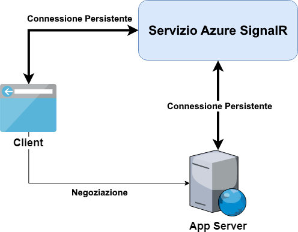

# Funzionamento interno del servizio Azure SignalR

> NOTA: Questo documento descrive l'utilizzo del servizio Azure SignalR, per il momento solo con ASP.NET Core SignalR.
> La documentazione sul supporto di SignalR a ASP.NET sarà aggiunta a breve.

- [Connessioni Server](#server-connections)
- [Connessioni Client](#client-connections)
- [Trasporto dati fra client e server](#transport)

Il servizio Azure SignalR è costruito sopra il framework ASP.NET Core SignalR.
Puoi iniziare da un'applicazione ASP.NET Core SignalR locale, e poi muoverti trasparentemente ad un servizio Azure SignalR con solo poche righe di codice.

Il diagramma che suegue descrive l'architettura tipica quando usi il servizio Azure SignalR con il tuo application server.
Il comportamento di client e server è diferente da ASP.NET Core SignalR in modalità self-hosting.
Ulteriori dettagli verranno descritti nelle sezioni seguenti.




<a name="server-connections"></a>
## Connessioni Server

Quanto utilizzi ASP.NET Core SignalR  in modalità self-hosting, l'application server ascolta per le connessioni dei client e le serve direttamente.

Con il servizio SignalR invece, l'application server non è più responsabile di accettare connessioni client persistenti.
Un endpoint di `negoziazione (negotiate)` viene esposto dall'SDK del servizio Azure SignalR per ogni hub.
Risponde alle richieste di negoziazione dei client e li ridirige al servizio SignalR.
Eventualmente, tutti i client saranno connessi al servizio SignalR.
Per ulteriori informazioni, vedi la sezione [Connessioni Client](#client-connections).

Una volta che l'application server è avviato, l'SDK del servizio Azure SignalR apre 5 connessioni WebSocket al servizio SignalR.
Il numero di connessioni utilizzate è configurabile e desctitto [qui](./use-signalr-service.md#connectioncount).
Messaggi da e verso i client saranno multiplexati all'interno di queste connessioni.

Queste connessioni dovrebbero rimanere connesse al servizio SignalR per tutto il tempo.
Se una connessione al server si interrompe a causa di problemi di rete,
- tutti i client che sono serviti da questa connessione sono disconnessi (per ulteriori informazioni sull'accoppiamento fra client e server vedi la sezione [Trasporto dati fra client e server](#transport));
- la connessione al server viene ristabilita automaticamente.

<a name="client-connections"></a>
## Connessioni Client

Quando si usa il servizio SignalR, i client si connettono al servizio SignalR invece che all'application server.
E' un processo in due fasi per stabilire connessioni persistenti fra il client e il servizio SignalR.

1. Il client invia una richiesta di negoziazione all'application server.
Con l'SDK del servizio Azure SignalR, l'application server ritorna una risposta di redirezione negoziazione all'URL del servizio SignalR e un token di accesso.
La risposta di redirezione tipica appare come segue:
    ```json
    {
        "url":"https://test.service.signalr.net:5001/client/?hub=chat&...",
        "accessToken":"<a typical JWT token>",
        "availableTransports":[]
    }
    ```

1. Dopo aver ricevuto la risposta di redirezione, il client usa la nuova URL ed il token di accesso per iniziare il processo di connessione al servizio SignalR.
Clicca qui per avere ulteriori dettagli sui [protocolli di trasporto](https://github.com/aspnet/SignalR/blob/release/2.2/specs/TransportProtocols.md) di ASP.NET Core SignalR.

<a name="transport"></a>
## Trasporto dati fra client e server

Quando un client è connesso al servizio SignalR, il runtime del servizio troverà una connessione server per servire il cient
- Questo avviene solo una volta, ed è un'accoppiamento uno-a-uno fra le connessioni del client e del server
- La mappatura è valida nel servizio SignalR finchè la connessione del client o del server si disconnettono.

A questo punto l'application server riceve un evento con le informazioni del nuovo client.
Una connessione logica al client viene creata nell'application server per iniziare la pipeline di elaborazione di ASP.NET Core SignalR.

Ora che il canale dati fra un client e l'application server è stato stabilit.
Il servizio SignalR trasporta i dati dal client all'application server accoppiato.
E i dati dall'application server saranno inviati ai client relativi.

Come puoi notare, il servizio Azure SignalR è essenzialmente un livello di trasporto logico tra l'application server e i client.
Tutte le connessioni persistenti sono scaricate sul servizio SignalR.
L'application service deve solo gestire la logica di business nelle tue classi hub.
