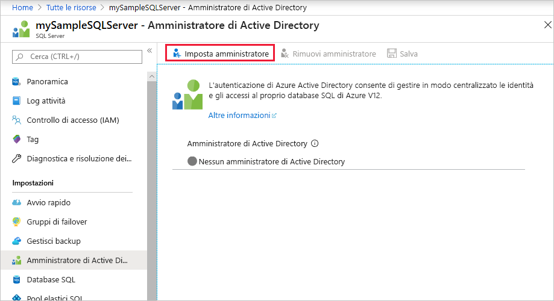
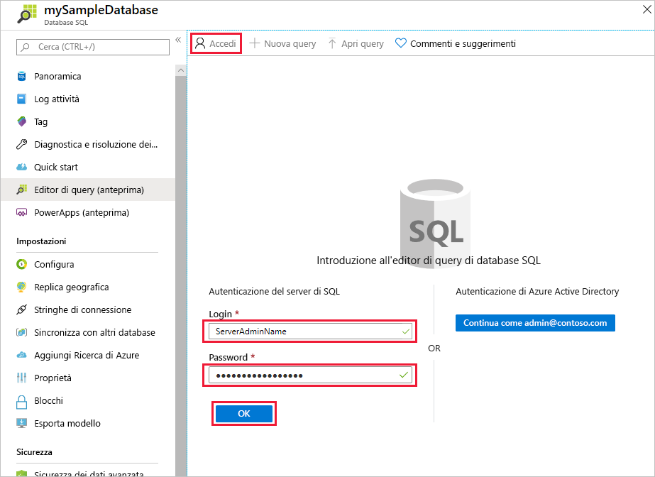

# <a name="quickstart-use-the-azure-portals-query-editor-preview-to-query-an-azure-sql-database"></a>Avvio rapido: Usare l'editor di query del portale di Azure (anteprima) per eseguire query su un database SQL di Azure
[!INCLUDE[appliesto-sqldb](../includes/appliesto-sqldb.md)]

L'editor di query è uno strumento del portale di Azure per l'esecuzione di query SQL sul database in Database SQL di Azure o sul data warehouse in Azure Synapse Analytics.

In questa guida di avvio rapido si userà l'editor di query per eseguire query T-SQL (Transact-SQL) su un database.

## <a name="prerequisites"></a>Prerequisiti

### <a name="create-a-database-with-sample-data"></a>Creare un database con dati di esempio

Per completare questo argomento di avvio rapido, è necessario il database di esempio AdventureWorksLT. Se non si dispone di una copia di lavoro del database di esempio AdventureWorksLT nel database SQL, la Guida introduttiva seguente consente di crearne rapidamente uno:

[Avvio rapido: Creare un database nel database SQL di Azure usando il portale di Azure, PowerShell o l'interfaccia della riga di comando di Azure](single-database-create-quickstart.md)

### <a name="set-an-azure-active-directory-admin-for-the-server-optional"></a>Impostare un amministratore Azure Active Directory per il server (facoltativo)

La configurazione di un amministratore di Azure Active Directory (Azure AD) consente di usare una singola identità per accedere al portale di Azure e al database. Se si vuole usare Azure AD per connettersi all'editor di query, seguire questa procedura.

Questo processo è facoltativo. è invece possibile usare l'autenticazione SQL per connettersi all'editor di query.

> [!NOTE]
> * Gli account di posta elettronica (ad esempio outlook.com, gmail.com, yahoo.com e così via) non sono ancora supportati come amministratori di Azure AD. Assicurarsi di scegliere un utente creato in modo nativo o federato in Azure AD.
> * Azure AD l'accesso dell'amministratore funziona con gli account che dispongono dell'autenticazione a due fattori abilitata, ma l'editor di query non supporta l'autenticazione a due fattori.

1. Nella portale di Azure passare al server di database SQL.

2. Scegliere **Amministratore di Active Directory** dal menu **SQL Server**.

3. Nella barra degli strumenti della pagina SQL Server **Active Directory amministratore** selezionare **imposta amministratore**.

    

4. Nella casella di ricerca della pagina **Aggiungi amministratore** immettere un utente o un gruppo da trovare, selezionarlo come amministratore e quindi scegliere il pulsante **Seleziona**.

5. Di nuovo sulla barra degli strumenti della pagina **Amministratore di Active Directory** di SQL Server selezionare **Salva**.

## <a name="using-sql-query-editor"></a>Utilizzo dell'editor di query SQL

1. Accedere al [portale di Azure](https://portal.azure.com/) e selezionare il database su cui eseguire query.

2. Dal menu **Database SQL** scegliere **Editor di query (anteprima)** .

    

### <a name="establish-a-connection-to-the-database"></a>Stabilire una connessione con il database

Anche se è stato eseguito l'accesso al portale, è comunque necessario fornire le credenziali per accedere al database. Per connettersi al database, è possibile usare l'autenticazione SQL o Azure Active Directory.

#### <a name="connect-using-sql-authentication"></a>Connettersi con l'autenticazione SQL

1. Nella pagina **Accesso**, in **Autenticazione di SQL Server**, immettere l'**account di accesso** e la **password** di un utente che ha accesso al database. In caso di dubbi, usare l'account di accesso e la password dell'amministratore del server di database.

    

2. Selezionare **OK**.

#### <a name="connect-using-azure-active-directory"></a>Connettersi con Azure Active Directory

Nell' **editor di query (anteprima)** esaminare la pagina di **accesso** nella sezione **autenticazione Active Directory** . L'autenticazione verrà eseguita automaticamente, pertanto se si è un amministratore Azure AD al database, verrà visualizzato un messaggio che informa che è stato eseguito l'accesso. Quindi selezionare il pulsante **continua come** *\<your user or group ID>* . Se la pagina indica che l'accesso non è riuscito, potrebbe essere necessario aggiornarla.

### <a name="query-a-database-in-sql-database"></a>Eseguire query su un database nel database SQL

Le query di esempio seguenti dovrebbero essere eseguite correttamente sul database di esempio AdventureWorksLT.

#### <a name="run-a-select-query"></a>Eseguire una query SELECT

1. Incollare la query seguente nell'editor di query:

   ```sql
    SELECT TOP 20 pc.Name as CategoryName, p.name as ProductName
    FROM SalesLT.ProductCategory pc
    JOIN SalesLT.Product p
    ON pc.productcategoryid = p.productcategoryid;
   ```

2. Selezionare **Esegui** e quindi esaminare l'output nel riquadro **Risultati**.

   

3. Facoltativamente, è possibile salvare la query come file con estensione sql oppure esportare i dati restituiti come file JSON, CSV o XML.

#### <a name="run-an-insert-query"></a>Eseguire una query INSERT

Eseguire l'istruzione T-SQL [INSERT](/sql/t-sql/statements/insert-transact-sql/) seguente per aggiungere un nuovo prodotto nella tabella `SalesLT.Product`.

1. Sostituire la query precedente con questa.

    ```sql
    INSERT INTO [SalesLT].[Product]
           ( [Name]
           , [ProductNumber]
           , [Color]
           , [ProductCategoryID]
           , [StandardCost]
           , [ListPrice]
           , [SellStartDate]
           )
    VALUES
           ('myNewProduct'
           ,123456789
           ,'NewColor'
           ,1
           ,100
           ,100
           ,GETDATE() );
   ```


2. Selezionare **Esegui** per inserire una nuova riga nella tabella `Product`. Nel riquadro **Messaggi** verrà visualizzato **Query succeeded: Affected rows: 1** (Query riuscita. Righe interessate: 1).


#### <a name="run-an-update-query"></a>Eseguire una query UPDATE

Eseguire l'istruzione T-SQL [UPDATE](/sql/t-sql/queries/update-transact-sql/) seguente per modificare il nuovo prodotto.

1. Sostituire la query precedente con questa.

   ```sql
   UPDATE [SalesLT].[Product]
   SET [ListPrice] = 125
   WHERE Name = 'myNewProduct';
   ```

2. Selezionare **Esegui** per aggiornare la riga specificata nella tabella `Product`. Nel riquadro **Messaggi** verrà visualizzato **Query succeeded: Affected rows: 1** (Query riuscita. Righe interessate: 1).

#### <a name="run-a-delete-query"></a>Eseguire una query DELETE

Eseguire l'istruzione T-SQL [DELETE](/sql/t-sql/statements/delete-transact-sql/) seguente per rimuovere il nuovo prodotto.

1. Sostituire la query precedente con questa:

   ```sql
   DELETE FROM [SalesLT].[Product]
   WHERE Name = 'myNewProduct';
   ```

2. Selezionare **Esegui** per eliminare la riga specificata nella tabella `Product`. Nel riquadro **Messaggi** verrà visualizzato **Query succeeded: Affected rows: 1** (Query riuscita. Righe interessate: 1).


## <a name="troubleshooting-and-considerations"></a>Risoluzione dei problemi e considerazioni

Quando si usa l'editor di query è necessario tenere presente quanto segue.

### <a name="configure-local-network-settings"></a>Configurare le impostazioni della rete locale

Se si verifica uno degli errori seguenti nell'editor di query:
 - *Le impostazioni della rete locale potrebbero impedire all'editor di query di emettere query. Per istruzioni su come configurare le impostazioni di rete, fare clic qui.*
 - *Impossibile stabilire una connessione al server. Questo potrebbe indicare un problema con la configurazione del firewall locale o con le impostazioni del proxy di rete*

Ciò è dovuto al fatto che l'editor di query utilizza la porta 443 e 1443 per comunicare. È necessario assicurarsi di avere abilitato il traffico HTTPS in uscita su queste porte. Nelle istruzioni riportate di seguito viene illustrato come eseguire questa operazione, a seconda del sistema operativo. Potrebbe essere necessario collaborare con l'IT aziendale per concedere l'approvazione per aprire la connessione nella rete locale.

#### <a name="steps-for-windows"></a>Passaggi per Windows

1. Apri **Windows Defender Firewall**
2. Nel menu a sinistra selezionare **Impostazioni avanzate** .
3. In **Windows Defender Firewall con sicurezza avanzata**, selezionare **regole in uscita** nel menu a sinistra.
4. Selezionare **nuova regola...** nel menu a destra

Nella **creazione guidata nuova regola connessioni in uscita** attenersi alla seguente procedura:

1. Selezionare **porta** come tipo di regola che si desidera creare. Selezionare **Avanti**
2. Selezionare **TCP**
3. Selezionare **porte remote specifiche** e immettere "443, 1443". Quindi selezionare **Avanti**
4. Selezionare "Consenti la connessione se è sicura"
5. Selezionare **Avanti** , quindi fare di nuovo clic su **Avanti** .
5. Mantieni selezionato "dominio", "privato" e "pubblico"
6. Assegnare un nome alla regola, ad esempio "accedi all'editor di query SQL di Azure" e, facoltativamente, una descrizione. Quindi selezionare **fine**

#### <a name="steps-for-mac"></a>Passaggi per Mac
1. Aprire **Preferenze di sistema** (menu Apple > preferenze di sistema).
2. Fare clic su **sicurezza & privacy**.
3. Fare clic su **Firewall**.
4. Se il firewall è disattivato, selezionare **fare clic sul blocco per apportare le modifiche** nella parte inferiore e selezionare **Attiva firewall**
4. Fare clic su **opzioni firewall**.
5. Nella finestra **Privacy & sicurezza** selezionare questa opzione: "Consenti automaticamente al software firmato di ricevere connessioni in ingresso".

#### <a name="steps-for-linux"></a>Passaggi per Linux
Eseguire questi comandi per aggiornare iptables
  ```
  sudo iptables -A OUTPUT -p tcp --dport 443 -j ACCEPT
  sudo iptables -A OUTPUT -p tcp --dport 1443 -j ACCEPT
  ```

### <a name="connection-considerations"></a>Considerazioni sulla connessione

* Per le connessioni pubbliche all'editor di query, è necessario [aggiungere l'indirizzo IP in uscita alle regole del firewall consentite del server](firewall-create-server-level-portal-quickstart.md) per accedere ai database e ai data warehouse.

* Se nel server è configurata una connessione a collegamento privato e ci si connette all'editor di query da un indirizzo IP nella rete virtuale privata, l'editor di query funziona senza dover aggiungere l'indirizzo IP del client alle regole del firewall del server di database SQL.

* Le autorizzazioni RBAC di base necessarie per utilizzare l'editor di query sono l'accesso in lettura al server e al database. Chiunque disponga di questo livello di accesso può accedere alla funzionalità dell'editor di query di. Per limitare l'accesso a utenti specifici, è necessario impedire che questi siano in grado di accedere all'editor di query con le credenziali di autenticazione di Azure Active Directory o SQL. Se non possono assegnare se stessi come amministratore di AAD per il server o accedere/aggiungere un account amministratore SQL, non dovrebbero essere in grado di utilizzare l'editor di query.

* L'editor di query non supporta la connessione al database `master`.

* L'editor di query non è in grado di connettersi a un database di replica con `ApplicationIntent=ReadOnly`

* Se è stato visualizzato questo messaggio di errore "non è stato possibile convalidare l'intestazione X-CSRF-Signature", eseguire l'azione seguente per risolvere il problema:

    * Verificare che l'orologio del computer sia impostato sull'ora e sul fuso orario corretti. È anche possibile provare a abbinare il fuso orario del computer con Azure cercando il fuso orario per la posizione dell'istanza, ad esempio Stati Uniti orientali, Pacific e così via.
    * Se si utilizza una rete proxy, verificare che l'intestazione della richiesta "X-CSRF-Signature" non venga modificata o eliminata.

### <a name="other-considerations"></a>Altre considerazioni

* Premendo **F5**, la pagina dell'editor di query verrà aggiornata e qualsiasi query in uso andrà persa.

* Esiste un timeout di 5 minuti per l'esecuzione delle query.

* L'editor di query supporta solo la proiezione cilindrica per i tipi di dati Geography.

* Per tabelle e viste di database non è previsto il supporto di IntelliSense, ma l'editor supporta il completamento automatico dei nomi già digitati.

## <a name="next-steps"></a>Passaggi successivi

Per altre informazioni sul supporto per T-SQL (Transact-SQL) disponibile nei database SQL di Azure, vedere [Risoluzione delle differenze di Transact-SQL durante la migrazione al database SQL](transact-sql-tsql-differences-sql-server.md).
