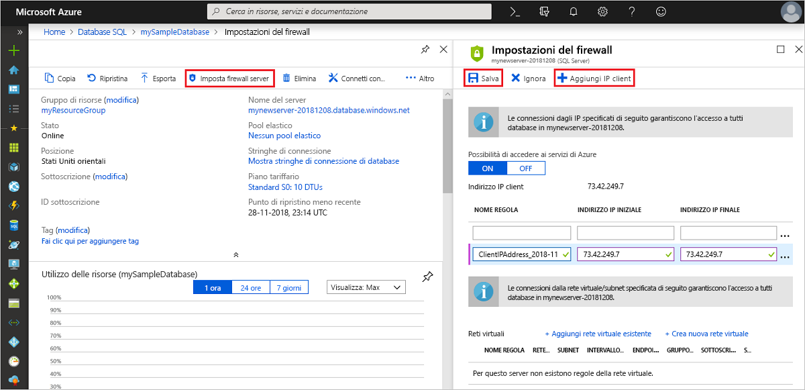

# Avvio rapido: Creare una regola del firewall a livello di server con il portale di Azure
[!INCLUDE[appliesto-sqldb](../includes/appliesto-sqldb.md)]

Questa guida di avvio rapido illustra come creare una [regola del firewall a livello di server](firewall-configure.md) nel database SQL di Azure usando il portale di Azure, per consentire la connessione a [server SQL logici](logical-servers.md), database singoli e pool elastici e ai relativi database. Una regola del firewall è necessaria per la connessione da altre risorse di Azure e da risorse locali. Le regole del firewall a livello di server non si applicano all'istanza gestita di SQL di Azure.

## Prerequisiti

Questa guida introduttiva usa come punto di partenza le risorse create in [Creare un database singolo usando il portale di Azure](single-database-create-quickstart.md).

## Accedere al portale di Azure

Accedere al [portale di Azure](https://portal.azure.com/).

## Creare una regola del firewall IP a livello di server

 Il servizio Database SQL crea un firewall a livello di server per database singoli e in pool. Questo firewall impedisce alle applicazioni client di connettersi al server o ai relativi database a meno che non si crei una regola del firewall IP per aprire il firewall. Per una connessione da un indirizzo IP esterno ad Azure, creare una regola del firewall per un indirizzo IP specifico o un intervallo di indirizzi da cui si vuole potersi connettere. Per altre informazioni sulle regole del firewall IP a livello di server e di database, vedere [Regole del firewall IP a livello di server e a livello di database](firewall-configure.md).

> [!NOTE]
> Il database SQL di Azure comunica sulla porta 1433. Se si sta provando a connettersi da una rete aziendale, il traffico in uscita sulla porta 1433 potrebbe non essere consentito dal firewall della rete. In questo caso, non è possibile connettersi al server a meno che il reparto IT non apra la porta 1433.
> [!IMPORTANT]
> Una regola del firewall di 0.0.0.0 consente a tutti i servizi di Azure di passare attraverso la regola del firewall a livello di server e di provare a connettersi a un database tramite il server.

Seguire questi passaggi per creare una regola del firewall IP a livello di server per l'indirizzo IP del client e abilitare la connettività esterna tramite il firewall del database SQL di Azure solo per il proprio indirizzo IP.

1. Al termine della distribuzione del [database](#prerequisites) selezionare **Database SQL** dal menu a sinistra e quindi scegliere **mySampleDatabase** nella pagina **Database SQL**. Si apre la pagina di panoramica per il database che visualizza il nome completo del server, ad esempio **mynewserver-20170824.database.windows.net**, e offre altre opzioni di configurazione.

2. Copiare il nome completo del server da usare per connettersi al server e ai relativi database in altre guide di avvio rapido.

   

3. Selezionare **Imposta firewall server** sulla barra degli strumenti. Verrà visualizzata la pagina **Impostazioni del firewall** per il server.

   

4. Scegliere **Aggiungi IP client** sulla barra degli strumenti per aggiungere l'indirizzo IP corrente a una nuova regola del firewall IP a livello di server. Una regola del firewall IP a livello di server può aprire la porta 1433 per un singolo indirizzo IP o un intervallo di indirizzi IP.

   > [!IMPORTANT]
   > Per impostazione predefinita, l'accesso attraverso il firewall del database SQL di Azure è disabilitato per tutti i servizi di Azure. Scegliere **SÌ** in questa pagina se si vuole abilitare l'accesso per tutti i servizi di Azure.
   >

5. Selezionare **Salva**. Viene creata una regola del firewall IP a livello di server per l'indirizzo IP corrente, che apre la porta 1433 nel server.

6. Chiudere la pagina **Impostazioni del firewall**.

È ora possibile connettersi al server e ai relativi database usando SQL Server Management Studio o un altro strumento a scelta da questo indirizzo IP, con l'account amministratore del server creato in precedenza.

## Pulire le risorse

Salvare queste risorse se si vuole passare a [Passaggi successivi](#next-steps) per ottenere informazioni su come eseguire la connessione e le query nel database usando alcuni metodi diversi. Se tuttavia si vogliono eliminare le risorse create in questa guida di avvio rapido, seguire questa procedura.

1. Dal menu a sinistra nel portale di Azure scegliere **Gruppi di risorse** e quindi selezionare **myResourceGroup**.
2. Nella pagina del gruppo di risorse selezionare **Elimina**, digitare **myResourceGroup** nella casella di testo e quindi scegliere **Elimina**.

## Passaggi successivi

- Dopo aver creato un database, è possibile [connettersi ed eseguire query](connect-query-content-reference-guide.md) usando uno degli strumenti o dei linguaggi di programmazione preferiti, tra cui
  - [Connettersi ed eseguire query usando SQL Server Management Studio](connect-query-ssms.md)
  - [Connettersi ed eseguire query usando Azure Data Studio](/sql/azure-data-studio/quickstart-sql-database?toc=/azure/sql-database/toc.json)
- Per informazioni su come progettare il primo database, creare tabelle e inserire dati, vedere una delle esercitazioni seguenti:
  - [Progettare il primo database singolo nel database SQL di Azure usando SSMS](design-first-database-tutorial.md)
  - [Progettare un database singolo nel database SQL di Azure e connettersi con C# e ADO.NET](design-first-database-csharp-tutorial.md)
