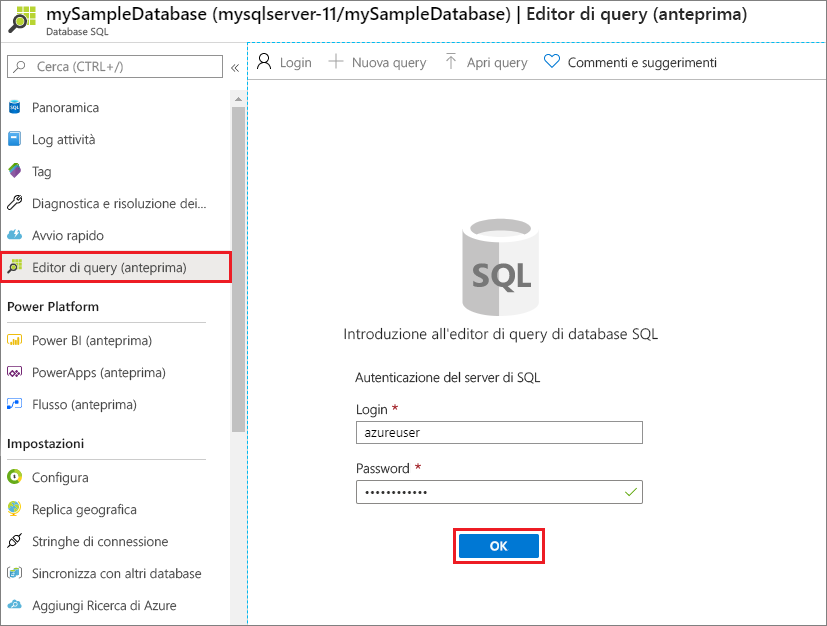

# <a name="quickstart-create-an-azure-sql-database-single-database"></a>Avvio rapido: Crea un database SQL di Azure singolo

In questo argomento di avvio rapido si userà il portale di Azure, uno script di Azure PowerShell o uno script dell'interfaccia della riga di comando di Azure per creare un database singolo nel database SQL di Azure. È quindi possibile eseguire query sul database con l'**editor di query** nel portale di Azure.

Un [database singolo](single-database-overview.md) è l'opzione più semplice e rapida per il database SQL di Azure. È possibile gestire un database singolo all'interno di un [server](logical-servers.md), che risiede in un [gruppo di risorse di Azure ](../../azure-resource-manager/management/manage-resource-groups-portal.md) in un'area di Azure specificata. In questa guida di avvio rapido vengono creati un nuovo gruppo di risorse e un server per il nuovo database.

È quindi possibile creare un database singolo nel livello di calcolo *con provisioning* o *serverless*. Per un database con provisioning viene preallocata una quantità fissa di risorse di calcolo, tra cui CPU e memoria, e viene usato uno dei due [modelli di acquisto](purchasing-models.md) disponibili. In questo argomento di avvio rapido viene creato un database con provisioning usando il modello di acquisto [basato su vCore](service-tiers-vcore.md), ma è anche possibile scegliere un modello [basato su unità di elaborazione di database](service-tiers-dtu.md).

Il livello di calcolo serverless è disponibile solo nel modello di acquisto basato su vCore e include una gamma di risorse di calcolo a scalabilità automatica, tra cui CPU e memoria. Per creare un database singolo nel livello di calcolo serverless, vedere [Creare database serverless](serverless-tier-overview.md#create-a-new-database-in-the-serverless-compute-tier).

## <a name="prerequisite"></a>Prerequisito

- Una sottoscrizione di Azure attiva. Se non se ne ha una, [creare un account gratuito](https://azure.microsoft.com/free/).

## <a name="create-a-single-database"></a>Creare un database singolo

[!INCLUDE [sql-database-create-single-database](../includes/sql-database-create-single-database.md)]

## <a name="query-the-database"></a>Eseguire query sul database

Dopo aver creato il database, è possibile usare l'**editor di query** predefinito per portale di Azure per connettersi ed eseguire query sui dati.

1. Nel portale cercare e selezionare **Database SQL**, quindi selezionare il database nell'elenco.
1. Nella pagina **Database SQL** del database selezionare **Editor di query (anteprima)** nel menu a sinistra.
1. Immettere le credenziali di accesso di amministratore server e selezionare **OK**.

   

1. Immettere la query seguente nel riquadro **Editor di query**.

   ```sql
   SELECT TOP 20 pc.Name as CategoryName, p.name as ProductName
   FROM SalesLT.ProductCategory pc
   JOIN SalesLT.Product p
   ON pc.productcategoryid = p.productcategoryid;
   ```

1. Selezionare **Esegui** e quindi esaminare i risultati della query nel riquadro **Risultati**.

   

1. Chiudere la pagina **Editor di query** e selezionare **OK** quando richiesto per rimuovere le modifiche non salvate.

## <a name="clean-up-resources"></a>Pulire le risorse

Mantenere il gruppo di risorse, il server e il database singolo per procedere con i passaggi successivi e acquisire informazioni su come connettersi al database ed eseguire query con metodi diversi.

Dopo aver finito di usare queste risorse, è possibile eliminare il gruppo di risorse creato, eliminando in questo modo anche il server e il database singolo al suo interno.

### <a name="the-azure-portal"></a>[Il portale di Azure](#tab/azure-portal)

Per eliminare **myResourceGroup** e tutte le relative risorse con il portale di Azure:

1. Nel portale cercare e selezionare **Gruppi di risorse** e quindi selezionare **myResourceGroup** nell'elenco.
1. Nella pagina del gruppo di risorse selezionare **Elimina gruppo di risorse**.
1. In **Digitare il nome del gruppo di risorse** immettere *myResourceGroup* e quindi selezionare **Elimina**.

### <a name="the-azure-cli"></a>[L’interfaccia della riga di comando di Azure](#tab/azure-cli)

Per eliminare il gruppo di risorse e tutte le relative risorse, eseguire il comando dell'interfaccia della riga di comando di Azure seguente usando il nome del gruppo di risorse:

```azurecli-interactive
az group delete --name <your resource group>
```

### <a name="powershell"></a>[PowerShell](#tab/azure-powershell)

Per eliminare il gruppo di risorse e tutte le relative risorse, eseguire il cmdlet di PowerShell seguente, usando il nome del gruppo di risorse:

```azurepowershell-interactive
Remove-AzResourceGroup -Name <your resource group>
```

---

## <a name="next-steps"></a>Passaggi successivi

[Connettersi ed eseguire query](connect-query-content-reference-guide.md) sul database con strumenti e linguaggi diversi:
> [!div class="nextstepaction"]
> [Connettersi ed eseguire query usando SQL Server Management Studio](connect-query-ssms.md)
>
> [Connettersi ed eseguire query usando Azure Data Studio](/sql/azure-data-studio/quickstart-sql-database?toc=/azure/sql-database/toc.json)

Si vuole ottimizzare e risparmiare sulla spesa per il cloud?

> [!div class="nextstepaction"]
> [Per iniziare, analizzare i costi con Gestione costi](https://docs.microsoft.com/azure/cost-management-billing/costs/quick-acm-cost-analysis?WT.mc_id=costmanagementcontent_docsacmhorizontal_-inproduct-learn)
