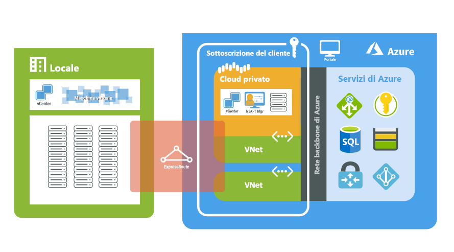

# Che cos'è la soluzione Azure VMware (AVS) (anteprima)?

La soluzione Azure VMware (AVS) offre cloud privati in Azure. I cloud privati contengono cluster vSphere, creati da un'infrastruttura di Azure bare metal dedicata. È possibile dimensionare i cluster di cloud privati da 3 a 16 host, con la possibilità di avere più cluster in un singolo cloud privato. Per tutti i cloud privati viene effettuato il provisioning con server vCenter, rete vSAN, vSphere e NSX-T. È possibile eseguire la migrazione dei carichi di lavoro dagli ambienti locali, creare o distribuire nuove macchine virtuali e utilizzare i servizi di Azure dai cloud privati.

AVS è una soluzione VMware collaudata con convalide e test continuativi di miglioramenti e aggiornamenti. L'infrastruttura e il software del cloud privato vengono gestiti e mantenuti da Microsoft, per consentire di concentrarsi sullo sviluppo e sull'esecuzione di carichi di lavoro nei cloud privati.

Il diagramma seguente mostra l'adiacenza tra cloud privati e reti virtuali in Azure, servizi di Azure e ambienti locali. L'accesso di rete da cloud privati a servizi di Azure o reti virtuali offre l'integrazione basata su contratti di servizio degli endpoint servizio di Azure. L'accesso al cloud privato da ambienti locali usa la copertura globale ExpressRoute per una connessione privata e sicura.

## Host, cluster e cloud privati

I cloud privati e i cluster AVS vengono creati da un host di infrastruttura di Azure bare metal iperconvergente. Gli host di livello elevato sono dotati di 576 GB di RAM e di processori dual core Intel a 18 core a 2,3 GHz. Gli host di livello elevato sono dotati di due gruppi di dischi vSAN con un livello di capacità di rete vSAN non elaborato totale di 15,36 TB (unità SSD) e un livello di cache di rete vSAN di 3,2 TB (NVMe).

I nuovi cloud privati vengono distribuiti tramite il portale di Azure o l'interfaccia della riga di comando di Azure.

## Rete

Quando viene distribuito un cloud privato, vengono create le reti private per la gestione, il provisioning e vMotion. Queste reti private vengono usate per l'accesso a vCenter e NSX-T Manager e per la distribuzione o la migrazione tramite vMotion della macchina virtuale. Tutte le reti private sono accessibili da una rete virtuale in Azure o dagli ambienti locali. La funzionalità Copertura globale ExpressRoute viene usata per connettere i cloud privati agli ambienti locali e questa connessione richiede una rete virtuale con un circuito ExpressRoute nella sottoscrizione.

Durante la distribuzione di un cloud privato viene effettuato il provisioning dell'accesso a Internet e ai servizi di Azure. L'accesso consente alle macchine virtuali nelle reti dei carichi di lavoro di produzione di utilizzare servizi basati su Azure o su Internet. L'accesso a Internet è disabilitato per impostazione predefinita per i nuovi cloud privati e può essere abilitato o disabilitato in qualsiasi momento.

Per altre informazioni sulla rete e sull'interconnettività, vedere l'articolo relativo ai [Concetti sulla rete](concepts-networking.md).

## Accesso e sicurezza

Per maggiore sicurezza, i cloud privati AVS usano il controllo degli accessi in base al ruolo di vSphere. Le funzionalità LDAP per l'accesso SSO di vSphere possono essere integrate con Azure Active Directory. Per altre informazioni sulle identità e sui privilegi, vedere l'articolo relativo ai [Concetti su accesso e identità](concepts-identity.md).

La crittografia dei dati inattivi della rete vSAN è abilitata per impostazione predefinita e viene usata per fornire la sicurezza dell'archivio dati della rete vSAN. Questo argomento viene descritto più dettagliatamente nell'articolo relativo ai [Concetti sull'archiviazione](concepts-storage.md).

## Manutenzione del ciclo di vita di software e host

Gli aggiornamenti regolari del cloud privato AVS e del software VMware garantiscono che nei cloud privati siano in esecuzione i set di funzionalità, di sicurezza e di stabilità più recenti. Altre informazioni sulla manutenzione e sugli aggiornamenti della piattaforma sono disponibili nell'articolo relativo ai [Concetti sull'aggiornamento](concepts-upgrades.md).

## Monitoraggio del cloud privato

È possibile usare la funzionalità [Log in Monitoraggio di Azure](../azure-monitor/overview.md) per raccogliere i log delle macchine virtuali in esecuzione nel cloud privato AVS. È possibile [scaricare e installare l'agente Microsoft Monitoring Agent](../azure-monitor/platform/log-analytics-agent.md#installation-and-configuration) nelle macchine virtuali Linux e Windows in esecuzione nei cloud privati AVS, usando le stesse query eseguite nelle macchine virtuali locali. È possibile eseguire le stesse query che si eseguono normalmente nelle macchine virtuali. Per altre informazioni sulla creazione di query, vedere [Come scrivere le query](../azure-monitor/log-query/log-query-overview.md#how-can-i-learn-how-to-write-queries).

## Passaggi successivi

Il passaggio successivo prevede l'approfondimento dei [Concetti principali sul cloud privato e sui cluster](concepts-private-clouds-clusters.md).

<!-- LINKS - external -->

<!-- LINKS - internal -->
[concepts-private-clouds-clusters]: ./concepts-private-clouds-clusters.md
