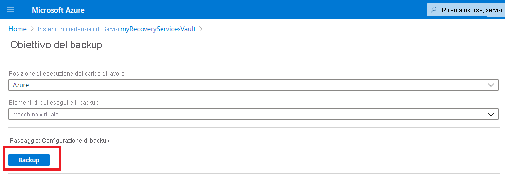
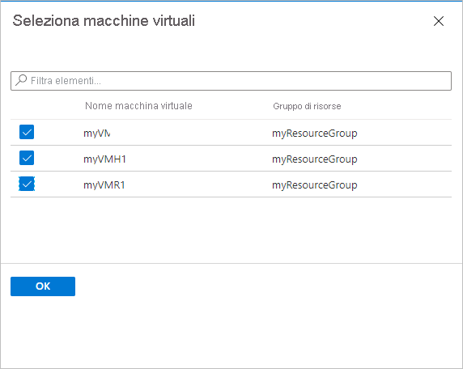
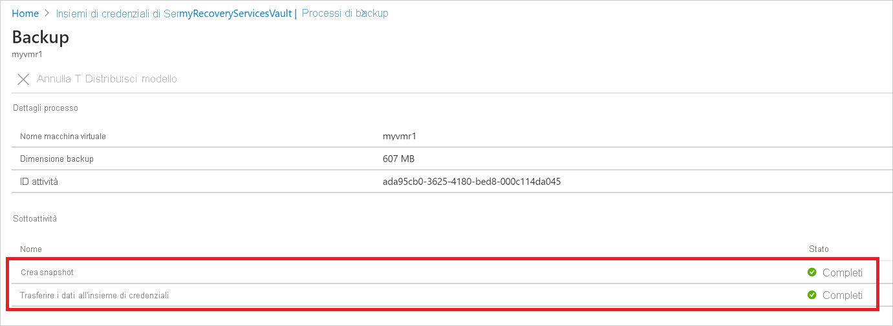

# Eseguire il backup di macchine virtuali di Azure in un insieme di credenziali di Servizi di ripristino

Questo articolo descrive come eseguire il backup delle macchine virtuali di Azure in un insieme di credenziali di Servizi di ripristino usando il servizio Backup di Azure.This article describes how to back up Azure VMs in a Recovery Services vault, using the [Azure Backup](backup-overview.md) service.

In questo articolo vengono illustrate le operazioni seguenti:

> [!div class="checklist"]
>
> * Preparare le macchine virtuali di Azure.
> * Creare un insieme di credenziali.
> * Individuare le macchine virtuali e configurare un criterio di backup.
> * Abilitare il backup per le macchine virtuali di Azure.Enable backup for Azure VMs.
> * Eseguire il backup iniziale.

> [!NOTE]
> In questo articolo viene descritto come configurare un insieme di credenziali e selezionare le macchine virtuali di cui eseguire il backup. È utile per eseguire il backup di più macchine virtuali. In alternativa, è possibile eseguire il backup di [una singola macchina virtuale](backup-azure-vms-first-look-arm.md) di Azure direttamente dalle impostazioni della macchina virtuale.

## Prima di iniziare

* [Esaminare](backup-architecture.md#architecture-built-in-azure-vm-backup) l'architettura di backup della macchina virtuale di Azure.Review the Azure VM backup architecture.
* [Informazioni su](backup-azure-vms-introduction.md) backup delle macchine virtuali di Azure ed estensione di backup.
* [Esaminare la matrice](backup-support-matrix-iaas.md) di supporto prima di configurare il backup.

Inoltre, ci sono un paio di cose che potrebbe essere necessario fare in alcune circostanze:

* **Installare l'agente di macchine virtuali nella macchina virtuale:** Backup di Azure esegue il backup delle macchine virtuali di Azure installando un'estensione dell'agente di macchine virtuali di Azure in esecuzione nel computer. Se la macchina virtuale è stata creata da un'immagine del marketplace di Azure, l'agente viene installato e in esecuzione. Se si crea una macchina virtuale personalizzata o si esegue la migrazione di un computer locale, potrebbe essere necessario [installare l'agente manualmente.](#install-the-vm-agent)

## Creare un insieme di credenziali

 Un insieme di credenziali consente di archiviare i backup e i punti di ripristino creati nel corso del tempo, oltre ai criteri di backup associati ai computer sottoposti a backup. Creare un insieme di credenziali nel modo seguente:

1. Accedere al [portale](https://portal.azure.com/)di Azure .
2. Nella ricerca digitare **Servizi di ripristino**. In **Servizi**fare clic su **Insieme di credenziali dei servizi**di ripristino .

     

3. Nel menu **del vault di Servizi di ripristino,** fare clic su **Aggiungi**.

     

4. Nell'insieme di **credenziali dei servizi di ripristino**digitare un nome descrittivo per identificare l'insieme di credenziali.
    * Il nome deve essere univoco per la sottoscrizione di Azure.
    * Può contenere da 2 a 50 caratteri.
    * Deve iniziare con una lettera e può contenere solo lettere, numeri e trattini.
5. Selezionare la sottoscrizione di Azure, il gruppo di risorse e l'area geografica in cui deve essere creato l'insieme di credenziali. Successivamente, fare clic su **Create**.
    * La creazione dell'insieme di credenziali può richiedere alcuni minuti.
    * Monitorare le notifiche di stato nell'area superiore destra del portale.

Una volta creato, l'insieme di credenziali viene visualizzato nell'elenco degli insiemi di credenziali dei servizi di recupero. Se non viene visualizzato, selezionare **Aggiorna**.

>[!NOTE]
> Backup di Azure consente ora la personalizzazione del nome del gruppo di risorse creato dal servizio Backup di Azure.Azure Backup now allows customization of the resource group name created by the Azure Backup service. Per altre informazioni, vedere Gruppo di risorse Backup di [Azure per macchine virtuali.](backup-during-vm-creation.md#azure-backup-resource-group-for-virtual-machines)

### Modificare la replica di archiviazioneModify storage replication

Per impostazione predefinita, gli insiemi di credenziali utilizzano [l'archiviazione con ridondanza geografica (GRS, Geoperidere)](https://docs.microsoft.com/azure/storage/common/storage-redundancy-grs).

* Se l'insieme di credenziali è il meccanismo di backup principale, si consiglia di utilizzare GRS.
* È possibile utilizzare [l'archiviazione con ridondanza locale (LRS)](https://docs.microsoft.com/azure/storage/common/storage-redundancy-lrs?toc=%2fazure%2fstorage%2fblobs%2ftoc.json) per un'opzione più economica.

Modificare il tipo di replica di archiviazione come segue:Modify storage replication type as follows:

1. Nel nuovo vault, fare clic su **Proprietà** nella sezione **Impostazioni.**
2. In **Proprietà**, in **Configurazione backup**fare clic su **Aggiorna**.
3. Selezionare il tipo di replica di archiviazione e fare clic su **Salva**.

      

> [!NOTE]
   > Non è possibile modificare il tipo di replica di archiviazione dopo l'impostazione dell'insieme di credenziali e contiene elementi di backup. Se si desidera eseguire questa operazione è necessario ricreare il vault.

## Applicare un criterio di backup

Configurare un criterio di backup per l'insieme di credenziali.

1. Nell'insieme di credenziali, fare clic su **"Backup"** nella sezione **Panoramica.**

   

2. In **Obiettivo di backup** > Dove è in esecuzione il carico di lavoro? selezionare **Azure.In**Backup Goal**Where is your workload running?** select Azure . In **Cosa si desidera eseguire il backup selezionare** Macchina **Virtual machine** >  virtuale**OK**. In questo modo viene registrata l'estensione delle macchine virtuali nell'insieme di credenziali.

   

3. In **Criteri di backup** selezionare i criteri da associare all'insieme di credenziali.
    * Il criterio predefinito esegue il backup della macchina virtuale una volta al giorno. I backup giornalieri vengono conservati per 30 giorni. Le istantanee di recupero istantanee vengono conservate per due giorni.
    * Se non si desidera utilizzare il criterio predefinito, selezionare **Crea nuovo**e creare un criterio personalizzato come descritto nella procedura successiva.

      

4. In **Seleziona macchine virtuali**selezionare le macchine virtuali di cui si vuole eseguire il backup usando il criterio. Fare quindi clic su **OK**.

   * Le macchine virtuali selezionate vengono convalidate.
   * È possibile selezionare solo macchine virtuali presenti nella stessa area dell'insieme di credenziali.
   * Il backup delle macchine virtuali può essere eseguito in un solo insieme di credenziali.

     

5. In **Backup**fare clic su **Abilita backup**. Questa operazione consente di distribuire i criteri nell'insieme di credenziali e nelle macchine virtuali e installare l'estensione di backup nell'agente di macchine virtuali in esecuzione nella macchina virtuale di Azure.

     

Dopo l'abilitazione del backup:

* Il servizio Backup installa l'estensione di backup indipendentemente dal fatto che la VM sia in esecuzione o meno.
* Un backup iniziale verrà eseguito in base alla pianificazione del backup.
* Quando vengono eseguiti i backup, tenere presente che:
  * Una macchina virtuale in esecuzione ha maggiori possibilità di acquisire un punto di ripristino coerente con l'applicazione.
  * Tuttavia, anche se la macchina virtuale è disattivata, viene eseguito il backup. Una macchina virtuale di questo tipo è nota come macchina virtuale offline. In questo caso, il punto di ripristino sarà coerente con l'arresto anomalo del sistema.
* La connettività in uscita esplicita non è necessaria per consentire il backup delle macchine virtuali di Azure.Explicit outbound connectivity is not required to allow backup of Azure VMs.

### Creare criteri personalizzati

Se si è scelto di creare un nuovo criterio di backup, immettere le impostazioni dei criteri.

1. In **Nome criterio**specificare un nome significativo.
2. In **Pianificazione backup**specificare quando eseguire i backup. È possibile eseguire backup giornalieri o settimanali per le macchine virtuali di Azure.You can take daily or weekly backups for Azure VMs.
3. In **Ripristino immediato**specificare per quanto tempo si desidera conservare le istantanee localmente per il ripristino immediato.
    * Quando si esegue il ripristino, i dischi delle macchine virtuali di cui è stato eseguito il backup vengono copiati dall'archivio, attraverso la rete fino al percorso di archiviazione di ripristino. Con il ripristino immediato, è possibile sfruttare le istantanee archiviate localmente eseguite durante un processo di backup, senza attendere il trasferimento dei dati di backup nell'insieme di credenziali.
    * È possibile conservare le istantanee per il ripristino istantaneo per un numero di giorni compreso tra uno e cinque giorni. Due giorni è l'impostazione predefinita.
4. In **Intervallo di conservazione**specificare per quanto tempo si desidera mantenere i punti di backup giornalieri o settimanali.
5. In **Conservazione del punto di backup mensile**specificare se si desidera mantenere un backup mensile dei backup giornalieri o settimanali.
6. Fare clic su **OK** per salvare i criteri.

    

> [!NOTE]
   > Backup di Azure non supporta la regolazione automatica dell'orologio in base all'ora legale per i backup delle macchine virtuali di Azure. Quando si verificano modifiche all'ora, modificare manualmente i criteri di backup in base alle esigenze.

## Attivare il backup iniziale

Il backup iniziale verrà eseguito in base alla pianificazione, ma è possibile eseguirlo immediatamente come segue:

1. Selezionare **Elementi di backup** dal menu dell'insieme di credenziali.
2. In **Elementi di backup**fare clic su Macchina virtuale di **Azure**.
3. Nell'elenco **Elementi di backup** fare clic sui puntini di sospensione (...).
4. Fare clic su **Esegui backup ora**.
5. In **Backup ora**, utilizzare il controllo calendario per selezionare l'ultimo giorno in cui deve essere mantenuto il punto di ripristino. Fare quindi clic su **OK**.
6. Monitorare le notifiche del portale. È possibile monitorare l'avanzamento del processo nel dashboard dell'insieme di credenziali > **processi** > di backup**in corso.** A seconda delle dimensioni della macchina virtuale, la creazione del backup iniziale potrebbe richiedere un po' di tempo.

## Verificare lo stato del processo di backup

I dettagli del processo di backup per ogni backup della macchina virtuale sono costituiti da due fasi, ovvero la fase **Snapshot** seguita dalla fase **Trasferisci dati nell'insieme di credenziali.** 
La fase snapshot garantisce la disponibilità di un punto di ripristino archiviato insieme ai dischi per **i ripristini istantanei** e sono disponibili per un massimo di cinque giorni a seconda della conservazione dello snapshot configurata dall'utente. Il trasferimento dei dati nell'insieme di credenziali crea un punto di ripristino nell'insieme di credenziali per la conservazione a lungo termine. Il trasferimento dei dati nel vault inizia solo dopo il completamento della fase di snapshot.

  

Nel back-end sono in esecuzione due **attività** secondarie, una per il processo di backup front-end che può essere controllata dal pannello Dettagli processo di **backup** come indicato di seguito:

  

Il completamento della fase **Trasferisci dati al vault** può richiedere più giorni a seconda delle dimensioni dei dischi, della varianza per disco e di diversi altri fattori.

Lo stato del processo può variare a seconda degli scenari seguenti:

**Snapshot** | **Trasferire i dati all'insieme di credenziali** | **Stato processo**
--- | --- | ---
Completi | In corso | In corso
Completi | Operazione ignorata | Completi
Completi | Completi | Completi
Completi | Operazione non riuscita | Completato con avviso
Operazione non riuscita | Operazione non riuscita | Operazione non riuscita

Ora con questa funzionalità, per la stessa macchina virtuale, due backup possono essere eseguiti in parallelo, ma in entrambe le fasi (snapshot, trasferimento di dati nell'insieme di credenziali) solo una sub-attività può essere in esecuzione. Così negli scenari erano un processo di backup in corso ha provocato il backup del giorno successivo a fallire sarà evitato con questa funzionalità di disaccoppiamento. I backup del giorno successivo possono avere lo snapshot completato mentre **Trasferisci dati nell'insieme** di credenziali vengono ignorati se il processo di backup di un giorno precedente è in corso.
Il punto di ripristino incrementale creato nell'insieme di credenziali acquisirà tutta la varianza dall'ultimo punto di ripristino creato nell'insieme di credenziali. Non vi è alcun impatto sui costi per l'utente.

## Passaggi facoltativi

### Installare l'agente di macchine virtuali

Backup di Azure esegue il backup di macchine virtuali di Azure tramite l'installazione di un'estensione per l'agente di macchine virtuali di Azure in esecuzione nel computer. Se la macchina virtuale è stata creata da un'immagine di Azure Marketplace, l'agente viene installato e in esecuzione. Se si crea una macchina virtuale personalizzata o si esegue la migrazione di un computer locale, potrebbe essere necessario installare l'agente manualmente, come riepilogato nella tabella.

**Vm** | **Dettagli**
--- | ---
**Windows** | 1. [Scaricare e installare](https://go.microsoft.com/fwlink/?LinkID=394789&clcid=0x409) il file MSI dell'agente.   2. Installare con le autorizzazioni di amministratore sul computer.   3. Verificare l'installazione. Nella *C:\WindowsAzure\Packages* macchina virtuale fare clic con il pulsante destro del mouse su**Proprietà** **WaAppAgent.exe** > . Nella scheda **Dettagli** la **versione del prodotto** deve essere 2.6.1198.718 o successiva.   Se si sta aggiornando l'agente, assicurarsi che non siano in esecuzione operazioni di backup e [reinstallare l'agente](https://go.microsoft.com/fwlink/?LinkID=394789&clcid=0x409).
**Linux** | Eseguire l'installazione utilizzando un RPM o un pacchetto DEB dal repository dei pacchetti della distribuzione. Questo è il metodo preferito per l'installazione e l'aggiornamento dell'agente Linux di Azure.This is the preferred method for installing and upgrading the Azure Linux agent. Tutti i [provider di distribuzione supportati](https://docs.microsoft.com/azure/virtual-machines/linux/endorsed-distros) integrano il pacchetto agente Linux di Azure nelle immagini e nei repository. L'agente è disponibile in [GitHub](https://github.com/Azure/WALinuxAgent), ma non è consigliabile installarlo direttamente da questa posizione.   Se si sta aggiornando l'agente, assicurarsi che non siano in esecuzione operazioni di backup e aggiornare i file binari.

>[!NOTE]
> **Backup di Azure supporta ora il backup e il ripristino selettivi del disco tramite la soluzione di backup della macchina virtuale di Azure.Azure Backup now supports selective disk backup and restore using the Azure Virtual Machine backup solution.**
>
>Oggi, Backup di Azure supporta il backup di tutti i dischi (sistema operativo e dati) in una macchina virtuale insieme usando la soluzione di backup della macchina virtuale. Con la funzionalità exclude-disk, è possibile eseguire il backup di uno o pochi dischi dati dai molti dischi dati in una macchina virtuale. Ciò offre una soluzione efficiente ed economica per le vostre esigenze di backup e ripristino. Ogni punto di ripristino contiene i dati dei dischi inclusi nell'operazione di backup, che consente di ripristinare un sottoinsieme di dischi dal punto di ripristino specificato durante l'operazione di ripristino. Questo vale per il ripristino sia dallo snapshot che dal vault.
>
>**Per iscriverti all'anteprima, scrivici all'utenteAskAzureBackupTeam@microsoft.com**

## Passaggi successivi

* Risolvere eventuali problemi con [gli agenti della macchina virtuale](backup-azure-troubleshoot-vm-backup-fails-snapshot-timeout.md) di Azure o il backup della macchina virtuale di Azure.Troubleshoot any issues with Azure VM agents or Azure VM [backup](backup-azure-vms-troubleshoot.md).
* [Ripristina](backup-azure-arm-restore-vms.md) Macchine virtuali di Azure.Azure VMs.
