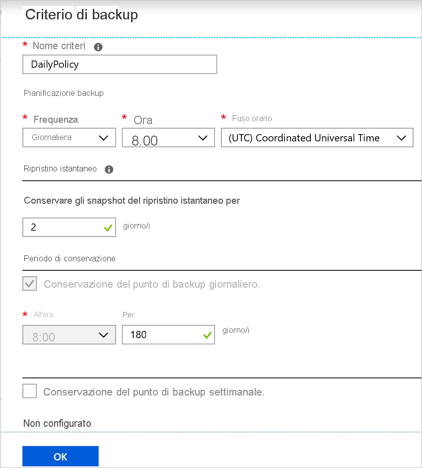
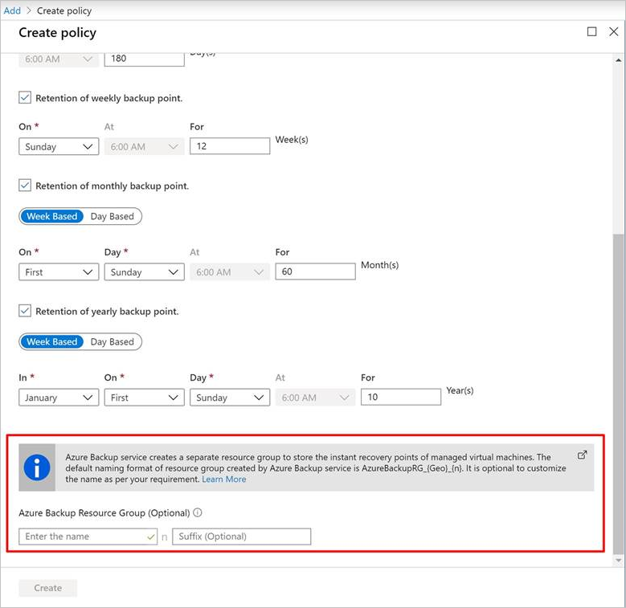

# Abilitare il backup quando si crea una macchina virtuale di Azure

Usare il servizio backup di Azure per eseguire il backup di macchine virtuali (VM) di Azure. Viene eseguito il backup delle macchine virtuali in base a una pianificazione specificata in un criterio di backup e i punti di ripristino vengono creati dai backup. I punti di ripristino vengono archiviati negli insiemi di credenziali dei servizi di ripristino.

Questo articolo illustra come abilitare il backup quando si crea una macchina virtuale (VM) nell'portale di Azure.  

## Prima di iniziare

- [Controllare](backup-support-matrix-iaas.md#supported-backup-actions) quali sistemi operativi sono supportati se si Abilita il backup quando si crea una macchina virtuale.

## Accedere ad Azure

Se non è già stato effettuato l'accesso al proprio account, accedere al [portale di Azure](https://portal.azure.com).

## Creare una VM con il backup configurato

1. Nella portale di Azure selezionare **Crea una risorsa**.

2. In Azure Marketplace selezionare **calcolo**, quindi selezionare un'immagine di macchina virtuale.

3. Configurare la VM in base alle istruzioni di [Windows](../virtual-machines/windows/quick-create-portal.md) o [Linux](../virtual-machines/linux/quick-create-portal.md) .

4. Nella scheda **gestione** , in **Abilita backup**, selezionare **on**.
5. Backup di backup di Azure in un insieme di credenziali di servizi di ripristino. Selezionare **Crea nuovo** se non si dispone di un insieme di credenziali esistente.
6. Accettare il nome dell'insieme di credenziali suggerito o specificarne di personalizzati.
7. Specificare o creare un gruppo di risorse in cui risiederà l'insieme di credenziali. L'insieme di credenziali del gruppo di risorse può essere diverso dal gruppo di risorse VM.

    

8. Accettare i criteri di backup predefiniti o modificare le impostazioni.
    - Un criterio di backup specifica la frequenza con cui eseguire snapshot di backup della macchina virtuale e il tempo di conservazione delle copie di backup.
    - Il criterio predefinito esegue il backup della macchina virtuale una volta al giorno.
    - È possibile personalizzare i criteri di backup per una macchina virtuale di Azure per eseguire backup giornalieri o settimanali.
    - [Altre](backup-azure-vms-introduction.md#backup-and-restore-considerations) informazioni sulle considerazioni relative al backup per le VM di Azure.
    - [Altre](backup-instant-restore-capability.md) informazioni sulla funzionalità di ripristino istantaneo.

      

>[!NOTE]
>[SSE e PMK sono i metodi di crittografia predefiniti per le](backup-encryption.md) macchine virtuali di Azure. Backup di Azure supporta il backup e il ripristino di queste macchine virtuali di Azure.

## Gruppo di risorse di backup di Azure per le macchine virtuali

Il servizio di backup crea un gruppo di risorse separato (RG), diverso dal gruppo di risorse della macchina virtuale in cui archiviare la raccolta di punti di ripristino (RPC). La RPC ospita i punti di ripristino istantaneo delle macchine virtuali gestite. Il formato di denominazione predefinito del gruppo di risorse creato dal servizio di backup è: `AzureBackupRG_<Geo>_<number>` . Ad esempio: *AzureBackupRG_northeurope_1*. È ora possibile personalizzare il nome del gruppo di risorse creato da backup di Azure.

Punti da notare:

1. È possibile usare il nome predefinito del RG oppure modificarlo in base ai requisiti aziendali.
2. Il modello di nome RG viene fornito come input durante la creazione dei criteri di backup della macchina virtuale. Il nome RG deve avere il formato seguente: `<alpha-numeric string>* n <alpha-numeric string>` . ' n'viene sostituito con un numero intero (a partire da 1) e viene usato per la scalabilità orizzontale se il primo RG è pieno. Un RG può avere un massimo di 600 RPC attualmente.
              
3. Il modello deve seguire le regole di denominazione RG riportate di seguito e la lunghezza totale non deve superare la lunghezza massima consentita per il nome RG.
    1. I nomi dei gruppi di risorse consentono solo caratteri alfanumerici, punti, caratteri di sottolineatura, trattini e parentesi. Non possono terminare con un punto.
    2. I nomi dei gruppi di risorse possono contenere fino a 74 caratteri, inclusi il nome del RG e il suffisso.
4. Il primo `<alpha-numeric-string>` è obbligatorio mentre la seconda dopo ' n'è facoltativa. Questo vale solo se si assegna un nome personalizzato. Se non si immette alcun elemento in nessuna delle caselle di testo, viene usato il nome predefinito.
5. È possibile modificare il nome del RG modificando il criterio se e quando richiesto. Se viene modificato il modello di nome, il nuovo RPs verrà creato nel nuovo RG. Tuttavia, il precedente RPs si troverà ancora nel vecchio RG e non verrà spostato, perché la raccolta RP non supporta lo spostamento delle risorse. Infine, il RPs verrà sottoposta a Garbage Collection quando i punti scadono.

6. Si consiglia di non bloccare il gruppo di risorse creato per l'uso da parte del servizio di backup.

Per configurare il gruppo di risorse di backup di Azure per le macchine virtuali con PowerShell, vedere Creazione di un [gruppo di risorse di backup di Azure durante la memorizzazione dello snapshot](backup-azure-vms-automation.md#creating-azure-backup-resource-group-during-snapshot-retention).

## Avviare un backup dopo la creazione della macchina virtuale

Il backup della macchina virtuale viene eseguito in base ai criteri di backup. Tuttavia, si consiglia di eseguire un backup iniziale.

Dopo aver creato la macchina virtuale, eseguire le operazioni seguenti:

1. Nelle proprietà della macchina virtuale selezionare **backup**. Lo stato della macchina virtuale è il backup iniziale in sospeso fino a quando non viene eseguito il backup iniziale.
2. Selezionare Esegui backup **ora** per eseguire un backup su richiesta.

    

## Usare un modello di Gestione risorse per distribuire una macchina virtuale protetta

I passaggi precedenti illustrano come usare la portale di Azure per creare una macchina virtuale e proteggerla in un insieme di credenziali di servizi di ripristino. Per distribuire rapidamente una o più macchine virtuali e proteggerle in un insieme di credenziali di servizi di ripristino, vedere il modello [distribuire una macchina virtuale Windows e abilitare il backup](https://azure.microsoft.com/resources/templates/101-recovery-services-create-vm-and-configure-backup/).

## Passaggi successivi

Ora che la macchina virtuale è stata protetta, informazioni su come gestirla e ripristinarla.

- [Gestire e monitorare le VM](backup-azure-manage-vms.md)
- [Ripristinare la macchina virtuale](backup-azure-arm-restore-vms.md)

Se si verificano problemi, [vedere](backup-azure-vms-troubleshoot.md) la guida alla risoluzione dei problemi.
