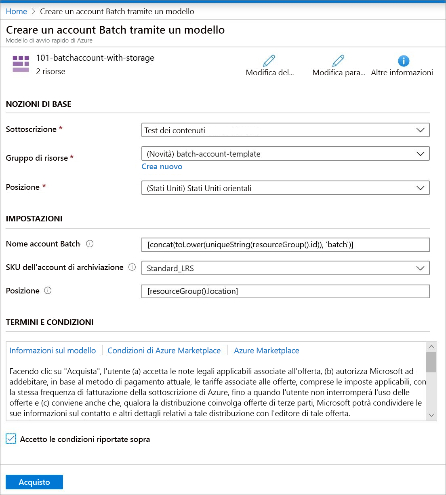

# Avvio rapido: Creare un account Batch con il modello di Resource Manager

È necessario un account Batch per creare risorse di calcolo (pool di nodi di calcolo) e processi Batch. È possibile collegare un account di Archiviazione di Azure con l’account Batch, utile per distribuire applicazioni e archiviare dati di input e output per la maggior parte dei carichi di lavoro concreti. Questo argomento di avvio rapido illustra come usare un modello di Azure Resource Manager (modello ARM) per creare un account Batch, inclusa l'archiviazione. Dopo aver completato questa guida introduttiva, saranno chiari i concetti fondamentali del servizio Batch e sarà possibile provare Batch con carichi di lavoro più realistici su scala più ampia.

[!INCLUDE [About Azure Resource Manager](../../includes/resource-manager-quickstart-introduction.md)]

Se l'ambiente soddisfa i prerequisiti e si ha familiarità con l'uso dei modelli di Resource Manager, selezionare il pulsante **Distribuisci in Azure**. Il modello verrà aperto nel portale di Azure.

## Prerequisiti

È necessario disporre di una sottoscrizione di Azure attiva.

- [!INCLUDE [quickstarts-free-trial-note](../../includes/quickstarts-free-trial-note.md)]

## Rivedere il modello

Il modello usato in questo avvio rapido proviene dai [modelli di avvio rapido di Azure](https://azure.microsoft.com/resources/templates/101-batchaccount-with-storage/).

:::code language="json" source="~/quickstart-templates/101-batchaccount-with-storage/azuredeploy.json":::

Nel modello sono definite due risorse di Azure:

- [Microsoft.Storage/storageAccounts](/azure/templates/microsoft.storage/storageaccounts): Crea un account di archiviazione.
- [Microsoft.Batch/batchAccounts](/azure/templates/microsoft.batch/batchaccounts): Creare un account Batch.

## Distribuire il modello

1. Selezionare l'immagine seguente per accedere ad Azure e aprire un modello. Il modello crea un account di Azure Batch e un account di archiviazione.

   

1. Selezionare o immettere i valori seguenti.

   

   - **Sottoscrizione**: selezionare una sottoscrizione di Azure.
   - **Gruppo di risorse**: selezionare **Crea nuovo**, immettere un nome univoco per il gruppo di risorse e quindi fare clic su **OK**.
   - **Località**: selezionare una località. Ad esempio **Stati Uniti centrali**.
   - **Nome account Batch**: Lasciare il valore predefinito.
   - **Account di archiviazione**: selezionare un tipo di account di archiviazione. Ad esempio, **Standard_LRS**.
   - **Località**: Lasciare l'impostazione predefinita in modo che le risorse si trovino nella stessa posizione del gruppo di risorse.
   - Accetto le condizioni riportate sopra: **Seleziona**.

1. Selezionare **Acquisto**.

Dopo alcuni minuto, verrà visualizzata una notifica che indica che l’account Batch è stato creato.

In questo esempio, il portale di Azure viene utilizzato per distribuire il modello. Oltre al portale di Azure, è anche possibile usare Azure PowerShell, l'interfaccia della riga di comando di Azure e l'API REST. Per informazioni sugli altri metodi di distribuzione, vedere [Distribuire modelli](../azure-resource-manager/templates/deploy-powershell.md).

## Convalidare la distribuzione

È possibile convalidare la distribuzione nel portale di Azure passando al gruppo di risorse creato. Nella schermata **Panoramica** verificare che siano presenti l'account Batch e l'account di archiviazione.

## Pulire le risorse

Se si prevede di usare le [esercitazioni](./tutorial-parallel-dotnet.md) successive, è consigliabile non cancellare le risorse create. In alternativa, se non sono più necessarie, è possibile [eliminare il gruppo di risorse](../azure-resource-manager/management/delete-resource-group.md?tabs=azure-portal#delete-resource-group), che eliminerà anche l'account Batch e l'account di archiviazione creato.

## Passaggi successivi

In questa guida di avvio rapido sono stati creati un account Batch e un account di archiviazione. Per altre informazioni su Azure Batch, passare alle esercitazioni di Azure Batch.

> [!div class="nextstepaction"]
> [Esercitazioni di Azure Batch](./tutorial-parallel-dotnet.md)
