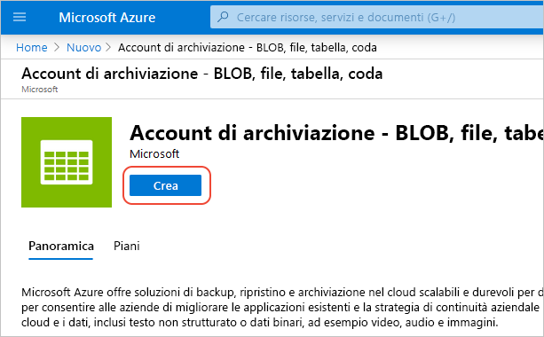
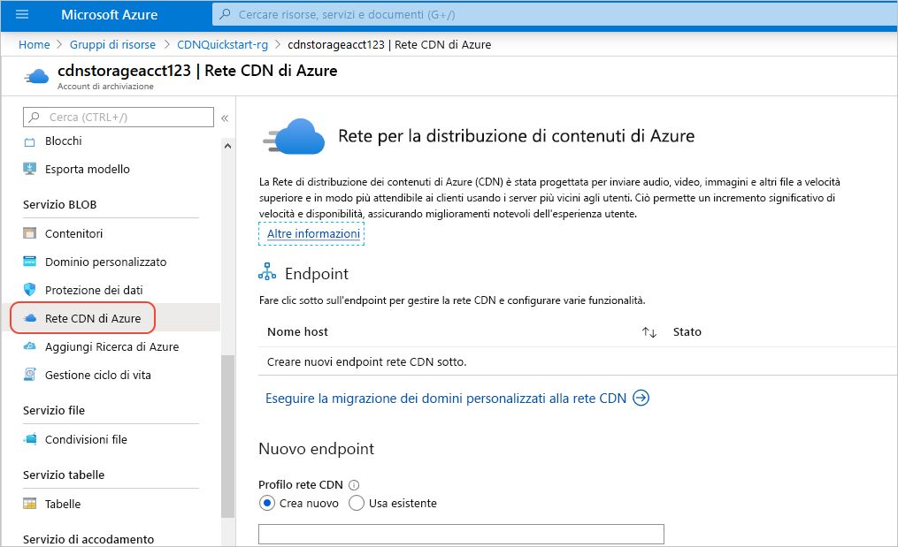

# Guida introduttiva: Integrare un account di archiviazione di Azure con la rete CDN di Azure

In questo argomento di avvio rapido si abilita la [rete per la distribuzione di contenuti (rete CDN) di Azure](cdn-overview.md) per memorizzare nella cache il contenuto di Archiviazione di Azure. La rete CDN di Azure offre agli sviluppatori una soluzione globale per distribuire contenuti con esigenze di larghezza di banda elevata. Consente di memorizzare nella cache oggetti BLOB e contenuti statici di istanze di calcolo in nodi fisici negli Stati Uniti, in Europa, Asia, Australia e America del Sud.

## Prerequisiti

- Un account Azure con una sottoscrizione attiva. [Creare un account gratuitamente](https://azure.microsoft.com/free/?ref=microsoft.com&utm_source=microsoft.com&utm_medium=docs&utm_campaign=visualstudio).

## Accedere al portale di Azure

Accedere al [portale di Azure](https://portal.azure.com) con il proprio account Azure.

## Creare un account di archiviazione

Un account di archiviazione consente di accedere ai servizi di archiviazione di Azure. L'account di archiviazione rappresenta il livello più elevato dello spazio dei nomi per l'accesso a ogni componente del servizio Archiviazione di Azure: BLOB di Azure, Coda di Azure e Archivio tabelle. Per altre informazioni, vedere [Introduzione ad Archiviazione di Microsoft Azure](../storage/common/storage-introduction.md).

Per creare un account di archiviazione, è necessario essere amministratori del servizio o coamministratori della sottoscrizione.

1. In alto a sinistra nel portale di Azure selezionare **Crea una risorsa**. Viene visualizzato il riquadro **Nuovo**.

1. Cercare **Account di archiviazione** e selezionare **Account di archiviazione - BLOB, file, tabella, coda** nell'elenco a discesa. quindi selezionare **Crea**:
    
    

1. Nel pannello **Crea account di archiviazione** immettere le informazioni seguenti:

    | Impostazione | valore | 
    | --- | --- |
    | Dettagli del progetto > Gruppo di risorse | Selezionare **Crea nuovo** e usare il nome *CDNQuickstart-rg*. È anche possibile usare un gruppo di risorse esistente, se si preferisce. |
    | Dettagli istanza > Nome dell'account di archiviazione | Immettere un nome per l'account composto da 3-24 caratteri costituiti solo da lettere e numeri. Il nome deve essere univoco in Azure e diventa il nome host all'interno dell'URL usato per fare riferimento a risorse BLOB, coda o tabella per la sottoscrizione. Per fare riferimento a una risorsa contenitore nell'archiviazione BLOB, usare un URI nel formato seguente: http:// *&lt;storageaccountname&gt;* .blob.core.windows.net/ *&lt;container-name&gt;* .
    | Dettagli istanza > Località | Selezionare un'area di Azure vicina nell'elenco a discesa. |
    
    Lasciare le impostazioni predefinite per tutte le altre informazioni, quindi selezionare **Rivedi e crea**.

1. Per completare la creazione dell'account di archiviazione possono essere necessari diversi minuti. Al termine della creazione, selezionare **Vai alla risorsa** per aprire la pagina dell'account di archiviazione per il passaggio successivo.

## Abilitare la rete CDN di Azure per l'account di archiviazione

1. Nella pagina dell'account di archiviazione scegliere **Servizio BLOB** > **Rete CDN di Azure** dal menu a sinistra. Verrà visualizzata la pagina **Rete CDN di Azure**.

    
    
1. Nella sezione **Nuovo endpoint** immettere le informazioni seguenti:

    | Impostazione  | valore |
    | -------- | ----- |
    | **Profilo CDN** | Selezionare **Crea nuovo** e immettere il nome del profilo, ad esempio *cdn-profile-123*. Un profilo è una raccolta di endpoint. |
    | **Piano tariffario** | Selezionare una delle opzioni **Standard**, ad esempio **Microsoft Standard**. |
    | **Nome endpoint rete CDN** | Immettere il nome host dell'endpoint, ad esempio *cdn-endpoint-123*. Questo nome deve essere univoco a livello globale in Azure perché consente di accedere alle risorse memorizzate nella cache all'URL _&lt;endpoint-name&gt;_ .azureedge.net. |
    | **Nome host dell'origine** | Per impostazione predefinita, un nuovo endpoint della rete CDN usa il nome host dell'account di archiviazione come server di origine. |

1. Selezionare **Create** (Crea). Dopo la creazione, l'endpoint verrà visualizzato nell'elenco di endpoint.

    

> [!TIP]
> Se si vogliono specificare impostazioni di configurazione avanzate per l'endpoint della rete CDN, come ad esempio l'[ottimizzazione del download di un file di grandi dimensioni](cdn-optimization-overview.md#large-file-download), è invece possibile usare l'[estensione Rete CDN di Azure](cdn-create-new-endpoint.md) per creare un profilo e un endpoint di rete CDN.

## Abilitare funzionalità aggiuntive della rete CDN

Dalla pagina **Rete CDN di Azure** dell'account di archiviazione selezionare l'endpoint della rete CDN nell'elenco per aprire la pagina di configurazione della rete CDN.

Da questa pagina è possibile abilitare funzionalità aggiuntive della rete CDN per il recapito, ad esempio la [compressione](cdn-improve-performance.md), la [memorizzazione nella cache della stringa di query](cdn-query-string.md) e il [filtro geografico](cdn-restrict-access-by-country.md). 
    
## Abilitare SAS

Se si vuole concedere l'accesso limitato ai contenitori di archiviazione privati, è possibile usare la funzionalità di firma di accesso condiviso dell'account di archiviazione di Azure. Una firma di accesso condiviso è un URI che concede diritti di accesso limitati alle risorse di Archiviazione di Azure senza esporre la chiave dell'account. Per altre informazioni, vedere [Uso della rete CDN di Azure con SAS](cdn-sas-storage-support.md).

## Accedere al contenuto della rete CDN

Per accedere al contenuto memorizzato nella cache nella rete CDN, usare l'URL della rete CDN specificato nel portale. L'indirizzo per un oggetto BLOB memorizzato nella cache ha il formato seguente:

http://<*endpoint-name*\>.azureedge.net/<*myPublicContainer*\>/<*BlobName*\>

> [!NOTE]
> Dopo l'abilitazione dell'accesso della rete CDN di Azure a un account di archiviazione, tutti gli oggetti disponibili pubblicamente saranno idonei per la memorizzazione nella cache POP della rete CDN. Se si modifica un oggetto attualmente memorizzato nella cache nella rete CDN, il nuovo contenuto sarà disponibile tramite la rete CDN di Azure solo dopo l'aggiornamento dei contenuti della rete CDN di Azure alla scadenza della durata specificata per i contenuti memorizzati nella cache.

## Rimuovere contenuti dalla rete CDN di Azure

Se non si vuole più memorizzare un oggetto nella cache della rete CDN di Azure, è possibile eseguire una delle operazioni seguenti:

- Rendere privato il contenitore, invece di pubblico. Per altre informazioni, vedere [Gestire l'accesso in lettura anonimo a contenitori e BLOB](../storage/blobs/anonymous-read-access-configure.md).
- Disabilitare o eliminare l'endpoint della rete CDN usando il portale di Azure.
- Modificare il servizio ospitato, in modo che non risponda più a richieste per l'oggetto.

Un oggetto già memorizzato nella cache della rete CDN di Azure rimane nella cache fino alla scadenza della durata prevista per l'oggetto o fino a quando l'endpoint non viene [ripulito](cdn-purge-endpoint.md). Al termine della durata prevista, la rete CDN di Azure determina se l'endpoint della rete CDN è ancora valido e se l'oggetto è ancora accessibile in modo anonimo. In caso contrario, l'oggetto non sarà più memorizzato nella cache.

## Pulire le risorse

Nei passaggi precedenti sono stati creati un profilo e un endpoint della rete CDN in un gruppo di risorse. Salvare queste risorse se si vuole continuare con i [passaggi successivi](#next-steps) e ottenere informazioni su come aggiungere un dominio personalizzato all'endpoint. Se tuttavia non si prevede di usare queste risorse in futuro, è possibile eliminarle eliminando il gruppo di risorse, evitando così costi aggiuntivi:

1. Dal menu a sinistra del portale di Azure scegliere **Gruppi di risorse** e quindi selezionare *CDNQuickstart-rg*\*.

2. Nella pagina **Gruppo di risorse** selezionare **Elimina gruppo di risorse**, immettere *CDNQuickstart-rg* nella casella di testo e quindi selezionare **Elimina**.

    Con questa azione si elimineranno il gruppo di risorse, il profilo e l'endpoint creati in questa guida introduttiva.

3. Per eliminare l'account di archiviazione, selezionarlo dal dashboard, e quindi scegliere **Elimina** dal menu in alto.

## Passaggi successivi

> [!div class="nextstepaction"]
> [Creare un profilo e un endpoint della rete CDN di Azure](cdn-create-new-endpoint.md)

> [!div class="nextstepaction"]
> [Esercitazione: Usare la rete CDN per il contenuto statico del server da un'app Web](cdn-add-to-web-app.md)