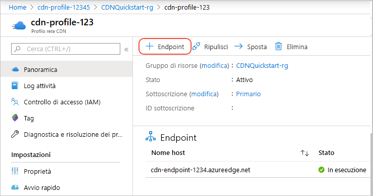
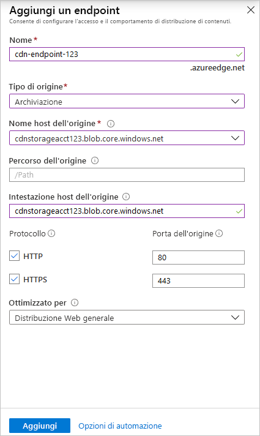

# Guida introduttiva: Creare un profilo e un endpoint della rete CDN di Azure

In questa guida introduttiva si abilita la rete per la distribuzione di contenuti (rete CDN) di Azure creando un nuovo profilo della rete CDN, ovvero una raccolta di uno o più endpoint CDN. Dopo aver creato un profilo e un endpoint, è possibile avviare la distribuzione di contenuti ai clienti.

## Prerequisiti

- Un account Azure con una sottoscrizione attiva. [Creare un account gratuitamente](https://azure.microsoft.com/free/?ref=microsoft.com&utm_source=microsoft.com&utm_medium=docs&utm_campaign=visualstudio).
- Un account di archiviazione di Azure denominato *cdnstorageacct123*, che viene usato per il nome host di origine. Per completare questo requisito, vedere [Integrare un account di archiviazione di Azure con la rete CDN di Azure](cdn-create-a-storage-account-with-cdn.md).

## Accedere al portale di Azure

Accedere al [portale di Azure](https://portal.azure.com) con il proprio account Azure.

[!INCLUDE [cdn-create-profile](../../includes/cdn-create-profile.md)]

## Creare un nuovo endpoint della rete CDN

Dopo aver creato un profilo di rete CDN, è possibile usarlo per creare un endpoint.

1. Nel portale di Azure selezionare nel dashboard il profilo di rete CDN creato. Se non si riesce a trovarlo, è possibile aprire il gruppo di risorse in cui è stato creato oppure usare la barra di ricerca nella parte superiore del portale, immettere il nome del profilo e selezionarlo nei risultati.
   
1. Nella pagina del profilo della rete CDN selezionare **+ Endpoint**.
   
    
   
    Verrà visualizzato il riquadro **Aggiungi un endpoint**.

3. Immettere i valori di impostazione seguenti:

    | Impostazione | valore |
    | ------- | ----- |
    | **Nome** | Immettere *cdn-endpoint-123* come nome host dell'endpoint. Il nome deve essere univoco a livello globale in Azure. Se è già in uso, immettere un nome diverso. Questo nome viene usato per accedere alle risorse memorizzate nella cache nel dominio _&lt;nome endpoint&gt;_ .azureedge.net.|
    | **Tipo di origine** | Selezionare **Archiviazione**. | 
    | **Nome host dell'origine** | Selezionare il nome host dell'account di archiviazione di Azure in uso nell'elenco a discesa, ad esempio *cdnstorageacct123.blob.core.windows.net*. |
    | **Percorso dell'origine** | Lasciare vuoto. |
    | **Intestazione host dell'origine** | Lasciare il valore predefinito, ovvero il nome host per l'account di archiviazione. |  
    | **Protocollo** | Lasciare selezionate le opzioni **HTTP** e **HTTPS** predefinite. |
    | **Porta dell'origine** | Lasciare i valori di porta predefiniti. | 
    | **Ottimizzato per** | Lasciare la selezione predefinita, ovvero **Distribuzione Web generale**. |

    

3. Selezionare **Aggiungi** per creare il nuovo endpoint. Dopo la creazione, l'endpoint verrà visualizzato nell'elenco di endpoint per il profilo.
    
   
    
   Il tempo necessario per la propagazione dell'endpoint dipende dal piano tariffario selezionato al momento della creazione del profilo. **Akamai standard** in genere viene completato entro un minuto **Microsoft Standard** in 10 minuti e **Verizon standard** e **Verizon premium** in un massimo di 90 minuti.

## Pulire le risorse

Nei passaggi precedenti sono stati creati un profilo e un endpoint della rete CDN in un gruppo di risorse. Salvare queste risorse se si vuole continuare con i [passaggi successivi](#next-steps) e ottenere informazioni su come aggiungere un dominio personalizzato all'endpoint. Se tuttavia non si prevede di usare queste risorse in futuro, è possibile eliminarle eliminando il gruppo di risorse, evitando così costi aggiuntivi:

1. Dal menu a sinistra del portale di Azure scegliere **Gruppi di risorse** e quindi selezionare **CDNQuickstart-rg**.

2. Nella pagina **Gruppo di risorse** selezionare **Elimina gruppo di risorse**, immettere *CDNQuickstart-rg* nella casella di testo e quindi selezionare **Elimina**. Con questa azione si elimineranno il gruppo di risorse, il profilo e l'endpoint creati in questo argomento di avvio rapido.

## Passaggi successivi

> [!div class="nextstepaction"]
> [Esercitazione: Usare la rete CDN per il contenuto statico del server da un'app Web](cdn-add-to-web-app.md)

> [!div class="nextstepaction"]
> [Esercitazione: Aggiungere un dominio personalizzato all'endpoint della rete CDN di Azure](cdn-map-content-to-custom-domain.md)
