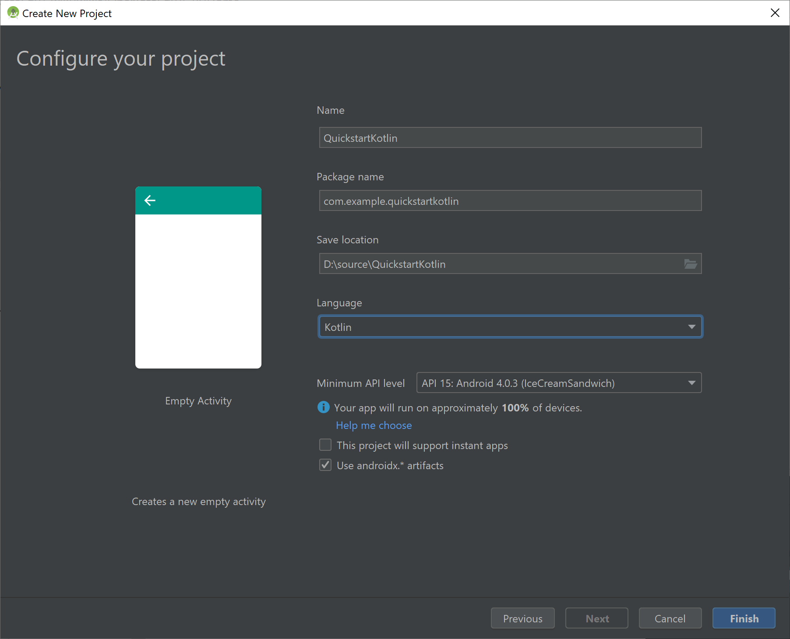
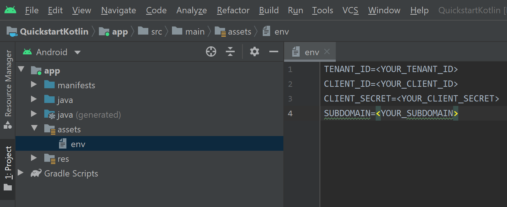
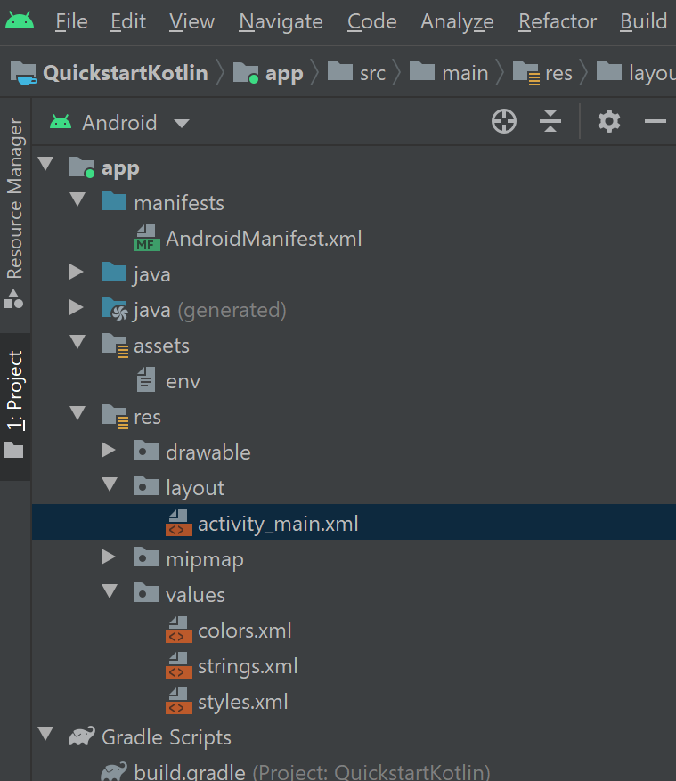
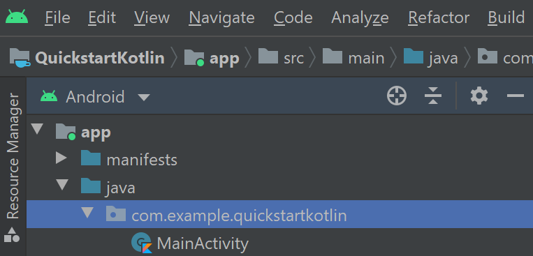
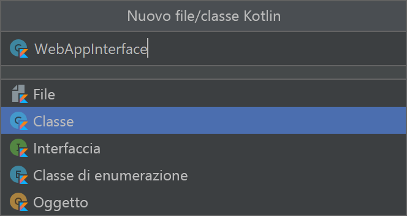
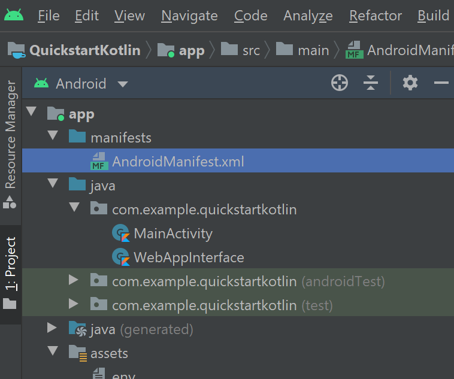
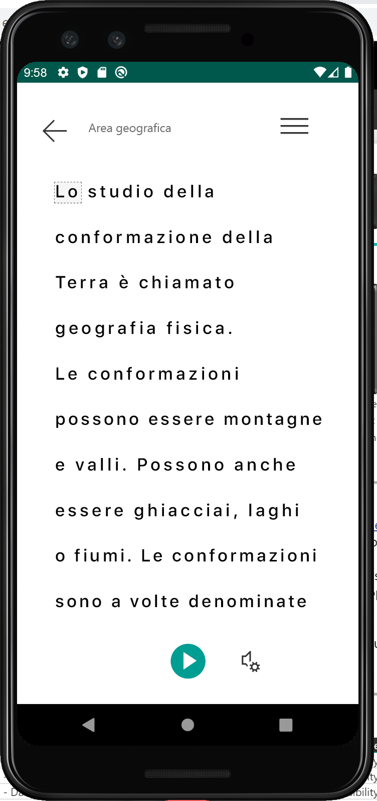

Lo [strumento di lettura immersiva](https://www.onenote.com/learningtools) è uno strumento incluso che implementa tecniche comprovate per migliorare la comprensione della lettura.

In questo argomento di avvio rapido si creerà da zero un'app Android che si integrerà con lo strumento di lettura immersiva. Un esempio pratico completo di questo argomento di avvio rapido è disponibile [in GitHub](https://github.com/microsoft/immersive-reader-sdk/tree/master/js/samples/quickstart-kotlin).

Se non si ha una sottoscrizione di Azure, creare un [account gratuito](https://azure.microsoft.com/free/?WT.mc_id=A261C142F) prima di iniziare.

## <a name="prerequisites"></a>Prerequisiti

* Una risorsa dello strumento di lettura immersiva configurata per l'autenticazione Azure Active Directory. Seguire [queste istruzioni](../../how-to-create-immersive-reader.md) per configurare l'ambiente. Quando si configurano le proprietà dell'ambiente, sarà necessario usare alcuni valori creati qui. Salvare l'output della sessione in un file di testo per riferimento futuro.
* [Git](https://git-scm.com/).
* [Immersive Reader SDK](https://github.com/microsoft/immersive-reader-sdk).
* [Android Studio](https://developer.android.com/studio).

## <a name="create-an-android-project"></a>Creare un progetto Android

Avviare un nuovo progetto in Android Studio. Il codice sorgente di questo esempio è disponibile nell'[Immersive Reader SDK](https://github.com/microsoft/immersive-reader-sdk/tree/master/js/samples/quickstart-kotlin).


Nella finestra **Choose your project** (Scegliere il progetto) selezionare **Empty Activity** (Attività vuota) e quindi **Next** (Avanti).


## <a name="configure-the-project"></a>Configurare il progetto

Denominare il progetto **QuickstartKotlin** e selezionare un percorso per salvarlo. Selezionare **Kotlin** come linguaggio di programmazione e quindi selezionare **Fine**.



## <a name="set-up-assets-and-authentication"></a>Configurare gli asset e l'autenticazione

Creare una nuova cartella **/assets**.


 Creare un file denominato **env** all'interno della cartella assets. Aggiungere i nomi e i valori seguenti e specificare i valori appropriati. Non eseguire il commit di questo file env nel controllo del codice sorgente, perché contiene segreti che non devono essere resi pubblici.


```text
TENANT_ID=<YOUR_TENANT_ID>
CLIENT_ID=<YOUR_CLIENT_ID>
CLIENT_SECRET=<YOUR_CLIENT_SECRET>
SUBDOMAIN=<YOUR_SUBDOMAIN>
```


## <a name="add-dependencies"></a>Aggiungere le dipendenze

Sostituire le dipendenze esistenti nel file **build.gradle** con le implementazioni seguenti per abilitare le coroutine (programmazione asincrona), gson (analisi e serializzazione JSON) e dotenv per fare riferimento alle variabili definite nel file env. Potrebbe essere necessario sincronizzare nuovamente il progetto quando si implementerà MainActivity.kt in un passaggio successivo di questo avvio rapido.

```build.gradle
dependencies {
    implementation fileTree(dir: 'libs', include: ['*.jar'])
    implementation"org.jetbrains.kotlin:kotlin-stdlib-jdk7:$kotlin_version"
    implementation 'androidx.appcompat:appcompat:1.0.2'
    implementation 'androidx.core:core-ktx:1.0.2'
    implementation 'androidx.constraintlayout:constraintlayout:1.1.3'
    implementation "org.jetbrains.kotlinx:kotlinx-coroutines-core:1.1.1"
    implementation "org.jetbrains.kotlinx:kotlinx-coroutines-android:1.1.1"
    implementation 'com.google.code.gson:gson:2.8.6'
    implementation 'io.github.cdimascio:java-dotenv:5.1.3'
    testImplementation 'junit:junit:4.12'
    androidTestImplementation 'androidx.test.ext:junit:1.1.0'
    androidTestImplementation 'androidx.test.espresso:espresso-core:3.1.1'
}
```


## <a name="update-app-strings-and-layout-resources"></a>Aggiornare le stringhe dell'app e le risorse di layout

Sostituire il contenuto di **res/strings/strings.xml** con le stringhe seguenti da usare nell'app.


```strings.xml
<resources>

    <!-- Copyright (c) Microsoft Corporation. All rights reserved. -->
    <!-- Licensed under the MIT License. -->

    <string name="app_name">ImmersiveReaderSDK</string>
    <string name="geographyTitle">Geography</string>
    <string name="geographyTextEn">The study of Earth’s landforms is called physical geography. Landforms can be mountains and valleys. They can also be glaciers, lakes or rivers. Landforms are sometimes called physical features. It is important for students to know about the physical geography of Earth. The seasons, the atmosphere and all the natural processes of Earth affect where people are able to live. Geography is one of a combination of factors that people use to decide where they want to live.The physical features of a region are often rich in resources. Within a nation, mountain ranges become natural borders for settlement areas. In the U.S., major mountain ranges are the Sierra Nevada, the Rocky Mountains, and the Appalachians.Fresh water sources also influence where people settle. People need water to drink. They also need it for washing. Throughout history, people have settled near fresh water. Living near a water source helps ensure that people have the water they need. There was an added bonus, too. Water could be used as a travel route for people and goods. Many Americans live near popular water sources, such as the Mississippi River, the Colorado River and the Great Lakes.Mountains and deserts have been settled by fewer people than the plains areas. However, they have valuable resources of their own.</string>
    <string name="geographyTextFr">L\'étude des reliefs de la Terre est appelée géographie physique. Les reliefs peuvent être des montagnes et des vallées. Il peut aussi s\'agira de glaciers, delacs ou de rivières. Les reliefs sont parfois appelés caractéristiques physiques. Il est important que les élèves connaissent la géographie physique de laTerre. Les saisons, l\'atmosphère et tous les processus naturels de la Terre affectent l\'endroit où les gens sont capables de vivre. La géographie est l\'un desfacteurs que les gens utilisent pour décider où ils veulent vivre. Les caractéristiques physiques d\'une région sont souvent riches en ressources. Àl\'intérieur d\'une nation, les chaînes de montagnes deviennent des frontières naturelles pour les zones de peuplement. Aux États-Unis, les principaleschaînes de montagnes sont la Sierra Nevada, les montagnes Rocheuses et les Appalaches.Les sources d\'eau douce influencent également l\'endroit où lesgens s\'installent. Les gens ont besoin d\'eau pour boire. Ils en ont aussi besoin pour se laver. Tout au long de l\'histoire, les gens se sont installés près del\'eau douce. Vivre près d\'une source d\'eau permet de s\'assurer que les gens ont l\'eau dont ils ont besoin. Il y avait un bonus supplémentaire, aussi. L\'eaupourrait être utilisée comme voie de voyage pour les personnes et les marchandises. Beaucoup d\'Américains vivent près des sources d\'eau populaires,telles que le fleuve Mississippi, le fleuve Colorado et les Grands Lacs.Mountains et les déserts ont été installés par moins de gens que les zones desplaines. Cependant, ils disposent de ressources précieuses.Les gens ont une réponse.</string>
    <string name="immersiveReaderButtonText">Immersive Reader</string>
</resources>
```

Sostituire il contenuto di **res/layout/activity_main.xml** con il codice XML seguente da usare nell'app. Questo codice XML è il layout dell'interfaccia utente dell'app.



```activity_main.xml
<?xml version="1.0" encoding="utf-8"?>

<!-- Copyright (c) Microsoft Corporation. All rights reserved. -->
<!-- Licensed under the MIT License. -->

<androidx.constraintlayout.widget.ConstraintLayout xmlns:android="http://schemas.android.com/apk/res/android"
    xmlns:app="http://schemas.android.com/apk/res-auto"
    xmlns:tools="http://schemas.android.com/tools"
    android:layout_width="match_parent"
    android:layout_height="match_parent"
    android:background="#FFFFFF"
    tools:context=".MainActivity">

    <LinearLayout
        android:id="@+id/linearLayout"
        android:layout_width="match_parent"
        android:layout_height="0dp"
        android:background="#FFFFFF"
        android:orientation="vertical"
        app:layout_constraintBottom_toBottomOf="parent"
        app:layout_constraintEnd_toEndOf="parent"
        app:layout_constraintHorizontal_bias="0.0"
        app:layout_constraintStart_toStartOf="parent"
        app:layout_constraintTop_toTopOf="parent"
        app:layout_constraintVertical_bias="0.0">

        <TextView
            android:id="@+id/Title"
            android:layout_width="match_parent"
            android:layout_height="wrap_content"
            android:layout_marginLeft="48dp"
            android:layout_marginTop="24dp"
            android:layout_marginRight="48dp"
            android:layout_marginBottom="24dp"
            android:text="@string/geographyTitle"
            android:textSize="24sp"
            android:textStyle="bold" />

        <ScrollView
            android:id="@+id/ContentPane"
            android:layout_width="match_parent"
            android:layout_height="480dp"
            android:layout_marginBottom="48dp"
            android:clipToPadding="false"
            android:fillViewport="false"
            android:paddingLeft="48dp"
            android:paddingRight="48dp"
            android:scrollbarStyle="outsideInset"
            android:visibility="visible"
            tools:visibility="visible">

            <LinearLayout
                android:layout_width="match_parent"
                android:layout_height="match_parent"
                android:orientation="vertical">

                <TextView
                    android:id="@+id/Content1"
                    android:layout_width="match_parent"
                    android:layout_height="wrap_content"
                    android:background="#00FFFFFF"
                    android:text="@string/geographyTextEn"
                    android:textSize="18sp" />

                <TextView
                    android:id="@+id/Content2"
                    android:layout_width="match_parent"
                    android:layout_height="wrap_content"
                    android:background="#00FFFFFF"
                    android:text="@string/geographyTextFr"
                    android:textSize="18sp" />

            </LinearLayout>

        </ScrollView>

        <Button
            android:id="@+id/LaunchImmersiveReaderButton"
            android:layout_width="match_parent"
            android:layout_height="60dp"
            android:layout_marginLeft="40dp"
            android:layout_marginRight="40dp"
            android:layout_marginBottom="80dp"
            android:text="@string/immersiveReaderButtonText"
            android:textAllCaps="false"
            android:textSize="24sp"
            android:visibility="visible"
            tools:visibility="visible" />

    </LinearLayout>

</androidx.constraintlayout.widget.ConstraintLayout>
```

## <a name="set-up-the-app-kotlin-code-javascript-interface"></a>Configurare l'interfaccia JavaScript del codice dell'app Kotlin

Nella cartella **/Java/com.example.quickstartkotlin** creare una nuova classe Kotlin e assegnarle il nome **WebAppInterface**. Aggiungerle quindi il codice seguente. Questo codice consente all'app di interfacciarsi con le funzioni JavaScript in HTML che verranno aggiunte in un passaggio successivo.





```WebAppInterface.kt
// Copyright (c) Microsoft Corporation. All rights reserved.
// Licensed under the MIT License.

package com.example.quickstartkotlin

import android.content.Context
import android.webkit.JavascriptInterface
import android.webkit.WebView
import android.widget.LinearLayout
import android.widget.Toast

class WebAppInterface(private val mContext: Context, var parentLayout: LinearLayout, var webView: WebView) {

    // Show a toast from html.
    @JavascriptInterface
    fun showToast(toast: String) {
        Toast.makeText(mContext, toast, Toast.LENGTH_SHORT).show()
    }

    // Exit the Immersive Reader.
    @JavascriptInterface
    fun immersiveReaderExit() {
        webView.post(Runnable { destroyWebView(parentLayout, webView) })

        // Any additional functionality may be added here.
        Toast.makeText(mContext, "The Immersive Reader has been closed!", Toast.LENGTH_SHORT).show()
    }

    // Disposes of the WebView when the back arrow is tapped.
    private fun destroyWebView(parentLayout: LinearLayout, webView: WebView) {

        // Removes the WebView from its parent view before doing anything.
        parentLayout.removeView(webView)

        // Cleans things up before destroying the WebView.
        webView.clearHistory()
        webView.clearCache(true)
        webView.loadUrl("about:blank")
        webView.onPause()
        webView.removeAllViews()
        webView.pauseTimers()
        webView.destroy()
    }
}
```

## <a name="set-up-the-app-kotlin-code-main-activity"></a>Configurare l'attività principale del codice dell'app Kotlin

Nella cartella **/Java/com.example.quickstartkotlin** è presente un file di classe Kotlin **MainActivity.kt**. È in questo file che viene creata la logica dell'app. Sostituire il contenuto con il codice seguente:

```MainActivity.kt
// Copyright (c) Microsoft Corporation. All rights reserved.
// Licensed under the MIT License.

package com.example.quickstartkotlin

import android.app.Activity
import androidx.appcompat.app.AppCompatActivity
import android.os.Bundle
import android.webkit.CookieManager
import android.webkit.WebView
import android.widget.Button
import android.webkit.WebViewClient
import android.widget.LinearLayout
import android.widget.TextView
import com.google.gson.*
import io.github.cdimascio.dotenv.dotenv
import java.io.IOException
import java.io.*
import java.net.HttpURLConnection
import java.net.HttpURLConnection.HTTP_OK
import java.net.URL
import kotlinx.coroutines.*
import org.json.JSONObject
import java.util.*

// This sample app uses the Dotenv. It's a module that loads environment variables from a .env file to better manage secrets.
// https://github.com/cdimascio/java-dotenv
// Be sure to add a "env" file to the /assets folder.
// Instead of '.env', use 'env'.

class MainActivity : AppCompatActivity() {
    private val dotEnv = dotenv {
        directory = "/assets"
        filename = "env"
        ignoreIfMalformed = true
        ignoreIfMissing = true
    }

    private lateinit var contextualWebView: WebView

    override fun onCreate(savedInstanceState: Bundle?) {
        super.onCreate(savedInstanceState)
        this.supportActionBar!!.hide()
        setContentView(R.layout.activity_main)
        val immersiveReaderButton = findViewById<Button>(R.id.LaunchImmersiveReaderButton)
        immersiveReaderButton.setOnClickListener { GlobalScope.launch { handleLoadImmersiveReaderWebView() } }
    }

    // Assigns values to the objects sent to the Immersive Reader SDK,
    // acquires the token and authorizes the app, then launches
    // the Web View to get the response and load the Immersive Reader
    // when the button is clicked in HTML.
    private suspend fun handleLoadImmersiveReaderWebView() {
        val exampleActivity = this
        val subdomain = dotEnv["SUBDOMAIN"]
        val irTitle = findViewById<TextView>(R.id.Title)
        val irText1 = findViewById<TextView>(R.id.Content1)
        val irText2 = findViewById<TextView>(R.id.Content2)

        // The content of the request that's shown in the Immersive Reader.
        // This basic example contains chunks of two different languages.
        val chunk1 = Chunk()
        chunk1.content = irText1.text.toString()
        chunk1.lang = "en"
        chunk1.mimeType = "text/plain"

        val chunk2 = Chunk()
        chunk2.content = irText2.text.toString()
        chunk2.lang = "fr"
        chunk2.mimeType = "text/plain"

        val chunks = ArrayList<Chunk>()
        chunks.add(chunk1)
        chunks.add(chunk2)

        val content = Content()
        content.title = irTitle.text.toString()
        content.chunks = chunks

        // Options may be assigned values here (e.g. options.uiLang = "en").
        val options = Options()

        var token: String

        runBlocking{
            val resp = async { getImmersiveReaderTokenAsync() }
            token = resp.await()
            val jsonResp = JSONObject(token)
            loadImmersiveReaderWebView(exampleActivity, jsonResp.getString("access_token"), subdomain, content, options)
        }
    }

    // The next two functions get the token from the Immersive Reader SDK
    // and authorize the app.
    private suspend fun getImmersiveReaderTokenAsync(): String {
        return getToken()
    }

    @Throws(IOException::class)
    fun getToken(): String {
        val clientId = dotEnv["CLIENT_ID"]
        val clientSecret = dotEnv["CLIENT_SECRET"]
        val tenantId = dotEnv["TENANT_ID"]
        val tokenUrl = URL("https://login.windows.net/$tenantId/oauth2/token")
        val form = "grant_type=client_credentials&resource=https://cognitiveservices.azure.com/&client_id=$clientId&client_secret=$clientSecret"

        val connection = tokenUrl.openConnection() as HttpURLConnection
        connection.requestMethod = "POST"
        connection.setRequestProperty("content-type", "application/x-www-form-urlencoded")
        connection.doOutput = true

        val writer = DataOutputStream(connection.outputStream)
        writer.writeBytes(form)
        writer.flush()
        writer.close()

        val responseCode = connection.responseCode

        if (responseCode == HTTP_OK) {
            val readerIn = BufferedReader(InputStreamReader(connection.inputStream))
            var inputLine = readerIn.readLine()
            val response = StringBuffer()

            do {
                response.append(inputLine)
            } while (inputLine.length < 0)
            readerIn.close()

            // Return token
            return response.toString()
        } else {
            val responseError = Error(code = "BadRequest", message = "There was an error getting the token.")
            throw IOException(responseError.toString())
        }
    }

    // To be assigned values and sent to the Immersive Reader SDK
    class Chunk(var content: String? = null,
                var lang: String? = null,
                var mimeType: String? = null)

    class Content(var title: String? = null,
                  var chunks: List<Chunk>? = null)

    class Message(var cogSvcsAccessToken: String? = null,
                  var cogSvcsSubdomain: String? = null,
                  var content: Content? = null,
                  var launchToPostMessageSentDurationInMs: Int? = null,
                  var options: Options? = null)

    // Only includes Immersive Reader options relevant to Android apps.
    // For a complete list, visit https://docs.microsoft.com/azure/cognitive-services/immersive-reader/reference
    class Options(var uiLang: String? = null, // Language of the UI, e.g. en, es-ES (optional). Defaults to browser language if not specified.
                  var timeout: Int? = null, // Duration (in milliseconds) before launchAsync fails with a timeout error (default is 15000 ms).
                  var uiZIndex: Int? = null, // Z-index of the iframe that will be created (default is 1000)
                  var onExit: (() -> Any)? = null, // Executes a callback function when the Immersive Reader exits
                  var customDomain: String? = null, // Reserved for internal use. Custom domain where the Immersive Reader webapp is hosted (default is null).
                  var allowFullscreen: Boolean? = null, // The ability to toggle fullscreen (default is true).
                  var hideExitButton: Boolean? = null // Whether or not to hide the Immersive Reader's exit button arrow (default is false). This should only be true if there is an alternative mechanism provided to exit the Immersive Reader (e.g a mobile toolbar's back arrow).
    )

    class Error(var code: String? = null,
                var message: String? = null)

    // A custom Web View component that launches inside the app
    @Throws(IOException::class)
    fun loadImmersiveReaderWebView(
        exampleActivity: Activity,
        token: String,
        subdomain: String?,
        content: Content,
        options: Options
    ) {
        val startPostMessageSentDurationInMs = Date()

        // Populate the message
        val messageData = Message()
        messageData.cogSvcsAccessToken = token
        messageData.cogSvcsSubdomain = subdomain
        messageData.content = content
        messageData.options = options

        GlobalScope.launch {
            withContext(Dispatchers.Main) {
                contextualWebView = WebView(exampleActivity)
                val parentLayout = findViewById<LinearLayout>(R.id.linearLayout)
                val contextualWebViewSettings = contextualWebView.settings

                contextualWebViewSettings.allowContentAccess = true
                contextualWebViewSettings.builtInZoomControls = true
                contextualWebViewSettings.javaScriptEnabled = true
                contextualWebViewSettings.loadsImagesAutomatically = true
                contextualWebViewSettings.loadWithOverviewMode = true
                contextualWebViewSettings.useWideViewPort = true
                contextualWebViewSettings.userAgentString = "Android"
                contextualWebViewSettings.domStorageEnabled = true

                contextualWebViewSettings.setAppCacheEnabled(false)
                contextualWebViewSettings.setSupportZoom(true)
                contextualWebView.setInitialScale(1)

                // Enables WebView Cookies
                if (android.os.Build.VERSION.SDK_INT >= android.os.Build.VERSION_CODES.LOLLIPOP) {
                    CookieManager.getInstance().setAcceptThirdPartyCookies(contextualWebView, true)
                } else {
                    CookieManager.getInstance().setAcceptCookie(true)
                }

                val contextualWebViewLayout = LinearLayout.LayoutParams(LinearLayout.LayoutParams.MATCH_PARENT, LinearLayout.LayoutParams.MATCH_PARENT)
                parentLayout.addView(contextualWebView, 0, contextualWebViewLayout)

                // This is required to launch the WebView *inside* the host application.
                contextualWebView.webViewClient = object : WebViewClient() {
                    override fun shouldOverrideUrlLoading(view: WebView, url: String): Boolean {
                        view.loadUrl(url)
                        return true
                    }

                    // Send message JSON object to Immersive Reader html
                    override fun onPageFinished(view: WebView, url: String) {
                        val endPostMessageSentDurationInMs = Date()
                        val postMessageSentDurationInMs = (endPostMessageSentDurationInMs.time - startPostMessageSentDurationInMs.time).toInt()

                        // Updates launchToPostMessageSentDurationInMs
                        messageData.launchToPostMessageSentDurationInMs = postMessageSentDurationInMs

                        // Serializes message data class to JSON
                        val gson = Gson()
                        val message = gson.toJson(messageData)

                        // Calls the handleLaunchImmersiveReader function in HTML
                        if (android.os.Build.VERSION.SDK_INT >= android.os.Build.VERSION_CODES.KITKAT) {
                            view.evaluateJavascript("handleLaunchImmersiveReader($message)", null)
                        } else {
                            view.loadUrl("javascript:handleLaunchImmersiveReader($message)")
                        }

                        // Sets the visibility of the WebView after the function has been called.
                        view.visibility = WebView.VISIBLE
                    }
                }

                // This is where the WebAppInterface Class is used.
                // Affords a way for JavaScript to work with the app directly from
                // the Web View's HTML.
                val jsInterface = WebAppInterface(exampleActivity, parentLayout, contextualWebView)
                contextualWebView.addJavascriptInterface(jsInterface, "Android")
                contextualWebView.loadUrl("file:///android_asset/immersiveReader.html")
            }
        }
    }
}
```

## <a name="add-the-app-html-to-the-web-view"></a>Aggiungere il codice HTML dell'app alla visualizzazione Web

L'implementazione della visualizzazione Web ha bisogno del codice HTML per funzionare. Fare clic con il pulsante destro del mouse sulla cartella **/assets**, creare un nuovo file e assegnargli il nome **immersiveReader.html**.


Aggiungere il codice HTML e JavaScript seguente. Questo codice aggiunge l'Immersive Reader SDK all'app che verrà usato per aprire lo strumento di lettura immersiva usando il codice dell'app scritto.

```immersiveReader.html
<!-- Copyright (c) Microsoft Corporation. All rights reserved.
Licensed under the MIT License. -->

<!DOCTYPE html>
<html>
<head>
    <meta charset="utf-8">
    <meta name="viewport" content="width=device-width, initial-scale=1, shrink-to-fit=no">
    <script type="text/javascript" src="https://contentstorage.onenote.office.net/onenoteltir/immersivereadersdk/immersive-reader-sdk.1.0.0.js"></script>
</head>
<body>
<script type="text/javascript">
        function handleLaunchImmersiveReader(message) {
            if (!message) {
                Android.showToast('Message is null or undefined!');
            } else {
                // Learn more about chunk usage and supported MIME types https://docs.microsoft.com/azure/cognitive-services/immersive-reader/reference#chunk
                var data = {
                    title: message.content.title,
                    chunks: message.content.chunks
                };

                // A simple declarative function used to close the Immersive Reader WebView via @JavaScriptInterface
                var exitCallback = function() {
                    Android.immersiveReaderExit();
                }

                // Learn more about options https://docs.microsoft.com/azure/cognitive-services/immersive-reader/reference#options
                var options = {
                    onExit: exitCallback,
                    uiZIndex: 2000
                };

                // Use the JavaScript SDK to launch the Immersive Reader.
                ImmersiveReader.launchAsync(message.cogSvcsAccessToken, message.cogSvcsSubdomain, data, options);
            }
        }
    </script>
</body>
</html>
```

## <a name="set-up-app-permissions"></a>Configurare le autorizzazioni dell'app



Poiché l'applicazione deve effettuare chiamate di rete all'Immersive Reader SDK per poter funzionare, è necessario assicurarsi che le autorizzazioni dell'app siano configurate in modo da consentire l'accesso alla rete. Sostituire il contenuto di **/manifests/AndroidManifest.xml** con il codice XML seguente:

```AndroidManifest.xml
<?xml version="1.0" encoding="utf-8"?>
<manifest xmlns:android="http://schemas.android.com/apk/res/android"
    package="com.example.quickstartkotlin">

    <uses-permission android:name="android.permission.INTERNET" />

    <application
        android:allowBackup="true"
        android:icon="@mipmap/ic_launcher"
        android:label="@string/app_name"
        android:roundIcon="@mipmap/ic_launcher_round"
        android:supportsRtl="true"
        android:theme="@style/AppTheme">
        <activity android:name=".MainActivity">
            <intent-filter>
                <action android:name="android.intent.action.MAIN" />

                <category android:name="android.intent.category.LAUNCHER" />
            </intent-filter>
        </activity>
    </application>

</manifest>
```

## <a name="run-the-app"></a>Eseguire l'app

Usare Android Studio per eseguire l'app in un emulatore di dispositivo. Quando si seleziona lo **Strumento di lettura immersiva**, questo si apre con il contenuto dell'app.



## <a name="next-steps"></a>Passaggi successivi

Esplorare [Immersive Reader SDK](https://github.com/microsoft/immersive-reader-sdk) e le [informazioni di riferimento su Immersive Reader SDK](../../reference.md).