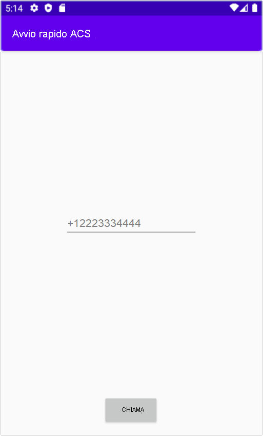

[!INCLUDE [Emergency Calling Notice](../../../includes/emergency-calling-notice-include.md)]
## <a name="prerequisites"></a>Prerequisiti

- Un account Azure con una sottoscrizione attiva. [Creare un account gratuitamente](https://azure.microsoft.com/free/?WT.mc_id=A261C142F). 
- Una risorsa di Servizi di comunicazione distribuita. [Creare una risorsa di Servizi di comunicazione](../../create-communication-resource.md).
- Un numero di telefono acquisito nella risorsa di Servizi di comunicazione. [Come ottenere un numero di telefono](../../telephony-sms/get-phone-number.md).
- Un `User Access Token` per abilitare il client di chiamata. Per altre informazioni, vedere [come ottenere un `User Access Token`](../../access-tokens.md)
- Completare la guida di avvio rapido per [aggiungere funzionalità per chiamate all'applicazione](../getting-started-with-calling.md)

### <a name="prerequisite-check"></a>Controllo dei prerequisiti

- Per visualizzare i numeri di telefono associati alla risorsa di Servizi di comunicazione, accedere al [portale di Azure](https://portal.azure.com/), individuare la risorsa di Servizi di comunicazione e aprire la scheda dei **numeri di telefono** nel riquadro di spostamento sinistro.

## <a name="setting-up"></a>Configurazione

### <a name="add-pstn-functionality-to-your-app"></a>Aggiungere funzionalità PSTN all'app

Aggiungere il tipo `PhoneNumber` all'app modificando **MainActivity.java**:


```java
import com.azure.android.communication.common.PhoneNumberIdentifier;
```

<!--
> [!TBD]
> Namespace based on input from Komivi Agbakpem. But it does not correlates with other use namespaces in Calling Quickstart. E.g: "com.azure.communication.calling.CommunicationUserIdentifier" or "com.azure.communication.common.client.CommunicationTokenCredential". Double-chek this.
-->

## <a name="start-a-call-to-phone"></a>Avviare una chiamata al telefono

Specificare il numero di telefono acquisito nella risorsa di Servizi di comunicazione. Verrà usato per avviare la chiamata:

> [!WARNING]
> Si noti che i numeri di telefono devono essere specificati nel formato standard internazionale E.164, ad esempio +12223334444.

Modificare il gestore dell'evento `startCall()` in **MainActivity.java** in modo che gestisca le chiamate telefoniche:

```java
    private void startCall() {
        EditText calleePhoneView = findViewById(R.id.callee_id);
        String calleePhone = calleePhoneView.getText().toString();
        PhoneNumberIdentifier callerPhone = new PhoneNumberIdentifier("+12223334444");
        StartCallOptions options = new StartCallOptions();
        options.setAlternateCallerId(callerPhone);
        options.setVideoOptions(new VideoOptions(null));
        call = agent.startCall(
                getApplicationContext(),
                new PhoneNumberIdentifier[] {new PhoneNumberIdentifier(calleePhone)},
                options);
    }
```

## <a name="launch-the-app-and-call-the-echo-bot"></a>Avviare l'app e chiamare l'Echo Bot

È ora possibile avviare l'app usando il pulsante "Run App" (Esegui app) sulla barra degli strumenti (MAIUSC+F10). È possibile effettuare una chiamata specificando un numero di telefono nel campo di testo aggiunto e facendo clic sul pulsante **CALL** (Chiama).
> [!WARNING]
> Si noti che i numeri di telefono devono essere specificati nel formato standard internazionale E.164, ad esempio +12223334444.


