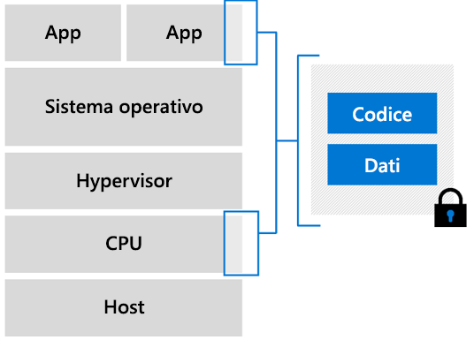

# Panoramica di macchine virtuali (VM) di Azure computing riservato

Azure è il primo provider di servizi cloud a offrire il confidential computing in un ambiente virtuale. Sono state sviluppate macchine virtuali che fungono da livello di astrazione tra l'hardware e l'applicazione. È possibile eseguire carichi di lavoro su larga scala e con opzioni di ridondanza e disponibilità.  

## Macchine virtuali abilitate per Intel SGX

Nelle macchine virtuali di confidential computing di Azure, una parte dell'hardware della CPU è riservata per una parte di codice e dati dell'applicazione. Questa parte con restrizioni è l'enclave. 

L'infrastruttura di confidential computing di Azure è attualmente costituita da SKU speciali di macchine virtuali (VM). Queste VM vengono eseguite su processori Intel con tecnologia Intel SGX (Software Guard Extension). [Intel SGX](https://intel.com/sgx) è il componente che consente la maggiore protezione resa disponibile con il confidential computing. 

Oggi Azure offre la [serie DCsv2](https://docs.microsoft.com/azure/virtual-machines/dcv2-series) basata su tecnologia Intel SGX per la creazione di enclavi basate su hardware. È possibile creare applicazioni sicure basate su enclavi sicure da eseguire nella serie DCsv2 di VM per proteggere i dati e il codice dell'applicazione in uso. 

[Scopri di più](virtual-machine-solutions.md) sulla distribuzione di macchine virtuali di Azure Confidential computing con enclave attendibili basate su hardware.

## Enclavi

Le enclave sono parti protette del processore e della memoria dell'hardware. Non vi è alcun modo per visualizzare dati o codice all'interno dell'enclave, neanche con un debugger. Se il codice non attendibile tenta di modificare il contenuto nella memoria dell'enclave, l'ambiente viene disabilitato e le operazioni vengono negate.

Fondamentalmente, un'enclave può essere paragonata a una scatola protetta. Il codice e i dati crittografati vengono inseriti nella scatola. Dall'esterno della scatola, non è possibile vedere niente. All'enclave viene assegnata una chiave per decrittografare i dati, che vengono quindi elaborati e crittografati di nuovo, prima di essere inviati al di fuori.

Ogni Enclave ha una dimensione impostata della cache di pagina crittografata (EPC) che determina la quantità di memoria che può essere contenuta in ogni enclave. Le macchine virtuali DCsv2 di dimensioni maggiori hanno più memoria EPC. Leggere la pagina delle [specifiche DCsv2](https://docs.microsoft.com/azure/virtual-machines/dcv2-series) per le dimensioni MASSIMe EPC per macchina virtuale.

### Sviluppo di applicazioni da eseguire all'interno di enclavi
Quando si sviluppano applicazioni, è possibile usare [strumenti software](application-development.md) per schermare parti del codice e dei dati all'interno dell'enclave. Questi strumenti garantiscono che il codice e i dati non possano essere visualizzati o modificati da utenti esterni all'ambiente attendibile. 

## Passaggi successivi
- [Leggere le procedure consigliate](virtual-machine-solutions.md) per la distribuzione di soluzioni in macchine virtuali di Azure Confidential computing.
- [Distribuire una macchina virtuale della serie DCsv2](quick-create-portal.md)
- [Sviluppare un'applicazione in grado di riconoscere l'enclave](application-development.md) usando l'SDK di OE