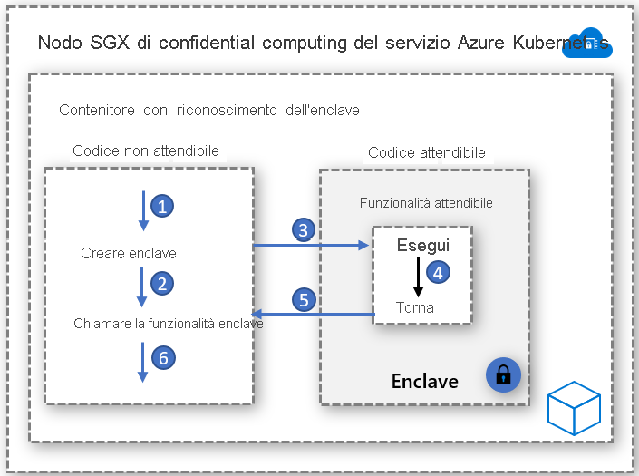

# Contenitori con riconoscimento dell'enclave

Un'enclave è un'area di memoria protetta che assicura la riservatezza dei dati e dell'esecuzione di codice. È un'istanza di un ambiente TEE (Trusted Execution Environment) protetto dall'hardware. I nodi di confidential computing nel servizio Azure Kubernetes usano [Intel Software Guard Extensions (SGX)](https://software.intel.com/sgx) per creare ambienti enclave isolati nei nodi tra ogni applicazione contenitore.

Proprio come le macchine virtuali Intel SGX, le applicazioni contenitore sviluppate per l'esecuzione in enclave hanno due componenti:

- Un componente non attendibile (l'host) e
- Un componente attendibile (l'enclave).

L'architettura delle applicazioni contenitore con riconoscimento dell'enclave offre il massimo controllo sull'implementazione mantenendo al minimo il footprint del codice nell'enclave. Ridurre al minimo il codice eseguito nell'enclave contribuisce a ridurre la superficie di attacco.   

## Componenti principali

### Open Enclave SDK
Open Enclave SDK è una libreria open source indipendente dall'hardware per lo sviluppo di applicazioni C e C++ che usano ambienti TEE (Trusted Execution Environment). L'implementazione corrente offre il supporto per Intel SGX e il supporto in anteprima per il [sistema operativo OP-TEE in ARM TrustZone](https://optee.readthedocs.io/en/latest/general/about.html).

Informazioni introduttive sulle applicazioni contenitore basate su Open Enclave sono disponibili [qui](https://github.com/openenclave/openenclave/tree/master/docs/GettingStartedDocs)

### Intel SGX SDK
Intel gestisce l'SDK per la creazione di applicazioni SGX per carichi di lavoro di contenitori sia Linux che Windows. I contenitori Windows attualmente non sono supportati dai nodi di confidential computing del servizio Azure Kubernetes.

Informazioni introduttive sulle applicazioni basate su Intel SGX sono disponibili [qui](https://software.intel.com/content/www/us/en/develop/topics/software-guard-extensions/sdk.html)

### CCF (Confidential Consortium Framework)
Il Confidential Consortium Framework (CCF) è un framework open source per la creazione di una nuova categoria di applicazioni sicure, a disponibilità elevata e a prestazioni elevate incentrate sui dati e sul calcolo a parti multiple. Con il framework CCF è possibile creare reti riservate a scalabilità elevata che soddisfano i principali requisiti aziendali, fornendo un mezzo per accelerare la produzione e l'adozione della blockchain basata su consorzio e della tecnologia di calcolo a parti multiple.

Informazioni introduttive sul confidential computing di Azure e sul CCF sono disponibili [qui](https://github.com/Microsoft/CCF)

### Runtime ONNX per l'inferenza di dati riservati

Il runtime ONNX basato su enclave open source stabilisce un canale sicuro tra il client e il servizio di inferenza, assicurando che né la richiesta né la risposta possano uscire dall'enclave protetta. 

Questa soluzione consente di usare un modello con training di Machine Learning esistente e di eseguirlo in modo riservato, garantendo al tempo stesso una relazione di trust tra il client e il server tramite l'attestazione e le verifiche. 

Informazioni introduttive sul trasferimento in modalità lift-and-shift di modelli di Machine Learning nel runtime ONNX sono disponibili [qui](https://aka.ms/confidentialinference)

## Implementazioni di esempi di contenitori

[Esempi di Azure per i contenitori con riconoscimento dell'enclave nel servizio Azure Kubernetes](https://github.com/Azure-Samples/enclave-aware-container-samples)

<!-- LINKS - external -->
[Azure Attestation]: https://docs.microsoft.com/en-us/azure/attestation/

<!-- LINKS - internal -->
[DC Virtual Machine]: /confidential-computing/virtual-machine-solutions
[Confidential Containers]: /confidential-computing/containercompute/confidential-containers