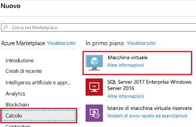
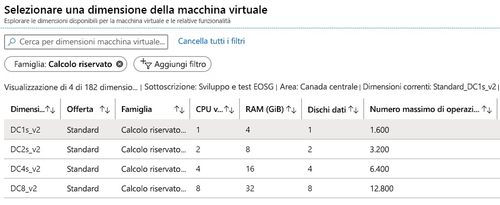
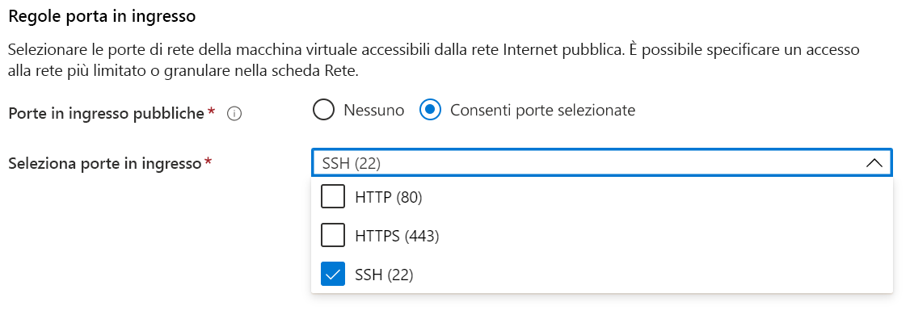

# <a name="quickstart-deploy-an-azure-confidential-computing-vm-in-the-azure-portal"></a>Avvio rapido: Distribuire una macchina virtuale di confidential computing di Azure nel portale di Azure

Questo articolo illustra come creare una macchina virtuale (VM) di confidential computing supportata da Intel SGX con il portale di Azure. Si installerà quindi Open Enclave SDK (Software Development Kit) per configurare l'ambiente di sviluppo. 

Questa esercitazione è raccomandata se si è interessati alla distribuzione di una macchina virtuale di confidential computing con una configurazione personalizzata. In caso contrario, è consigliabile seguire la [procedura per la distribuzione di macchine virtuali di confidential computing per il marketplace commerciale Microsoft](quick-create-marketplace.md).


## <a name="prerequisites"></a>Prerequisiti

Se non si ha una sottoscrizione di Azure, [creare un account](https://azure.microsoft.com/pricing/purchase-options/pay-as-you-go/) prima di iniziare.

> [!NOTE]
> Gli account di valutazione gratuiti non hanno accesso alle macchine virtuali usate in questa esercitazione. Eseguire l'aggiornamento a una sottoscrizione con pagamento in base al consumo.


## <a name="sign-in-to-azure"></a>Accedere ad Azure

1. Accedere al [portale di Azure](https://portal.azure.com/).

1. Nella parte superiore selezionare **Crea una risorsa**.

1. Nel riquadro **Marketplace** selezionare **Calcolo** a sinistra.

1. Trovare e selezionare **Macchina virtuale**.

    

1. Nella pagina di destinazione Macchina virtuale selezionare **Crea**.


## <a name="configure-a-confidential-computing-virtual-machine"></a>Configurare una macchina virtuale di confidential computing

1. Nella scheda **Informazioni di base** selezionare le opzioni per **Sottoscrizione** e **Gruppo di risorse**.

1. In **Nome macchina virtuale** immettere un nome per la nuova VM.

1. Digitare o selezionare i valori seguenti:

   * **Area**: selezionare l'area di Azure appropriata.

        > [!NOTE]
        > Le macchine virtuali di confidential computing vengono eseguite solo in hardware speciale disponibile in specifiche aree. Per informazioni aggiornate sulle aree disponibili per le VM serie DCsv2, vedere [Aree disponibili](https://azure.microsoft.com/global-infrastructure/services/?products=virtual-machines).

1. Configurare l'immagine del sistema operativo da usare per la macchina virtuale.

    * **Scegliere l'immagine**: per questa esercitazione, selezionare Ubuntu 18.04 LTS. È anche possibile selezionare Windows Server 2019, Windows Server 2016 o e Ubuntu 20.04 LTS. In questo caso, si verrà reindirizzati alla procedura appropriata dell'esercitazione.
    
    * **Attivare l'immagine per Gen 2**: le macchine virtuali di confidential computing vengono eseguite solo in immagini di [generazione 2](../virtual-machines/generation-2.md). Assicurarsi che l'immagine selezionata sia di generazione 2. Fare clic sulla scheda **Avanzate** in cui si configura la macchina virtuale. Scorrere verso il basso fino a trovare la sezione "Generazione macchina virtuale". Selezionare Gen 2 e tornare nella scheda **Informazioni di base**.
    

        


        

    * **Tornare nella configurazione di base**: Tornare nella scheda **Informazioni di base** usando il riquadro di spostamento superiore.

1. Scegliere una macchina virtuale con funzionalità di confidential computing nel selettore di dimensioni scegliendo **Modifica dimensioni**. Nel selettore di dimensioni della macchina virtuale fare clic su **Cancella tutti i filtri**. Scegliere **Aggiungi filtro**, selezionare **Famiglia** come tipo di filtro e quindi selezionare solo **Calcolo riservato**.

    

    > [!TIP]
    > Verranno visualizzate le dimensioni **DC1s_v2**, **DC2s_v2**, **DC4s_V2** e **DC8_v2**. Queste sono le uniche dimensioni di macchine virtuali che attualmente supportano il confidential computing Intel SGX. [Altre informazioni](virtual-machine-solutions.md)

1. Specificare le informazioni seguenti:

   * **Tipo di autenticazione**: Selezionare **Chiave pubblica SSH** se si crea una VM Linux. 

        > [!NOTE]
        > Per l'autenticazione, si può scegliere di usare una chiave pubblica SSH o una password. L'opzione più sicura è SSH. Per istruzioni su come generare una chiave SSH, vedere l'articolo su come [creare chiavi SSH in Linux e Mac per le VM Linux in Azure](../virtual-machines/linux/mac-create-ssh-keys.md).

    * **Nome utente**: immettere il nome dell'amministratore della macchina virtuale.

    * **Chiave pubblica SSH**: se applicabile, immettere la chiave pubblica RSA.
    
    * **Password**: se applicabile, immettere la password per l'autenticazione.

    * **Porte in ingresso pubbliche**: scegliere **Consenti porte selezionate** e selezionare **SSH (22)** e **HTTP (80)** nell'elenco **Selezionare le porte in ingresso pubbliche**. Se si distribuisce una macchina virtuale Windows, selezionare **HTTP (80)** e **RDP (3389)** . In questo argomento di avvio rapido questo passaggio è necessario per connettersi alla VM e completare la configurazione di Open Enclave SDK. 

     


1. Apportare modifiche nella scheda **Dischi**.

   * Se è stata scelta una macchina virtuale **DC1s_v2**, **DC2s_v2**, **DC4s_V2**, scegliere il tipo di disco **SSD Standard** o **SSD Premium**. 
   * Se è stata scelta una macchina virtuale **DC8_v2**, scegliere **SDD Standard** come tipo di disco.

1. Apportare eventuali modifiche alle impostazioni nelle schede seguenti o mantenere quelle predefinite.

    * **Rete**
    * **Gestione**
    * **Configurazione guest**
    * **Tag**

1. Selezionare **Rivedi e crea**.

1. Nel riquadro **Rivedi e crea** selezionare **Crea**.

> [!NOTE]
> Procedere con la sezione successiva e continuare con questa esercitazione se è stata distribuita una VM Linux. Se è stata distribuita una VM Windows, [seguire questa procedura per connettersi alla VM Windows](../virtual-machines/windows/connect-logon.md) e quindi [installare OE SDK in Windows](https://github.com/openenclave/openenclave/blob/master/docs/GettingStartedDocs/install_oe_sdk-Windows.md).


## <a name="connect-to-the-linux-vm"></a>Connettersi alla VM Linux

Se si usa già una shell BASH, connettersi alla VM di Azure con il comando **ssh**. Nel comando seguente, sostituire il nome utente e l'indirizzo IP della VM per connettersi alla propria VM Linux.

```bash
ssh azureadmin@40.55.55.555
```

L'indirizzo IP pubblico della VM è disponibile nella relativa sezione Panoramica del portale di Azure.

:::image type="content" source="media/quick-create-portal/public-ip-virtual-machine.png" alt-text="Indirizzo IP nel portale di Azure":::

Se l'esecuzione avviene in Windows e non si ha una shell BASH, installare un client SSH, ad esempio PuTTY.

1. [Scaricare e installare PuTTY](https://www.chiark.greenend.org.uk/~sgtatham/putty/download.html).

1. Eseguire PuTTY.

1. Nella schermata di configurazione di PuTTY immettere l'indirizzo IP pubblico della VM.

1. Selezionare **Apri** e immettere nome utente e password quando richiesto.

Per altre informazioni sulla connessione alle VM Linux, vedere l'articolo su come [creare una VM Linux in Azure con il portale](../virtual-machines/linux/quick-create-portal.md).

> [!NOTE]
> Se viene visualizzato un avviso di sicurezza PuTTY relativo alla mancata memorizzazione nella cache della chiave host del server, scegliere tra le opzioni seguenti. Se si considera attendibile l'host, selezionare **Sì** per aggiungere la chiave nella cache di PuTTy e continuare a la procedura di connessione. Se si vuole eseguire la connessione una sola volta, senza aggiungere la chiave nella cache, selezionare **No**. Se non si considera attendibile l'host, selezionare **Annulla** per abbandonare la connessione.

## <a name="install-the-open-enclave-sdk-oe-sdk"></a>Installare Open enclave SDK (OE SDK) <a id="Install"></a>

Seguire le istruzioni dettagliate per installare [OE SDK](https://github.com/openenclave/openenclave) nella macchina virtuale serie DCsv2 che esegue un'immagine Ubuntu 18.04 LTS Gen 2. 

Se la macchina virtuale viene eseguita in Ubuntu 18.04 LTS Gen 2, è necessario seguire le istruzioni di installazione per [Ubuntu 18.04.](https://github.com/openenclave/openenclave/blob/master/docs/GettingStartedDocs/install_oe_sdk-Ubuntu_18.04.md)

#### <a name="1-configure-the-intel-and-microsoft-apt-repositories"></a>1. Configurare i repository Intel e Microsoft APT

```bash
echo 'deb [arch=amd64] https://download.01.org/intel-sgx/sgx_repo/ubuntu bionic main' | sudo tee /etc/apt/sources.list.d/intel-sgx.list
wget -qO - https://download.01.org/intel-sgx/sgx_repo/ubuntu/intel-sgx-deb.key | sudo apt-key add -

echo "deb http://apt.llvm.org/bionic/ llvm-toolchain-bionic-7 main" | sudo tee /etc/apt/sources.list.d/llvm-toolchain-bionic-7.list
wget -qO - https://apt.llvm.org/llvm-snapshot.gpg.key | sudo apt-key add -

echo "deb [arch=amd64] https://packages.microsoft.com/ubuntu/18.04/prod bionic main" | sudo tee /etc/apt/sources.list.d/msprod.list
wget -qO - https://packages.microsoft.com/keys/microsoft.asc | sudo apt-key add -
```

#### <a name="2-install-the-intel-sgx-dcap-driver"></a>2. Installare il driver DCAP di Intel SGX
In alcune versioni di Ubuntu potrebbe essere già installato il driver Intel SGX. Controllare usando il comando seguente: 

```bash
dmesg | grep -i sgx
[  106.775199] sgx: intel_sgx: Intel SGX DCAP Driver {version}
``` 
Se l'output è vuoto, installare il driver: 

```bash
sudo apt update
sudo apt -y install dkms
wget https://download.01.org/intel-sgx/sgx-dcap/1.7/linux/distro/ubuntu18.04-server/sgx_linux_x64_driver_1.35.bin -O sgx_linux_x64_driver.bin
chmod +x sgx_linux_x64_driver.bin
sudo ./sgx_linux_x64_driver.bin
```

> [!WARNING]
> Usare l'ultima versione del driver DCAP di Intel SGX disponibile sul [sito SGX di Intel](https://01.org/intel-software-guard-extensions/downloads).

#### <a name="3-install-the-intel-and-open-enclave-packages-and-dependencies"></a>3. Installare i pacchetti e le dipendenze di Intel e Open Enclave


```bash
sudo apt -y install clang-8 libssl-dev gdb libsgx-enclave-common libprotobuf10 libsgx-dcap-ql libsgx-dcap-ql-dev az-dcap-client open-enclave
```

> [!NOTE] 
> Questo passaggio installa anche il pacchetto [az-dcap-client](https://github.com/microsoft/azure-dcap-client), che è necessario per l'esecuzione dell'attestazione remota in Azure.

#### <a name="4-verify-the-open-enclave-sdk-install"></a>4. **Verificare l'installazione di Open Enclave SDK**

Vedere le informazioni sull'[uso di Open Enclave SDK](https://github.com/openenclave/openenclave/blob/master/docs/GettingStartedDocs/Linux_using_oe_sdk.md) in GitHub per verificare e usare l'SDK installato.

## <a name="clean-up-resources"></a>Pulire le risorse

Quando non servono più, è possibile eliminare il gruppo di risorse, la macchina virtuale e tutte le risorse correlate. 

Selezionare il gruppo di risorse per la macchina virtuale, quindi fare clic su **Elimina**. Confermare il nome del gruppo di risorse da terminare eliminando le risorse.

## <a name="next-steps"></a>Passaggi successivi

In questo argomento di avvio rapido è stata distribuita una macchina virtuale di confidential computing ed è stato installato Open Enclave SDK. Per altre informazioni sulle macchine virtuali di confidential computing in Azure, vedere [Soluzioni nelle macchine virtuali](virtual-machine-solutions.md). 

Per altre informazioni su come creare applicazioni di confidential computing, continuare con gli esempi di Open Enclave SDK in GitHub. 

> [!div class="nextstepaction"]
> [Esempi di compilazione di Open Enclave SDK](https://github.com/openenclave/openenclave/blob/master/samples/README.md)
