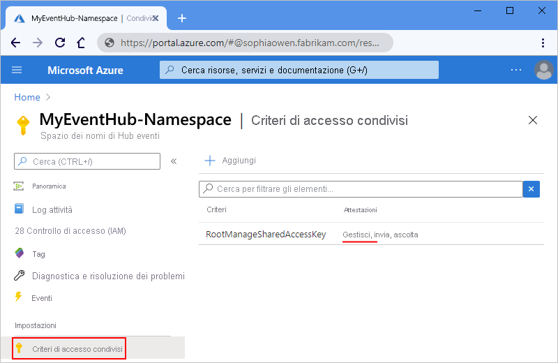
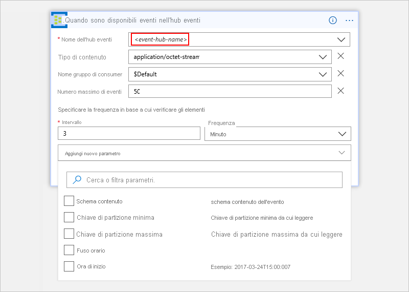
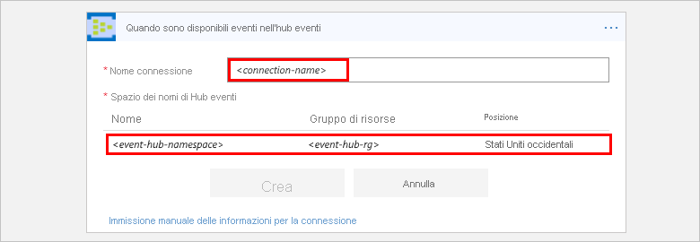
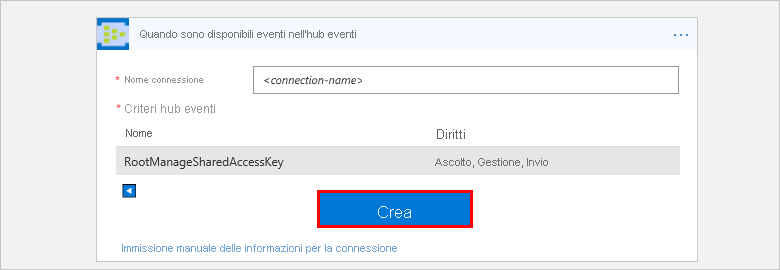

# Monitorare, ricevere e inviare eventi con Hub eventi di Azure e App per la logica di Azure

Questo articolo illustra come monitorare e gestire gli eventi inviati ad [Hub eventi di Azure](../event-hubs/event-hubs-about.md) dall'interno di un'app per la logica con il connettore di Hub eventi di Azure. In questo modo, è possibile creare app per la logica in grado di automatizzare attività e flussi di lavoro per il controllo, l'invio e la ricezione di eventi dall'Hub eventi. Per informazioni tecniche specifiche del connettore, vedere informazioni di [riferimento sul connettore di hub eventi di Azure](/connectors/eventhubs/) </a> .

## Prerequisiti

* Un account e una sottoscrizione di Azure. Se non si ha una sottoscrizione di Azure, [iscriversi per creare un account Azure gratuito](https://azure.microsoft.com/free/). 

* Uno [spazio dei nomi di hub eventi di Azure e un hub eventi](../event-hubs/event-hubs-create.md)

* L'app per la logica in cui si desidera accedere all'Hub eventi. Per avviare l'app per la logica con un trigger di hub eventi di Azure, è necessaria un'app per la [logica vuota](../logic-apps/quickstart-create-first-logic-app-workflow.md).
Se non si ha familiarità con le app per la logica, consultare [Informazioni su App per la logica di Azure](../logic-apps/logic-apps-overview.md) e [Avvio rapido: Creare la prima app per la logica](../logic-apps/quickstart-create-first-logic-app-workflow.md).

## Controllare le autorizzazioni e ottenere la stringa di connessione

Per assicurarsi che l'app per la logica possa accedere all'hub eventi, controllare le autorizzazioni e ottenere la stringa di connessione per lo spazio dei nomi di hub eventi.

1. Accedere al [portale di Azure](https://portal.azure.com).

1. Passare allo *spazio dei nomi* di Hub eventi, non a un hub eventi specifico. 

1. Nel menu spazio dei nomi, in **Impostazioni**, selezionare **criteri di accesso condiviso**. In **attestazioni** verificare di disporre delle autorizzazioni di **gestione** per lo spazio dei nomi.

   

1. Se si vogliono immettere in un secondo momento le informazioni di connessione manualmente, ottenere la stringa di connessione per lo spazio dei nomi di Hub eventi.

   1. Sotto **Criterio**, scegliere **RootManageSharedAccessKey**.

   1. Trovare la stringa di connessione della chiave primaria. Premere il pulsante Copia e salvare la stringa di connessione per un uso successivo.

      

      > [!TIP]
      > Per verificare se la stringa di connessione è associata allo spazio dei nomi di Hub eventi o a un hub eventi specifico, assicurarsi che nella stringa non sia presente il parametro `EntityPath`. Se questo parametro è presente, la stringa di connessione è per un'entità hub eventi specifica e non è la stringa corretta da usare con l'app per la logica.

1. Procedere quindi ad [aggiungere un trigger per hub eventi](#add-trigger) o [aggiungere un'azione per hub eventi](#add-action).

## Aggiungere un trigger per Hub eventi

In App per la logica di Azure, ogni app per la logica deve essere avviata con un [trigger](../logic-apps/logic-apps-overview.md#logic-app-concepts), che viene attivato quando si verifica un determinato evento o quando viene soddisfatta una condizione specifica. Ogni volta che il trigger viene attivato, il motore di App per la logica crea un'istanza dell'app per la logica e avvia l'esecuzione del flusso di lavoro dell'app.

Nell'esempio viene illustrato come avviare un flusso di lavoro di app per la logica quando vengono inviati nuovi eventi all'Hub eventi. 

> [!NOTE]
> Tutti i trigger dell'hub eventi sono trigger con *polling prolungato* , il che significa che il trigger elabora tutti gli eventi e quindi attende 30 secondi per partizione per visualizzare più eventi nell'hub eventi. Quindi, se il trigger è configurato con quattro partizioni, questo ritardo potrebbe richiedere fino a due minuti prima che il trigger completi il polling di tutte le partizioni. Se non viene ricevuto alcun evento entro questo intervallo di tempo, l'esecuzione del trigger viene ignorata. In caso contrario, il trigger continua a leggere gli eventi finché l'hub eventi non è vuoto. Il polling successivo si baserà sull'intervallo di ricorrenza specificato nelle proprietà del trigger.

1. Nel portale di Azure o in Visual Studio creare un'app per la logica vuota, che apre Progettazione app per la logica. Questo esempio usa il portale di Azure.

1. Nella casella di ricerca immettere "hub eventi" come filtro. Dall'elenco trigger selezionare questo trigger: **quando sono disponibili eventi nell'hub eventi-Hub eventi**

   

1. Se vengono richiesti i dettagli della connessione, [creare la connessione ad Hub eventi](#create-connection). 

1. Nel trigger fornire le informazioni sull'hub eventi che si desidera monitorare. Per ulteriori proprietà, aprire l'elenco **Aggiungi nuovo parametro** . Se si seleziona un parametro, questa proprietà viene aggiunta alla scheda trigger.

   

   | Proprietà | Obbligatoria | Descrizione |
   |----------|----------|-------------|
   | **Nome hub eventi** | Sì | Nome dell'hub eventi che si vuole monitorare |
   | **Tipo di contenuto** | No | Tipo di contenuto dell'evento. Il valore predefinito è `application/octet-stream`. |
   | **Nome gruppo di consumer** | No | [Nome del gruppo di consumer dell'hub eventi](../event-hubs/event-hubs-features.md#consumer-groups) da usare per la lettura degli eventi. Se non specificato, viene usato il gruppo di consumer predefinito. |
   | **Maximum events count (Numero massimo di eventi)** | No | Numero massimo di eventi. Il trigger restituisce un valore compreso tra uno e il numero di eventi specificato da questa proprietà. |
   | **Interval** | Sì | Numero intero positivo che descrive la frequenza con cui il flusso di lavoro viene eseguito in base alla frequenza |
   | **Frequenza** | Sì | Unità di tempo per la ricorrenza |
   ||||

   **Proprietà aggiuntive**

   | Proprietà | Obbligatoria | Descrizione |
   |----------|----------|-------------|
   | **Content schema (Schema contenuto)** | No | Schema del contenuto JSON per gli eventi da leggere dall'hub eventi. Se ad esempio si specifica lo schema del contenuto, è possibile attivare l'app per la logica solo per gli eventi che corrispondono allo schema. |
   | **Minimum partition key (Chiave di partizione minima)** | No | Immettere l'ID di [partizione](../event-hubs/event-hubs-features.md#partitions) minima da leggere. Per impostazione predefinita, vengono lette tutte le partizioni. |
   | **Maximum partition key (Chiave di partizione massima)** | No | Immettere l'ID di [partizione](../event-hubs/event-hubs-features.md#partitions) massima da leggere. Per impostazione predefinita, vengono lette tutte le partizioni. |
   | **Fuso orario** | No | Valido solo quando si specifica un'ora di inizio, perché il trigger non accetta la differenza dall'ora UTC. Selezionare il fuso orario che si desidera applicare. 
Per altre informazioni, vedere [creare ed eseguire attività e flussi di lavoro ricorrenti con app per la logica di Azure](../connectors/connectors-native-recurrence.md). |
   | **Ora di inizio** | No | Specificare un'ora di inizio nel formato seguente: 
AAAA-MM-GGThh:mm:ss se si seleziona un fuso orario
-oppure-
AAAA-MM-GGThh:mm:ssZ se non si seleziona un fuso orario
Per altre informazioni, vedere [creare ed eseguire attività e flussi di lavoro ricorrenti con app per la logica di Azure](../connectors/connectors-native-recurrence.md). |
   ||||

1. Al termine, nella barra degli strumenti della finestra di progettazione scegliere **Salva**.

1. Continuare ad aggiungere una o più azioni all'app per la logica per le attività da eseguire con i risultati del trigger. 

   Ad esempio, per filtrare gli eventi in base a un valore specifico, ad esempio una categoria, è possibile aggiungere una condizione in modo che l'azione **Invia evento** invii solo gli eventi che soddisfano la condizione. 

## Aggiungere un'azione per Hub eventi

In App per la logica di Azure, un'[azione](../logic-apps/logic-apps-overview.md#logic-app-concepts) è un passaggio del flusso di lavoro che segue un trigger o un'altra azione. In questo esempio, l'app per la logica inizia con un trigger per hub eventi che verifica la presenza di nuovi eventi nell'Hub eventi.

1. Nel portale di Azure o in Visual Studio aprire l'app per la logica in Progettazione app per la logica. Questo esempio usa il portale di Azure.

1. Nel trigger o nell'azione scegliere **nuovo passaggio**.

   Per aggiungere un'azione tra due passaggi esistenti, posizionare il puntatore del mouse sulla freccia di connessione. 
   Scegliere il segno più ( **+** ) visualizzato e quindi selezionare **Aggiungi un'azione**.

1. Nella casella di ricerca immettere "hub eventi" come filtro.
Dall'elenco delle azioni selezionare questa azione: **Invia evento-Hub eventi**

   

1. Se vengono richiesti i dettagli della connessione, [creare la connessione ad Hub eventi](#create-connection). 

1. Nell'azione fornire informazioni sugli eventi che si desidera inviare. Per ulteriori proprietà, aprire l'elenco **Aggiungi nuovo parametro** . Se si seleziona un parametro, questa proprietà viene aggiunta alla scheda azione.

   

   | Proprietà | Obbligatoria | Descrizione |
   |----------|----------|-------------|
   | **Nome hub eventi** | Sì | Hub eventi in cui si vuole inviare l'evento |
   | **Contenuto** | No | Contenuto dell'evento da inviare |
   | **Proprietà** | No | Proprietà dell'app e valori da inviare |
   | **Chiave di partizione** | No | ID della [partizione](../event-hubs/event-hubs-features.md#partitions) in cui inviare l'evento |
   ||||

   Ad esempio, è possibile inviare l'output dal trigger di hub eventi a un altro hub eventi:

   

1. Al termine, nella barra degli strumenti della finestra di progettazione scegliere **Salva**.

## Connettersi all'hub eventi

[!INCLUDE [Create connection general intro](../../includes/connectors-create-connection-general-intro.md)] 

1. Quando viene chiesto di immettere le informazioni di connessione, specificare questi dettagli:

   | Proprietà | Obbligatoria | valore | Descrizione |
   |----------|----------|-------|-------------|
   | **Connection Name** (Nome connessione) | Sì | <*Nome connessione*> | Nome creato per la connessione |
   | **Spazio dei nomi di hub eventi** | Sì | <*Hub eventi-spazio dei nomi*> | Selezionare lo spazio dei nomi di Hub eventi da usare. |
   |||||  

   Ad esempio:

   

   Per immettere manualmente la stringa di connessione, selezionare **immettere manualmente le informazioni di connessione**. 
   Leggere [come trovare la stringa di connessione](#permissions-connection-string).

2. Se del caso, selezionare i criteri di Hub eventi da usare. Scegliere **Crea**.

   

3. Dopo aver creato la connessione, continuare con [Aggiungere un trigger per Hub eventi](#add-trigger) oppure [Aggiungere un'azione per Hub eventi](#add-action).

## Informazioni di riferimento sui connettori

Per informazioni tecniche, ad esempio su trigger, azioni e limiti indicati nel file Swagger del connettore, vedere la [pagina di riferimento del connettore](/connectors/eventhubs/).

> [!NOTE]
> Per le app per la logica in un [ambiente Integration Services (ISE)](../logic-apps/connect-virtual-network-vnet-isolated-environment-overview.md), la versione con etichetta ISE del connettore usa invece i [limiti dei messaggi ISE](../logic-apps/logic-apps-limits-and-config.md#message-size-limits) .

## Passaggi successivi

* Informazioni su altri [connettori di App per la logica](../connectors/apis-list.md)
