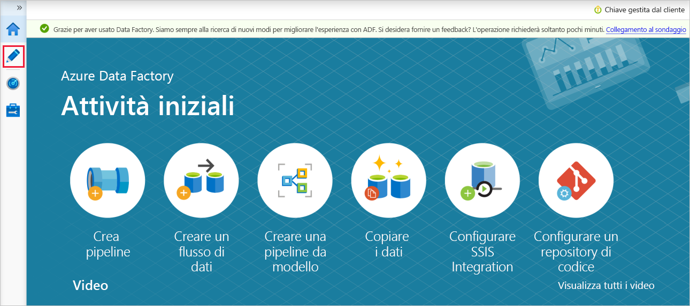

# <a name="how-to-create-and-configure-azure-integration-runtime"></a>Come creare e configurare il runtime di integrazione di Azure
Il runtime di integrazione è l'infrastruttura di calcolo usata da Azure Data Factory per fornire le funzionalità di integrazione di dati in diversi ambienti di rete. Per altre informazioni sul runtime di integrazione, vedere [Integration runtime](concepts-integration-runtime.md) (Runtime di integrazione).

Il runtime di integrazione di Azure fornisce una funzionalità di calcolo completamente gestita per eseguire in modo nativo lo spostamento dei dati e inviare le attività di trasformazione dei dati ai servizi di calcolo, ad esempio HDInsight. È ospitato nell'ambiente Azure e supporta la connessione alle risorse nell'ambiente di rete pubblica con endpoint accessibili pubblicamente.

Questo documento illustra come creare e configurare il runtime di integrazione di Azure. 

[!INCLUDE [updated-for-az](../../includes/updated-for-az.md)]

## <a name="default-azure-ir"></a>Runtime di integrazione di Azure predefinito
Per impostazione predefinita, ogni data factory ha un runtime di integrazione di Azure nel back-end che supporta le operazioni negli archivi dati cloud e i servizi di calcolo nella rete pubblica. La località di tale runtime di integrazione di Azure viene risolta automaticamente. Se la proprietà **connectVia** non viene specificata nella definizione del servizio collegato, viene usato il runtime di integrazione di Azure predefinito. È necessario creare in modo esplicito un runtime di integrazione di Azure solo quando si vuole definire in modo esplicito la località del runtime di integrazione o si vogliono raggruppare le esecuzioni di attività in runtime di integrazione diversi a scopo di gestione. 

## <a name="create-azure-ir"></a>Creare il runtime di integrazione di Azure

Per creare e configurare un'operazione di controllo di irperazione di Azure, è possibile usare le procedure seguenti.

### <a name="create-an-azure-ir-via-azure-powershell"></a>Creare un rapporto di stato di archiviazione tramite Azure PowerShellCreate an Azure IR via Azure PowerShell
Il runtime di integrazione può essere creato utilizzando il cmdlet PowerShell **Set-AzDataFactoryV2IntegrationRuntime.** Per creare un ri-controllo degli accessi di Azure, specificare il nome, il percorso e il tipo per il comando. Ecco un comando di esempio per creare un runtime di integrazione di Azure con la località impostata su "Europa occidentale":

```powershell
Set-AzDataFactoryV2IntegrationRuntime -DataFactoryName "SampleV2DataFactory1" -Name "MySampleAzureIR" -ResourceGroupName "ADFV2SampleRG" -Type Managed -Location "West Europe"
```  
Per il runtime di integrazione di Azure, il tipo deve essere impostato su **Managed**. Non è necessario specificare i dettagli del calcolo perché è completamente gestito in modo elastico nel cloud. Specificare i dettagli del calcolo, ad esempio le dimensioni del nodo e il numero di nodi, quando si vuole creare un runtime di integrazione SSIS di Azure. Per altre informazioni, vedere [Creare e configurare il runtime di integrazione SSIS di Azure](create-azure-ssis-integration-runtime.md).

È possibile configurare un runtime di integrazione di Azure esistente per modificarne il percorso usando il cmdlet PowerShell Set-AzDataFactoryV2IntegrationRuntime.You can configure an existing Azure IR to change its location using the Set-AzDataFactoryV2IntegrationRuntime PowerShell cmdlet. Per altre informazioni sulla località di un runtime di integrazione di Azure, vedere [Introduction to integration runtime](concepts-integration-runtime.md) (Introduzione al runtime di integrazione).

### <a name="create-an-azure-ir-via-azure-data-factory-ui"></a>Creare un catalogo di flusso di flusso di azure tramite l'interfaccia utente di Azure Data FactoryCreate an Azure IR via Azure Data Factory UI
Usare la procedura seguente per creare un catalogo di accesso alternativo di Azure usando l'interfaccia utente di Azure Data Factory.Use the following steps to create an Azure IR using Azure Data Factory UI.

1. Nella pagina **Iniziamo** dell'interfaccia utente di Azure Data Factory selezionare la scheda **Autore** nel riquadro sinistro.

   

1. Selezionare Connessioni nella parte inferiore del riquadro sinistro e selezionare Runtime di integrazione nella finestra Connessioni.Select **Connections** at the bottom of the left pane, and select **Integration runtimes** in the **Connections** window. Selezionare **Nuovo**.

   

1. Nella pagina **Installazione runtime** integrazione selezionare **Azure, Self-Hosted**e quindi **Continua**. 

1. Nella pagina seguente selezionare **Azure** per creare un 'rin/qui Azure e quindi selezionare **Continua**.
   

1. Immettere un nome per il codice a/i del proprio rior di gruppo di Azure e selezionare **Crea**.
   

1. Al termine della creazione verrà visualizzata una notifica popup. Nella pagina Runtime di **integrazione** verificare che nell'elenco sia visualizzato il runtime di integrazione appena creato.

## <a name="use-azure-ir"></a>Usare il runtime di integrazione di Azure

Dopo la creazione di un runtime di integrazione di Azure, è possibile farvi riferimento nella definizione del servizio collegato. Segue un esempio di come fare riferimento al runtime di integrazione di Azure creato sopra da un servizio collegato Archiviazione di Azure:

```json
{
    "name": "MyStorageLinkedService",
    "properties": {
      "type": "AzureStorage",
      "typeProperties": {
        "connectionString": "DefaultEndpointsProtocol=https;AccountName=myaccountname;AccountKey=..."
      },
      "connectVia": {
        "referenceName": "MySampleAzureIR",
        "type": "IntegrationRuntimeReference"
      }   
    }
}

```

## <a name="next-steps"></a>Passaggi successivi
Per creare altri tipi di runtime di integrazione, vedere gli articoli seguenti:

- [Creare un runtime di integrazione self-hostedCreate self-hosted integration runtime](create-self-hosted-integration-runtime.md)
- [Creare il runtime di integrazione SSIS di Azure](create-azure-ssis-integration-runtime.md)
 
