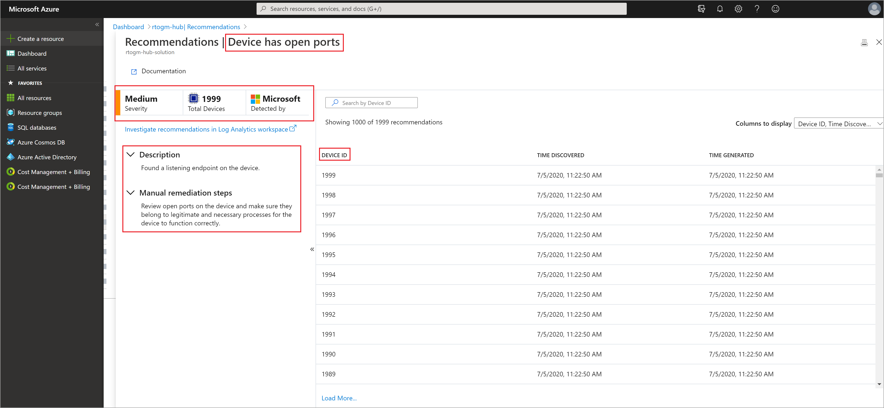

# Avvio rapido: Esaminare le raccomandazioni sulla sicurezza

L'analisi tempestiva e la mitigazione delle raccomandazioni di Defender per IoT sono l'approccio ottimale per migliorare il comportamento di sicurezza e ridurre la superficie di attacco in una soluzione IoT.

In questa guida di avvio rapido si esamineranno le informazioni disponibili in ogni raccomandazione sulla sicurezza per IoT e verrà illustrato come eseguire il drill-down e usare i dettagli di ogni raccomandazione e dei dispositivi correlati per ridurre il rischio.

A questo punto, procedere con l'esercitazione.

## Esaminare le nuove raccomandazioni

Nell'elenco delle raccomandazioni dell'hub IoT vengono visualizzate tutte le raccomandazioni sulla sicurezza aggregate per l'hub IoT.

1.  Nel portale di Azure aprire l' **hub IoT**  di cui si vogliono esaminare le nuove raccomandazioni.

1.  Selezionare  **Raccomandazioni** nel menu  **Sicurezza** . Verranno visualizzate tutte le raccomandazioni sulla sicurezza per l'hub IoT, con quelle delle ultime 24 ore contrassegnate con il flag  **Nuova** . 

    

1.  Selezionare e aprire qualsiasi raccomandazione nell'elenco per visualizzarne i dettagli ed eseguire il drill-down sulle specifiche.

## Dettagli delle raccomandazioni sulla sicurezza

Aprire ogni raccomandazione aggregata per visualizzare la relativa descrizione dettagliata, la procedura di correzione e l'ID di ogni dispositivo che ha attivato la raccomandazione. Sono riportati anche la gravità della raccomandazione e l'accesso per l'indagine diretta con Log Analytics.

1.  Selezionare e aprire qualsiasi raccomandazione sulla sicurezza nell'elenco  **Hub IoT** \> **Sicurezza** \> **Raccomandazioni** .

1.  Esaminare la **descrizione**, la  **gravità** e i  **dettagli di tutti i dispositivi**  che hanno emesso questa raccomandazione nel periodo di aggregazione. 

1.  Dopo aver esaminato le specifiche della raccomandazione, usare le istruzioni della  **procedura di correzione manuale**  per correggere e risolvere il problema che ha causato la raccomandazione. 

    

1.  Esplorare i dettagli delle raccomandazioni per un dispositivo specifico selezionando il dispositivo desiderato nella pagina di drill-down.

    

1.  Se sono necessarie ulteriori indagini,  **esaminare la raccomandazione in Log Analytics**  usando l'apposito collegamento. 

## Passaggi successivi

Per informazioni su come creare avvisi personalizzati, passare all'articolo successivo:

> [!div class="nextstepaction"]
> [Creare avvisi personalizzati](quickstart-create-custom-alerts.md)
