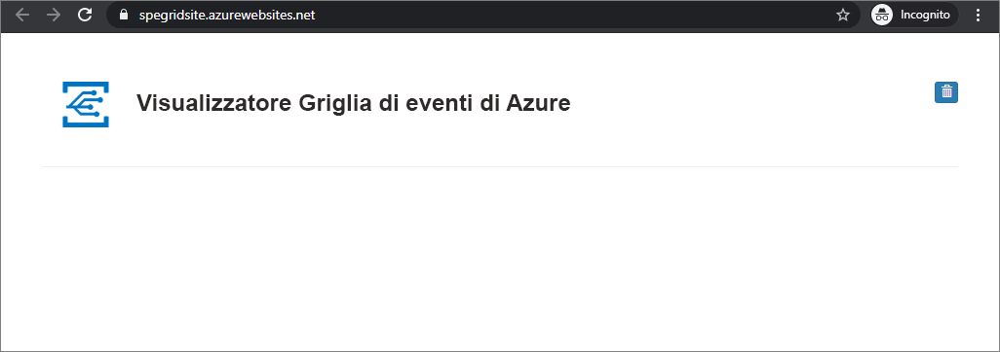

# Instradare gli eventi di archiviazione BLOB a un endpoint Web usando un modello di Azure Resource Manager

La griglia di eventi di Azure è un servizio di gestione degli eventi per il cloud. In questo articolo si usa un **modello di Azure Resource Manager** per creare un account di archiviazione BLOB, sottoscrivere i relativi eventi e attivare un evento per visualizzare il risultato. In genere, si inviano eventi a un endpoint che elabora i dati dell'evento e intraprende azioni. Per maggiore semplicità, tuttavia, in questo articolo gli eventi vengono inviati a un'app Web che raccoglie e visualizza i messaggi.

[!INCLUDE [About Azure Resource Manager](../../includes/resource-manager-quickstart-introduction.md)]

Se non si ha una sottoscrizione di Azure, creare un [account gratuito](https://azure.microsoft.com/free/) prima di iniziare.

## Prerequisiti

### Creare un endpoint del messaggio

Prima di sottoscrivere gli eventi per l'account di archiviazione BLOB, creare l'endpoint per il messaggio dell'evento. L'endpoint richiede in genere azioni basate sui dati degli eventi. Per semplificare questa guida introduttiva, si distribuisce un'[app Web preesistente](https://github.com/Azure-Samples/azure-event-grid-viewer) che visualizza i messaggi di evento. La soluzione distribuita include un piano di servizio app, un'app Web del servizio app e codice sorgente da GitHub.

1. Selezionare **Distribuisci in Azure** per distribuire la soluzione nella sottoscrizione. Nel portale di Azure specificare i valori per i parametri.

    [Distribuzione in Azure](https://portal.azure.com/#create/Microsoft.Template/uri/https%3A%2F%2Fraw.githubusercontent.com%2FAzure-Samples%2Fazure-event-grid-viewer%2Fmaster%2Fazuredeploy.json)
1. Per il completamento della distribuzione possono essere necessari alcuni minuti. Dopo il completamento della distribuzione, visualizzare l'app Web per assicurarsi che sia in esecuzione. In un Web browser passare a: `https://<your-site-name>.azurewebsites.net`

1. Viene visualizzato il sito, ma nessun evento è ancora stato pubblicato.

   

## Creare un account di archiviazione con una sottoscrizione di Griglia di eventi

### Rivedere il modello

Il modello usato in questo avvio rapido proviene dai [modelli di avvio rapido di Azure](https://github.com/Azure/azure-quickstart-templates/tree/master/101-event-grid-subscription-and-storage).

[!code-json[<Azure Resource Manager template create Blob storage Event Grid subscription>](~/quickstart-templates/101-event-grid-subscription-and-storage/azuredeploy.json)]

Nel modello sono definite due risorse di Azure:

* [**Microsoft.Storage/storageAccounts**](/azure/templates/microsoft.storage/storageaccounts): crea un account di archiviazione di Azure.
* [**Microsoft.EventGrid/systemTopics**](/azure/templates/microsoft.eventgrid/systemtopics): crea un argomento di sistema con il nome specificato per l'account di archiviazione. 
* [**Microsoft.EventGrid/systemTopics/eventSubscriptions**](/azure/templates/microsoft.eventgrid/systemtopics/eventsubscriptions): crea una sottoscrizione di Griglia di eventi di Azure per l'argomento di sistema.

### Distribuire il modello

1. Selezionare il collegamento seguente per accedere ad Azure e aprire un modello. Il modello crea un insieme di credenziali delle chiavi e un segreto.

    

2. Specificare l'**endpoint**: fornire l'URL dell'app Web e aggiungere `api/updates` all'URL della home page.
3. Selezionare **Acquista** per distribuire il modello.

  In questo caso per distribuire il modello si usa il portale di Azure. È anche possibile usare Azure PowerShell, l'interfaccia della riga di comando di Azure e un'API REST. Per informazioni sugli altri metodi di distribuzione, vedere [Distribuire modelli](../azure-resource-manager/templates/deploy-powershell.md).

> [!NOTE]
> È possibile trovare altri esempi di modelli di Griglia di eventi di Azure [qui](https://azure.microsoft.com/resources/templates/?resourceType=Microsoft.Eventgrid).

## Convalidare la distribuzione

Visualizzare nuovamente l'app Web e notare che all'app è stato inviato un evento di convalida della sottoscrizione. Selezionare l'icona a forma di occhio per espandere i dati dell'evento. Griglia di eventi invia l'evento di convalida in modo che l'endpoint possa verificare che voglia ricevere i dati dell'evento. L'app Web include il codice per convalidare la sottoscrizione.

A questo punto, attivare un evento per vedere come la griglia di eventi distribuisce il messaggio nell'endpoint.

Per attivare un evento per l'account di archiviazione BLOB, caricare un file. Non sono necessari contenuti specifici per il file. Gli articoli presuppongono che si abbia un file denominato testfile.txt, ma è possibile usare qualsiasi file.

Quando si carica il file nell'archiviazione BLOB di Azure, Griglia di eventi invia un messaggio all'endpoint configurato durante la sottoscrizione. Il messaggio è in formato JSON e contiene una matrice con uno o più eventi. Nell'esempio seguente il messaggio JSON contiene una matrice con un solo evento. Visualizzare l'app Web. Si noterà che è stato ricevuto un evento creato da un BLOB.

## Pulire le risorse

Quando non è più necessario, [eliminare il gruppo di risorse](../azure-resource-manager/management/delete-resource-group.md?tabs=azure-portal#delete-resource-group
).

## Passaggi successivi

Per altre informazioni sui modelli di Azure Resource Manager, vedere gli articoli seguenti:

* [Documentazione di Azure Resource Manager](/azure/azure-resource-manager)
* [Definire risorse nei modelli di Azure Resource Manager](/azure/templates/)
* [Modelli di avvio rapido di Azure](https://azure.microsoft.com/resources/templates/)
* [Modelli di Griglia di eventi di Azure](https://azure.microsoft.com/resources/templates/?resourceType=Microsoft.Eventgrid).
