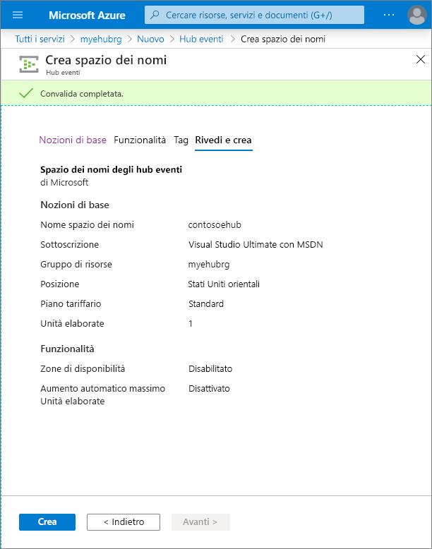

# Avvio rapido: Creare un hub eventi con il portale di Azure
Hub eventi di Azure è una piattaforma di Big Data streaming e un servizio di inserimento di eventi che consente di ricevere ed elaborare milioni di eventi al secondo. Hub eventi consente di elaborare e archiviare eventi, dati o dati di telemetria generati dal software distribuito e dai dispositivi. I dati inviati a un hub eventi possono essere trasformati e archiviati usando qualsiasi provider di analisi in tempo reale o adattatori di invio in batch/archiviazione. Per una panoramica dettagliata di Hub eventi, vedere [Panoramica di Hub eventi](event-hubs-about.md) e [Funzionalità di Hub eventi](event-hubs-features.md).

In questa guida introduttiva viene creato un hub eventi usando il [portale di Azure](https://portal.azure.com).

## Prerequisiti

Per completare questa guida introduttiva, assicurarsi di disporre di quanto segue:

- Sottoscrizione di Azure. Se non se ne ha una, [creare un account gratuito](https://azure.microsoft.com/free/) prima di iniziare.
- [Visual Studio 2019](https://www.visualstudio.com/vs) o versioni successive.
- [NET Standard SDK](https://www.microsoft.com/net/download/windows) versione 2.0 o successiva.

## Creare un gruppo di risorse

Un gruppo di risorse è una raccolta logica per le risorse di Azure. Tutte le risorse vengono distribuite e gestite in un gruppo di risorse. Per creare un gruppo di risorse:

1. Accedere al [portale di Azure](https://portal.azure.com).
2. Nel riquadro di spostamento a sinistra fare clic su **Gruppi di risorse**. Fare quindi clic su **Aggiungi**.

   

2. Per **Sottoscrizione** selezionare il nome della sottoscrizione di Azure in cui si vuole creare il gruppo di risorse.
3. Digitare un **nome univoco per il gruppo di risorse**. Il sistema verifica immediatamente se il nome è disponibile nella sottoscrizione di Azure attualmente selezionata.
4. Selezionare un'**area** per il gruppo di risorse.
5. Selezionare **Rivedi e crea**.

   
6. Nel riquadro **Rivedi e crea** selezionare **Crea**. 

## Creare uno spazio dei nomi di Hub eventi

Uno spazio dei nomi di Hub eventi specifica un contenitore di ambito univoco, a cui fa riferimento il nome di dominio completo, in cui si crea uno o più hub eventi. Per creare uno spazio dei nomi nel gruppo di risorse usando il portale, eseguire le azioni seguenti:

1. Nel portale di Azure fare clic su **Crea una risorsa** nella parte superiore sinistra della schermata.
2. Selezionare **Tutti i servizi** nel menu a sinistra e scegliere la **stella (`*`)** accanto a **Hub eventi** nella categoria **Analytics**. Verificare che **Hub eventi** venga aggiunto a **PREFERITI** nel menu di spostamento a sinistra. 
    
   
3. Selezionare **Hub eventi** sotto **PREFERITI** nel menu di spostamento a sinistra e scegliere **Aggiungi** sulla barra degli strumenti.

   
4. Nella pagina **Crea spazio dei nomi** seguire questa procedura:
    1. Selezionare la **sottoscrizione** in cui creare lo spazio dei nomi.
    2. Selezionare il **gruppo di risorse** creato nel passaggio precedente. 
    3. Immettere un **nome** per lo spazio dei nomi. Verrà effettuato immediatamente un controllo sulla disponibilità del nome.
    4. Selezionare una **località** per lo spazio dei nomi.    
    5. Scegliere il **piano tariffario** (Basic o Standard).  
    6. Lasciare invariate le impostazioni di **Unità elaborate**. Per informazioni sulle unità elaborate, vedere [Scalabilità di Hub eventi](event-hubs-scalability.md#throughput-units).  
    5. Selezionare **Rivedi e crea** nella parte inferiore della pagina.

       
   6. Nella pagina **Rivedi e crea** controllare le impostazioni e selezionare **Crea**. Attendere il completamento della distribuzione. 

       
   7. Nella pagina **Distribuzione** selezionare **Vai alla risorsa** per passare alla pagina relativa allo spazio dei nomi. 

      
   8. Verificare che la pagina the **Spazio dei nomi di Hub eventi** sia simile all'esempio seguente: 

              

       > [!NOTE]
       > Hub eventi di Azure fornisce un endpoint Kafka. che consente allo spazio dei nomi di Hub eventi di comprendere in modo nativo il protocollo del messaggio e le API [Apache Kafka](https://kafka.apache.org/intro). Con questa funzionalità è possibile comunicare con gli Hub eventi come si farebbe con gli argomenti Kafka senza modificare i client del protocollo o eseguire i propri cluster. Hub eventi supporta [Apache Kafka 1.0](https://kafka.apache.org/10/documentation.html) e versioni successive. Per altre informazioni, vedere [Usare Hub eventi di Azure da applicazioni Apache Kafka](event-hubs-for-kafka-ecosystem-overview.md).
    
## Creare un hub eventi

Per creare un hub eventi all'interno dello spazio dei nomi, eseguire le azioni seguenti:

1. Nella pagina dello spazio dei nomi degli hub eventi selezionare **Hub eventi** nel menu a sinistra.
1. Nella parte superiore della finestra fare clic su **+ Hub eventi**.
   
    
1. Digitare un nome per l'hub eventi e quindi fare clic su **Crea**.
   
    
4. È possibile controllare lo stato della creazione dell'hub eventi negli avvisi. Dopo aver creato l'hub eventi, è possibile visualizzarlo nell'elenco degli hub eventi come illustrato nell'immagine seguente:

    

## Passaggi successivi

In questo articolo è stato creato un gruppo di risorse, uno spazio dei nomi Hub eventi e un hub eventi. Per istruzioni dettagliate relative all'invio o alla ricezione di eventi da un hub eventi, vedere le esercitazioni per l'**invio e la ricezione di eventi**: 

- [.NET Core](get-started-dotnet-standard-send-v2.md)
- [Java](get-started-java-send-v2.md)
- [Python](get-started-python-send-v2.md)
- [JavaScript](get-started-node-send-v2.md)
- [Go](event-hubs-go-get-started-send.md)
- [C (solo invio)](event-hubs-c-getstarted-send.md)
- [Apache Storm (solo ricezione)](event-hubs-storm-getstarted-receive.md)

[Azure portal]: https://portal.azure.com/
[3]: ./media/event-hubs-quickstart-portal/sender1.png
[4]: ./media/event-hubs-quickstart-portal/receiver1.png
