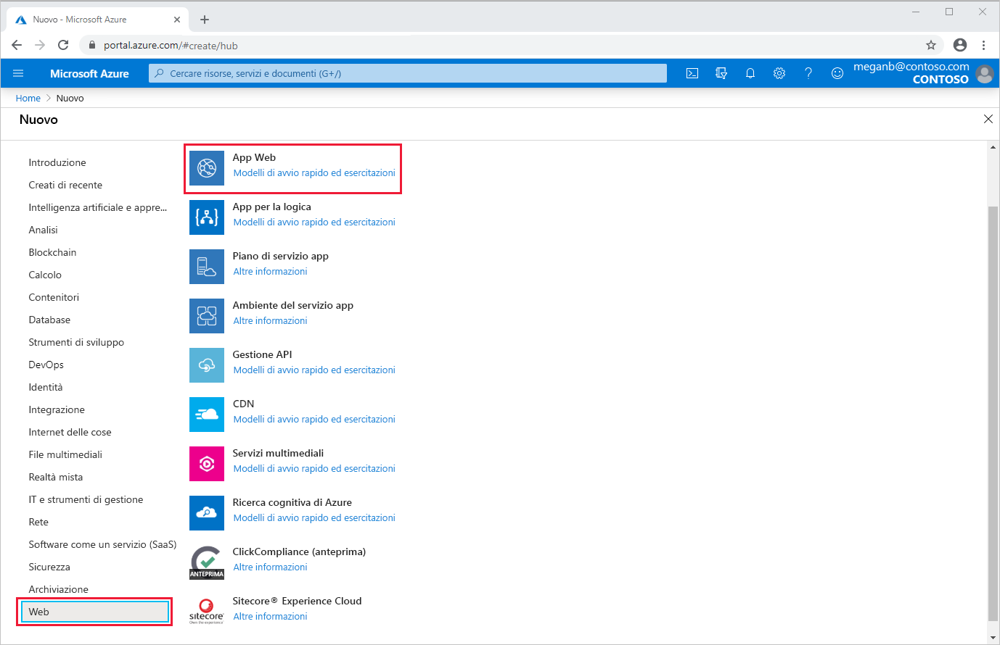
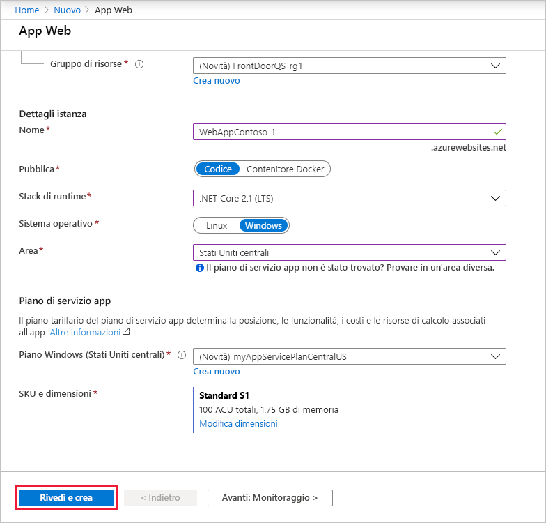
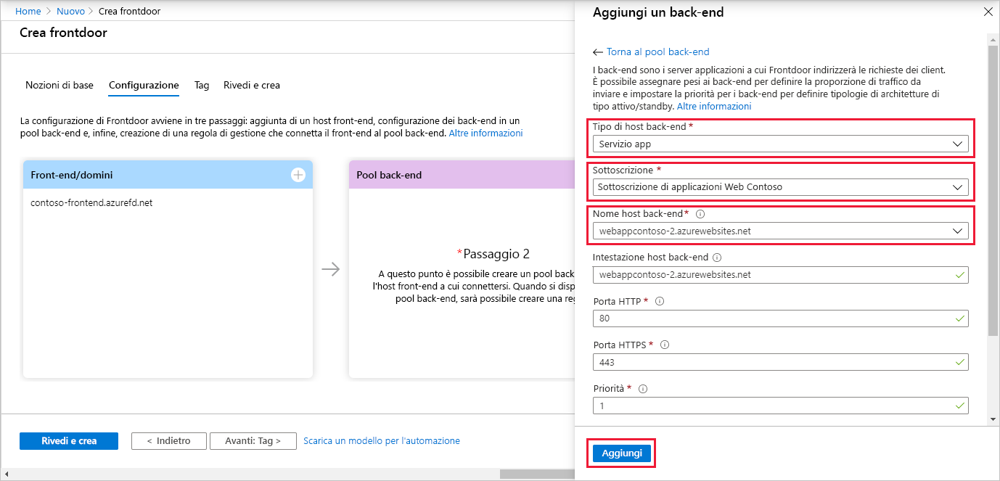

# Guida introduttiva: Creare una frontdoor per un'applicazione Web globale a disponibilità elevata

Per iniziare a usare Frontdoor di Azure, configurare la disponibilità elevata per un'applicazione Web tramite il portale di Azure.

In questo argomento di avvio rapido Frontdoor di Azure raggruppa due istanze di un'applicazione Web eseguite in aree di Azure diverse. La configurazione di Frontdoor viene creata in base a back-end di peso uguale e con la stessa priorità. Questa configurazione indirizza il traffico al sito più vicino che esegue l'applicazione. Frontdoor di Azure monitora continuamente l'applicazione Web. Il servizio fornisce il failover automatico al sito successivo disponibile quando il sito più vicino non è disponibile.

## Prerequisiti

- Un account Azure con una sottoscrizione attiva. [Creare un account gratuitamente](https://azure.microsoft.com/free/?WT.mc_id=A261C142F).

## Creare due istanze di un'app Web

Per questo argomento di avvio rapido, è necessario creare due istanze di un'applicazione Web eseguite in aree di Azure diverse. Entrambe le istanze dell'applicazione Web vengono eseguite in modalità *attiva/attiva*, in modo una possa acquisire traffico. Questa configurazione è diversa da una configurazione *attiva/standby*, in cui un'istanza agisce da failover.

Se non è già disponibile un'app Web, seguire questa procedura per configurarne una di esempio.

1. Accedere al portale di Azure all'indirizzo https://portal.azure.com.

1. Nella home page o nel menu di Azure selezionare **Crea una risorse**.

1. Selezionare **Web** > **App Web**.

   

1. In **App Web** selezionare la **Sottoscrizione** da usare.

1. Per **Gruppo di risorse** selezionare **Crea nuovo**. Immettere *FrontDoorQS_rg1* per **Nome** e selezionare **OK**.

1. In **Dettagli istanza** immettere un valore univoco per **Nome** dell'app Web. Questo esempio usa *WebAppContoso-1*.

1. Selezionare uno **stack di runtime**, in questo esempio *.NET Core 2.1 (LTS)* .

1. Selezionare un'area, ad esempio *Stati Uniti centrali.*

1. In **Piano Windows** selezionare **Crea nuovo**. Immettere *myAppServicePlanCentralUS* per **Nome** e selezionare **OK**.

1. Assicurarsi che l'opzione **SKU e dimensioni** sia impostata su **Standard S1, 100 ACU totali, 1,75 GB di memoria**.

1. Selezionare **Rivedi e crea**, esaminare la scheda **Riepilogo** e quindi selezionare **Crea**. Il completamento della distribuzione potrebbe richiedere diversi minuti.

   

Al termine della distribuzione, creare una seconda app Web. Seguire la stessa procedura con gli stessi valori, ad eccezione dei valori seguenti:

| Impostazione          | valore     |
| ---              | ---  |
| **Gruppo di risorse**   | Selezionare **Nuovo** e immettere *FrontDoorQS_rg2* |
| **Nome**             | Immettere un nome univoco per l'app Web, in questo esempio *WebAppContoso-2*  |
| **Area**           | Scegliere un'area diversa, in questo esempio *Stati Uniti centro-meridionali* |
| **Piano di servizio app** > **Piano Windows**         | Selezionare **Nuovo**, immettere *myAppServicePlanSouthCentralUS*, quindi selezionare **OK** |

## Creare una frontdoor per l'applicazione

Configurare Frontdoor di Azure per indirizzare il traffico degli utenti in base alla latenza più bassa tra i due server di app Web. Per iniziare, aggiungere un host front-end per Frontdoor di Azure.

1. Nella home page o nel menu di Azure selezionare **Crea una risorse**. Selezionare **Rete** > **Frontdoor**.

1. In **Crea una frontdoor** selezionare una **Sottoscrizione**.

1. Per **Gruppo di risorse**selezionare **Nuovo**, quindi immettere *FrontDoorQS_rg0* e selezionare **OK**.  In alternativa, è possibile usare un gruppo di risorse esistente.

1. Se è stato creato un gruppo di risorse, selezionare un valore per **Località del gruppo di risorse**, quindi selezionare **Avanti: Configurazione**.

1. In **Front-end/domini** selezionare **+** per aprire **Aggiungi un host front-end**.

1. Per **Nome host**, immettere un nome host univoco globale. Questo esempio usa *contoso-frontend*. Selezionare **Aggiungi**.

   

Successivamente, creare un pool back-end che contenga le due app Web.

1. Sempre in **Crea una frontdoor**, in **Pool back-end**, selezionare **+** per aprire **Aggiungi un pool back-end**.

1. Per **Nome**, immettere *myBackEndPool*.

1. Selezionare **Aggiungi un back-end**. Per **Tipo host back-end**, selezionare *Servizio app*.

1. Selezionare la sottoscrizione e quindi scegliere la prima app Web creata da **Nome host back-end**. In questo esempio l'app Web è *WebAppContoso-1*. Selezionare **Aggiungi**.

1. Selezionare di nuovo **Aggiungi un back-end**. Per **Tipo host back-end**, selezionare *Servizio app*.

1. Selezionare di nuovo la sottoscrizione e quindi scegliere la seconda app Web creata da **Nome host back-end**. Selezionare **Aggiungi**.

   

Infine, aggiungere una regola di routing. Una regola di routing esegue il mapping dell'host front-end al pool back-end. La regola inoltra una richiesta di `contoso-frontend.azurefd.net` a **myBackendPool**.

1. Sempre in **Crea una frontdoor**, in **Regole di routing**, selezionare **+** per configurare una regola di routing.

1. In **Aggiungi una regola**, per **Nome**, immettere *LocationRule*. Accettare tutti i valori predefiniti, quindi selezionare **Aggiungi** per aggiungere la regola di routing.

   >[!WARNING]
   > È **necessario** assicurarsi che ognuno degli host front-end nella frontdoor abbia una regola di routing con un percorso predefinito (`\*`) associato. Questo vuol dire che tra tutte le regole di gestione deve esisterne almeno una per ognuno degli host front-end definita nel percorso predefinito (`\*`). In caso contrario, è possibile che il traffico degli utenti finali non venga instradato correttamente.

1. Selezionare **Rivedi e crea** e quindi **Crea**.

   

## Visualizzare Frontdoor di Azure in azione

Dopo aver creato una frontdoor, occorreranno alcuni minuti perché la configurazione venga distribuita a livello globale. Al termine, accedere all'host front-end creato. In un browser passare all'indirizzo `contoso-frontend.azurefd.net`. La richiesta verrà automaticamente instradata al server più vicino tra quelli specificati nel pool back-end.

Se queste app sono state create in questo argomento di avvio rapido, verrà visualizzata una pagina di informazioni.

Per testare il failover globale istantaneo, provare a eseguire i passaggi seguenti:

1. Aprire un browser, come descritto sopra, e passare all'indirizzo del front-end `contoso-frontend.azurefd.net`.

1. Nel portale di Azure cercare e selezionare *Servizi app*. Scorrere verso il basso per trovare una delle app Web, in questo esempio **WebAppContoso-1**.

1. Selezionare l'app Web, quindi selezionare **Arresta**e **Sì** per verifica.

1. Aggiornare il browser. Si dovrebbe visualizzare la stessa pagina di informazioni.

   >[!TIP]
   >Per queste azioni si verifica un leggero ritardo. Può essere necessario eseguire di nuovo l'aggiornamento.

1. Trovare l'altra app Web e arrestarla.

1. Aggiornare il browser. Questa volta dovrebbe essere visualizzato un messaggio di errore.

   

## Pulire le risorse

Al termine, è possibile rimuovere tutti gli elementi creati. Con l'eliminazione di un gruppo di risorse viene eliminato anche il relativo contenuto. Se non si intende usare questa frontdoor, è consigliabile rimuovere le risorse pe evitare addebiti non necessari.

1. Nel portale di Azure cercare e selezionare **Gruppi di risorse** oppure scegliere **Gruppi di risorse** dal menu del portale di Azure.

1. Filtrare o scorrere verso il basso per trovare un gruppo di risorse, ad esempio **FrontDoorQS_rg0**.

1. Selezionare il gruppo di risorse e quindi **Elimina gruppo di risorse**.

   >[!WARNING]
   >Questa azione è irreversibile.

1. Digitare il nome del gruppo di risorse per verifica, quindi selezionare **Elimina**.

Ripetere la procedura per gli altri due gruppi.

## Passaggi successivi

Passare all'articolo successivo per informazioni su come aggiungere un dominio personalizzato alla frontdoor.
> [!div class="nextstepaction"]
> [Aggiungere un dominio personalizzato](front-door-custom-domain.md)

Per altre informazioni sul routing del traffico, vedere [Metodi di routing di Frontdoor](front-door-routing-methods.md).
