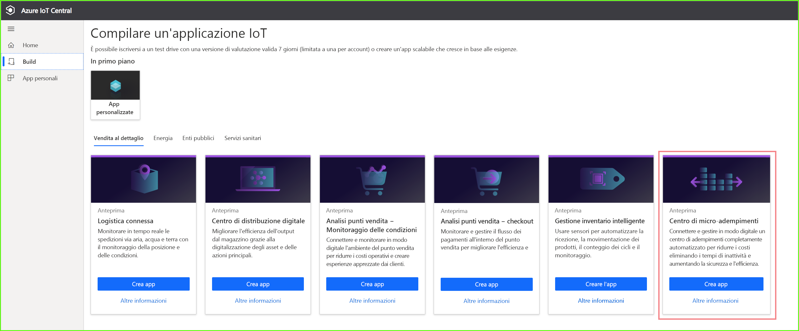
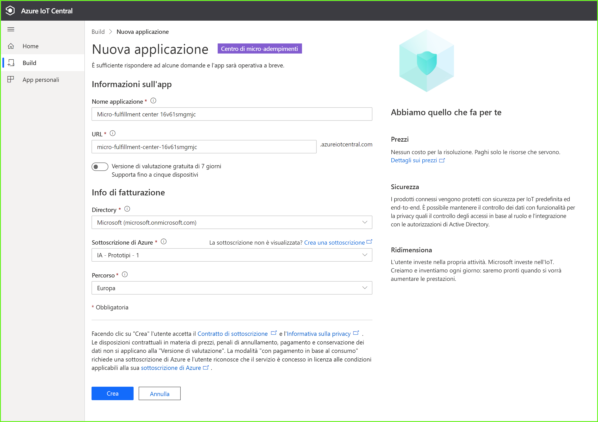
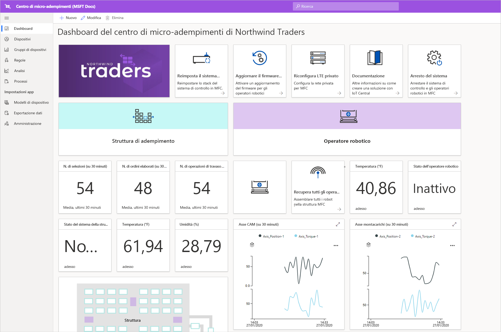
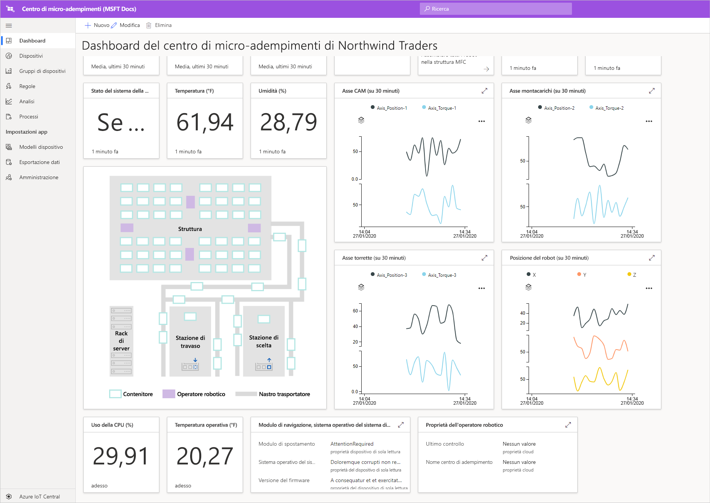

# Esercitazione: Distribuire ed esaminare un modello di applicazione Centro di micro-adempimenti

In questa esercitazione si userà il modello di applicazione Centro di micro-adempimenti di Azure IoT Central per creare una soluzione per la vendita al dettaglio. Si apprenderà come distribuire il modello, che cosa contiene e quali operazioni è opportuno eseguire successivamente.

## Prerequisiti
Per completare questa serie di esercitazioni, è necessaria una sottoscrizione di Azure. Facoltativamente, è possibile usare una versione di valutazione gratuita valida per 7 giorni. Se non si ha una sottoscrizione di Azure, è possibile crearne una nella [pagina di iscrizione ad Azure](https://aka.ms/createazuresubscription).

## Creare un'applicazione 
In questa sezione viene creata una nuova applicazione Azure IoT Central da un modello. Questa applicazione verrà usata in tutta la serie di esercitazioni per creare una soluzione completa.

Per creare una nuova applicazione Azure IoT Central:

1. Passare al [sito Web di gestione delle applicazioni Azure IoT Central](https://aka.ms/iotcentral).
1. Se si ha una sottoscrizione di Azure, accedere con le credenziali usate per tale sottoscrizione, in caso contrario accedere con un account Microsoft:

   

1. Per iniziare a creare una nuova applicazione Azure IoT Central, selezionare **Nuova applicazione**.

1. Selezionare **Vendita al dettaglio**.  Nella pagina relativa alla vendita al dettaglio sono visualizzati diversi modelli di applicazione di vendita al dettaglio.

Per creare una nuova applicazione Centro di micro-adempimenti che usa le funzionalità di anteprima:  
1. Selezionare il modello di applicazione **Centro di micro-adempimenti**. Questo modello include i modelli di tutti i dispositivi usati nell'esercitazione. Offre anche un dashboard operatore per il monitoraggio delle condizioni all'interno del centro di adempimenti, nonché delle condizioni dei trasportatori robotizzati. 

    
    
1. Facoltativamente, scegliere un **nome applicazione** descrittivo. Il modello di applicazione si basa sulla società fittizia Northwind Traders. 

    >[!NOTE]
    >Se si usa un nome applicazione descrittivo, è comunque necessario usare un valore univoco per l'URL dell'applicazione.

1. Se si ha una sottoscrizione di Azure, immettere la directory, la sottoscrizione di Azure e l'area. Se non si ha una sottoscrizione, è possibile abilitare la versione di valutazione gratuita di 7 giorni e completare le informazioni di contatto necessarie.  

    Per altre informazioni su directory e sottoscrizioni, vedere la guida di avvio rapido [Creare un'applicazione Azure IoT Central (funzionalità di anteprima)](../preview/quick-deploy-iot-central.md).

1. Selezionare **Create** (Crea).

    

## Esaminare l'applicazione 

Al termine della distribuzione del modello di app, verrà visualizzato il **dashboard del centro di micro-adempimenti di Northwind Traders**. Northwind Traders è un rivenditore fittizio che ha un centro di micro-adempimenti gestito in questa applicazione Azure IoT Central. Il dashboard operatore mostra le informazioni e i dati di telemetria relativi ai dispositivi inclusi nel modello nonché un set di comandi, processi e azioni che è possibile eseguire. Il dashboard presenta una divisione logica in due sezioni. A sinistra è possibile monitorare le condizioni ambientali all'interno della struttura di adempimenti, mentre a destra si può monitorare l'integrità di un trasportatore robotizzato all'interno della struttura.  

Nel dashboard è possibile eseguire queste operazioni:
   * Visualizzare i dati di telemetria dei dispositivi, come il numero di prelievi, il numero di ordini elaborati e proprietà come lo stato del sistema della struttura.  
   * Visualizzare la planimetria e la posizione dei trasportatori robotizzati all'interno della struttura di adempimenti.
   * Attivare comandi, ad esempio la reimpostazione del sistema di controllo, l'aggiornamento del firmware dei trasportatori e la riconfigurazione della rete.

     
   * Visualizzare un esempio del dashboard che può essere usato da un operatore per monitorare le condizioni all'interno del centro di adempimenti. 
   * Monitorare l'integrità dei payload in esecuzione nel dispositivo gateway all'interno del centro di adempimenti.    

     

## Modello di dispositivo
Se si seleziona la scheda Modelli di dispositivo, si noterà che il modello include due tipi diversi di dispositivo: 
   * **Operatore robotico**: questo modello di dispositivo rappresenta la definizione di un trasportatore robotizzato funzionante che è stato distribuito nella struttura di adempimenti ed esegue le operazioni appropriate di immagazzinamento e recupero. Se si seleziona il modello, si noterà che il robot invia dati sul dispositivo, come la temperatura e la posizione dell'asse, e proprietà come lo stato del trasportatore robotizzato. 
   * **Monitoraggio delle condizioni della struttura**: questo modello di dispositivo rappresenta una raccolta di dispositivi che consente di monitorare le condizioni ambientali, nonché il dispositivo gateway che ospita vari carichi di lavoro perimetrali per supportare il centro di adempimenti. Il dispositivo invia dati di telemetria come la temperatura, il numero di prelievi e il numero di ordini, nonché informazioni sullo stato e l'integrità dei carichi di lavoro di calcolo in esecuzione nell'ambiente. 

     

Se si seleziona la scheda Gruppi di dispositivi, si noterà anche che per questi modelli di dispositivo vengono creati automaticamente gruppi di dispositivi.

## Regole
Nella scheda **Regole** si noterà che il modello di applicazione include una regola di esempio per il monitoraggio delle condizioni di temperatura del trasportatore robotizzato. È possibile usare questa regola per avvisare l'operatore se un robot specifico nella struttura si sta surriscaldando e deve essere portato offline per la manutenzione. 

Usare la regola di esempio come spunto per definire regole più appropriate per le funzioni dell'azienda.

## Pulire le risorse

Se non si intende continuare a usare questa applicazione, eliminare il modello di applicazione. Passare ad **Amministrazione** > **Impostazioni dell'applicazione** e selezionare **Elimina**.

## Passaggi successivi
* Altre informazioni sull'[architettura della soluzione per il centro di micro-adempimenti](./architecture-micro-fulfillment-center.md).
* Altre informazioni sugli altri [modelli per la vendita al dettaglio di Azure IoT Central](./overview-iot-central-retail.md).
* [Panoramica di Azure IoT Central](../preview/overview-iot-central.md).
