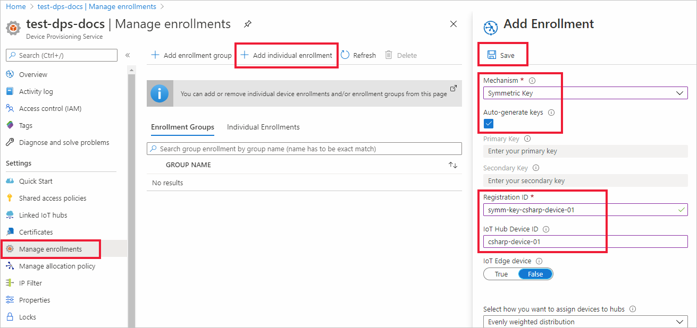
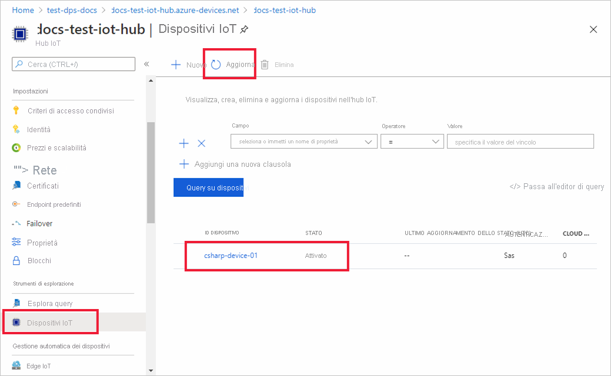

# <a name="quickstart-provision-a-symmetric-key-device-using-c"></a>Avvio rapido: Effettuare il provisioning di un dispositivo con chiave simmetrica in C#

Questo argomento di avvio rapido illustra come effettuare il provisioning di un computer di sviluppo Windows come un dispositivo in un hub IoT usando C#. Il dispositivo userà una chiave simmetrica e una registrazione singola per l'autenticazione con un'istanza del servizio Device Provisioning per poter essere assegnato a un hub IoT. Per effettuare il provisioning del dispositivo, verrà usato codice di esempio di [Azure IoT per C#](https://github.com/Azure-Samples/azure-iot-samples-csharp). 

Questo articolo illustra il provisioning con una registrazione singola, ma è anche possibile usare gruppi di registrazioni. Esistono alcune differenze quando si usano i gruppi di registrazioni. È ad esempio necessario usare una chiave di dispositivo derivata con un ID registrazione univoco per il dispositivo. L'articolo [Come effettuare il provisioning di dispositivi usando gruppi di registrazioni con chiave simmetrica](how-to-legacy-device-symm-key.md) include un esempio di gruppo di registrazioni. Per altre informazioni sui gruppi di registrazioni, vedere [Attestazione con chiave simmetrica delle registrazioni di gruppo](concepts-symmetric-key-attestation.md#group-enrollments).

Se non si ha familiarità con il processo di provisioning automatico, vedere la panoramica sul [provisioning](about-iot-dps.md#provisioning-process). 

Assicurarsi anche di avere completato la procedura descritta in [Configurare il servizio Device Provisioning in hub IoT con il portale di Azure](./quick-setup-auto-provision.md) prima di continuare con questa guida introduttiva. Questa guida introduttiva prevede che sia già stata creata un'istanza del servizio Device Provisioning.

Questo articolo si riferisce a una workstation basata su Windows. Tuttavia, è possibile eseguire le procedure in Linux. Per un esempio di Linux, vedere [Come effettuare il provisioning per la multi-tenancy](how-to-provision-multitenant.md).


[!INCLUDE [quickstarts-free-trial-note](../../includes/quickstarts-free-trial-note.md)]


## <a name="prerequisites"></a>Prerequisiti

* Verificare che nel computer basato su Windows sia installato [.NET Core 2.1 SDK](https://www.microsoft.com/net/download/windows) o versione successiva.

* La versione più recente di [Git](https://git-scm.com/download/) installata.

<a id="setupdevbox"></a>


## <a name="create-a-device-enrollment"></a>Creare una registrazione dei dispositivi

1. Accedere al [portale di Azure](https://portal.azure.com), selezionare il pulsante **Tutte le risorse** nel menu a sinistra e aprire un'istanza del servizio Device Provisioning.

2. Selezionare **Gestisci registrazioni** e quindi fare clic sul pulsante **Aggiungi registrazione singola** nella parte superiore. 

3. Nel pannello **Aggiungi registrazione** immettere le informazioni seguenti e premere il pulsante **Salva**.

   - **Meccanismo:** selezionare **Chiave simmetrica** come *meccanismo* di attestazione dell'identità.

   - **Genera chiavi automaticamente**: selezionare questa casella.

   - **ID registrazione**: immettere un ID di registrazione per identificare la registrazione. Usare solo caratteri alfanumerici minuscoli e trattini ("-"). Ad esempio, **symm-key-csharp-device-01**.

   - **ID dispositivo hub IoT:** immettere un identificatore di dispositivo. Ad esempio, **csharp-device-01**.

     

4. Dopo aver salvato la registrazione, la **chiave primaria** e la **chiave secondaria** verranno generate e aggiunte alla voce di registrazione. La registrazione del dispositivo con chiave simmetrica verrà visualizzata come **symm-key-csharp-device-01** nella colonna *ID registrazione* della scheda *Registrazioni singole*. 

5. Aprire la registrazione e copiare i valori generati per **Chiave primaria** e **Chiave secondaria**. Questo valore di chiave e l'**ID registrazione** verranno usati successivamente, al momento dell'aggiunta delle variabili di ambiente da usare con il codice di esempio per il provisioning del dispositivo.


## <a name="prepare-the-c-environment"></a>Preparare l'ambiente C# 

1. Aprire una shell CMD Git o un ambiente della riga di comando Bash Git. Clonare il repository GitHub degli [esempi di Azure IoT per C#](https://github.com/Azure-Samples/azure-iot-samples-csharp) usando il comando seguente:

    ```cmd
    git clone https://github.com/Azure-Samples/azure-iot-samples-csharp.git
    ```


<a id="firstbootsequence"></a>

## <a name="prepare-the-device-provisioning-code"></a>Preparare il codice per il provisioning del dispositivo

In questa sezione verranno aggiunte le quattro variabili di ambiente seguenti che verranno usate come parametri del codice di esempio relativo al provisioning di dispositivi per effettuare il provisioning del dispositivo con chiave simmetrica. 

* `DPS_IDSCOPE`
* `PROVISIONING_REGISTRATION_ID`
* `PRIMARY_SYMMETRIC_KEY`
* `SECONDARY_SYMMETRIC_KEY`

Il codice di provisioning contatterà l'istanza del servizio Device Provisioning in base a queste variabili per autenticare il dispositivo. Il dispositivo verrà quindi assegnato a un hub IoT già collegato all'istanza del servizio Device Provisioning in base alla configurazione della registrazione singola. Una volta effettuato il provisioning, il codice di esempio invierà alcuni dati di telemetria di test all'hub IoT.

1. Nel [portale di Azure](https://portal.azure.com) selezionare **Panoramica** nel menu del servizio Device Provisioning e copiare i valori per _Endpoint servizio_ e _ID ambito_. Questi valori vengono usati per le variabili di ambiente `PROVISIONING_HOST` e `DPS_IDSCOPE`.

    

2. Aprire un prompt dei comandi e passare a *SymmetricKeySample* nel repository degli esempi clonato:

    ```cmd
    cd provisioning\Samples\device\SymmetricKeySample
    ```

3. Nella cartella *SymmetricKeySample* aprire *Program.cs* in un editor di testo e trovare le righe di codice che impostano le stringhe `individualEnrollmentPrimaryKey` e `individualEnrollmentSecondaryKey`. Aggiornare queste righe di codice nel modo seguente, in modo da usare le variabili di ambiente anziché codificare le chiavi.
 
    ```csharp
        //These are the two keys that belong to your individual enrollment. 
        // Leave them blank if you want to try this sample for an individual enrollment instead
        //private const string individualEnrollmentPrimaryKey = "";
        //private const string individualEnrollmentSecondaryKey = "";

        private static string individualEnrollmentPrimaryKey = Environment.GetEnvironmentVariable("PRIMARY_SYMMETRIC_KEY");;
        private static string individualEnrollmentSecondaryKey = Environment.GetEnvironmentVariable("SECONDARY_SYMMETRIC_KEY");;
    ```

    Trovare inoltre la riga di codice che imposta la stringa `registrationId` e aggiornarla nel modo seguente in modo da usare una variabile di ambiente, come indicato di seguito:

    ```csharp
        //This field is mandatory to provide for this sample
        //private static string registrationId = "";

        private static string registrationId = Environment.GetEnvironmentVariable("PROVISIONING_REGISTRATION_ID");;
    ```

    Salvare le modifiche apportate a *Program.cs*.

3. Al prompt dei comandi aggiungere le variabili di ambiente per l'ambito ID, l'ID registrazione e le chiavi simmetriche primaria e secondaria copiati dalla registrazione singola nella sezione precedente.  

    I comandi seguenti sono esempi che illustrano la sintassi dei comandi. Assicurarsi di usare i valori corretti.

    ```console
    set DPS_IDSCOPE=0ne00000A0A
    ```

    ```console
    set PROVISIONING_REGISTRATION_ID=symm-key-csharp-device-01
    ```

    ```console
    set PRIMARY_SYMMETRIC_KEY=sbDDeEzRuEuGKag+kQKV+T1QGakRtHpsERLP0yPjwR93TrpEgEh/Y07CXstfha6dhIPWvdD1nRxK5T0KGKA+nQ==
    ```

    ```console
    set SECONDARY_SYMMETRIC_KEY=Zx8/eE7PUBmnouB1qlNQxI7fcQ2HbJX+y96F1uCVQvDj88jFL+q6L9YWLLi4jqTmkRPOulHlSbSv2uFgj4vKtw==
    ```


4. Compilare ed eseguire il codice di esempio tramite il comando seguente.

    ```console
    dotnet run
    ```

5. L'output previsto dovrebbe essere simile a quello riportato di seguito, che mostra l'hub IoT collegato a cui è stato assegnato il dispositivo in base alle impostazioni della registrazione singola. La stringa di esempio "TestMessage" viene inviata all'hub come test:

    ```output
    D:\azure-iot-samples-csharp\provisioning\Samples\device\SymmetricKeySample>dotnet run
    RegistrationID = symm-key-csharp-device-01
    ProvisioningClient RegisterAsync . . . Assigned
    ProvisioningClient AssignedHub: docs-test-iot-hub.azure-devices.net; DeviceID: csharp-device-01
    Creating Symmetric Key DeviceClient authentication
    DeviceClient OpenAsync.
    DeviceClient SendEventAsync.
    DeviceClient CloseAsync.
    Enter any key to exit
    ```
    
6. Nel portale di Azure passare all'hub IoT collegato al servizio di provisioning e aprire il pannello **Dispositivi IoT**. Al termine del provisioning del dispositivo a chiave simmetrica nell'hub, l'ID dispositivo verrà visualizzato con lo *STATO* **abilitato**. Potrebbe essere necessario premere il pulsante **Aggiorna** nella parte superiore se il pannello è stato aperto prima dell'esecuzione del codice di esempio del dispositivo. 

     

> [!NOTE]
> Se si è modificato lo *stato iniziale del dispositivo gemello* rispetto al valore predefinito della voce di registrazione del dispositivo, è possibile eseguire il pull dello stato del dispositivo desiderato dall'hub e agire di conseguenza. Per altre informazioni, vedere [Comprendere e usare dispositivi gemelli nell'hub IoT](../iot-hub/iot-hub-devguide-device-twins.md).
>


## <a name="clean-up-resources"></a>Pulire le risorse

Se si prevede di continuare a usare ed esplorare l'esempio di client dispositivo, non eseguire la pulizia delle risorse create in questa guida di avvio rapido. Se non si intende continuare, seguire questa procedura per eliminare tutte le risorse create in questa guida.

1. Nel portale di Azure selezionare **Tutte le risorse** nel menu a sinistra e quindi il servizio Device Provisioning. Aprire **Gestisci registrazioni** per il servizio e quindi selezionare la scheda **Registrazioni singole**. Selezionare la casella di controllo accanto all'*ID registrazione* del dispositivo registrato in questa guida di avvio rapido e fare clic sul pulsante **Elimina** nella parte superiore del riquadro. 
1. Nel menu a sinistra nel portale di Azure selezionare **Tutte le risorse** e quindi selezionare l'hub IoT. Aprire il pannello **Dispositivi IoT** per l'hub, selezionare la casella di controllo accanto all'*ID dispositivo* del dispositivo registrato in questa guida di avvio rapido e quindi fare clic sul pulsante **Elimina** nella parte superiore del riquadro.

## <a name="next-steps"></a>Passaggi successivi

In questa guida di avvio rapido è stato effettuato il provisioning di un dispositivo a chiave simmetrica basato su Windows nell'hub IoT usando il servizio Device Provisioning in hub IoT. Per informazioni su come effettuare il provisioning di dispositivi con certificati X.509 usando C#, continuare con la guida di avvio rapido seguente per i dispositivi X.509. 

> [!div class="nextstepaction"]
> [Avvio rapido di Azure - Effettuare il provisioning di dispositivi X.509 con il servizio Device Provisioning e C#](quick-create-simulated-device-x509-csharp.md)
