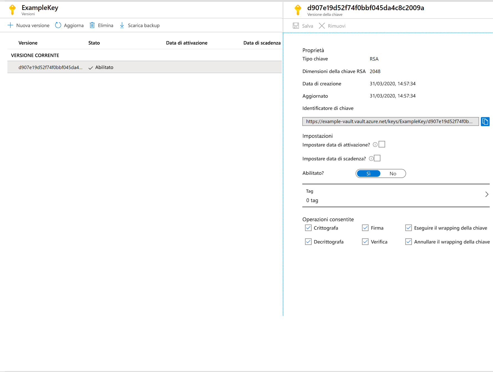

# Avvio rapido: Impostare e recuperare una chiave da Azure Key Vault con il portale di Azure

Azure Key Vault è un servizio cloud che funziona come archivio protetto dei segreti. È possibile archiviare in modo sicuro chiavi, password, certificati e altri segreti. È possibile creare e gestire istanze di Azure Key Vault tramite il portale di Azure. In questo avvio rapido viene creato un insieme di credenziali delle chiavi che viene poi usato per archiviare una chiave. Per altre informazioni su Key Vault, vedere la relativa [panoramica](../general/overview.md).

Se non si ha una sottoscrizione di Azure, creare un [account gratuito](https://azure.microsoft.com/free/?WT.mc_id=A261C142F) prima di iniziare.

## Accedere ad Azure

Accedere al portale di Azure all'indirizzo https://portal.azure.com.

## Creare un insieme di credenziali

1. Nel menu del portale di Azure o dalla pagina **Home** selezionare **Crea una risorsa**.
2. Nella casella di ricerca immettere **Key Vault**.
3. Nell'elenco dei risultati scegliere **Key Vault**.
4. Nella sezione Key Vault scegliere **Crea**.
5. Nella pagina **Crea insieme di credenziali delle chiavi** specificare le informazioni seguenti:
    - **Name**: è necessario un nome univoco. Per questa guida di avvio rapido si userà **Example-Vault**. 
    - **Sottoscrizione** Scegliere una sottoscrizione.
    - In **Gruppo di risorse** scegliere **Crea nuovo** e immettere il nome del gruppo di risorse.
    - Scegliere un percorso nel menu a discesa **Percorso**.
    - Lasciare invariati i valori predefiniti delle altre opzioni.
6. Dopo avere specificato le informazioni, selezionare **Crea**.

Prendere nota delle due proprietà elencate di seguito:

* **Vault Name**: in questo esempio corrisponde a **Example-Vault**. Questo nome verrà usato per altri passaggi.
* **Vault URI** (URI dell'insieme di credenziali): in questo esempio corrisponde a https://example-vault.vault.azure.net/. Le applicazioni che usano l'insieme di credenziali tramite l'API REST devono usare questo URI.

A questo punto, l'account Azure è l'unico autorizzato a eseguire operazioni su questo nuovo insieme di credenziali.

## Aggiungere una chiave a Key Vault

Per aggiungere una chiave a Key Vault, sono sufficienti un paio di passaggi aggiuntivi. In questo caso si aggiunge una chiave che può essere usata da un'applicazione. Il nome della chiave è **ExampleKey**.

1. Nella pagina delle proprietà di Key Vault selezionare **Chiavi**.
2. Fare clic su **Genera/Importa**.
3. Nella schermata **Creare una chiave** selezionare i seguenti valori:
    - **Opzioni**: Genera.
    - **Nome**: ExampleKey.
    - Lasciare invariati gli altri valori predefiniti. Fare clic su **Crea**.

Dopo avere ricevuto il messaggio che indica che la chiave è stata creata, è possibile fare clic sulla chiave nell'elenco. Sarà quindi possibile vedere alcune delle proprietà. Se si fa clic sulla versione corrente è possibile visualizzare il valore specificato nel passaggio precedente.

## Pulire le risorse

Altre guide di avvio rapido ed esercitazioni relative a Key Vault si basano su questa guida di avvio rapido. Se si prevede di usare le guide di avvio rapido e le esercitazioni successive, è consigliabile non cancellare le risorse create.
Quando non è più necessario, eliminare il gruppo di risorse per eliminare l'istanza di Key Vault e le risorse correlate. Per eliminare il gruppo di risorse tramite il portale:

1. Immettere il nome del gruppo di risorse nella casella di ricerca nella parte superiore del portale. Quando nei risultati della ricerca viene visualizzato il gruppo di risorse usato in questo avvio rapido, selezionarlo.
2. Selezionare **Elimina gruppo di risorse**.
3. Nella casella **DIGITARE IL NOME DEL GRUPPO DI RISORSE:** digitare il nome del gruppo di risorse e selezionare **Elimina**.

## Passaggi successivi

In questa guida di avvio rapido è stata creata un'istanza di Key Vault in cui è stata archiviata una chiave. Per altre informazioni sul servizio Key Vault e su come integrarlo nelle applicazioni, continuare con gli articoli seguenti.

- Leggere una [panoramica di Azure Key Vault](../general/overview.md)
- Vedere la [Guida per gli sviluppatori per Azure Key Vault](../general/developers-guide.md)
- Vedere [Panoramica della sicurezza di Key Vault](../general/security-overview.md)