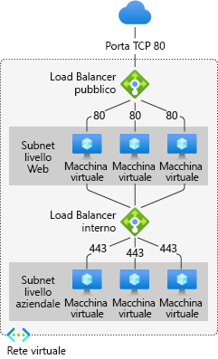

# Componenti di Azure Load Balancer

Azure Load Balancer contiene numerosi componenti principali che ne garantiscono il funzionamento. Questi componenti possono essere configurati nella sottoscrizione tramite il portale di Azure, l'interfaccia della riga di comando di Azure, Azure PowerShell o i modelli.

## Configurazioni IP front-end

l'indirizzo IP pubblico del servizio Load Balancer. Rappresenta il punto di contatto per i client. Questi indirizzi possono essere:

- **Indirizzo IP pubblico**
- **Indirizzo IP privato**

La selezione dell'indirizzo IP determina il **tipo** del servizio di bilanciamento del carico creato. La selezione dell'indirizzo IP privato crea un servizio di bilanciamento del carico interno. La selezione dell'indirizzo IP pubblico crea un servizio di bilanciamento del carico pubblico.

|  | Servizio di bilanciamento del carico pubblico  | Servizio di bilanciamento del carico interno |
| ---------- | ---------- | ---------- |
| Configurazione dell'indirizzo IP front-end| Indirizzo IP pubblico | Indirizzo IP privato|
| Descrizione | Un servizio di bilanciamento del carico pubblico esegue il mapping dell'indirizzo IP pubblico e della porta del traffico in ingresso all'indirizzo IP privato e alla porta della macchina virtuale. Il servizio di bilanciamento esegue il mapping in senso inverso del traffico di risposta dalla macchina virtuale. Se si applicano le regole di bilanciamento del carico, è possibile distribuire tipi specifici di traffico in più macchine virtuali o servizi. È ad esempio possibile dividere il carico del traffico delle richieste Web tra più server Web.| Un servizio di bilanciamento del carico interno distribuisce il traffico alle risorse che si trovano all'interno di una rete virtuale. Azure limita l'accesso agli indirizzi IP front-end con carico bilanciato di una rete virtuale. Gli indirizzi IP front-end e le reti virtuali non sono mai esposti direttamente a un endpoint di Internet. Le applicazioni line-of-business interne vengono eseguite in Azure e sono accessibili dall'interno di Azure o da risorse locali. |
| SKU supportati | Basic e Standard | Basic e Standard |

## Pool back-end

Gruppo di macchine virtuali o di istanze nel set di scalabilità di macchine virtuali che gestiscono la richiesta in ingresso. Per un ridimensionamento a costi contenuti in base ai volumi elevati del traffico in ingresso, le linee guida per il calcolo raccomandano in genere di aggiungere altre istanze al pool back-end. 

Load Balancer si riconfigura immediatamente tramite una riconfigurazione automatica in base all'aumento o alla riduzione delle istanze. L'aggiunta o la rimozione di macchine virtuali dal pool back-end riconfigura il servizio di bilanciamento del carico senza operazioni aggiuntive. L'ambito del pool back-end è una qualsiasi macchina virtuale nella rete virtuale. 

Mentre si valuta come progettare il pool back-end, è consigliabile prevedere il minor numero di singole risorse pool di back-end per ottimizzare ulteriormente la durata delle operazioni di gestione. Non vi è alcuna differenza in termini di scalabilità o prestazioni del piano dati.

## Probe di integrità

un probe di integrità viene usato per determinare l'integrità delle istanze nel pool back-end. È possibile definire la soglia di non integrità per i probe di integrità. Se un probe non risponde, il servizio di bilanciamento del carico interrompe l'invio di nuove connessioni alle istanze non integre. Un errore di probe non influisce sulle connessioni esistenti. La connessione continua fino a quando:

- L'applicazione termina il flusso
- Si verifica un timeout di inattività
- La VM viene arrestata

Load Balancer fornisce diversi tipi di probe di integrità per endpoint:

- TCP
- HTTP
- HTTPS

Il servizio Load Balancer Basic non supporta i probe HTTPS. Il servizio Load Balancer Basic chiude tutte le connessioni TCP (incluse quelle stabilite).

## Regole di bilanciamento del carico

Le regole di bilanciamento del carico indicano al servizio di bilanciamento del carico le operazioni da eseguire. Una regola di bilanciamento del carico esegue il mapping di una configurazione IP front-end e di una porta specifiche a più indirizzi IP e porte back-end.

## Regole NAT in ingresso

Le regole NAT in ingresso inoltrano il traffico dall'indirizzo IP front-end a un'istanza di back-end all'interno della rete virtuale. Il port forwarding viene eseguito dalla stessa distribuzione basata su hash del bilanciamento del carico. 

Gli scenari di utilizzo includono ad esempio le sessioni Remote Desktop Protocol (RDP) o Secure Shell (SSH) per separare le istanze delle macchine virtuali all'interno di una rete virtuale. È possibile eseguire il mapping di più endpoint interni a porte sullo stesso indirizzo IP front-end. È possibile usare gli indirizzi IP front-end per gestire in modalità remota le macchine virtuali senza un sistema jump box.

## Regole in uscita

Una regola in uscita configura il processo NAT (Network Address Translation) in uscita per tutte le macchine virtuali o le istanze identificate dal pool back-end.

Il servizio Load Balancer Basic non supporta le regole in uscita.

## Passaggi successivi

- Per iniziare a usare il servizio Load Balancer, vedere [Creare un servizio Load Balancer Standard pubblico](quickstart-load-balancer-standard-public-portal.md).
- Altre informazioni su [Azure Load Balancer](load-balancer-overview.md).
- Informazioni sull'[indirizzo IP pubblico](https://docs.microsoft.com/azure/virtual-network/virtual-network-public-ip-address)
- Informazioni sull'[indirizzo IP privato](https://docs.microsoft.com/azure/virtual-network/virtual-network-ip-addresses-overview-arm#private-ip-addresses)
- Informazioni sull'uso di [Load Balancer Standard e zone di disponibilità](load-balancer-standard-availability-zones.md).
- Altre informazioni sulla diagnostica per [Azure Load Balancer Standard](load-balancer-standard-diagnostics.md).
- Informazioni su [Reimpostare TCP in caso di inattività](load-balancer-tcp-reset.md).
- Informazioni su [Load Balancer Standard con regole di bilanciamento del carico di porte a disponibilità elevata](load-balancer-ha-ports-overview.md).
- Informazioni sull'uso di [Load Balancer con più front-end](load-balancer-multivip-overview.md).
- Vedere altre informazioni sui [gruppi di sicurezza di rete](../virtual-network/security-overview.md).
- Informazioni sui [tipi di probe](load-balancer-custom-probe-overview.md#types).
- Altre informazioni sui [Limiti di Load Balancer](https://docs.microsoft.com/azure/azure-resource-manager/management/azure-subscription-service-limits#load-balancer).
- Altre informazioni sull'uso del [port forwarding](https://docs.microsoft.com/azure/load-balancer/tutorial-load-balancer-port-forwarding-portal).
- Altre informazioni sulle [Regola in uscita di Load Balancer](https://docs.microsoft.com/azure/load-balancer/load-balancer-outbound-rules-overview).
