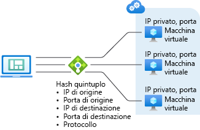

# Algoritmo di Azure Load Balancer

Load Balancer offre numerose funzionalità per le applicazioni UDP e TCP.

## Algoritmo di bilanciamento del carico

È possibile creare una regola di bilanciamento del carico per distribuire il traffico dal pool front-end a un pool back-end. Azure Load Balancer usa un algoritmo hash per la distribuzione dei flussi in ingresso (non i byte). Load Balancer riscrive le intestazioni dei flussi nelle istanze del pool back-end. Un server è disponibile per ricevere i nuovi flussi quando un probe di integrità indica un endpoint di back-end integro.

Per impostazione predefinita, Load Balancer usa un hash a 5 tuple.

L'hash include:

- **Indirizzo IP di origine**
- **Porta di origine**
- **Indirizzo IP di destinazione**
- **Porta di destinazione**
- **Numero di protocollo IP per il mapping dei flussi ai server disponibili**

L'affinità con un indirizzo IP di origine viene creata tramite un hash a due o tre tuple. Tutti i pacchetti dello stesso flusso arrivano nella stessa istanza dietro il front-end con carico bilanciato.

Quando il client avvia un nuovo flusso dallo stesso indirizzo IP di origine, la porta di origine cambia. Di conseguenza, l'hash a 5 tuple può determinare l'instradamento del traffico a un endpoint back-end diverso.
Per altre informazioni, vedere [Configurare la modalità di distribuzione per Azure Load Balancer](./load-balancer-distribution-mode.md).

L'immagine seguente mostra la distribuzione basata su hash:

*Figura: Distribuzione basata su hash*

## Indipendenza e trasparenza delle applicazioni

Load Balancer non interagisce direttamente con il protocollo TCP o UDP o con il livello dell'applicazione. Può essere supportato qualsiasi scenario di applicazione TCP o UDP. Load Balancer non chiude né genera flussi o interagisce con il payload del flusso. Load Balancer non fornisce la funzionalità del gateway del livello applicazione. Gli handshake del protocollo si verificano sempre direttamente tra il client e l'istanza del pool back-end. Una risposta a un flusso in ingresso è sempre una risposta da una macchina virtuale. Quando il flusso arriva nella macchina virtuale, viene mantenuto anche l'indirizzo IP di origine.

- A ogni endpoint risponde una macchina virtuale. Ad esempio, si verifica sempre un handshake TCP tra il client e la macchina virtuale back-end selezionata. Una risposta a una richiesta in un front-end è una risposta generata da una macchina virtuale di back-end. Quando si convalida correttamente la connettività a un front-end, si convalida anche la connettività per almeno una macchina virtuale back-end.
- I payload dell'applicazione sono trasparenti per Load Balancer. Qualsiasi applicazione UDP o TCP può essere supportata.
- Poiché Load Balancer non interagisce con il payload TCP e fornisce l'offload TLS, è possibile creare scenari crittografati completi. L'uso di Load Balancer consente di ottenere un'ampia scalabilità orizzontale per le applicazioni TLS terminando la connessione TLS nella macchina virtuale stessa. Ad esempio, la funzionalità di codifica della sessione TLS è limitata solo dal tipo e dal numero di macchine virtuali aggiunte al pool di back-end.

## Passaggi successivi

- Informazioni sui [componenti](components.md) di Azure Load Balancer.
- Vedere [Creare un servizio Load Balancer Standard pubblico](quickstart-load-balancer-standard-public-portal.md) per iniziare a usare un servizio Load Balancer, crearne uno, creare macchine virtuali con un'estensione IIS personalizzata installata e bilanciare il carico dell'app Web tra le macchine virtuali.
- Informazioni sulle [Connessioni in uscita di Azure Load Balancer](load-balancer-outbound-connections.md).
- Altre informazioni su [Azure Load Balancer](load-balancer-overview.md).
- Informazioni sui [probe di integrità](load-balancer-custom-probe-overview.md).
- Altre informazioni sulla diagnostica per [Azure Load Balancer Standard](load-balancer-standard-diagnostics.md).
- Vedere altre informazioni sui [gruppi di sicurezza di rete](../virtual-network/network-security-groups-overview.md).