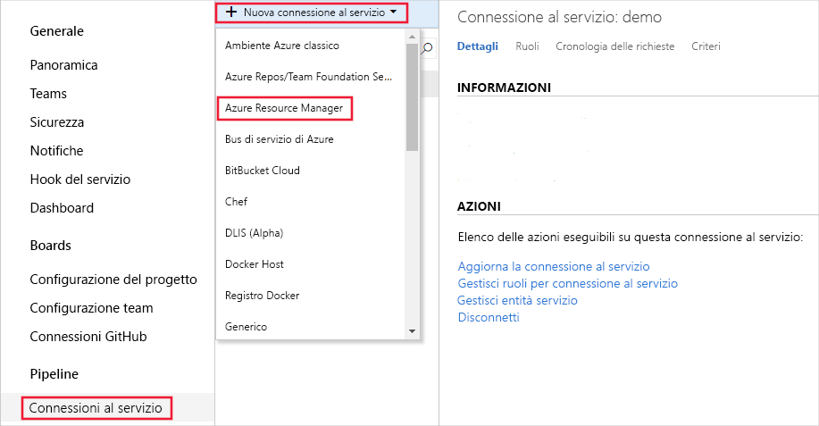
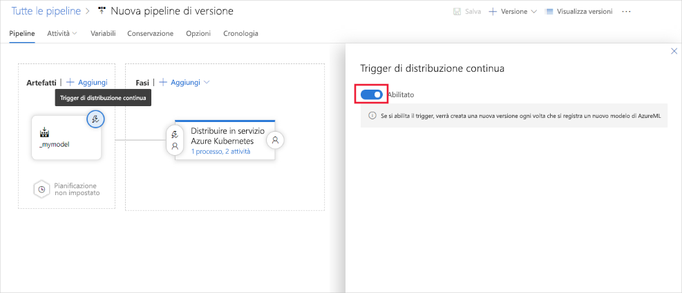

# Distribuzione continua di modelli

Questo articolo illustra come usare la distribuzione continua in Azure DevOps per verificare automaticamente la presenza di nuove versioni dei modelli registrati ed effettuare il push di tali nuovi modelli nell'ambiente di produzione.

## Prerequisiti

Questo articolo presuppone che sia già stato registrato un modello nell'area di lavoro Azure Machine Learning. Vedere [questa esercitazione](how-to-train-scikit-learn.md) per un esempio di formazione e registrazione di un modello Scikit-learn.

## Distribuzione continua di modelli

È possibile distribuire i modelli in modo continuo usando l'estensione Machine Learning per [Azure DevOps](https://azure.microsoft.com/services/devops/). È possibile usare l'estensione Machine Learning per Azure DevOps per attivare una pipeline di distribuzione quando viene registrato un nuovo modello di apprendimento automatico in un'area di lavoro di Azure Machine Learning.

1. Iscriversi a [Azure Pipelines](https://docs.microsoft.com/azure/devops/pipelines/get-started/pipelines-sign-up?view=azure-devops), che rende possibile l'integrazione e il recapito continui dell'applicazione in qualsiasi piattaforma o cloud. Si noti che Azure Pipelines non è uguale [Machine Learning pipeline](concept-ml-pipelines.md#compare).

1. [Creare un progetto DevOps di Azure.](https://docs.microsoft.com/azure/devops/organizations/projects/create-project?view=azure-devops)

1. Installare l' [estensione Machine Learning per Azure Pipelines](https://marketplace.visualstudio.com/items?itemName=ms-air-aiagility.vss-services-azureml&targetId=6756afbe-7032-4a36-9cb6-2771710cadc2&utm_source=vstsproduct&utm_medium=ExtHubManageList).

1. Usare le connessioni al servizio per configurare una connessione dell'entità servizio all'area di lavoro Azure Machine Learning in modo che sia possibile accedere agli elementi. Passare a Impostazioni progetto, selezionare **connessioni al servizio**e quindi selezionare **Azure Resource Manager**:

    

1. Nell'elenco **livello ambito** selezionare **AzureMLWorkspace**e quindi immettere il resto dei valori:

    

1. Per distribuire continuamente il modello di apprendimento automatico usando Azure Pipelines, in pipeline selezionare **versione**. Aggiungere un nuovo elemento, quindi selezionare l'elemento del **modello AzureML** e la connessione del servizio creata in precedenza. Selezionare il modello e la versione per attivare una distribuzione:

    

1. Abilitare il trigger del modello nell'elemento del modello. Quando si attiva il trigger, ogni volta che la versione specificata (ovvero la versione più recente) del modello viene registrata nell'area di lavoro, viene attivata una pipeline di rilascio di Azure DevOps.

    

## Passaggi successivi

Per altri esempi di distribuzione continua per i modelli ML, vedere i progetti seguenti su GitHub.

* [Microsoft/MLOps](https://github.com/Microsoft/MLOps)
* [Microsoft/MLOpsPython](https://github.com/microsoft/MLOpsPython)