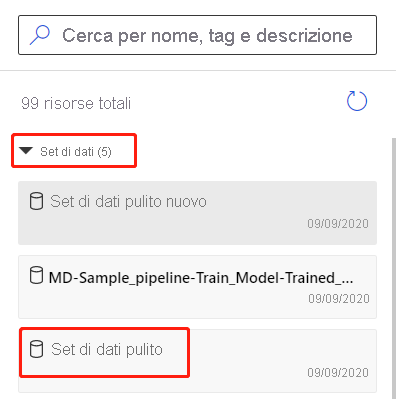

# Importazione dei propri dati nella finestra di progettazione di Azure Machine Learning (anteprima)

In questo articolo si spiega come importare dati nella finestra di progettazione per creare soluzioni personalizzate. È possibile importare i dati nella finestra di progettazione in due modi: 

* **Set di dati in Azure Machine Learning**: registrare i [set di dati](concept-data.md#datasets) in Azure Machine Learning per abilitare le funzionalità avanzate che consentono di gestire i dati.
* **Importare il modulo dati**: usare il modulo [Import Data](algorithm-module-reference/import-data.md) per accedere direttamente ai dati dalle origini dati online.

## Uso dei set di dati di Azure Machine Learning

Consigliamo di usare i [set di dati](concept-data.md#datasets) per importare i dati nella finestra di progettazione. Quando si registra un set di dati, è possibile sfruttare appieno funzionalità avanzate come [il controllo delle versioni e il rilevamento](how-to-version-track-datasets.md) e [il monitoraggio dei dati](how-to-monitor-datasets.md).

### Registrazione di un set di dati

È possibile registrare i set di dati esistenti [a livello di codice con l'SDK](how-to-create-register-datasets.md#use-the-sdk) o [visivamente in Azure Machine Learning Studio](how-to-create-register-datasets.md#use-the-ui).

È anche possibile registrare l'output di qualsiasi modulo della finestra di progettazione come set di dati.

1. Selezionare il modulo che restituisce i dati da registrare.

1. Nel riquadro delle proprietà selezionare **Output** > **Registra set di dati**.

    

### Uso di un set di dati

I set di dati registrati sono disponibili nella tavolozza dei moduli, in **Set di dati** > **Set di dati personali**. Per usare un set di dati, trascinarlo e rilascialo nelle canvas della pipeline. Collegare quindi la porta di uscita del set di dati agli altri moduli della tavolozza.

> [!NOTE]
> Al momento la finestra di progettazione supporta solo l'elaborazione di [set di dati tabulari](how-to-create-register-datasets.md#dataset-types). Per impiegare un [set di dati in file](how-to-create-register-datasets.md#dataset-types), usare l'SDK di Azure Machine Learning, disponibile per Python e R.

## Importazione dei dati usando il modulo Importa dati

Sebbene sia consigliabile usare i set di dati per importare i dati, è anche possibile usare il modulo [Import Data](algorithm-module-reference/import-data.md). Il modulo Import Data salta la registrazione del set di dati in Azure Machine Learning e importa i dati direttamente da un [archivio dati](concept-data.md#datastores) o da un URL HTTP.

Per informazioni dettagliate su come usare il modulo Import Data, vedere la [pagina di riferimento di Importa dati](algorithm-module-reference/import-data.md).

> [!NOTE]
> Se nel set di dati sono presenti troppe colonne, potrebbe verificarsi il seguente errore: "Convalida non riuscita a causa della limitazione delle dimensioni". Per evitare che si verifichi, [registrare il set di dati nell'interfaccia Set di dati](how-to-create-register-datasets.md#use-the-ui).

## Origini supportate

In questa sezione sono elencate le origini dati supportate dalla finestra di progettazione. I dati della finestra di progettazione provengono da un archivio dati o da un [set di dati tabulare](how-to-create-register-datasets.md#dataset-types).

### Origini di archivio dati
Per un elenco delle origini di archivio dati supportate, vedere [Accesso ai dati nei servizi di archiviazione di Azure](how-to-access-data.md#supported-data-storage-service-types).

### Origini di set di dati tabulari

La finestra di progettazione supporta i set di dati tabulari creati dalle origini seguenti:
 * File delimitati
 * File JSON
 * File Parquet
 * Query SQL

## Tipi di dati

La finestra di progettazione riconosce internamente i tipi di dati seguenti:

* string
* Integer
* Decimal
* Boolean
* Data

La finestra di progettazione usa un tipo di dati interno per passare i dati tra i moduli. È possibile convertire in modo esplicito i dati in formato tabella dati tramite il modulo [Convert to Dataset](algorithm-module-reference/convert-to-dataset.md). I moduli che accettano formati diversi da quello interno convertono i dati in modo automatico prima di passare al modulo successivo.

## Vincoli dei dati

I moduli della finestra di progettazione sono limitati dalle dimensioni della destinazione di calcolo. Per i set di dati più grandi è necessario usare una risorsa di calcolo Azure Machine Learning più grande. Per altre informazioni sulle destinazioni di calcolo di Azure Machine Learning vedere [Cosa sono le destinazioni di calcolo in Azure Machine Learning?](concept-compute-target.md#azure-machine-learning-compute-managed)

## Passaggi successivi

Nozioni di base sulla finestra di progettazione con [Esercitazione: Stimare il prezzo di un'automobile con la finestra di progettazione](tutorial-designer-automobile-price-train-score.md).
