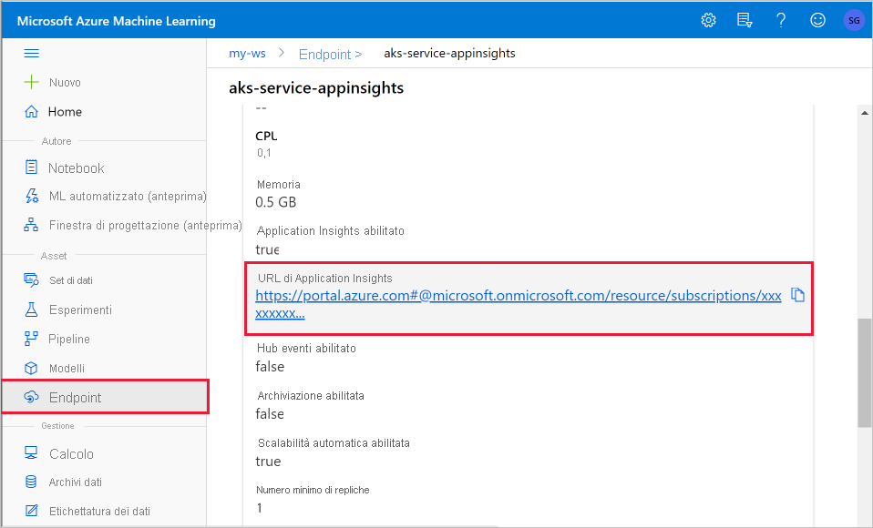
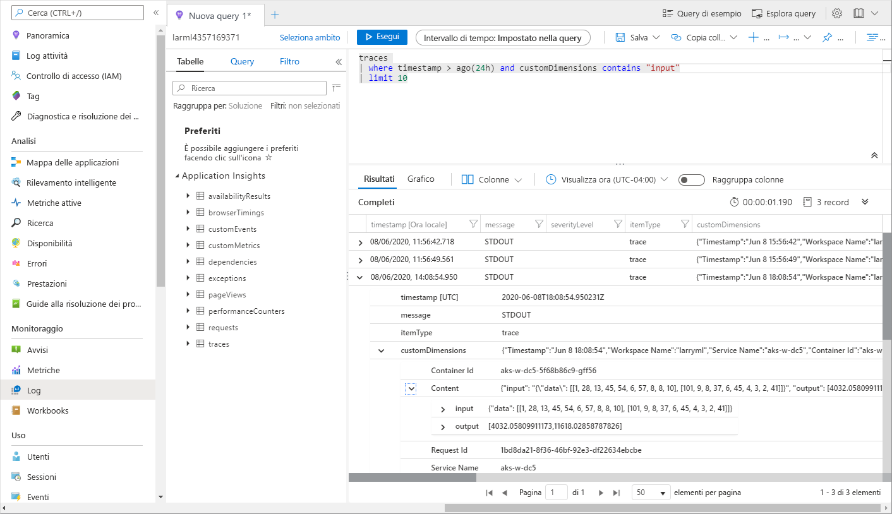

# <a name="monitor-and-collect-data-from-ml-web-service-endpoints"></a>Monitorare e raccogliere dati da endpoint servizio Web di ML


Questo articolo illustra come raccogliere dati da modelli distribuiti in endpoint di servizio Web in Azure Kubernetes Service (AKS) o istanze di contenitore di Azure (ACI). Usare [applicazione Azure Insights](../azure-monitor/app/app-insights-overview.md) per raccogliere i dati seguenti da un endpoint:
* Dati di output
* Risposte
* Frequenza delle richieste, tempi di risposta e percentuali di errore
* Tassi di dipendenza, tempi di risposta e percentuali di errore
* Eccezioni

Il notebook [Enable-App-Insights-in-Production-Service. ipynb](https://github.com/Azure/MachineLearningNotebooks/blob/master/how-to-use-azureml/deployment/enable-app-insights-in-production-service/enable-app-insights-in-production-service.ipynb) illustra i concetti descritti in questo articolo.
 
[!INCLUDE [aml-clone-in-azure-notebook](../../includes/aml-clone-for-examples.md)]
 
## <a name="prerequisites"></a>Prerequisiti

* Una sottoscrizione di Azure: provare la [versione gratuita o a pagamento di Azure Machine Learning](https://aka.ms/AMLFree).

* Un'area di lavoro di Azure Machine Learning, una directory locale contenente gli script e Azure Machine Learning SDK per Python installato. Per ulteriori informazioni, vedere [come configurare un ambiente di sviluppo](how-to-configure-environment.md).

* Un modello di Machine Learning addestrato. Per altre informazioni, vedere l'esercitazione [Train image classification Model](tutorial-train-models-with-aml.md) .

<a name="python"></a>

## <a name="configure-logging-with-the-python-sdk"></a>Configurare la registrazione con Python SDK

Questa sezione illustra come abilitare la registrazione di Application Insights usando Python SDK. 

### <a name="update-a-deployed-service"></a>Aggiornare un servizio distribuito

Per aggiornare un servizio Web esistente, attenersi alla procedura seguente:

1. Identificare il servizio nell'area di lavoro. Il valore per `ws` è il nome dell'area di lavoro

    ```python
    from azureml.core.webservice import Webservice
    aks_service= Webservice(ws, "my-service-name")
    ```
2. Aggiornare il servizio e abilitare applicazione Azure Insights

    ```python
    aks_service.update(enable_app_insights=True)
    ```

### <a name="log-custom-traces-in-your-service"></a>Registrare tracce personalizzate nel servizio

> [!IMPORTANT]
> Applicazione Azure Insights registra solo i payload fino a 64KB. Se viene raggiunto questo limite, è possibile che vengano visualizzati errori, ad esempio memoria insufficiente, oppure che non vengano registrate informazioni. Se i dati da registrare sono di dimensioni maggiori 64KB, è invece consigliabile archiviarli nell'archiviazione BLOB usando le informazioni in [raccogliere dati per i modelli in produzione](how-to-enable-data-collection.md).
>
> Per situazioni più complesse, come il rilevamento dei modelli all'interno di una distribuzione di AKS, è consigliabile usare una libreria di terze parti, ad esempio [OpenCensus](https://opencensus.io).

Per registrare tracce personalizzate, seguire il processo di distribuzione standard per AKS o ACI nel documento [How to deploy and where](how-to-deploy-and-where.md) . Quindi, attenersi alla procedura seguente:

1. Aggiornare il file di assegnazione dei punteggi aggiungendo istruzioni Print per inviare i dati a Application Insights durante l'inferenza. Per informazioni più complesse, ad esempio i dati della richiesta e la risposta, usare una struttura JSON. 

    Il file di esempio seguente `score.py` registra quando il modello è stato inizializzato, l'input e l'output durante l'inferenza e l'ora in cui si verificano gli errori.

    
    ```python
    import pickle
    import json
    import numpy 
    from sklearn.externals import joblib
    from sklearn.linear_model import Ridge
    from azureml.core.model import Model
    import time

    def init():
        global model
        #Print statement for appinsights custom traces:
        print ("model initialized" + time.strftime("%H:%M:%S"))
        
        # note here "sklearn_regression_model.pkl" is the name of the model registered under the workspace
        # this call should return the path to the model.pkl file on the local disk.
        model_path = Model.get_model_path(model_name = 'sklearn_regression_model.pkl')
        
        # deserialize the model file back into a sklearn model
        model = joblib.load(model_path)
    

    # note you can pass in multiple rows for scoring
    def run(raw_data):
        try:
            data = json.loads(raw_data)['data']
            data = numpy.array(data)
            result = model.predict(data)
            # Log the input and output data to appinsights:
            info = {
                "input": raw_data,
                "output": result.tolist()
                }
            print(json.dumps(info))
            # you can return any datatype as long as it is JSON-serializable
            return result.tolist()
        except Exception as e:
            error = str(e)
            print (error + time.strftime("%H:%M:%S"))
            return error
    ```

2. Aggiornare la configurazione del servizio e assicurarsi di abilitare Application Insights.
    
    ```python
    config = Webservice.deploy_configuration(enable_app_insights=True)
    ```

3. Compilare un'immagine e distribuirla in Azure Kubernetes o Azure Container. Per ulteriori informazioni, vedere [How to deploy and where](how-to-deploy-and-where.md).


### <a name="disable-tracking-in-python"></a>Disabilitare il rilevamento in Python

Per disabilitare applicazione Azure Insights, usare il codice seguente:

```python 
## replace <service_name> with the name of the web service
<service_name>.update(enable_app_insights=False)
```

<a name="studio"></a>

## <a name="configure-logging-with-azure-machine-learning-studio"></a>Configurare la registrazione con Azure Machine Learning Studio

È anche possibile abilitare applicazione Azure Insights da Azure Machine Learning Studio. Quando si è pronti per distribuire il modello come servizio Web, attenersi alla procedura seguente per abilitare Application Insights:

1. Accedere a studio all'indirizzo https://ml.azure.com .
1. Passare a **modelli** e selezionare il modello che si desidera distribuire.
1. Selezionare  **+ Distribuisci**.
1. Popolare il modulo **Distribuisci modello** .
1. Espandere il menu **Avanzate** .

    
1. Selezionare **Enable Application Insights Diagnostics and Data Collection**.

    

## <a name="view-metrics-and-logs"></a>Visualizzare metriche e log

### <a name="query-logs-for-deployed-models"></a>Log di query per i modelli distribuiti

È possibile utilizzare la `get_logs()` funzione per recuperare i log da un servizio Web distribuito in precedenza. Il log può contenere informazioni dettagliate sugli errori che si sono verificati durante la distribuzione.

```python
from azureml.core.webservice import Webservice

# load existing web service
service = Webservice(name="service-name", workspace=ws)
logs = service.get_logs()
```

### <a name="view-logs-in-the-studio"></a>Visualizzare i log in studio

Applicazione Azure Insights archivia i log dei servizi nello stesso gruppo di risorse dell'area di lavoro Azure Machine Learning. Usare la procedura seguente per visualizzare i dati tramite Studio:

1. Passare all'area di lavoro Azure Machine Learning in [Studio](https://ml.azure.com/).
1. Selezionare **Endpoint**.
1. Selezionare il servizio distribuito.
1. Selezionare il collegamento **url Application Insights** .

    [](././media/how-to-enable-app-insights/appinsightsloc.png#lightbox)

1. In Application Insights, nella scheda **Panoramica** o nella sezione __monitoraggio__ Selezionare __log__.

    [](./media/how-to-enable-app-insights/overview.png#lightbox)

1. Per visualizzare le informazioni registrate dal file score.py, esaminare la tabella __TRACES__ . La query seguente cerca i log in cui è stato registrato il valore di __input__ :

    ```kusto
    traces
    | where customDimensions contains "input"
    | limit 10
    ```

   [](././media/how-to-enable-app-insights/model-data-trace.png#lightbox)

Per altre informazioni su come usare applicazione Azure Insights, vedere [che cos'è Application Insights?](../azure-monitor/app/app-insights-overview.md).

## <a name="web-service-metadata-and-response-data"></a>Metadati del servizio Web e dati di risposta

> [!IMPORTANT]
> Applicazione Azure Insights registra solo i payload fino a 64KB. Se viene raggiunto questo limite, è possibile che vengano visualizzati errori, ad esempio memoria insufficiente, oppure che non vengano registrate informazioni.

Per registrare le informazioni della richiesta del servizio Web, aggiungere `print` istruzioni al file score.py. Ogni `print` istruzione genera una voce nella tabella di traccia Application Insights sotto il messaggio `STDOUT` . Application Insights archivia gli `print` output dell'istruzione in  `customDimensions` e nella `Contents` tabella di traccia. La stampa di stringhe JSON produce una struttura di dati gerarchica nell'output di traccia in `Contents` .

## <a name="export-data-for-retention-and-processing"></a>Esportare i dati per la conservazione e l'elaborazione

>[!Important]
> Applicazione Azure Insights supporta solo le esportazioni nell'archivio BLOB. Per altre informazioni sui limiti di questa implementazione, vedere Esportare dati di [telemetria da App Insights](../azure-monitor/app/export-telemetry.md#continuous-export-advanced-storage-configuration).

Usare Application Insights ' [esportazione continua](../azure-monitor/app/export-telemetry.md) per esportare i dati in un account di archiviazione BLOB in cui è possibile definire le impostazioni di conservazione. Application Insights Esporta i dati in formato JSON. 

:::image type="content" source="media/how-to-enable-app-insights/continuous-export-setup.png" alt-text="Esportazione continua":::

## <a name="next-steps"></a>Passaggi successivi

In questo articolo si è appreso come abilitare la registrazione e visualizzare i log per gli endpoint del servizio Web. Per i passaggi successivi, provare questi articoli:


* [Come distribuire un modello in un cluster AKS](./how-to-deploy-azure-kubernetes-service.md)

* [Come distribuire un modello in istanze di contenitore di Azure](./how-to-deploy-azure-container-instance.md)

* [MLOps: consente di gestire, distribuire e monitorare i modelli con Azure Machine Learning](./concept-model-management-and-deployment.md) per ottenere altre informazioni sull'uso dei dati raccolti dai modelli nell'ambiente di produzione. Tali dati possono contribuire a migliorare continuamente il processo di machine learning.