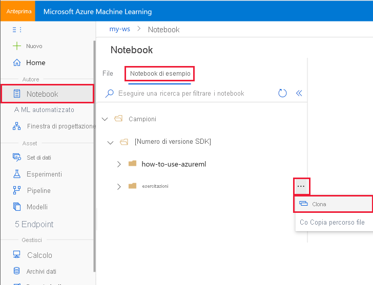
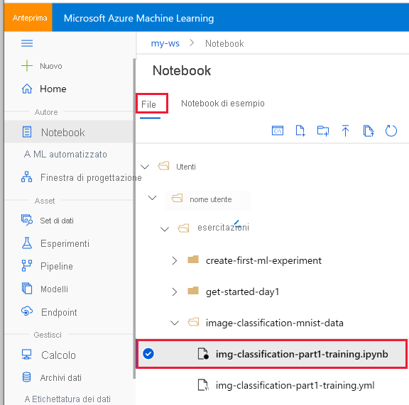

# Esercitazione: Introduzione alla creazione del primo esperimento di Machine Learning con Python SDK
[!INCLUDE [applies-to-skus](../../includes/aml-applies-to-basic-enterprise-sku.md)]

In questa esercitazione si completeranno le procedure end-to-end per iniziare a usare Azure Machine Learning SDK per Python eseguito in Jupyter Notebook. Questa esercitazione, la **prima di una serie di esercitazioni in due parti**, illustra l'installazione e la configurazione dell'ambiente Python, nonché la creazione di un'area di lavoro per gestire gli esperimenti e i modelli di Machine Learning. Su questa base, nella [**seconda parte**](tutorial-1st-experiment-sdk-train.md) viene eseguito il training di più modelli di Machine Learning e viene presentato il processo di gestione dei modelli sia con Azure Machine Learning Studio che con l'SDK.

In questa esercitazione:

> [!div class="checklist"]
> * Creare un'[area di lavoro di Azure Machine Learning](concept-workspace.md) da usare nell'esercitazione successiva.
> * Clonare il notebook delle esercitazioni nella cartella nell'area di lavoro.
> * Creare un'istanza di calcolo basata sul cloud con Azure Machine Learning Python SDK installato e preconfigurato.

Se non è disponibile una sottoscrizione di Azure, creare un account gratuito prima di iniziare. Provare la [versione gratuita o a pagamento di Azure Machine Learning](https://aka.ms/AMLFree).

## Creare un'area di lavoro

Un'area di lavoro di Machine Learning è una risorsa cloud fondamentale usata per eseguire gli esperimenti, il training e la distribuzione di modelli di Machine Learning. Collega la sottoscrizione e il gruppo di risorse di Azure a un oggetto di facile utilizzo nel servizio. 

Per creare un'area di lavoro è necessario usare il portale di Azure, una console basata sul Web per la gestione delle risorse di Azure. 

[!INCLUDE [aml-create-portal](../../includes/aml-create-in-portal.md)]

>[!IMPORTANT] 
> Prendere nota dell'**area di lavoro** e della **sottoscrizione**. Si tratta di informazioni necessarie per assicurarsi di creare l'esperimento nel posto giusto. 

## Eseguire il notebook nell'area di lavoro

Questa esercitazione usa il server notebook cloud nell'area di lavoro per un'esperienza preconfigurata senza installazioni. Se si preferisce avere il controllo sull'ambiente, sui pacchetti e sulle dipendenze, usare il [proprio ambiente](how-to-configure-environment.md#local).

Seguire questo video oppure usare la procedura dettagliata seguente per clonare ed eseguire l'esercitazione dall'area di lavoro. 

> [!VIDEO https://www.microsoft.com/en-us/videoplayer/embed/RE4mTUr]

### Clonare una cartella del notebook

Completare i passaggi seguenti di configurazione ed esecuzione dell'esperimento in Azure Machine Learning Studio, un'interfaccia consolidata che include strumenti di Machine Learning per l'esecuzione di scenari di data science per esperti della materia di qualsiasi livello di competenza.

1. Accedere ad [Azure Machine Learning Studio](https://ml.azure.com/).

1. Selezionare la sottoscrizione e l'area di lavoro create.

1. Selezionare **Notebook** a sinistra.

1. Aprire la cartella **Samples**.

1. Aprire la cartella **Python**.

1. Aprire la cartella con un numero di versione.  Questo numero rappresenta la versione corrente di Python SDK.

1. Selezionare **"..."** a destra della cartella **tutorials** e quindi scegliere **Clone** (Clona).

    

1. Viene visualizzato un elenco di cartelle che mostra ogni utente che accede all'area di lavoro.  Selezionare la propria cartella per clonare la cartella **tutorials** al suo interno.

### <a name="open">Aprire il notebook clonato

1. In **User Files** (File utente) aprire la propria cartella e quindi la cartella **tutorials** clonata.

    

    > [!IMPORTANT]
    > Nella cartella di **esempi** è possibile visualizzare i notebook ma non eseguirli.  Per eseguire un notebook, assicurarsi di aprirne la versione clonata nella sezione **User Files** (File utente).
    
1. Selezionare il file **tutorial-1st-experiment-sdk-train.ipynb** nella cartella **tutorials/create-first-ml-experiment**.

1. Sulla barra superiore selezionare un'istanza di calcolo da usare per eseguire il notebook. Queste macchine virtuali sono preconfigurate con [tutti i componenti necessari per eseguire Azure Machine Learning](concept-compute-instance.md#contents). 

1. Se non sono disponibili macchine virtuali, selezionare **+ Aggiungi** per creare una macchina virtuale per l'istanza di calcolo. 

    1. Quando si crea una VM, specificare il nome,  che deve essere composto da un numero di caratteri compreso tra 2 e 16. I caratteri validi sono lettere, numeri e il carattere - ed è necessario che il nome sia univoco nella sottoscrizione di Azure.

    1.  Selezionare le dimensioni della macchina virtuale dalle opzioni disponibili.

    1. Selezionare quindi **Crea**. Per configurare la VM sono necessari circa 5 minuti.

1. Quando la VM è disponibile, verrà visualizzata sulla barra degli strumenti superiore.  È ora possibile eseguire il notebook usando **Esegui tutto** sulla barra degli strumenti oppure premendo **MAIUSC + INVIO** nelle celle di codice del notebook.

Se sono presenti widget personalizzati o si preferisce usare Jupyter/JupyterLab, selezionare l'elenco a discesa **Jupyter** all'estrema destra, quindi selezionare **Jupyter** o **JupyterLab**. Verrà visualizzata una nuova finestra del browser.

## Passaggi successivi

In questa esercitazione sono state completate le attività seguenti:

* Creazione di un'area di lavoro di Azure Machine Learning
* Creazione e configurazione di un server notebook cloud nell'area di lavoro

Nella **seconda parte** dell'esercitazione viene eseguito il codice in `tutorial-1st-experiment-sdk-train.ipynb` per il training di un modello di Machine Learning. 

> [!div class="nextstepaction"]
> [Esercitazione: Eseguire il training del primo modello](tutorial-1st-experiment-sdk-train.md)

> [!IMPORTANT]
> Se non si prevede di seguire la parte 2 di questa esercitazione oppure altre esercitazioni, è consigliabile [arrestare la VM del server notebook cloud](tutorial-1st-experiment-sdk-train.md#clean-up-resources) quando non viene usata per ridurre i costi.

